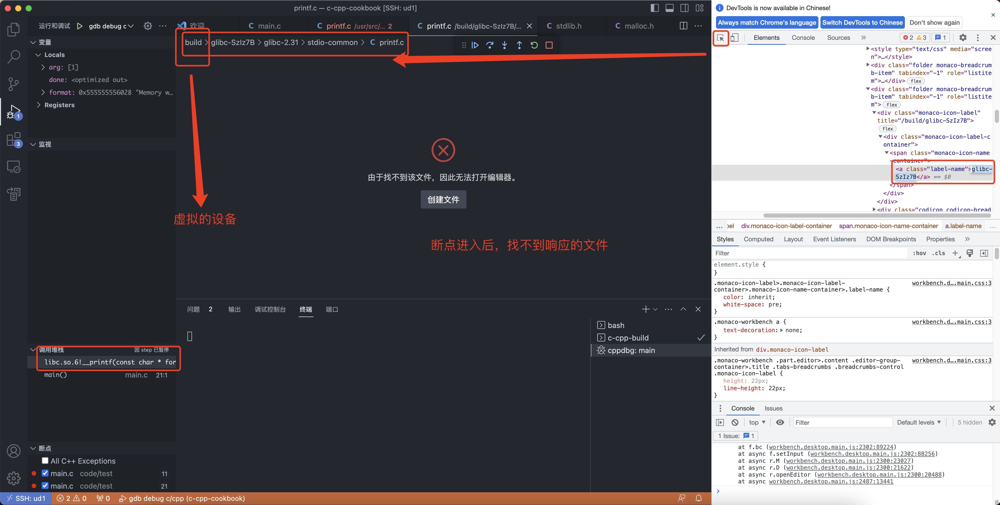

- # c-vscode

## 在线调试
[官方文档](https://code.visualstudio.com/docs/cpp/config-linux)  
### 插件
[C/C++ for Visual Studio Code](https://marketplace.visualstudio.com/items?itemName=ms-vscode.cpptools)  

依赖
```sh
sudo apt-get install build-essential gdb
```


### 配置

```json

```

### gdb参数配置
汇编格式配置
```json
{
    "setupCommands": [
                {
                    "description": "为 gdb 启用整齐打印",
                    "text": "-enable-pretty-printing",
                    "ignoreFailures": true
                }
            ]
}
```

比如gdb指令为:`show debug-file-directory`, 需要再在vscode调试控制台执行:`-exec show debug-file-directory`
```sh
-exec show debug-file-directory
The directory where separate debug symbols are searched for is "/usr/lib/debug".
-exec -enable-pretty-printing
result-class: done
```

gdb执行效果
```sh
(gdb) directory /usr/src/glibc/glibc-2.31
Source directories searched: /usr/src/glibc/glibc-2.31:$cdir:$cwd
```

### gdb调试c及glibc源码

查看glibc版本
```sh
root@matrix:~# ldd --version
ldd (Ubuntu GLIBC 2.31-0ubuntu9.9) 2.31
Copyright (C) 2020 Free Software Foundation, Inc.
This is free software; see the source for copying conditions.  There is NO
warranty; not even for MERCHANTABILITY or FITNESS FOR A PARTICULAR PURPOSE.
Written by Roland McGrath and Ulrich Drepper.
```

- gcc (gnu collect compiler)是一组编译工具的总称。它主要完成的工作任务是“预处理”和“编译”，以及提供了与编译器紧密相关的运行库的支持，如libgcc_s.so、libstdc++.so等。
- libc (C 运行库) Linux下的ANSI C的函数库 
- glibc (C 运行库) Linux下的GUN C函数库 

> ubuntu系统中libc库路径: /usr/lib/x86_64-linux-gnu/libc-2.31.so  


开始调试: 
```sh
sudo apt-get install libc6-dbg
```

> 我们可以通过readelf命令来验证这些共享库确实是带有调试信息的  

```sh
# readelf -S /usr/lib/x86_64-linux-gnu/libc.so.6 | grep -i debug
  [66] .gnu_debuglink    PROGBITS         0000000000000000  001ee294
```

如果出现上面输出结果中以.debug开头的 sections，那么说明是带调试信息的。  

glibc 源码
```sh
sudo apt-get install glibc-source
cd /usr/src/glibc
sudo tar -xvf glibc-2.31.tar.xz
```

目录结构
```sh
root@matrix:/usr/src/glibc# ls -l 
total 17008
drwxr-xr-x 12 root root     4096 Feb 15 14:47 debian
drwxr-xr-x 70 root root     4096 Feb 15 14:48 glibc-2.31
-rw-r--r--  1 root root 17407584 Apr  7  2022 glibc-2.31.tar.xz
```

测试源码
```c
#include <stdio.h>
#include <stdlib.h>

int main (void)
{
	//create char pointer
	char *ptr;

	//ptr is now the memory address of the beginning of this 10 char element array.
	//we used the sizeof() function to make sure that the size of memory allocated is 10 units on any host
	ptr = malloc(10 * sizeof(char));

	//if malloc fails, our ptr pointer will be pointing towards a NULL value, this checks for that
	if (ptr == NULL)
	{
		printf("Memory could not be allocated.");
		return 1;
	}
	else 
	{
		printf("Memory was successfully allocated.");
		//this makes sure we don't keep memory allocated that we're not using.
		free(ptr);
		return 0;
	}
}
```

编译后的关联库:  
```sh
# ldd main
	linux-vdso.so.1 (0x00007fffb3bfb000)
	libc.so.6 => /lib/x86_64-linux-gnu/libc.so.6 (0x00007fbff2e53000)
	/lib64/ld-linux-x86-64.so.2 (0x00007fbff3054000)
```

```sh
# gdb -q ./main
Reading symbols from ./main...
(gdb) directory /usr/src/glibc/glibc-2.31/malloc
Source directories searched: /usr/src/glibc/glibc-2.31/malloc:$cdir:$cwd
(gdb) show debug-file-directory
The directory where separate debug symbols are searched for is "/usr/lib/debug".
(gdb) b main.c:11
Breakpoint 1 at 0x1195: file /root/work/c-cpp-cookbook/code/test/main.c, line 11.
(gdb) r
Starting program: /root/work/c-cpp-cookbook/code/test/main 

Breakpoint 1, main () at /root/work/c-cpp-cookbook/code/test/main.c:11
11              ptr = malloc(10 * sizeof(char));
(gdb) b malloc
Breakpoint 2 at 0x7ffff7e690e0: malloc. (2 locations)
(gdb) n

Breakpoint 2, __GI___libc_malloc (bytes=10) at malloc.c:3023
3023    {
```

> 还是需要增加到具体源码文件的当前目录  

目前gdb已经可以调试了，但是vscode的`c/c++`插件还是无法进入源码和调试

### vscode 阅读c及glibc源码
`launch.json`配置  
```sh
"sourceFileMap":{
                "/build/glibc-S9d2JN": "/usr/src/glibc"
            },
```


### vscode 在线调试c及glibc源码  

编译指令
```sh
/usr/bin/gcc -g -O0 /root/work/c-cpp-cookbook/code/test/main.c -o /root/work/c-cpp-cookbook/code/test/main
```

可以增加`-Wl,--verbose`, 可以看见编译和链接的过程。但是最终问题还是因为系统的libc库不能调试，我手动编译了glibc，查看调试信息如下:  
```sh
/work/c-cpp-cookbook/code/test/main
Using built-in specs.
COLLECT_GCC=/usr/bin/gcc
COLLECT_LTO_WRAPPER=/usr/lib/gcc/x86_64-linux-gnu/9/lto-wrapper
OFFLOAD_TARGET_NAMES=nvptx-none:hsa
OFFLOAD_TARGET_DEFAULT=1
Target: x86_64-linux-gnu
Configured with: ../src/configure -v --with-pkgversion='Ubuntu 9.4.0-1ubuntu1~20.04.1' --with-bugurl=file:///usr/share/doc/gcc-9/README.Bugs --enable-languages=c,ada,c++,go,brig,d,fortran,objc,obj-c++,gm2 --prefix=/usr --with-gcc-major-version-only --program-suffix=-9 --program-prefix=x86_64-linux-gnu- --enable-shared --enable-linker-build-id --libexecdir=/usr/lib --without-included-gettext --enable-threads=posix --libdir=/usr/lib --enable-nls --enable-clocale=gnu --enable-libstdcxx-debug --enable-libstdcxx-time=yes --with-default-libstdcxx-abi=new --enable-gnu-unique-object --disable-vtable-verify --enable-plugin --enable-default-pie --with-system-zlib --with-target-system-zlib=auto --enable-objc-gc=auto --enable-multiarch --disable-werror --with-arch-32=i686 --with-abi=m64 --with-multilib-list=m32,m64,mx32 --enable-multilib --with-tune=generic --enable-offload-targets=nvptx-none=/build/gcc-9-Av3uEd/gcc-9-9.4.0/debian/tmp-nvptx/usr,hsa --without-cuda-driver --enable-checking=release --build=x86_64-linux-gnu --host=x86_64-linux-gnu --target=x86_64-linux-gnu
Thread model: posix
gcc version 9.4.0 (Ubuntu 9.4.0-1ubuntu1~20.04.1) 
COLLECT_GCC_OPTIONS='-v' '-g' '-O0' '-o' '/root/work/c-cpp-cookbook/code/test/main' '-mtune=generic' '-march=x86-64'
 /usr/lib/gcc/x86_64-linux-gnu/9/cc1 -quiet -v -imultiarch x86_64-linux-gnu /root/work/c-cpp-cookbook/code/test/main.c -quiet -dumpbase main.c -mtune=generic -march=x86-64 -auxbase main -g -O0 -version -fasynchronous-unwind-tables -fstack-protector-strong -Wformat -Wformat-security -fstack-clash-protection -fcf-protection -o /root/work/c-cpp-cookbook/ccPAb907.s
```

编译指令
```sh
cd /usr/src/glibc/glibc-2.31
mkdir build && cd build
mkdir /usr/local/glibc
apt install bison -y # 安装依赖
CFLAG="-g -O0" ../configure --prefix=/usr/local/glibc
make -j4
```

查看libc的调试信息，这样才是可以调试的:  
```sh
# readelf -S /usr/src/glibc/glibc-2.31/build/libc.so.6 | grep -i debug
  [66] .debug_aranges    PROGBITS         0000000000000000  001bde40
  [67] .debug_info       PROGBITS         0000000000000000  001d18a0
  [68] .debug_abbrev     PROGBITS         0000000000000000  00aeb6c7
  [69] .debug_line       PROGBITS         0000000000000000  00bf4b7b
  [70] .debug_str        PROGBITS         0000000000000000  00de968d
  [71] .debug_loc        PROGBITS         0000000000000000  00e16303
  [72] .debug_ranges     PROGBITS         0000000000000000  010cf64d
```

可以省略`make install`  
```sh
root@matrix:/usr/src/glibc/glibc-2.31/build# ls -l /usr/local/glibc
total 32
drwxr-xr-x  2 root root 4096 Feb 16 15:51 bin
drwxr-xr-x  2 root root 4096 Feb 16 15:51 etc
drwxr-xr-x 22 root root 4096 Feb 16 15:51 include
drwxr-xr-x  3 root root 4096 Feb 16 15:51 lib
drwxr-xr-x  3 root root 4096 Feb 16 15:51 libexec
drwxr-xr-x  2 root root 4096 Feb 16 15:51 sbin
drwxr-xr-x  4 root root 4096 Feb 16 15:51 share
drwxr-xr-x  3 root root 4096 Feb 16 15:51 var
```

这就需要替换了，之前`libc.so.6 -> libc-2.31.so`,直接拷贝`cp /usr/src/glibc/glibc-2.31/build/libc.so /usr/lib/x86_64-linux-gnu/libc.so.6`  
如果需要恢复，直接执行`ldconfig -v`  

> 默认搜寻/lilb和/usr/lib，以及配置文件/etc/ld.so.conf内所列的目录下的库文件。  
> 往/lib和/usr/lib里面加东西，是不用修改/etc/ld.so.conf文件的，但是添加完后需要调用下ldconfig，不然添加的library会找不到。  
> 如果添加的library不在/lib和/usr/lib里面的话，就一定要修改/etc/ld.so.conf文件，往该文件追加library所在的路径，然后也需要重新调用下ldconfig命令。  


> 还是不行，既然gdb可以源码调试，那有没有可能不是`libc.so.6`的问题。  


`Unable to open ‘raise.c’: Unable to read file (Error: File not found (/build/glibc-ZN95T4/glibc-2.31/sysdeps/unix/sysv/linux/raise.c))`  

最终发现还是vscode找不到对应的目录`/build/`  

<br>
<div align=center>
    </img>  
</div>
<br>

修改路劲:
```json
 "sourceFileMap":{
                // "remote": "local"
                "/build/glibc-SzIz7B": "/usr/src/glibc" //需要下载glibc的源码文件，修改这里的配置
            },
```


