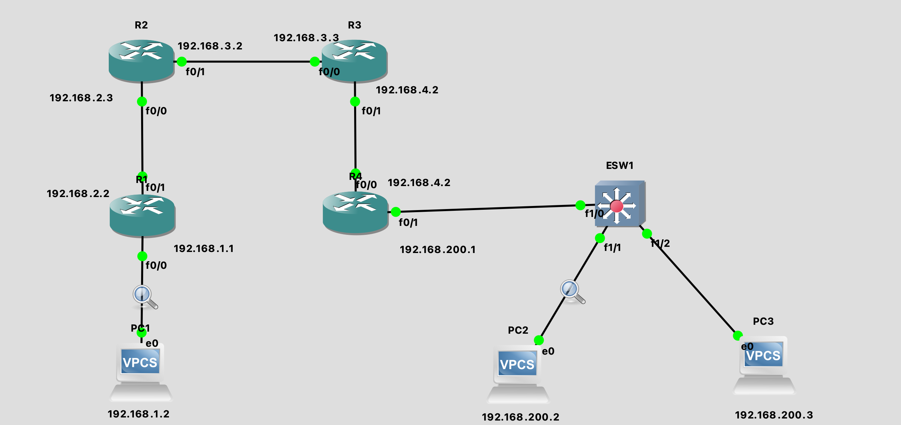

- # 二三层转发实例讲解

[华为-二三层转发实例讲解](https://support.huawei.com/enterprise/zh/knowledge/EKB1001157897)  

## 环境搭建

[GNS3环境搭建](https://github.com/ymm135/docs/blob/master/network/network-learn.md) 

> 如果不了解或者查不出原因，可以使用wireshak抓包查看。很方便。  


拓扑图:
<br>
<div align=center>
    </img>  
</div>
<br>

pc1配置
```sh
ip 192.168.1.2 24 192.168.1.1

PC1> show ip

NAME        : PC1[1]
IP/MASK     : 192.168.1.2/24
GATEWAY     : 192.168.1.1
DNS         : 
MAC         : 00:50:79:66:68:00
LPORT       : 20028
RHOST:PORT  : 127.0.0.1:20029
MTU         : 1500
```

pc2配置
```sh
ip 192.168.200.2 24 192.168.200.1

PC2> show ip

NAME        : PC2[1]
IP/MASK     : 192.168.200.2/24
GATEWAY     : 192.168.200.1
DNS         : 
MAC         : 00:50:79:66:68:01
LPORT       : 20038
RHOST:PORT  : 127.0.0.1:20039
MTU         : 1500

PC2> arp

00:50:79:66:68:02  192.168.200.3 expires in 43 seconds 
```

> arp表需要再通信之后才有，并且有存活时间。  

pc3配置
```sh
ip 192.168.200.3 24 192.168.200.1

PC3> show ip

NAME        : PC3[1]
IP/MASK     : 192.168.200.3/24
GATEWAY     : 192.168.200.1
DNS         : 
MAC         : 00:50:79:66:68:02
LPORT       : 20040
RHOST:PORT  : 127.0.0.1:20041
MTU         : 1500

PC3> arp

00:50:79:66:68:01  192.168.200.2 expires in 48 seconds 
```

ESW1(交换机)配置
```sh
-- 查看接口状态 show ip interface brief
ESW1#show ip int bri   
Interface                  IP-Address      OK? Method Status                Protocol
FastEthernet0/0            unassigned      YES NVRAM  administratively down down    
FastEthernet0/1            unassigned      YES NVRAM  administratively down down    
FastEthernet1/0            unassigned      YES unset  up                    up      
FastEthernet1/1            unassigned      YES unset  up                    up      
FastEthernet1/2            unassigned      YES unset  up                    up  


-- 查看是否生效
ESW1#ping 192.168.1.2
% Unrecognized host or address, or protocol not running.

-- 查看mac地址表
ESW1#show mac-address-table 
Destination Address  Address Type  VLAN  Destination Port
-------------------  ------------  ----  --------------------
c402.09f2.0000		Self	      1	    Vlan1	
0050.7966.6801		Dynamic	      1	    FastEthernet1/1	
0050.7966.6802		Dynamic	      1	    FastEthernet1/2	
```

R1配置
在使用路由器前，需要计算`Idle-PC`的值, 减少性能消耗

> 在计算机系统上运行的每个程序或任务都会占用 CPU 一定的处理时间。如果 CPU 已完成所有任务，则它处于空闲状态。

```sh
R1#config t
Enter configuration commands, one per line.  End with CNTL/Z.

-- 查看接口
R1(config)#do show ip int bri
Interface                  IP-Address      OK? Method Status                Protocol
FastEthernet0/0            unassigned      YES unset  administratively down down    
FastEthernet0/1            unassigned      YES unset  administratively down down    

-- 设置接口ip
R1(config)#interface FastEthernet 0/0
R1(config-if)#ip address 192.168.1.1 255.255.255.0
R1(config-if)#no shutdown
R1(config-if)#exit

R1(config)#interface FastEthernet 0/1
R1(config-if)#ip address 192.168.2.1 255.255.255.0
R1(config-if)#no shutdown
R1(config-if)#exit

-- 查看路由表
R1(config)#do show ip route
Codes: C - connected, S - static, R - RIP, M - mobile, B - BGP
       D - EIGRP, EX - EIGRP external, O - OSPF, IA - OSPF inter area 
       N1 - OSPF NSSA external type 1, N2 - OSPF NSSA external type 2
       E1 - OSPF external type 1, E2 - OSPF external type 2
       i - IS-IS, su - IS-IS summary, L1 - IS-IS level-1, L2 - IS-IS level-2
       ia - IS-IS inter area, * - candidate default, U - per-user static route
       o - ODR, P - periodic downloaded static route

Gateway of last resort is not set

C    192.168.1.0/24 is directly connected, FastEthernet0/0
C    192.168.2.0/24 is directly connected, FastEthernet0/1

也可以配置动态路由
-- 配置动态路由
R1(config)#router rip
R1(config-router)#network 192.168.1.0
R1(config-router)#network 192.168.2.0
R1(config-router)#version 2
R1(config-router)#no auto-summary 

-- 这时路由表没有变化，还没有学习呢  
R1(config-router)#do show ip route
Codes: C - connected, S - static, R - RIP, M - mobile, B - BGP
       D - EIGRP, EX - EIGRP external, O - OSPF, IA - OSPF inter area 
       N1 - OSPF NSSA external type 1, N2 - OSPF NSSA external type 2
       E1 - OSPF external type 1, E2 - OSPF external type 2
       i - IS-IS, su - IS-IS summary, L1 - IS-IS level-1, L2 - IS-IS level-2
       ia - IS-IS inter area, * - candidate default, U - per-user static route
       o - ODR, P - periodic downloaded static route

Gateway of last resort is not set

R    192.168.200.0/24 [120/3] via 192.168.2.3, 00:00:01, FastEthernet0/1
R    192.168.4.0/24 [120/2] via 192.168.2.3, 00:00:01, FastEthernet0/1
C    192.168.1.0/24 is directly connected, FastEthernet0/0
C    192.168.2.0/24 is directly connected, FastEthernet0/1
R    192.168.3.0/24 [120/1] via 192.168.2.3, 00:00:01, FastEthernet0/1

R1(config-router)#do show ip protocols
Routing Protocol is "rip"
  Outgoing update filter list for all interfaces is not set
  Incoming update filter list for all interfaces is not set
  Sending updates every 30 seconds, next due in 0 seconds
  Invalid after 180 seconds, hold down 180, flushed after 240
  Redistributing: rip
  Default version control: send version 2, receive version 2
  Automatic network summarization is not in effect
  Maximum path: 4
  Routing for Networks:
    192.168.1.0
    192.168.2.0
  Routing Information Sources:
    Gateway         Distance      Last Update
  Distance: (default is 120)
```


R2配置
```sh
R2#config t
Enter configuration commands, one per line.  End with CNTL/Z.

-- 查看接口
R2(config)#do show ip int bri
Interface                  IP-Address      OK? Method Status                Protocol
FastEthernet0/0            unassigned      YES unset  administratively down down    
FastEthernet0/1            unassigned      YES unset  administratively down down    

-- 设置接口ip
R2(config)#interface FastEthernet 0/0
R2(config-if)#ip address 192.168.2.3 255.255.255.0
R2(config-if)#no shutdown
RR21(config-if)#exit

R2(config)#interface FastEthernet 0/1
R2(config-if)#ip address 192.168.3.2 255.255.255.0
R2(config-if)#no shutdown
R2(config-if)#exit

-- 查看路由表
R2(config-router)#do show ip route    
Codes: C - connected, S - static, R - RIP, M - mobile, B - BGP
       D - EIGRP, EX - EIGRP external, O - OSPF, IA - OSPF inter area 
       N1 - OSPF NSSA external type 1, N2 - OSPF NSSA external type 2
       E1 - OSPF external type 1, E2 - OSPF external type 2
       i - IS-IS, su - IS-IS summary, L1 - IS-IS level-1, L2 - IS-IS level-2
       ia - IS-IS inter area, * - candidate default, U - per-user static route
       o - ODR, P - periodic downloaded static route

Gateway of last resort is not set

R    192.168.200.0/24 [120/2] via 192.168.3.3, 00:00:00, FastEthernet0/1
R    192.168.4.0/24 [120/1] via 192.168.3.3, 00:00:00, FastEthernet0/1
R    192.168.1.0/24 [120/1] via 192.168.2.1, 00:00:14, FastEthernet0/0
C    192.168.2.0/24 is directly connected, FastEthernet0/0
C    192.168.3.0/24 is directly connected, FastEthernet0/1

也可以配置动态路由
-- 配置动态路由
R2(config)#router rip
R2(config-router)#network 192.168.2.0
R2(config-router)#network 192.168.3.0
R2(config-router)#version 2
R2(config-router)#no auto-summary 

```

R3配置
```sh
R3#config t
Enter configuration commands, one per line.  End with CNTL/Z.

-- 查看接口
R3(config)#do show ip int bri
Interface                  IP-Address      OK? Method Status                Protocol
FastEthernet0/0            unassigned      YES unset  administratively down down    
FastEthernet0/1            unassigned      YES unset  administratively down down    

-- 设置接口ip
R3(config)#interface FastEthernet 0/0
R3(config-if)#ip address 192.168.3.3 255.255.255.0
R3(config-if)#no shutdown
RR31(config-if)#exit

R3(config)#interface FastEthernet 0/1
R3(config-if)#ip address 192.168.4.2 255.255.255.0
R3(config-if)#no shutdown
R3(config-if)#exit

-- 查看路由表
R3(config)#do show ip route
Codes: C - connected, S - static, R - RIP, M - mobile, B - BGP
       D - EIGRP, EX - EIGRP external, O - OSPF, IA - OSPF inter area 
       N1 - OSPF NSSA external type 1, N2 - OSPF NSSA external type 2
       E1 - OSPF external type 1, E2 - OSPF external type 2
       i - IS-IS, su - IS-IS summary, L1 - IS-IS level-1, L2 - IS-IS level-2
       ia - IS-IS inter area, * - candidate default, U - per-user static route
       o - ODR, P - periodic downloaded static route

Gateway of last resort is not set

R    192.168.200.0/24 [120/1] via 192.168.4.3, 00:00:06, FastEthernet0/1
C    192.168.4.0/24 is directly connected, FastEthernet0/1
R    192.168.1.0/24 [120/2] via 192.168.3.2, 00:00:13, FastEthernet0/0
R    192.168.2.0/24 [120/1] via 192.168.3.2, 00:00:13, FastEthernet0/0
C    192.168.3.0/24 is directly connected, FastEthernet0/0

也可以配置动态路由
-- 配置动态路由
R3(config)#router rip
R3(config-router)#network 192.168.3.0
R3(config-router)#network 192.168.4.0
R3(config-router)#version 2
R3(config-router)#no auto-summary 

```

R4配置
```sh
R4#config t
Enter configuration commands, one per line.  End with CNTL/Z.

-- 查看接口
R4(config)#do show ip int bri
Interface                  IP-Address      OK? Method Status                Protocol
FastEthernet0/0            unassigned      YES unset  administratively down down    
FastEthernet0/1            unassigned      YES unset  administratively down down    

-- 设置接口ip
R4(config)#interface FastEthernet 0/0
R4(config-if)#ip address 192.168.4.3 255.255.255.0
R4(config-if)#no shutdown
RR41(config-if)#exit

R4(config)#interface FastEthernet 0/1
R4(config-if)#ip address 192.168.200.1 255.255.255.0           # 还是需要设置成网关，不然学到路由表 
R4(config-if)#no shutdown
R4(config-if)#exit

-- 查看路由表
R4(config)#do show ip route     
Codes: C - connected, S - static, R - RIP, M - mobile, B - BGP
       D - EIGRP, EX - EIGRP external, O - OSPF, IA - OSPF inter area 
       N1 - OSPF NSSA external type 1, N2 - OSPF NSSA external type 2
       E1 - OSPF external type 1, E2 - OSPF external type 2
       i - IS-IS, su - IS-IS summary, L1 - IS-IS level-1, L2 - IS-IS level-2
       ia - IS-IS inter area, * - candidate default, U - per-user static route
       o - ODR, P - periodic downloaded static route

Gateway of last resort is not set

C    192.168.200.0/24 is directly connected, FastEthernet0/1
C    192.168.4.0/24 is directly connected, FastEthernet0/0
R    192.168.1.0/24 [120/3] via 192.168.4.2, 00:00:20, FastEthernet0/0
R    192.168.2.0/24 [120/2] via 192.168.4.2, 00:00:20, FastEthernet0/0
R    192.168.3.0/24 [120/1] via 192.168.4.2, 00:00:20, FastEthernet0/0
```

> 环境遇到异常，可以删除重建，另外创建的时候，可以一台设备一台设备创建，而不是整个拓扑图，后续问题不好定位!  

## ARP报文  

请求`10.25.16.170`的mac地址:  
```sh
Frame 33: 60 bytes on wire (480 bits), 60 bytes captured (480 bits) on interface en1, id 0
Ethernet II, Src: Tp-LinkT_91:a4:8d (a4:1a:3a:91:a4:8d), Dst: Broadcast (ff:ff:ff:ff:ff:ff)
    Destination: Broadcast (ff:ff:ff:ff:ff:ff)
    Source: Tp-LinkT_91:a4:8d (a4:1a:3a:91:a4:8d)
    Type: ARP (0x0806)
    Padding: 000000000000000000000000000000000000
Address Resolution Protocol (request)
    Hardware type: Ethernet (1)
    Protocol type: IPv4 (0x0800)
    Hardware size: 6
    Protocol size: 4
    Opcode: request (1)
    Sender MAC address: Tp-LinkT_91:a4:8d (a4:1a:3a:91:a4:8d)
    Sender IP address: 10.25.16.5
    Target MAC address: 00:00:00_00:00:00 (00:00:00:00:00:00)
    Target IP address: 10.25.16.170
```

## 对于二层转发(PC2 Ping PC3)

1. PC2生成一个源IP地址为`192.168.200.2/24`，目的IP地址为`192.168.200.3/24`的ICMP请求报文。

```sh
// 00:50:79:66:68:01 PC2 MAC地址
// 00:50:79:66:68:02 PC3 MAC地址
# PC2 ARP报文发起, 注意看 源mac地址是
Frame 113: 64 bytes on wire (512 bits), 64 bytes captured (512 bits) on interface -, id 0
Ethernet II, Src: Private_66:68:02 (00:50:79:66:68:02), Dst: Broadcast (ff:ff:ff:ff:ff:ff)
Address Resolution Protocol (request)
    Hardware type: Ethernet (1)
    Protocol type: IPv4 (0x0800)
    Hardware size: 6
    Protocol size: 4
    Opcode: request (1)
    Sender MAC address: Private_66:68:02 (00:50:79:66:68:02)
    Sender IP address: 192.168.200.3
    Target MAC address: Broadcast (ff:ff:ff:ff:ff:ff)
    Target IP address: 192.168.200.2

# PC2 ARP 响应包
Frame 114: 64 bytes on wire (512 bits), 64 bytes captured (512 bits) on interface -, id 0
Ethernet II, Src: Private_66:68:01 (00:50:79:66:68:01), Dst: Private_66:68:02 (00:50:79:66:68:02)
Address Resolution Protocol (reply)
    Hardware type: Ethernet (1)
    Protocol type: IPv4 (0x0800)
    Hardware size: 6
    Protocol size: 4
    Opcode: reply (2)
    Sender MAC address: Private_66:68:01 (00:50:79:66:68:01)
    Sender IP address: 192.168.200.2
    Target MAC address: Private_66:68:02 (00:50:79:66:68:02)
    Target IP address: 192.168.200.3

```

2. PC2的IP地址为`192.168.200.2/24`，PC3的IP地址为`192.168.200.3/24`，通过IP地址与掩码相与可以知道两台PC的网段均为`192.168.1.0/24`。在同一个网段，那么进行二层转发。

> A 直接广播`ARP request` 到广播域，B处于同一广播域，可以接收到 `ARP request`，B用单播方式直接告诉A自己的MAC B 地址。A收到B的ARP reply，将 MAC B ----10.1.1.3 缓存在`ARP Table`，既然知道B的二层、三层地址，可以完成 Ethernet Frame 的封装，从接口发送出去，可以长驱直入到达B，B也以同样的原理发回返程的Ethernet Frame。

3. `PC2`在广播域中发出ARP请求报文，请求`PC3`的MAC地址。

4. 交换机收到来自`PC2`的`ARP`请求，首先将`端口`和对应的`MAC`地址记录，然后向各个端口转发ARP请求。

5. 对于到`R4`的`ARP`请求，`R4`接收到后发现请求的并不是自己的`MAC`地址，丢弃收到的`ARP`报文。

6. 对于发送到`PC3`的`ARP`请求，`PC3`收到后发现请求的是自己的`MAC`地址，则回复自己的`MAC`地址。

7. 交换机收到来自`PC3`的`ARP`回复，首先将`端口`和对应的`MAC`地址记录，然后将回复报文转发给`PC2`。  

```sh
ESW1#show mac-address-table 
Destination Address  Address Type  VLAN  Destination Port
-------------------  ------------  ----  --------------------
c402.09f2.0000		Self	      1	    Vlan1	
0050.7966.6801		Dynamic	      1	    FastEthernet1/1	
0050.7966.6802		Dynamic	      1	    FastEthernet1/2
```

8. `PC2`知道了`PC3`的`MAC`地址，则将`PC2`的`MAC`地址和`PC3`的MAC地址加入新的`以太帧`，然后将报文发出。  

> `PC2`本机的`arp`表更新了`PC3`的MAC地址,  
> 通过指令`arp`查看: 00:50:79:66:68:02  192.168.200.3 expires in 21 seconds, 另外存在超时时间   
```sh
PC2> arp               

00:50:79:66:68:02  192.168.200.3 expires in 118 seconds 
```

9.  交换机收到报文查表后将`ICMP`请求报文发给`PC3`。

10. `PC3`收到报文后生成一个源IP地址为`192.168.200.3/24`，目的IP地址为`192.168.200.2/24`的`ICMP`回显报文。

11. PC3的IP地址为`192.168.200.3/24`，PC2的IP地址为`192.168.200.2/24`，通过IP地址与掩码相与可以知道两台PC的网段均为`192.168.1.0/24`。由于在同一个网段，那么进行二层转发。

12. `PC3`向广播域中发送`ARP`请求，请求`PC2`的`MAC`地址。

13. 交换机收到`ARP`请求后将ARP请求报文转发给`PC2`。

14. `PC2`收到请求自己`MAC`地址的`ARP`报文后则途经交换机到达`PC3`。

15. `PC3`知道了`PC2`的`MAC`地址，则将`PC3`的`MAC`地址和`PC2`的MAC地址加入新的以太网帧，然后将报文发出。

16. 交换机收到报文查表后将`ICMP`回显报文发给`PC2`。

17. `PC2`收到了来自`PC3`的`ICMP`回显报文，则`Ping`通。

 
## 对于三层转发(PC1 Ping PC3)

1. PC1生成一个源IP地址为 `192.168.1.2/24`，目的IP地址为 `192.168.200.3/24` 的ICMP请求报文。

2. PC1的IP地址为`192.168.1.2/24`，PC3的IP地址为`192.168.200.3/24`，通过IP地址与掩码相与可以知道PC1所在网段为`1192.168.1.0/24`，PC3所在网段为`192.168.1.0/24`。由于不在同一个网段，需要路由器进行转发。PC1的网关为`192.168.1.1`，`PC1`会发送`ARP`请求报文请求网关`R1`的`MAC`地址。  

> 不在同一网段，无法发送arp包。需要通过路由转发，这时会发送一个像网关的arp包。  
```sh
Frame 1: 64 bytes on wire (512 bits), 64 bytes captured (512 bits) on interface -, id 0
Ethernet II, Src: Private_66:68:00 (00:50:79:66:68:00), Dst: Broadcast (ff:ff:ff:ff:ff:ff)
Address Resolution Protocol (request)
    Hardware type: Ethernet (1)
    Protocol type: IPv4 (0x0800)
    Hardware size: 6
    Protocol size: 4
    Opcode: request (1)
    Sender MAC address: Private_66:68:00 (00:50:79:66:68:00)
    Sender IP address: 192.168.1.2
    Target MAC address: Broadcast (ff:ff:ff:ff:ff:ff)
    Target IP address: 192.168.1.1
```

3. `R1`收到`ARP`请求后发现是请求自己的`MAC`地址，则回复自己的`MAC`地址。

4. `PC1`收到后将`ICMP`报文加上自己的`MAC`地址和`R1`的`MAC`地址，发送到`R1`。

5. `R1`收到报文后发现是自己的`MAC`地址，则拆开以太帧头，发现目的IP是`192.168.200.3/24`，则根据查自己的`路由表`，发现有到目的IP的路由，则保留报文，并发出ARP请求，请求`R2`的`MAC`地址。  

```sh
R1(config-router)#do show ip route
Codes: C - connected, S - static, R - RIP, M - mobile, B - BGP
       D - EIGRP, EX - EIGRP external, O - OSPF, IA - OSPF inter area 
       N1 - OSPF NSSA external type 1, N2 - OSPF NSSA external type 2
       E1 - OSPF external type 1, E2 - OSPF external type 2
       i - IS-IS, su - IS-IS summary, L1 - IS-IS level-1, L2 - IS-IS level-2
       ia - IS-IS inter area, * - candidate default, U - per-user static route
       o - ODR, P - periodic downloaded static route

Gateway of last resort is not set

R    192.168.200.0/24 [120/3] via 192.168.2.3, 00:00:01, FastEthernet0/1
R    192.168.4.0/24 [120/2] via 192.168.2.3, 00:00:01, FastEthernet0/1
C    192.168.1.0/24 is directly connected, FastEthernet0/0
C    192.168.2.0/24 is directly connected, FastEthernet0/1
R    192.168.3.0/24 [120/1] via 192.168.2.3, 00:00:01, FastEthernet0/1
```

> 通过路由表，只是知道是否可达，如果可达，那就发送ARP表，获取下一跳的mac地址，继续传递发送。  

6. `R2`收到`ARP`请求后发现是请求自己的`MAC`地址，则回复自己的`MAC`地址。

7. R1在收到R2回复的MAC地址后将报文加上自己的MAC地址和R2的MAC地址后从对应端口发出。

8. R2收到报文后发现是自己的MAC地址，则拆开以太帧头，发现目的IP是`192.168.200.3/24`，则根据查自己的`路由表`，发现有到目的IP的路由，则保留报文，并发出ARP请求，请求`R3`的`MAC`地址。

9.  `R3`收到`ARP`请求后发现是请求自己的`MAC`地址，则回复自己的`MAC`地址。

10. R2在收到R3回复的MAC地址后将报文加上自己的MAC地址和R3的MAC地址后从对应端口发出。

11. R3收到报文后发现是自己的MAC地址，则拆开以太帧头，发现目的IP是`192.168.200.3/24`，则根据查自己的路由表，发现有到目的IP的路由，则保留报文，并发出ARP请求，请求R4的MAC地址。

12. R4收到ARP请求后发现是请求自己的MAC地址，则回复自己的MAC地址。

13. R3在收到R4回复的MAC地址后将报文加上自己的MAC地址和R3的MAC地址后从对应端口发出。

14. R4收到报文后发现是自己的MAC地址，则拆开以太帧头，发现目的IP是`192.168.200.3/24`，而自己有一条`192.168.1.0/24`的直连路由，判断后发现为同一网段，则准备进行二层转发。

15. `R4`在广播域中发送ARP请求，请求获取`PC3`的`MAC`地址。  

> R4接交换机的一端，必须是PC3的网关地址.  

16. 交换机收到来自R4的ARP请求，首先将`端口`和对应的`MAC`地址记录，然后向各个端口转发`ARP`请求。

17. 对于到`PC2`的`ARP`请求，`PC2`接收到后发现请求的并不是自己的`MAC`地址，丢弃收到的`ARP`报文。

18. 对于发送到`PC3`的`ARP`请求，`PC3`收到后发现请求的是自己的`MAC`地址，则回复自己的`MAC`地址。

19. 交换机收到来自`PC3`的`ARP`回复，首先将端口和对应的`MAC`地址记录，然后将回复报文转发给`R4`。

20. R4知道了PC3的MAC地址，则将自己的MAC地址和PC3的MAC地址加入新的以太网帧，然后将报文途经交换机发送给PC3。

21. PC3收到报文后生成一个源IP地址为192.168.200.3/24，目的IP地址为192.168.1.2/24的ICMP回显报文。

22. PC1的IP地址为192.168.1.2/24，PC3的IP地址为192.168.200.3/24，通过IP地址与掩码相与可以知道PC1所在网段为1192.168.1.0/24，PC3所在网段为192.168.1.0/24。由于不在同一个网段，那么进行三层转发。

23. 由于不在同一个网段，需要路由器进行转发。PC3会发送ARP请求报文请求网关R4的MAC地址。

24. 交换机收到PC3发来的ARP请求时先将端口和对应的MAC地址记录，然后进行转发。

25. 对于到PC2的ARP请求，PC2接收到后发现请求的并不是自己的MAC地址，丢弃收到的ARP报文。

26. 对于到R4的ARP请求，R4接收到后发现请求的是自己的MAC地址，则回复自己的MAC地址。

27. PC3知道了R4的MAC地址，则将ICMP回显报文加上自己的MAC地址和R4的MAC地址后途经交换机发送给R4。

28. R4收到报文发现MAC地址是自己的MAC地址，则拆开以太帧。R4发现报文的目的IP为192.168.1.2/24，查路由表后发现有到目的IP的路由，则保留报文，并发出ARP请求，请求R3的MAC地址。

29. R3收到ARP请求后发现是请求自己的MAC地址，则回复自己的MAC地址。

30. R4在收到R3回复的MAC地址后将报文加上自己的MAC地址和R4的MAC地址后从对应端口发出。

31.R3收到报文发现MAC地址是自己的MAC地址，则拆开以太帧。R3发现报文的目的IP为192.168.1.2/24，查路由表后发现有到目的IP的路由，则保留报文，并发出ARP请求，请求R2的MAC地址。

32. R2收到ARP请求后发现是请求自己的MAC地址，则回复自己的MAC地址。

33. R3在收到R2回复的MAC地址后将报文加上自己的MAC地址和R3的MAC地址后从对应端口发出。

34. R2收到报文发现MAC地址是自己的MAC地址，则拆开以太帧。R2发现报文的目的IP为192.168.1.2/24，查路由表后发现有到目的IP的路由，则保留报文，并发出ARP请求，请求R1的MAC地址。

35. R1收到ARP请求后发现是请求自己的MAC地址，则回复自己的MAC地址。

36. R2在收到R1回复的MAC地址后将报文加上自己的MAC地址和R2的MAC地址后从对应端口发出。

37. R1收到报文后发现是自己的MAC地址，则拆开以太帧头，发现目的IP是192.168.1.2/24，而自己有一条1192.168.1.0/24的直连路由，判断后发现为同一网段，则准备进行二层转发。

38. R1在广播域中发送ARP请求，请求获取PC1的MAC地址。

39. PC1收到ARP请求后回复自己的MAC地址。

40. R1在收到PC1回复的MAC地址后将报文加上自己的MAC地址和R1的MAC地址后从对应端口发出。

41. PC1收到PC3的ICMP回显报文，则Ping通。
