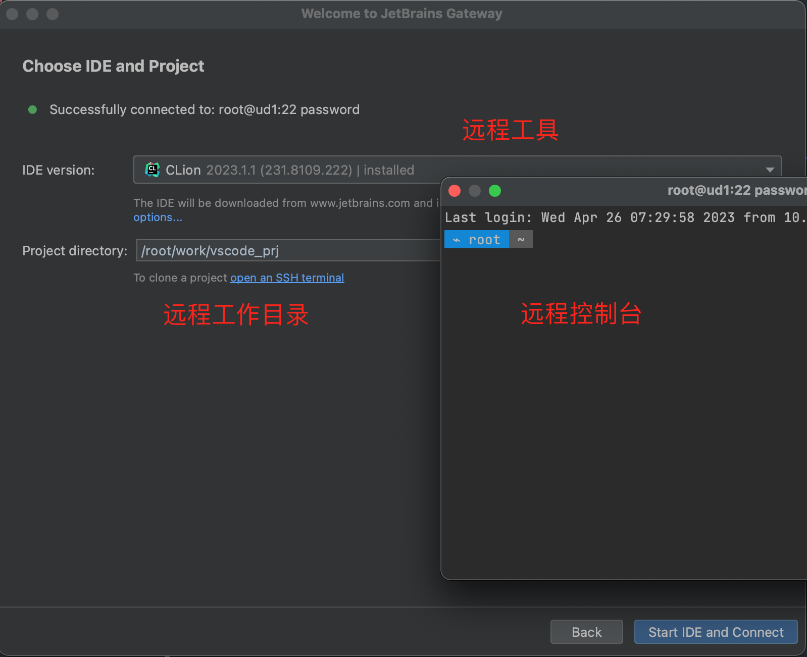
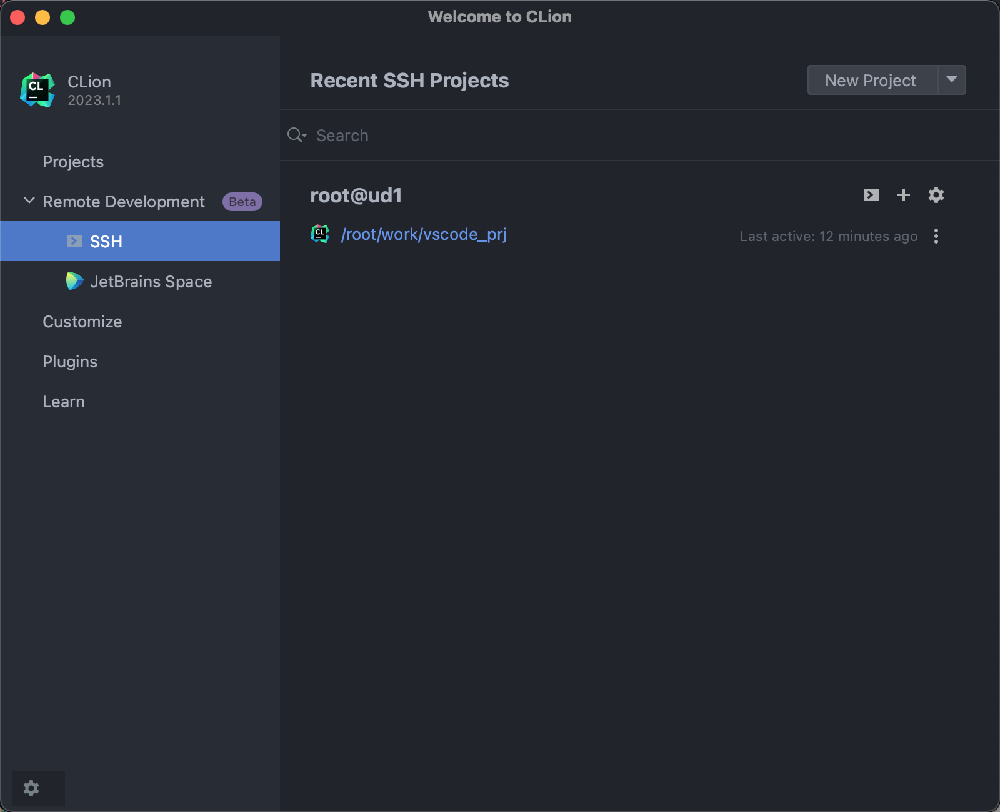
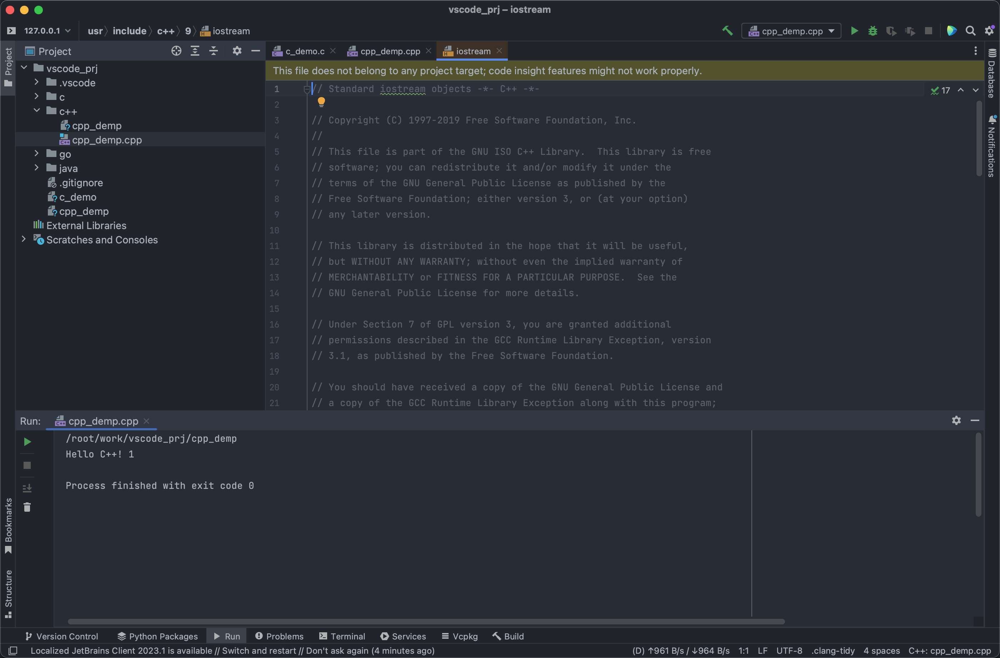

- # Mac Clion + Ubuntu开发

## 环境搭建  

https://www.jetbrains.com/help/clion/remote-development.html  

远程开发可以选择docker/虚拟机  

使用`JetBrains Gateway`远程连接设备，然后打开工程，可以直接开发调试了。  
> 类似于vscode Remote SSH  

 

    </img>  

 

> 增加SSH连接，然后使用IDE及项目工程  

 

    </img>  

 

> 通过ssh 连接项目   

 

    </img>  

 

> 远程debug

