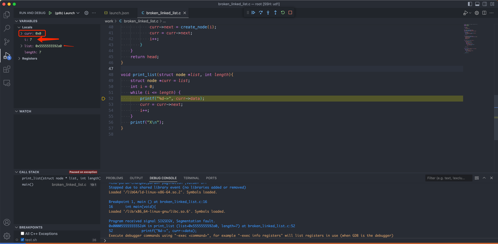
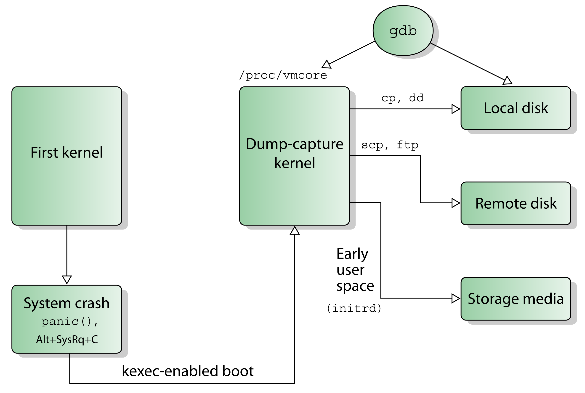

- # Core Dumps  

- [设置](#设置)
- [生成Core Dumps](#生成core-dumps)
- [vscode 查看gdb](#vscode-查看gdb)
- [Kdump + Crash](#kdump--crash)


## 设置  

启动Core Dumps之前，需要确定Core Dumps 的大小  
```sh
ulimit -c
```
如果为0，则无法生成Core Dumps，设置为最大值  
```sh
ulimit -c unlimited
```

`/proc/sys/kernel/core_pattern`决定Core Dumps的存储位置:  

```sh
cat /proc/sys/kernel/core_pattern
```

默认值为`core`, 也就是在当前core目录生成。  

ubuntu 格式: `|/usr/share/apport/apport -p%p -s%s -c%c -d%d -P%P -u%u -g%g -- %E`  

`|`是管道的意思，是将内容传输给`/usr/share/apport/apport`,apport是一个python脚本，`/etc/default/apport`配置文件，启用`sudo systemctl enable apport.service`  

> 文件存储位置为: `/var/lib/apport/coredump/`  
> core._root_work_broken_linked_list.0.fbb90c0f-c110-4e6e-85b1-c5f3add88d85.13155.1917158  

可以修改为如下值:  
```sh
echo "<desired-file-path>/<desired-file-name>" > /proc/sys/kernel/core_pattern

# 临时配置:
echo "/coredump/%e-%p-%s-%t.core" > /proc/sys/kernel/core_pattern  
echo '1' > /proc/sys/kernel/core_uses_pid

# 永久配置 /etc/sysctl.conf  sysctl -p 或 重启生效
kernel.core_pattern=/coredump/%e-%p-%s-%t.core
kernel.core_uses_pid=1
```


## 生成Core Dumps

测试文件`broken_linked_list.c`:
```c
//Makes a linked list of length 7 and prints it out
#include <stdio.h>
#include <stdlib.h>
#include <assert.h>


struct node {
    int data;
    struct node *next;
};

struct node *create_node(int data);
struct node *create_list(int length);
void print_list(struct node *list, int length);

int main(void){
    int length1 = 7;
    struct node *list1 = create_list(length1);
    print_list(list1, length1);

    return 0;
}

struct node *create_node(int data){
    struct node *new = malloc(sizeof(struct node));
    assert(new != NULL);
    new->data = data;
    new->next = NULL;
    return new;
}

struct node *create_list(int length) {

    struct node *head = NULL;
    if (length > 0) {
        head = create_node(0);
        int i = 1;
        struct node *curr = head;
        while (i < length) {
            curr->next = create_node(i);
            curr = curr->next;
            i++;
        }
    }
    return head;
}

void print_list(struct node *list, int length){
    struct node *curr = list;
    int i = 0;
    while (i <= length) {
        printf("%d->", curr->data);
        curr = curr->next;
        i++;
    }
    printf("X\n");
}
```

编译及运行:
```sh
$ gcc -g -o broken_linked_list broken_linked_list.c
$ ./broken_linked_list
Segmentation fault (core dumped)
```

> 程序崩溃了，因为访问了不允许访问的内存  
> core dumps文件在: 

使用gdb查看: 
```sh
gdb broken_linked_list /var/lib/apport/coredump/core._root_work_broken_linked_list.0.fbb90c0f-c110-4e6e-85b1-c5f3add88d85.13265.1941888
```

```sh
Core was generated by `./broken_linked_list'.
Program terminated with signal SIGSEGV, Segmentation fault.
#0  0x0000564835b242d4 in print_list (list=0x5648363972a0, length=7) at broken_linked_list.c:52
52	        printf("%d->", curr->data);
```

可以看到是`52`行访问了无效内存，`curr->data`有内存访问，打印`curr`的值
```sh
(gdb) p curr
$1 = (struct node *) 0x0

# 程序崩溃时i 为 7
(gdb) info locals
curr = 0x0
i = 7

# 查看list的内容
(gdb) print *list
$2 = {data = 0, next = 0x5648363972c0}

# 周边代码
(gdb) l
47	
48	void print_list(struct node *list, int length){
49	    struct node *curr = list;
50	    int i = 0;
51	    while (i <= length) {
52	        printf("%d->", curr->data);
53	        curr = curr->next;
54	        i++;
55	    }
56	    printf("X\n");
```

## vscode 查看gdb  
vscode 配置:
```json
        {
            "name": "(gdb) Launch",
            "type": "cppdbg",
            "request": "launch",
            "program": "${workspaceRoot}/work/broken_linked_list",
            "args": ["/var/lib/apport/coredump/core._root_work_broken_linked_list.0.fbb90c0f-c110-4e6e-85b1-c5f3add88d85.13265.1941888"],
            "stopAtEntry": false,
            "cwd": "${fileDirname}",
            "environment": [],
            "externalConsole": false,
            "MIMode": "gdb",
            "setupCommands": [
                {
                    "description": "Enable pretty-printing for gdb",
                    "text": "-enable-pretty-printing",
                    "ignoreFailures": true
                },
                {
                    "description": "Set Disassembly Flavor to Intel",
                    "text": "-gdb-set disassembly-flavor intel",
                    "ignoreFailures": true
                }
            ]
        }
```

<br>
<div align=center>
    </img>  
</div>
<br>

查看当时的内存状态:  
```sh
-exec p list
$1 = (struct node *) 0x5555555592a0
-exec x/32x list
0x5555555592a0:	0x00	0x00	0x00	0x00	0x00	0x00	0x00	0x00
0x5555555592a8:	0xc0	0x92	0x55	0x55	0x55	0x55	0x00	0x00
0x5555555592b0:	0x00	0x00	0x00	0x00	0x00	0x00	0x00	0x00
0x5555555592b8:	0x21	0x00	0x00	0x00	0x00	0x00	0x00	0x00
```


## Kdump + Crash

内核崩溃转储指的是在内核异常情况时，将 `RAM` 中部分内容进行转储到`磁盘`或者其他存储中。当内核发生 `panic` 时，内核依靠 kexec 机制在预先保留的内存区域快速重启一个`新的内核`实例，预留内存区域大小可通过内核启动参数 `crashkernel` 指定。

为了实现 `双内核` 布局，Kdump 在内核崩溃后立即使用 kexec 引导到转储捕获内核（capture kernel），使用 kexec 引导 `覆盖` 当前运行的内核。转储捕获内核可以是专门构建的单独 Linux 内核映像，也可以在支持可重定位内核的系统架构上重用主内核映像。

`kexec`（kernel execution，类似于 Unix 或 Linux 的系统调用 exec）是 Linux 内核的一种机制，其允许从当前运行的内核启动新内核。kexec 会跳过由系统固件（BIOS或UEFI）执行的引导加载程序阶段和硬件初始化阶段，直接将新内核加载到主内存并立即开始执行。这避免了完全重新启动的漫长时间，并且可以通过最小化停机时间来满足系统高可用性要求。  

md/extra/kdump_arch.png
<br>
<div align=center>
    </img>  
</div>
<br>

Kdump 的功能不仅仅在于分析内核崩溃，在内核学习时，如果我们需了解内核运行状态或结构的详情时，（如果又不想编写内核模块或者使用 gdb 单步调试）也可以使用 Kdump 进行转储，后续使用 Crash 工具对照源码进行分析总结。


安装
```sh
$ sudo apt install linux-crashdump
$ sudo apt install crash
```

> 需要重启才能生效  

```sh
$ sudo cat /etc/default/grub.d/kdump-tools.cfg
GRUB_CMDLINE_LINUX_DEFAULT="$GRUB_CMDLINE_LINUX_DEFAULT crashkernel=512M-:192M"

$ sudo cat /boot/grub/grub.cfg | grep -i crashkernel
linux	/vmlinuz-5.4.0-144-generic root=/dev/mapper/ubuntu--vg-ubuntu--lv ro   crashkernel=512M-:192M

$ 内核日志保留
dmesg | grep -i 512
[    0.000000] Command line: BOOT_IMAGE=/vmlinuz-5.4.0-147-generic root=/dev/mapper/ubuntu--vg-ubuntu--lv ro crashkernel=512M-:192M
[    0.215234] Kernel command line: BOOT_IMAGE=/vmlinuz-5.4.0-147-generic root=/dev/mapper/ubuntu--vg-ubuntu--lv ro crashkernel=512M-:192M
```

`kdump-config`查看kdump的状态  
```sh
kdump-config show
DUMP_MODE:        kdump
USE_KDUMP:        1
KDUMP_SYSCTL:     kernel.panic_on_oops=1
KDUMP_COREDIR:    /var/crash
crashkernel addr: 0xa3000000
   /var/lib/kdump/vmlinuz: symbolic link to /boot/vmlinuz-5.4.0-147-generic
kdump initrd: 
   /var/lib/kdump/initrd.img: symbolic link to /var/lib/kdump/initrd.img-5.4.0-147-generic
current state:    ready to kdump

kexec command:
  /sbin/kexec -p --command-line="BOOT_IMAGE=/vmlinuz-5.4.0-147-generic root=/dev/mapper/ubuntu--vg-ubuntu--lv ro reset_devices systemd.unit=kdump-tools-dump.service nr_cpus=1 irqpoll nousb" --initrd=/var/lib/kdump/initrd.img /var/lib/kdump/vmlinuz
```


