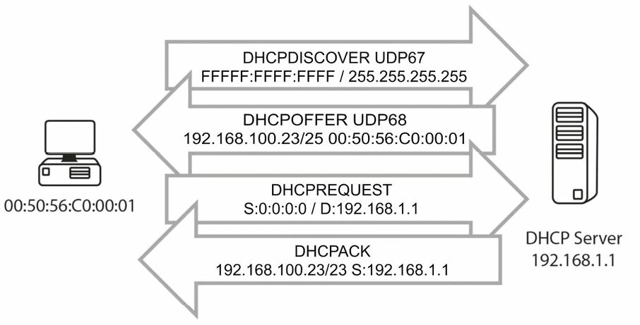
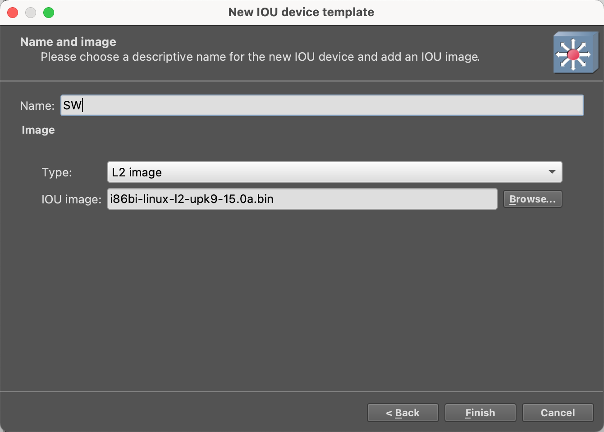

- # DHCP-DNS  

- [DHCP](#dhcp)
  - [DHCP功能](#dhcp功能)
  - [搭建环境验证](#搭建环境验证)
  - [DHCP报文](#dhcp报文)
- [DNS](#dns)
  - [DNS 功能](#dns-功能)
- [DHCP/DNS/VM 综合练习](#dhcpdnsvm-综合练习)
- [GNS3 IOU镜像](#gns3-iou镜像)
- [GNS3与docker的关联](#gns3与docker的关联)


主机使用动态主机配置协议（`Dynamic Host Configuration Protocol, DHCP`），紧接着加电启动后，收集到包括了 IP 地址、子网掩码及默认网关等初始配置信息。因为所有主机都需要一个 IP 地址，以在 IP 网络中进行通信，而 DHCP 就减轻了手动为每台主机配置一个 IP 地址的管理性负担。

域名系统（`Domain Name System, DNS`）将主机名称映射到 IP 地址，使得你可`www.in60days.com`输入到 `web` 浏览器中，而无需输入寄存该站点的服务器 IP 地址。


## DHCP
### DHCP功能
DHCP通过在网络上给主机自动分配 IP 信息，简化了网络管理任务。分配的信息可以包括 IP 地址、子网掩码及默认网关，且通常实在主机启动时。  

在主机第一次启动时，如其已被配置为采用 `DHCP` （大多数主机都是这样的），它就会发出一个询问分配 `IP` 信息的广播报文。该广播将为 `DHCP` 服务器收听到，同时该信息会被中继。  

> Farai指出 -- "这是假定主机和 DHCP 服务器实在同一子网的情形，而如它们不在同一子网，就看下面的ip helper-address命令。"  


<br>
<div align=center>
    </img>  
</div>
<br>

DHCP具体使用 UDP 端口67和68，来在网络上通信，同时，尽管在需要时路由器也可实现 `DHCP` 功能，但通常都会使用具体服务器作为 `DHCP` 服务器。在需要时，路由器同样可以配置为从 `DHCP` 服务器取得其接口 IP 地址，但很少这样做。配置这个特性的命令如下。

> Router(config-if)#ip address dhcp  

客户端的 DHCP 状态如下：

- 初始化，initialising
- 选择，selecting
- 请求，requesting
- 绑定，bound
- 更新，renewing
- 重绑定，rebinding


<br>
<div align=center>
    </img>  
</div>
<br>

DHCP服务器可被配置为在一个名为`租期`的特定时期，赋予某台主机一个 IP 地址。租期可以是几个小时或几天。对于那些不能在网络上分配给主机的 IP 地址，可以也应该予以保留。这些保留的 IP 地址，将是已被路由器接口或服务器所使用的地址。如未能保留这些地址，就会看到网络上的重复 IP 地址告警，因为 DHCP 服务器已将配置给路由器或服务器的地址，分配给了主机。

下面的图14.2中，可以看到完整的 DHCP 请求和分配过程。  

1. DHCP发现数据包（DHCP Discover packet）当某台设备启动后，同时其被配置为通过 DHCP 取得一个地址时，就会发出一个自 UDP 端口68(UDP port 68, bootpc）到 UDP 端口67(UDP port 67, bootps）的广播数据包。该数据包将到达网络上的所有设备，包括任何位处网络上的可能的 DHCP 服务器。

> **DHCP提议数据包**（DHCP Offer packet），本地网络上的 DHCP 服务器看到由客户端发出的广播发现报文（the broadcasted Discover message），就用 UDP 源端口`bootps 67`及目的端口`bootpc 68`, 同样以广播地址的形式，发回一个响应（就是 DHCP 提议数据包）。之所以同样以广播地址形式，是因为客户端此时仍然没有 IP 地址，而无法接收单播数据包。  


2. DHCP请求数据包（DHCP Request packet）, 一旦客户端工作站收到由 DHCP 服务器做出的提议（an offer made by the DHCP server），它就会发出一个广播（用于告知所有 DHCP 服务器，它已接受了来自某台服务器的提议） DHCP 请求报文到某台特定的 DHCP 服务器，并再度使用 UDP 源端口bootpc 68及目的端口bootps 67。客户端可能会收到来自多台 DHCP 服务器的提议，但它只需单独一个 IP 地址，所以它必需选择一台 DHCP 服务器（基于服务器标识），而选择通常都是按照"先到，先服务"原则完成的（on a "first-come, first-served" basis）。

3. DHCP确认数据包（DHCP ACK packet）, 选中的那台 DHCP 服务器发出另一个广播报文，来确认给那台特定客户端的地址分配，再度用到 UDP 源端口bootps 67及目的端口bootpc 68。  


### 搭建环境验证

R1配置
```sh
R1#show int description
Interface                      Status         Protocol Description
Fa0/0                          admin down     down     
Fa0/1                          admin down     down     
R1#config t
Enter configuration commands, one per line.  End with CNTL/Z.
R1(config)#interface fastEthernet 0/0
R1(config-if)#ip address 10.10.1.254 255.255.255.0   # 配置ip
R1(config-if)#no shutdown
R1(config-if)#exit
R1(config)#ip dhcp pool DHCPServer
R1(dhcp-config)#network 10.10.1.0 255.255.255.0
R1(dhcp-config)#default-router 10.10.1.254
R1(dhcp-config)#dns-server 114.114.114.114
R1(dhcp-config)#exit
R1(config)#ip dhcp excluded-address 10.10.1.254
R1(config)#end
Interface                  IP-Address      OK? Method Status                Protocol
FastEthernet0/0            10.10.1.254     YES manual up                    up      
FastEthernet0/1            unassigned      YES unset  administratively down down    
```

PC1配置
```sh
PC1> dhcp -r
DDORA IP 10.10.1.2/24 GW 10.10.1.254
```

### DHCP报文
`Discover`  
```sh
Frame 6: 406 bytes on wire (3248 bits), 406 bytes captured (3248 bits) on interface -, id 0
Ethernet II, Src: Private_66:68:02 (00:50:79:66:68:02), Dst: Broadcast (ff:ff:ff:ff:ff:ff)
Internet Protocol Version 4, Src: 0.0.0.0, Dst: 255.255.255.255
User Datagram Protocol, Src Port: 68, Dst Port: 67
Dynamic Host Configuration Protocol (Discover)
    Message type: Boot Request (1)
    Hardware type: Ethernet (0x01)
    Hardware address length: 6
    Hops: 0
    Transaction ID: 0xcc50ef12
    Seconds elapsed: 0
    Bootp flags: 0x0000 (Unicast)
    Client IP address: 0.0.0.0
    Your (client) IP address: 0.0.0.0
    Next server IP address: 0.0.0.0
    Relay agent IP address: 0.0.0.0
    Client MAC address: Private_66:68:02 (00:50:79:66:68:02)
    Client hardware address padding: 00000000000000000000
    Server host name not given
    Boot file name not given
    Magic cookie: DHCP
    Option: (53) DHCP Message Type (Discover)
    Option: (12) Host Name
    Option: (61) Client identifier
    Option: (255) End
    Padding: 000000000000000000000000000000000000000000000000000000000000000000000000…
```

`Offer`
```sh
Frame 16: 342 bytes on wire (2736 bits), 342 bytes captured (2736 bits) on interface -, id 0
Ethernet II, Src: c0:01:06:0a:00:00 (c0:01:06:0a:00:00), Dst: Private_66:68:02 (00:50:79:66:68:02)
Internet Protocol Version 4, Src: 10.10.1.254, Dst: 10.10.1.2
User Datagram Protocol, Src Port: 67, Dst Port: 68
Dynamic Host Configuration Protocol (Offer)
    Message type: Boot Reply (2)
    Hardware type: Ethernet (0x01)
    Hardware address length: 6
    Hops: 0
    Transaction ID: 0x4a70c259
    Seconds elapsed: 0
    Bootp flags: 0x0000 (Unicast)
    Client IP address: 0.0.0.0
    Your (client) IP address: 10.10.1.2
    Next server IP address: 0.0.0.0
    Relay agent IP address: 0.0.0.0
    Client MAC address: Private_66:68:02 (00:50:79:66:68:02)
    Client hardware address padding: 00000000000000000000
    Server host name not given
    Boot file name not given
    Magic cookie: DHCP
    Option: (53) DHCP Message Type (Offer)
    Option: (54) DHCP Server Identifier (10.10.1.254)
    Option: (51) IP Address Lease Time
    Option: (58) Renewal Time Value
    Option: (59) Rebinding Time Value
    Option: (1) Subnet Mask (255.255.255.0)
    Option: (3) Router
    Option: (6) Domain Name Server
    Option: (255) End
    Padding: 0000000000000000000000000000
```

`Request`
```sh
Frame 18: 406 bytes on wire (3248 bits), 406 bytes captured (3248 bits) on interface -, id 0
Ethernet II, Src: Private_66:68:02 (00:50:79:66:68:02), Dst: c0:01:06:0a:00:00 (c0:01:06:0a:00:00)
Internet Protocol Version 4, Src: 0.0.0.0, Dst: 255.255.255.255
User Datagram Protocol, Src Port: 68, Dst Port: 67
Dynamic Host Configuration Protocol (Request)
    Message type: Boot Request (1)
    Hardware type: Ethernet (0x01)
    Hardware address length: 6
    Hops: 0
    Transaction ID: 0x4a70c259
    Seconds elapsed: 0
    Bootp flags: 0x0000 (Unicast)
    Client IP address: 10.10.1.2
    Your (client) IP address: 0.0.0.0
    Next server IP address: 0.0.0.0
    Relay agent IP address: 0.0.0.0
    Client MAC address: Private_66:68:02 (00:50:79:66:68:02)
    Client hardware address padding: 00000000000000000000
    Server host name not given
    Boot file name not given
    Magic cookie: DHCP
    Option: (53) DHCP Message Type (Request)
    Option: (54) DHCP Server Identifier (10.10.1.254)
    Option: (50) Requested IP Address (10.10.1.2)
    Option: (61) Client identifier
    Option: (12) Host Name
    Option: (55) Parameter Request List
    Option: (255) End
    Padding: 000000000000000000000000000000000000000000000000000000000000000000000000…
```

`ACK`
```sh
Frame 19: 342 bytes on wire (2736 bits), 342 bytes captured (2736 bits) on interface -, id 0
Ethernet II, Src: c0:01:06:0a:00:00 (c0:01:06:0a:00:00), Dst: Private_66:68:02 (00:50:79:66:68:02)
Internet Protocol Version 4, Src: 10.10.1.254, Dst: 10.10.1.2
User Datagram Protocol, Src Port: 67, Dst Port: 68
Dynamic Host Configuration Protocol (ACK)
    Message type: Boot Reply (2)
    Hardware type: Ethernet (0x01)
    Hardware address length: 6
    Hops: 0
    Transaction ID: 0x4a70c259
    Seconds elapsed: 0
    Bootp flags: 0x0000 (Unicast)
    Client IP address: 10.10.1.2
    Your (client) IP address: 10.10.1.2
    Next server IP address: 0.0.0.0
    Relay agent IP address: 0.0.0.0
    Client MAC address: Private_66:68:02 (00:50:79:66:68:02)
    Client hardware address padding: 00000000000000000000
    Server host name not given
    Boot file name not given
    Magic cookie: DHCP
    Option: (53) DHCP Message Type (ACK)
    Option: (54) DHCP Server Identifier (10.10.1.254)
    Option: (51) IP Address Lease Time
    Option: (58) Renewal Time Value
    Option: (59) Rebinding Time Value
    Option: (1) Subnet Mask (255.255.255.0)
    Option: (3) Router
    Option: (6) Domain Name Server
    Option: (255) End
    Padding: 0000000000000000000000000000

```


## DNS
### DNS 功能
DNS将主机名映射到 IP 地址（而不是反过来）。这就允许你在 web 浏览器中浏览一个网址，而无需输入服务器 IP 地址。  

在主机或路由器想要将一个域名解析到 IP 地址（或反过来将 IP 地址解析到域名时）， `DNS` 用到`UDP 53`号端口。而在两台 `DNS` 服务器之间打算同步或分享它们的数据库时，就使用`TCP 53`号端口。  

如想要容许路由器找到 web 上的某台 DNS 服务器，就使用命令ip name-server 1.1.1.1，或是服务器相应的地址。  

也可以将某个主机名设置到路由器上的一个 IP 地址表中来节省时间，或是令到更易于记住要ping的或是连接到的哪台设备，如下面的输出所示。  

```sh
Router(config)#ip host R2 192.168.1.2
Router(config)#ip host R3 192.168.1.3
Router(config)#exit
Router#ping R2
Router#ping 192.168.1.2
!!!!!
```

## DHCP/DNS/VM 综合练习

[参考链接](https://blog.51cto.com/u_14449541/2436762)  

这次在gns3中加入vm-ubuntu的虚拟机，作为服务器。首先需要再配置中增加vm虚拟机，另外要配置虚拟机的网卡模式:  

<br>
<div align=center>
    </img>  
</div>
<br>

> 还是要勾选nat功能的，需要连接外网  

> Error while creating link: Attachment 'hostonly' is already configured on network adapter 0. Please remove it or allow VMwareVM 'VM-Ubuntu-1' to use any adapter.  
> error while starting VM-Ubuntu-1: No VMnet interface available between vmnet2 and vmnet255. Go to preferences VMware / Network / Configure to add more interfaces.
No VMnet interface available between vmnet2 and vmnet255. Go to preferences VMware / Network / Configure to add more interfaces.

拓扑图:

<br>
<div align=center>
    </img>  
</div>
<br>

-----
IOU1配置
```sh
IOU1#configure t
Enter configuration commands, one per line.  End with CNTL/Z.
IOU1(config)#no ip routing      # 关闭路由功能
IOU1(config)#vlan 10,20,136     # 建立vlan
IOU1(config-vlan)#int e0/1
% Applying VLAN changes may take few minutes.  Please wait...

IOU1(config-if)#sw mode acc
IOU1(config-if)#sw acc vlan 10
IOU1(config-if)#int e0/0
IOU1(config-if)#sw mode acc
IOU1(config-if)#sw acc vlan 20
IOU1(config-if)#int e0/2      
IOU1(config-if)#sw mode acc   
IOU1(config-if)#sw acc vlan 136
IOU1(config-if)#exit
IOU1(config)#int e0/3
IOU1(config-if)#sw mode trunk     # 设置为trunk模式  
Command rejected: An interface whose trunk encapsulation is "Auto" can not be configured to "trunk" mode.
IOU1(config-if)#sw t en dot
IOU1(config-if)#ex

IOU1(config)#do show vlan bri

VLAN Name                             Status    Ports
---- -------------------------------- --------- -------------------------------
1    default                          active    Et0/3, Et1/0, Et1/1, Et1/2
                                                Et1/3, Et2/0, Et2/1, Et2/2
                                                Et2/3, Et3/0, Et3/1, Et3/2
                                                Et3/3
10   VLAN0010                         active    Et0/1
20   VLAN0020                         active    Et0/0
136  VLAN0136                         active    Et0/2
1002 fddi-default                     act/unsup 
1003 token-ring-default               act/unsup 
1004 fddinet-default                  act/unsup 
1005 trnet-default                    act/unsup 
```

> trunk 与 access 模式区别  
> 
<br>
<div align=center>
    </img>  
</div>
<br>

-----

IOU2进行配置
```sh
IOU2#configure t
Enter configuration commands, one per line.  End with CNTL/Z.
IOU2(config)#vlan 10,20,136
IOU2(config-vlan)#exit
% Applying VLAN changes may take few minutes.  Please wait...
IOU2(config)#int vlan 10
*Mar 18 10:50:00.547: %LINEPROTO-5-UPDOWN: Line protocol on Interface Vlan10, changed state to down
IOU2(config-if)#ip add 192.168.10.1 255.255.255.0
IOU2(config-if)#ip helper-address 192.168.136.5   
IOU2(config-if)#no shut 
*Mar 18 10:51:06.699: %LINK-3-UPDOWN: Interface Vlan10, changed state to up
*Mar 18 10:51:06.703: %LINEPROTO-5-UPDOWN: Line protocol on Interface Vlan10, changed state to up

IOU2(config-if)#int vlan 20 
IOU2(config-if)#ip add 192.168.20.1 255.255.255.0  
IOU2(config-if)#ip helper-address 192.168.136.5
IOU2(config-if)#no shut                            
IOU2(config-if)#
*Mar 18 10:51:31.687: %LINK-3-UPDOWN: Interface Vlan20, changed state to up
*Mar 18 10:51:31.691: %LINEPROTO-5-UPDOWN: Line protocol on Interface Vlan20, changed state to up

IOU2(config-if)#int vlan 136
IOU2(config-if)#ip add 192.168.136.1 255.255.255.0
IOU2(config-if)#ip helper-address 192.168.136.5
IOU2(config-if)#no shut
IOU2(config-if)#exit
IOU2#show ip inter b
Interface              IP-Address      OK? Method Status                Protocol
Ethernet0/0            unassigned      YES unset  up                    up      
Ethernet0/1            unassigned      YES unset  up                    up      
Ethernet0/2            unassigned      YES unset  up                    up      
Ethernet0/3            unassigned      YES unset  up                    up      
Ethernet1/0            unassigned      YES unset  up                    up      
Ethernet1/1            unassigned      YES unset  up                    up      
Ethernet1/2            unassigned      YES unset  up                    up      
Ethernet1/3            unassigned      YES unset  up                    up      
Ethernet2/0            unassigned      YES unset  up                    up      
Ethernet2/1            unassigned      YES unset  up                    up      
Ethernet2/2            unassigned      YES unset  up                    up      
Ethernet2/3            unassigned      YES unset  up                    up      
Ethernet3/0            unassigned      YES unset  up                    up      
Ethernet3/1            unassigned      YES unset  up                    up      
Ethernet3/2            unassigned      YES unset  up                    up      
Ethernet3/3            unassigned      YES unset  up                    up      
Vlan1                  unassigned      YES NVRAM  administratively down down    
Vlan10                 192.168.10.1    YES manual up                    up      
Vlan20                 192.168.20.1    YES manual up                    up      
Vlan136                192.168.136.1   YES manual up                    up   
IOU2(config)#int e0/0
IOU2(config-if)#sw mode t
Command rejected: An interface whose trunk encapsulation is "Auto" can not be configured to "trunk" mode.
IOU2(config-if)#sw t en dot
IOU2(config-if)#exit
IOU2(config)#ip route 0.0.0.0 0.0.0.0 12.0.0.2         # 默认路由
IOU2(config)#
```

IOU2接收的数据都是有VLAN标识的,比如来自PC1-`VLAN10`的数据包:  
```sh
Frame 27: 102 bytes on wire (816 bits), 102 bytes captured (816 bits) on interface -, id 0
Ethernet II, Src: Private_66:68:00 (00:50:79:66:68:00), Dst: aa:bb:cc:80:02:00 (aa:bb:cc:80:02:00)
802.1Q Virtual LAN, PRI: 0, DEI: 0, ID: 10
    000. .... .... .... = Priority: Best Effort (default) (0)
    ...0 .... .... .... = DEI: Ineligible
    .... 0000 0000 1010 = ID: 10
    Type: IPv4 (0x0800)
Internet Protocol Version 4, Src: 192.168.10.110, Dst: 192.168.10.1
Internet Control Message Protocol
```
> 简单来说，仅仅创立一个vlan（虚拟局域网），那么就只有这个vlan下的几个端口可以相互通信（二层交换，以mac作为通信手段）。这几个端口不能访问到外部，外部也没有路径可以访问到这几个端口。当为vlan配置IP之后，就相当于提供了一个向外部的接口（三层路由，以IP）  
> 这里的实验把vlan设置为网关，当跨网段通信时，相当于路由功能了。  

-----

R1配置
```sh
R1(config)#inter f0/0
R1(config-if)#ip add 12.0.0.2 255.255.255.0  
R1(config-if)#no shut
*Mar  1 01:36:11.291: %LINK-3-UPDOWN: Interface FastEthernet0/0, changed state to up
*Mar  1 01:36:12.291: %LINEPROTO-5-UPDOWN: Line protocol on Interface FastEthernet0/0, changed state to up

R1(config-if)#inter f0/1                     
R1(config-if)#ip add 14.0.0.1 255.255.255.0 
R1(config-if)#no shut                       
R1(config-if)#exit
*Mar  1 01:36:34.551: %LINK-3-UPDOWN: Interface FastEthernet0/1, changed state to up
*Mar  1 01:36:35.551: %LINEPROTO-5-UPDOWN: Line protocol on Interface FastEthernet0/1, changed state to up

R1(config)#ip route 192.168.0.0 255.255.0.0 12.0.0.1
R1(config)#do show ip route 
Codes: C - connected, S - static, R - RIP, M - mobile, B - BGP
       D - EIGRP, EX - EIGRP external, O - OSPF, IA - OSPF inter area 
       N1 - OSPF NSSA external type 1, N2 - OSPF NSSA external type 2
       E1 - OSPF external type 1, E2 - OSPF external type 2
       i - IS-IS, su - IS-IS summary, L1 - IS-IS level-1, L2 - IS-IS level-2
       ia - IS-IS inter area, * - candidate default, U - per-user static route
       o - ODR, P - periodic downloaded static route

Gateway of last resort is not set

     12.0.0.0/24 is subnetted, 1 subnets
C       12.0.0.0 is directly connected, FastEthernet0/0
     14.0.0.0/24 is subnetted, 1 subnets
C       14.0.0.0 is directly connected, FastEthernet0/1
S    192.168.0.0/16 [1/0] via 12.0.0.1
```

VM-Ubuntu-One-1配置
```sh
sudo apt install isc-dhcp-server -y  # DHCP
sudo apt-get install bind9  # DNS
```

`/etc/dhcp/dhcpd.conf`配置dhcp服务器  
```sh
subnet 192.168.10.0 netmask 255.255.255.0 {
        range 192.168.10.100 192.168.10.200;
        option routers 192.168.10.1;
}

subnet 192.168.20.0 netmask 255.255.255.0 {
        range 192.168.20.100 192.168.20.200;
        option routers 192.168.20.1;
}

subnet 192.168.136.0 netmask 255.255.255.0 {
        range 192.168.136.100 192.168.136.200;
        option routers 192.168.136.1;
}
```
也可以给某台客户机分配固定的ip地址

```sh
PC1> show ip

NAME        : PC1[1]
IP/MASK     : 0.0.0.0/0
GATEWAY     : 0.0.0.0
DNS         : 
MAC         : 00:50:79:66:68:00
LPORT       : 20014
RHOST:PORT  : 127.0.0.1:20015
MTU         : 1500
```

增加固定ip
```sh
host pc1-node {  
    hardware ethernet 00:50:79:66:68:00;  fixed-address 192.168.10.110;
}
```

重启服务:`systemctl restart isc-dhcp-server`

另外配置服务器的ip地址为`192.168.136.5`  

` vim /etc/netplan/00-installer-config.yaml`  
```yaml
# This is the network config written by 'subiquity'
network:
  ethernets:
    ens33:
      dhcp4: no
      addresses:
        - 192.168.136.5/24
      gateway4: 192.168.136.1
  version: 2
```

应用`netplan apply`


DNS服务器设置
```sh
# 修改 /etc/bind/named.conf.options
forwarders { 
       8.8.8.8; 
       8.8.4.4; 
}; 

# /etc/bind/named.conf.local
zone "mycloud.cox" { 
     type master; 
     file "/etc/bind/db.mycloud.cox"; 
}; 

# /etc/bind/db.mycloud.cox
; 
; BIND data file for dev sites 
; 
$TTL    604800 
@       IN      SOA     mycloud.cox. root.mycloud.cox. ( 
                              1         ; Serial 
                         604800         ; Refresh 
                          86400         ; Retry 
                        2419200         ; Expire 
                         604800 )       ; Negative Cache TTL 
; 
@       IN      NS      mycloud.cox. 
@       IN      A       192.168.120.1 
*.mycloud.cox.  14400   IN      A       192.168.120.1 


# 重启服务
service bind9 restart

```


-----
PC1配置
```sh
PC1> dhcp
DORA IP 192.168.10.110/24 GW 192.168.10.1

PC1> show ip

NAME        : PC1[1]
IP/MASK     : 192.168.10.110/24
GATEWAY     : 192.168.10.1
DNS         : 
DHCP SERVER : 192.168.136.5
DHCP LEASE  : 569, 600/300/525
DOMAIN NAME : example.org
MAC         : 00:50:79:66:68:00
LPORT       : 20014
RHOST:PORT  : 127.0.0.1:20015
MTU         : 1500

ip dns 192.168.136.5
ping mycloud.com
```

-------

PC2配置
```sh
PC2> dhcp
DDORA IP 192.168.20.100/24 GW 192.168.20.1

PC2> show ip

NAME        : PC2[1]
IP/MASK     : 192.168.20.100/24
GATEWAY     : 192.168.20.1
DNS         : 
DHCP SERVER : 192.168.136.5
DHCP LEASE  : 586, 600/300/525
DOMAIN NAME : example.org
MAC         : 00:50:79:66:68:01
LPORT       : 20016
RHOST:PORT  : 127.0.0.1:20017
MTU         : 1500
```

## GNS3 IOU镜像
生成密钥:`wget http://www.ipvanquish.com/download/CiscoIOUKeygen3f.py`  

`CiscoIOUKeygen3f.py`文件内容:  
```python
#! /usr/bin/python3
print("*********************************************************************")
print("Cisco IOU License Generator - Kal 2011, python port of 2006 C version")
import os
import socket
import hashlib
import struct
# get the host id and host name to calculate the hostkey
hostid=os.popen("hostid").read().strip()
hostname = socket.gethostname()
ioukey=int(hostid,16)
for x in hostname:
 ioukey = ioukey + ord(x)
print("hostid=" + hostid +", hostname="+ hostname + ", ioukey=" + hex(ioukey)[2:])
# create the license using md5sum
iouPad1 = b'\x4B\x58\x21\x81\x56\x7B\x0D\xF3\x21\x43\x9B\x7E\xAC\x1D\xE6\x8A'
iouPad2 = b'\x80' + 39*b'\0'
md5input=iouPad1 + iouPad2 + struct.pack('!i', ioukey) + iouPad1
iouLicense=hashlib.md5(md5input).hexdigest()[:16]

print("\nAdd the following text to ~/.iourc:")
print("[license]\n" + hostname + " = " + iouLicense + ";\n")
with open("iourc.txt", "wt") as out_file:
   out_file.write("[license]\n" + hostname + " = " + iouLicense + ";\n")
print("^^^^^^^^^^^^^^^^^^^^^^^^^^^^^^^\nAlready copy to the file iourc.txt\n ")

print("You can disable the phone home feature with something like:")
print(" echo '127.0.0.127 xml.cisco.com' >> /etc/hosts\n")
```

日志:
```sh
Add the following text to ~/.iourc:
[license]
gns3vm = 73635fd3b0a13ad0;

^^^^^^^^^^^^^^^^^^^^^^^^^^^^^^^
Already copy to the file iourc.txt
 
You can disable the phone home feature with something like:
echo '127.0.0.127 xml.cisco.com' >> /etc/hosts
```

<br>
<div align=center>
    </img>  
</div>
<br>

## GNS3与docker的关联

[Create a docker container for GNS3](https://docs.gns3.com/docs/emulators/create-a-docker-container-for-gns3/)  


需要再GNS3中创建docker镜像，然后才能在列表中展示  
`ssh gns3@192.168.122.2`, 密码:gns3
```sh
docker pull atxiaoming/ssh-ubuntu:20.04
```


