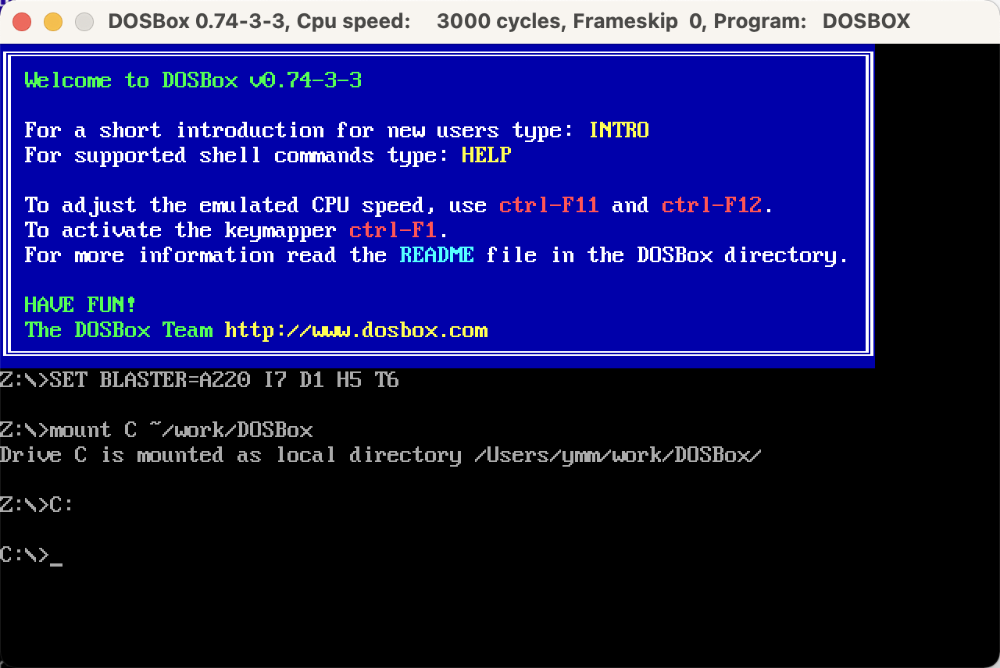
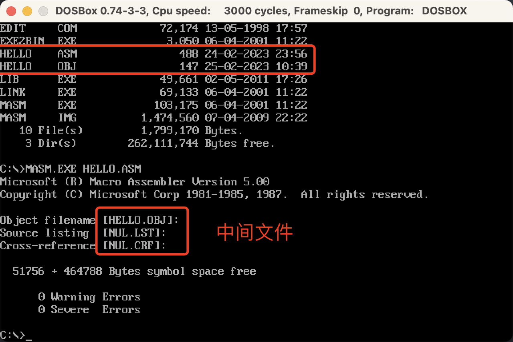
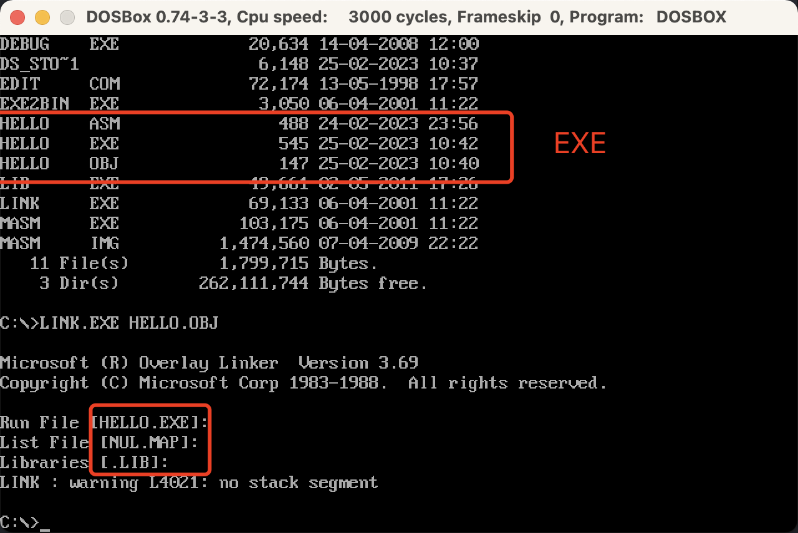
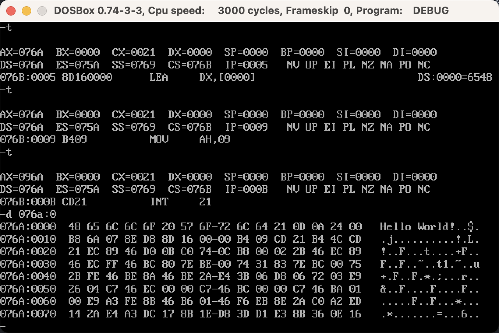
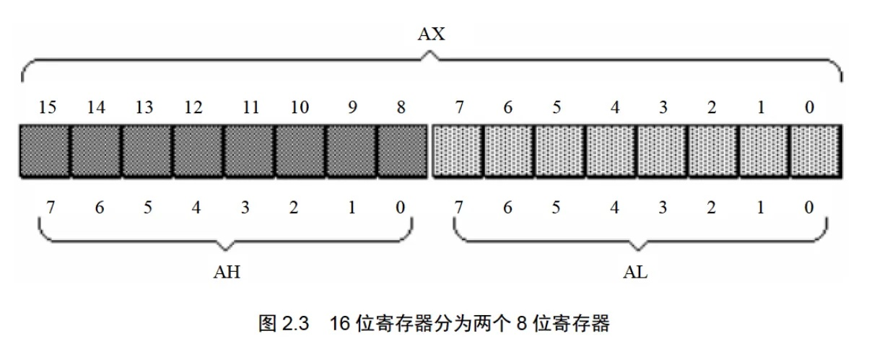
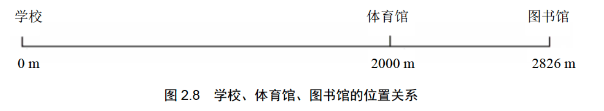
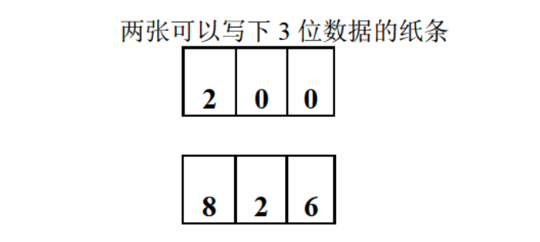
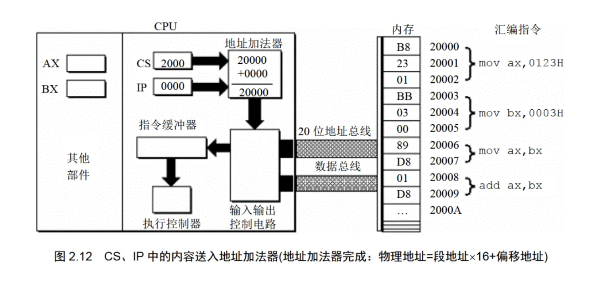
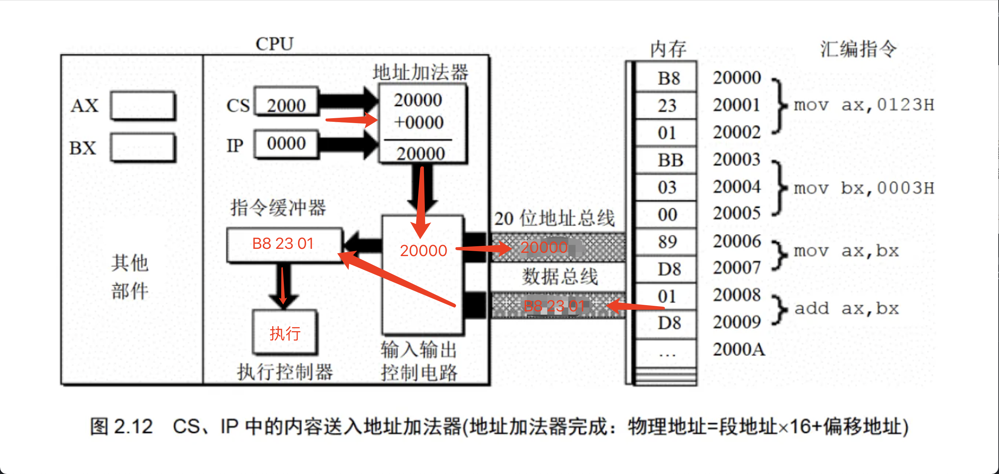
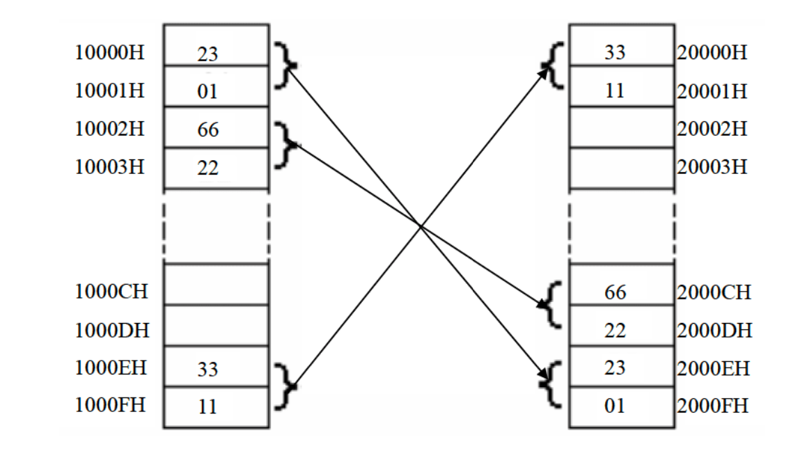

- # DOSBox 汇编开发
## 目录 

- [目录](#目录)
- [环境搭建](#环境搭建)
  - [DOSBox mac 配置](#dosbox-mac-配置)
  - [编写helloworld测试DOSBox环境](#编写helloworld测试dosbox环境)
  - [DOSBox调试功能](#dosbox调试功能)
- [1 基础知识](#1-基础知识)
- [2 寄存器](#2-寄存器)
  - [2.1 通用寄存器](#21-通用寄存器)
  - [2.2 字在寄存器中的存储](#22-字在寄存器中的存储)
  - [2.3 几条汇编指令](#23-几条汇编指令)
  - [2.4 物理地址](#24-物理地址)
  - [2.5 十六位结构的CPU](#25-十六位结构的cpu)
  - [2.6 8086CPU 给出物理地址的方法](#26-8086cpu-给出物理地址的方法)
  - [2.7 `段地址x16+偏移地址=物理地址`的本质含义](#27-段地址x16偏移地址物理地址的本质含义)
  - [2.8 段的概念](#28-段的概念)
  - [2.9 段寄存器](#29-段寄存器)
  - [2.10 CS 和 IP](#210-cs-和-ip)
  - [2.12 代码段](#212-代码段)
- [3 寄存器](#3-寄存器)
  - [3.1 内存中字的存储](#31-内存中字的存储)
  - [3.2 DS 和\[address\]](#32-ds-和address)
  - [3.3 字的传送](#33-字的传送)
  - [3.4 mov、add、sub 指令](#34-movaddsub-指令)
  - [3.5 数据段](#35-数据段)
  - [3.6 栈](#36-栈)
  - [3.7 CPU 提供的栈机制](#37-cpu-提供的栈机制)
  - [3.8 栈顶超界的问题](#38-栈顶超界的问题)
  - [3.9 push、pop 指令](#39-pushpop-指令)
  - [3.10 栈段](#310-栈段)
- [4 第一个程序](#4-第一个程序)
- [5 \[BX\]和 loop 指令](#5-bx和-loop-指令)


## 环境搭建  
目前汇编的环境搭建，可以使用nasm与masm，我使用的汇编教程为《汇编语言(第4版)》，所以这里使用DOSBox的MASM汇编语法开发。  

[参考文章](https://blog.csdn.net/qq_41855420/article/details/103746234)  

[:books: 返回目录](#目录)
### DOSBox mac 配置

可以在[DOSBox官网](https://www.dosbox.com/download.php?main=1)  进行下载dmg, 然后打开安装包，把`DOSBox.app`放到应用文件夹中。
打开软件之前，需要配置一下。首先下载[配置文件](../../res/files/汇编工具配置文件.zip), 然后放到自己本机的目录下, 自定义即可。  

配置文件内容:
```sh
ls -l /Users/ymm/Downloads/汇编工具配置文件
total 3528
-rw-r--r--  1 ymm  staff    20634  4 14  2008 DEBUG.EXE
-rw-r--r--  1 ymm  staff    72174  5 13  1998 EDIT.COM
-rw-r--r--  1 ymm  staff     3050  4  6  2001 EXE2BIN.EXE
-rw-r--r--  1 ymm  staff    49661  5  2  2011 LIB.EXE
-rw-r--r--  1 ymm  staff    69133  4  6  2001 LINK.EXE
-rw-r--r--  1 ymm  staff   103175  4  6  2001 MASM.EXE
-rw-r--r--  1 ymm  staff  1474560  4  7  2009 masm.IMg
```

增加配置文件路径:  
在访达通过`cmd+shift+G`命令，快速前往`/Users/ymm/Library/Preferences/DOSBox 0.74-3-3 Preferences`文件，通过文本编辑器打开，在末尾增加配置文件路径
```sh
# Lines in this section will be run at startup.
# You can put your MOUNT lines here.
# 挂载~/DOSBox目录为C盘
mount C ~/work/DOSBox
# 进入C盘（~/DOSBox目录）
C:
```

打开DOSBOx.app 界面如下:  

<br>
<div align=center>
    </img>  
</div>
<br>

> 需要出现`mount C ~/work/DOSBox`与`C:\>`字样才算加载配置成功!  

[:books: 返回目录](#目录)
### 编写helloworld测试DOSBox环境  

新建文件`hello.asm`,内容如下:  
```asm
DATAS SEGMENT
    ;此处输入数据段代码  
    ;13、10都是十进制，分别表示垂直制表符、退格，'$'表示字符串结尾
    STRING  DB  'Hello World!',13,10,'$'
DATAS ENDS

STACKS SEGMENT
    ;此处输入堆栈段代码
STACKS ENDS

CODES SEGMENT
    ASSUME CS:CODES,DS:DATAS,SS:STACKS
START:
    MOV AX,DATAS
    MOV DS,AX
    ;此处输入代码段代码
    
    LEA  DX,STRING
    MOV  AH,9
    INT  21H
    
    MOV AH,4CH
    INT 21H
CODES ENDS
    END START
```

把asm文件放到`~/work/DOSBox`文件夹下.  


- ### 编译

`MASM.EXE HELLO.ASM`  
> DOS这玩意好像不区分大小写，所以直接敲大写吧。另外源代码需要放到根目录下，不然无法编译。  


<br>
<div align=center>
    </img>  
</div>
<br>


- ### 链接

`LINK.EXE HELLO.OBJ`  

<br>
<div align=center>
    </img>  
</div>
<br>

- ### 运行  

`HELLO.EXE`  

输出
```sh
Hello World!
```

### DOSBox调试功能

`DEBUG.EXE HELLO.EXE`
- `-r`  查看寄存器
- `-u [行数]`  查看汇编指令命令
- `-t`  执行下一条汇编指令命令
- `-d 段地址:偏移地址`  查看指定内存单元命令
- `-q`  退出

<br>
<div align=center>
    </img>  
</div>
<br>

[:books: 返回目录](#目录)
## 1 基础知识
[参考github读书笔记](https://github.com/Ray-56/m-dream/issues/45)  

1. 汇编指令是机器指令的助记符，同机器指令一一对应
2. 每一种 CPU 都由自己的汇编指令集
3. CPU 可以直接使用的信息在`存储器`中存放
4. 在存储器中`指令`和`数据`没有任何区别，都是二进制信息
5. 存储单元从零开始顺序编号
6. 一个存储单元可以存储8个 bit，即8位二进制数
7. 1Byte=8bit 1KB=1024B 1MB=1024KB 1GB=1024MB
8. Byte 字节，bit 比特
9. 1KB = 1024Byte(B) = 8 * 1024bit  

机器码与对应的汇编指令:  
```sh
机器码:        10100001 00000011 00000000
对应的汇编指令:  MOV AX,[3]
含义:          传送3号单元的内容如AX
```

## 2 寄存器
### 2.1 通用寄存器
AX = AH + AL，高字节位，低字节位

<br>
<div align=center>
    </img>  
</div>
<br>

实例: 
| 寄存器 | 寄存器中的数据 | 所有的值 | 
| ----- | -----------  | ------ |
| AX | 0100 1110 0010 0000 | 20000(4E20H) |
| AH | 0100 1110 | 78(EH)| 
| AL | 0010 0000 | 32(20H) | 


### 2.2 字在寄存器中的存储
十六进制，汇编H结尾，C语言0x开头
Byte 字节， word 字，一个字由两个字节组成

### 2.3 几条汇编指令
AH AL 在使用中都是作为独立的 8 位寄存器  

检测点2.1 
62627 = 0xf4a3

(1). 写出每条汇编指令执行后相关寄存器中的值：
```sh
mov ax,62627; # AX=f4a3h
mov ah,31h;   # AX=31a3h
mov al,23h;   # AX=3123h
add ax,ax;    # AX=6246h
mov bx,826ch; # AX=6246h BX=826ch
mov cx,ax;    # AX=6246h BX=826ch CX=6246h
mov ax,bx;    # AX=826ch
add ax,bx;    # AX=04d8h 这里AX为16位寄存器，只能存放4位16进制的数据，所以最高位的1无法保存
mov al,bh;    # AX=0482h
mov ah,bl;    # AX=6c82h
add ah,ah;    # AX=d882h
add al,6;     # AX=d888h
add al,al;    # AX=d810h
add ax,cx;    # AX=6246h
```

(2). 只能使用目前学过的汇编指令，最多使用4条指令，编程计算2的4次方：
```sh
mov ax,2;     # AX=0002h
add ax,ax;    # AX=0004h
add ax,ax;    # AX=0008h
add ax,ax;    # AX=0016h
```

### 2.4 物理地址
CPU 通过地址总线送入存储器的必须是一个内存单元的物理地址.  

### 2.5 十六位结构的CPU
- 运算器一次最多可以处理16位的数据
- 寄存器的最大宽度为16位
- 寄存器和运算符之间的通路为16位

### 2.6 8086CPU 给出物理地址的方法
- CPU 相关部件提供两个16位的地址，分别为`段地址`、`偏移地址`
- 段地址和偏移地址通过内部总线送入地址加法器的部件
- 地址加法器将两个16位地址合成一个20位的物理地址
- 地址加法器同工内部总线将20位物理地址送入输入输出控制电路
- 输入输出控制电路将20位物理地址送上地址总线
- 20位物理地址被地址总线传送到存储器

地址加法器：物理地址=`段地址`x`16`+`偏移地址 ` 

`段地址x16` 的常用说法是左移4位(通常指二进制位)  

由观察数据`2H`二进制形式`10B`，对其进行左移运算可以得到：一个X进制的数据左移1位，相当于乘以X  

###  2.7 `段地址x16+偏移地址=物理地址`的本质含义

本质含义：CPU 在访问内存时，用一个基础地址（段地址x16）和一个相对于基础地址的偏移地址相加，给出内存单元的物理地址也就是“基础地址+偏移地址=物理地址”  

<br>
<div align=center>
    </img>  
</div>
<br>

三种方式表示图书馆的地址：

- 从学校走2826到图书馆。2826可以认为是图书馆的物理地址
- 从学校走2000基础地址到体育馆，再从体育馆走826偏移地址（以基础地址为起点）到图书馆
- 加限制两张三位数据纸条，第一张写上`200`段地址,第二张写上`826`偏移地址，再运算`200`x10+`826`=2826

<br>
<div align=center>
    </img>  
</div>
<br>

8086CPU 就相当于提供两张3位数据纸条的 CPU

[:books: 返回目录](#目录)


### 2.8 段的概念

`段地址`这个名称中包含`段`的概念，这种说法可能对一些学习者产生了误导，以为内存被划分成一个一个的段，每一段有一个段地址。 其实内存没有分段，段的划分来自于CPU，由于8086CPU用`基础地址(段地址x16)+偏移地址=物理地址`的方式给出内存单元的物理地址，使得我们可以用分段的方法来管理内存。  

```sh
CPU 可以使用不同的段地址和偏移地址形成同一个物理地址。eg:
    物理地址    段地址  偏移地址
    21F60H      2000H   1F60H
                2100H   0F60H
                21F6H   0000H
                1F00H   2F60H
                
偏移地址 16 位，变化范围为0~FFFFH，仅用偏移地址来寻址最多可寻到 64KB 个内存单元。
```

检测点2.2
公式：`段地址(SA)`x16 + `偏移地址(EA)` = 物理地址
这里的 16 是十进制，计算时需要先进行转换  

(1). 给定段地址为`0001H`, 仅通过变化偏移地址来寻址，CPU的寻址范围为____到____? 

0010H ~ 1000FH  
```sh
由题意可知偏移地址范围 0000H ~ FFFFH
min = 0001H x 16 + 0000H, min = 0010H
max = 0001H x 16 + FFFFH, max = 1000FH
```

### 2.9 段寄存器
8086CPU 有四个段寄存器：`CS`、`DS`、`SS`、`ES`。需要访问内存时提供内存单元的段地址。本章只看 `CS`  

- code segment (CS)  
- data segment (DS)
- stack segment (SS) 
- programmer (ES)  

[:books: 返回目录](#目录)  

### 2.10 CS 和 IP
`CS` 为代码段寄存器，`IP` 为指令指针寄存器  

在内存中，指令和数据没有任何区别，都是二进制信息，CPU 在工作的时候把有的信息看作指令，有的看作数据。**CPU 将 CS、IP 中的内容当作指令的`段地址`和`偏移地址`，用它们合成指令的物理地址，到内存中读取指令码，执行。**如果说，内存中的一段信息曾被 CPU 执行过的话，那么，它所在的内存单元必然被 CS:IP 指向过  


<br>
<div align=center>
    </img>  
</div>
<br>

(1) 8086CPU当前状态, CS中的内容为`2000H`, IP的内容为`0000H`;
(2) 内存20000H~20009H单元存放着可执行的机器码；
(3) 内存20000H~20009H单元中存放的机器码对应的指令如图；  

运行过程: 

<br>
<div align=center>
    </img>  
</div>
<br>

`jmp`指令可以修改 `CS`、`IP`。  

- jmp 段地址:偏移地址（段内转移）：用指令中给出的段地址修改 CS，偏移地址修改 IP
- jmp 某一合法寄存器（段间转移）：用寄存器中的值修改 IP

同时修改CS/IP  
```sh
jmp 2AE3:3
# 执行后
CS=2AE3H, IP=0003H, cpu将从2AE33H处读取指令
```

只修改IP
```sh
jmp ax, 指令执行前: ax=1000H, CS=2000H, IP=0003H
        指令执行后: ax=1000H, CS=2000H, IP=1000H
```

[:books: 返回目录](#目录)
### 2.12 代码段
对于 8086PC 机，可以根据需求，将一组内存单元定义为一个段。
我们可以将长度为 N(N<=64KB) 的一组代码，存在一组地址连续、起始地址为 16 的倍数的内存单元中，我们可以认为，这段内存是用来存放代码的，从而定义了一个代码段。

比如:
```sh
mov ax,0000         (B8 00 00)
add zx,0123H        (05 23 01)
mov bx,ax           (8B D8)
jmp bx              (FF E3)
```

这段长度为10个字节的指令，存放在`123B0H~123B9H`的一组内存单元中，我们就可以认为`123B0H~123B9H`这段内存是用来存放代码的，是一个代码段

[:books: 返回目录](#目录)

## 3 寄存器
### 3.1 内存中字的存储
任何两个地址连续的内存单元，N 号单元和 N+1 号单元，可以将它们看成两个内存单元，也可以看成一个地址为 N 的字单元中的`低位`字节单元和`高位`字节单元

例如：AX = 4E20H，AH = 4EH(高位)，AL = 20H(低位)，AX 存放在2地址字单元（2单元+3单元）中，2单元存放低位20H，3单元存放高位4EH  

[:books: 返回目录](#目录)
### 3.2 DS 和[address]

```
mov bx,1000H
mov ds,bx
mov al,[0]
```
上面三条指令将10000H(1000:0)中的数据读取到al中  

- 8086CPU 自定取`ds`中的数据作为内存单元的段地址  
- [···]表示一个内存单元，[0]中的 0 表示内存单元的偏移地址  

物理地址=`ds`x16 + `偏移量`,分析：10000H = 1000H x 16 + 0H 可以表示为 1000:0，地址段 1000H，偏移地址 0  

[:books: 返回目录](#目录)
### 3.3 字的传送

```sh
mov bx,1000h
mov ds,bx
mov ax,[0]    ;1000:0 处的字型数据送入 ax
mov [0],cx    ;cx 中的 16 位数据送到 1000:0 处
```

> 8086 CPU是16位结构，有16根数据线，可以一次性传送16位的数据。  

[:books: 返回目录](#目录)
### 3.4 mov、add、sub 指令

mov 寄存器，数据 例如：mov ax,8
mov 寄存器，寄存器 例如：mov ax,bx
mov 寄存器，内存单元 例如：mov ax,[0]
mov 内存单元，寄存器 例如：mov [0],ax
mov 段寄存器，寄存器 例如：mov ds,ax

add,sub 不能对`段寄存器`进行操作，其它与 mov 一致  

[:books: 返回目录](#目录)
### 3.5 数据段
将一组长度为 N(N<=64KB)、地址连续、起始地址为 16 倍数的内存单元当作专门储存数据的内存单元，从而定义一个数据段

比如，将 `123B0H~123B9H` 的内存单元定义为数据段。现在要累加这个数据段中的前 3 个单元中的数据，代码如下：
```sh
mov ax,123BH
mov ds,ax           ; 将 123BH 送入 ds 中，做为数据段的段地址
mov al,0            ; 用 al 存放累加结果
add al,[0]          ; 将数据段的第一个单元（偏移地址为0）中的数值加到 al 中
add al,[1]          ; 将数据段的第二个单元（偏移地址为1）中的数值加到 al 中
add al,[2]          ; 将数据段的第三个单元（偏移地址为2）中的数值加到 al 中
```

小节:
> 1. 字在内存中存储时，要用两个地址连续的内存单元来存放，字的低位字节存放在低地址单元中，高位字节存放在高地址单元中  
> 2. 用 mov 指令访问内存单元，可以在 mov 指令中只给出单元的偏移地址，此时，段地址默认在 DS 寄存器中  
> 3. [address] 表示一个偏移地址为 address 的内存单元
在内存和寄存器之间传送字型数据时，高地址单元和高 8 位寄存器、低地址单元和低 8 位寄存器相对应  
> 4. mov、add、sub 是具有两个操作对象的指令。jmp 是具有一个操作对象的指令  

[:books: 返回目录](#目录)
### 3.6 栈
LIFO（Last In First Out，后进先出)  

[:books: 返回目录](#目录)
### 3.7 CPU 提供的栈机制
`PUSH`入栈，`POP`出栈，8086CPU 的入栈和出栈都是以`字`为单位进行的。
字型数据用两个单元存放，高地址单元存放高 8 位，低地址单元存放低 8 位。
任意时刻，SS:SP 指向栈顶元素。 `SS` 段寄存器存放段地址，`SP` 寄存器存放偏移地址

[:books: 返回目录](#目录)
### 3.8 栈顶超界的问题
8086CPU不保证我们对栈的操作不会超界。它只知道栈顶在何处（由 SS:SP 指示），而不知道栈空间有多大。这点就好像它只知道当前要执行的指令在何处（由 CS:IP 指示），而不知道要执行的指令有多少。

从这两点可以看出 8086CPU 的工作机理，只考虑当前的情况：当前栈顶在何处、要执行的指令是哪一条  

[:books: 返回目录](#目录)
### 3.9 push、pop 指令

可以在寄存器和内存（栈空间也是内存空间的一部分，它只是一段可以以一种特殊方式进行访问的内存空间）之间传递数据  

```sh
push 寄存器     ; 将一个寄存器中的数据入栈
pop 寄存器      ; 出栈，用一个寄存器接收出栈的数据
push 段寄存器   ; 将一个段寄存器中的数据入栈
pop 段寄存器    ; 出栈，用一个段寄存器接收出栈的数据
push 内存单元   ; 将一个内存字单元处的字入栈（注意：栈操作都是以字为单位的）
pop 内存单元    ; 出栈，用一个内存字单元接收出栈的数据

; 比如：
mov ax,1000H
mov ds,ax       ; 内存单元的段地址要放在 ds 中
push [0]        ; 将 1000:0 处的字入栈
pop [2]         ; 出栈，出栈的数据送如 1000:2 处
```

> 指令执行时，CPU 要知道内存单元的地址，可以在 push、pop 指令中只给出内存单元的`偏移地址`，`段地址`在指令执行时，CPU 从 ds 中取得  

编程：
1. 将 10000H~1000FH 这段空间当作栈，初始状态栈为空
2. 设置 AX=001AH，BX=001BH
3. 将 AX、BX 中的数据入栈
4. 然后将 AX、BX 清零
5. 从栈中恢复 AX、BX 原来的内容

```sh
mov ax,1000H
mov ds,ax
mov sp,0010H    ; 栈顶为空，sp=栈底(栈空间高位)+16=000FH=+16=0010H
mov ax,001AH
mov bx,001BH
push ax
push bx

sub ax,ax       
sub bx,bx       ; 清零也可以使用 mov bx,0
                ; sub bx,bx 的机器码为 2 个字节
                ; mov bx,0 的机器码为 3 个字节
pop bx          ; 后进先出，所以先送入 bx
pop ax
```
[:books: 返回目录](#目录)
### 3.10 栈段

我们可以将长度为 N(N<=64KB)的一组地址连续、起始地址为 16 的倍数的内存单元，当作栈空间来用，从而定义了一个栈段  

将一段内存定义为一个段，用一个段地址指示段，用偏移地址访问段内的单元。

- 用一个段存放数据，将它定义为“数据段”；
- 用一个段存放代码，将它定义为“代码段”；
- 用一个段当作栈，将它定义为“栈段”；

若要让 CPU 按照我们的安排来访问这些段，就要

- 数据段，将它的段地址放在 DS 中，用 mov、add、sub 等访问内存单元的指令时，CPU 就将我们定义的数据段中的内容当作数据来访问
- 代码段，将它的段地址放在 CS 中，将段中的第一条指令的偏移地址放在 IP 中，这样 CPU 就将执行我们定义的代码段中的指令；
- 栈段，将它的段地址放在 SS 中，将栈顶单元的偏移地址放在 SP 中，这样 CPU 在需要执行栈操作时，比如执行 push、pop 指令等，就将我们定义的栈段当作栈空间来用；

> 由上可见：CS:IP 指向地址当作代码，SS:SP 指向地址当作栈  


- ### 检测点 3.2
补全下面的程序，使其可以将 10000H~1000FH 中的 8 个字，逆序复制到 20000H~2000FH 中。逆序复制的含义如下图所示：  

<br>
<div align=center>
    </img>  
</div>
<br>

```sh
mov ax,1000H
mov ds,ax
; ----补全代码开始----
mov ax,1000H
mov ss,ax
mov sp,0010H

; ----补全代码结束----
push [0]
push [2]
push [4]
push [6]
push [8]
push [A]
push [C]
push [E]
```
[:books: 返回目录](#目录)

## 4 第一个程序

[:books: 返回目录](#目录)
## 5 [BX]和 loop 指令

[:books: 返回目录](#目录)


