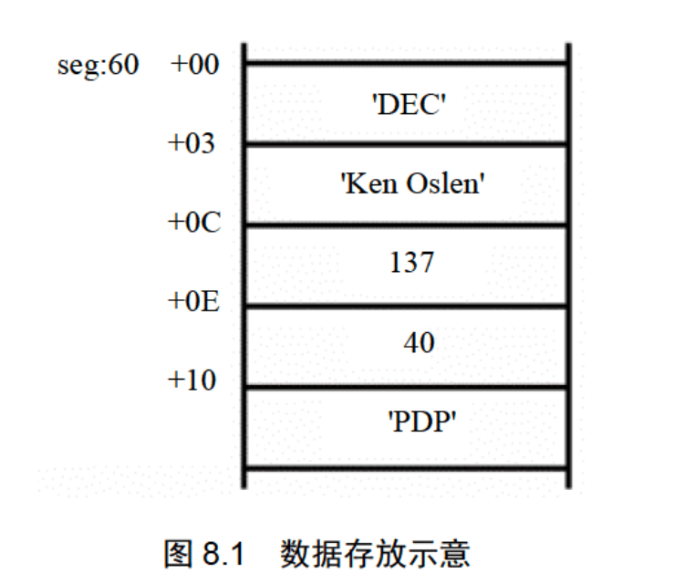

- # DOSBox 汇编开发
## 目录 

- [目录](#目录)
- [环境搭建](#环境搭建)
  - [DOSBox mac 配置](#dosbox-mac-配置)
  - [编写helloworld测试DOSBox环境](#编写helloworld测试dosbox环境)
  - [DOSBox调试功能](#dosbox调试功能)
- [1 基础知识](#1-基础知识)
- [2 寄存器](#2-寄存器)
  - [2.1 通用寄存器](#21-通用寄存器)
  - [2.2 字在寄存器中的存储](#22-字在寄存器中的存储)
  - [2.3 几条汇编指令](#23-几条汇编指令)
  - [2.4 物理地址](#24-物理地址)
  - [2.5 十六位结构的CPU](#25-十六位结构的cpu)
  - [2.6 8086CPU 给出物理地址的方法](#26-8086cpu-给出物理地址的方法)
  - [2.7 `段地址x16+偏移地址=物理地址`的本质含义](#27-段地址x16偏移地址物理地址的本质含义)
  - [2.8 段的概念](#28-段的概念)
  - [2.9 段寄存器](#29-段寄存器)
  - [2.10 CS 和 IP](#210-cs-和-ip)
  - [2.12 代码段](#212-代码段)
- [3 寄存器](#3-寄存器)
  - [3.1 内存中字的存储](#31-内存中字的存储)
  - [3.2 DS 和\[address\]](#32-ds-和address)
  - [3.3 字的传送](#33-字的传送)
  - [3.4 mov、add、sub 指令](#34-movaddsub-指令)
  - [3.5 数据段](#35-数据段)
  - [3.6 栈](#36-栈)
  - [3.7 CPU 提供的栈机制](#37-cpu-提供的栈机制)
  - [3.8 栈顶超界的问题](#38-栈顶超界的问题)
  - [3.9 push、pop 指令](#39-pushpop-指令)
  - [3.10 栈段](#310-栈段)
- [4 第一个程序](#4-第一个程序)
  - [4.1 一个源程序从写出到执行的过程](#41-一个源程序从写出到执行的过程)
- [5 \[BX\]和 loop 指令](#5-bx和-loop-指令)
  - [5.1 \[BX\]](#51-bx)
  - [5.2 Loop 指令](#52-loop-指令)
  - [5.3 在 Debug 中跟踪用 loop 指令实现的循环程序](#53-在-debug-中跟踪用-loop-指令实现的循环程序)
  - [5.4 Debug 和汇编编译器 masm 对指令的不同处理](#54-debug-和汇编编译器-masm-对指令的不同处理)
- [第 6 章 包含多个段的程序](#第-6-章-包含多个段的程序)
  - [6.1 在代码段中使用数据](#61-在代码段中使用数据)
  - [6.2 在代码段中使用栈](#62-在代码段中使用栈)
  - [6.3 将数据、代码、栈放入不同的段](#63-将数据代码栈放入不同的段)
  - [实验5 编写、调试具有多个段的程序](#实验5-编写调试具有多个段的程序)
- [7 更灵活的定位内存地址的方法](#7-更灵活的定位内存地址的方法)
  - [7.1 and 和 or 指令](#71-and-和-or-指令)
  - [7.2 关于 ASCII 码](#72-关于-ascii-码)
  - [7.3 以字符形式给出的数据](#73-以字符形式给出的数据)
  - [7.4 大小写转换的问题](#74-大小写转换的问题)
  - [7.5 \[bx+idata\]](#75-bxidata)
  - [7.6 用\[bx+idata\]的方式进行数据的处理](#76-用bxidata的方式进行数据的处理)
  - [7.7 SI 和 DI](#77-si-和-di)
  - [7.8 \[bx+si\]和\[bx+di\]](#78-bxsi和bxdi)
  - [7.9 \[bx+si+idata\]和\[bx+di+idata\]](#79-bxsiidata和bxdiidata)
  - [7.10 不同的寻址方式的灵活应用](#710-不同的寻址方式的灵活应用)
- [8 数据处理的两个基本问题](#8-数据处理的两个基本问题)
  - [8.1 bx、si、di 和 bp](#81-bxsidi-和-bp)
  - [8.2 机器指令处理的数据在什么地方](#82-机器指令处理的数据在什么地方)
  - [8.3 汇编语言中数据位置的表达](#83-汇编语言中数据位置的表达)
  - [8.4 寻址方式](#84-寻址方式)
  - [8.5 指令要处理的数据有多长](#85-指令要处理的数据有多长)
  - [8.6 寻址方式的综合应用](#86-寻址方式的综合应用)
  - [8.7 div 指令](#87-div-指令)
  - [8.8 伪指令 dd](#88-伪指令-dd)
  - [8.9 dup](#89-dup)
- [9 转移指令原理](#9-转移指令原理)
  - [9.1 操作符 offset](#91-操作符-offset)
  - [9.2 jmp 指令](#92-jmp-指令)
  - [9.3 ⭐️️依据位移进行转移的 jmp 指令](#93-️️依据位移进行转移的-jmp-指令)
  - [9.4 转移的目的地址在指令中的 jmp 指令](#94-转移的目的地址在指令中的-jmp-指令)
  - [9.5 转移地址在寄存器中的 jmp 指令](#95-转移地址在寄存器中的-jmp-指令)
  - [9.6 转移地址在内存中的 jmp 指令](#96-转移地址在内存中的-jmp-指令)
  - [9.7 jcxz 指令](#97-jcxz-指令)
- [10 CALL 和 RET 指令](#10-call-和-ret-指令)
- [11 标志寄存器](#11-标志寄存器)
- [12 内中断](#12-内中断)
- [13 int 指令](#13-int-指令)
- [14 端口](#14-端口)
- [15 外中断](#15-外中断)
- [16 直接定址表](#16-直接定址表)
- [17 使用BIOS进行键盘输入和磁盘读写](#17-使用bios进行键盘输入和磁盘读写)


## 环境搭建  
目前汇编的环境搭建，可以使用nasm与masm，我使用的汇编教程为《汇编语言(第4版)》，所以这里使用DOSBox的MASM汇编语法开发。  

[参考文章](https://blog.csdn.net/qq_41855420/article/details/103746234)  

[:books: 返回目录](#目录)
### DOSBox mac 配置

可以在[DOSBox官网](https://www.dosbox.com/download.php?main=1)  进行下载dmg, 然后打开安装包，把`DOSBox.app`放到应用文件夹中。
打开软件之前，需要配置一下。首先下载[配置文件](../../res/files/汇编工具配置文件.zip), 然后放到自己本机的目录下, 自定义即可。  

配置文件内容:
```sh
ls -l /Users/ymm/Downloads/汇编工具配置文件
total 3528
-rw-r--r--  1 ymm  staff    20634  4 14  2008 DEBUG.EXE
-rw-r--r--  1 ymm  staff    72174  5 13  1998 EDIT.COM
-rw-r--r--  1 ymm  staff     3050  4  6  2001 EXE2BIN.EXE
-rw-r--r--  1 ymm  staff    49661  5  2  2011 LIB.EXE
-rw-r--r--  1 ymm  staff    69133  4  6  2001 LINK.EXE
-rw-r--r--  1 ymm  staff   103175  4  6  2001 MASM.EXE
-rw-r--r--  1 ymm  staff  1474560  4  7  2009 masm.IMg
```

增加配置文件路径:  
在访达通过`cmd+shift+G`命令，快速前往`/Users/ymm/Library/Preferences/DOSBox 0.74-3-3 Preferences`文件，通过文本编辑器打开，在末尾增加配置文件路径
```sh
# Lines in this section will be run at startup.
# You can put your MOUNT lines here.
# 挂载~/DOSBox目录为C盘
mount C ~/work/DOSBox
# 进入C盘（~/DOSBox目录）
C:
```

打开DOSBOx.app 界面如下:  

<br>
<div align=center>
    </img>  
</div>
<br>

> 需要出现`mount C ~/work/DOSBox`与`C:\>`字样才算加载配置成功!  

[:books: 返回目录](#目录)
### 编写helloworld测试DOSBox环境  

新建文件`hello.asm`,内容如下:  
```asm
DATAS SEGMENT
    ;此处输入数据段代码  
    ;13、10都是十进制，分别表示垂直制表符、退格，'$'表示字符串结尾
    STRING  DB  'Hello World!',13,10,'$'
DATAS ENDS

STACKS SEGMENT
    ;此处输入堆栈段代码
STACKS ENDS

CODES SEGMENT
    ASSUME CS:CODES,DS:DATAS,SS:STACKS
START:
    MOV AX,DATAS
    MOV DS,AX
    ;此处输入代码段代码
    
    LEA  DX,STRING
    MOV  AH,9
    INT  21H
    
    MOV AH,4CH
    INT 21H
CODES ENDS
    END START
```

把asm文件放到`~/work/DOSBox`文件夹下.  


- ### 编译

`MASM.EXE HELLO.ASM`  
> DOS这玩意好像不区分大小写，所以直接敲大写吧。另外源代码需要放到根目录下，不然无法编译。  


<br>
<div align=center>
    </img>  
</div>
<br>


- ### 链接

`LINK.EXE HELLO.OBJ`  

<br>
<div align=center>
    </img>  
</div>
<br>

- ### 运行  

`HELLO.EXE`  

输出
```sh
Hello World!
```

### DOSBox调试功能

`DEBUG.EXE HELLO.EXE`
- `-r`  查看寄存器
- `-u [行数]`  查看汇编指令命令
- `-t`  执行下一条汇编指令命令
- `-d 段地址:偏移地址`  查看指定内存单元命令
- `-q`  退出

<br>
<div align=center>
    </img>  
</div>
<br>

[:books: 返回目录](#目录)
## 1 基础知识
[参考github读书笔记](https://github.com/Ray-56/m-dream/issues/45)  

1. 汇编指令是机器指令的助记符，同机器指令一一对应
2. 每一种 CPU 都由自己的汇编指令集
3. CPU 可以直接使用的信息在`存储器`中存放
4. 在存储器中`指令`和`数据`没有任何区别，都是二进制信息
5. 存储单元从零开始顺序编号
6. 一个存储单元可以存储8个 bit，即8位二进制数
7. 1Byte=8bit 1KB=1024B 1MB=1024KB 1GB=1024MB
8. Byte 字节，bit 比特
9. 1KB = 1024Byte(B) = 8 * 1024bit  

机器码与对应的汇编指令:  
```sh
机器码:        10100001 00000011 00000000
对应的汇编指令:  MOV AX,[3]
含义:          传送3号单元的内容如AX
```

## 2 寄存器
### 2.1 通用寄存器
AX = AH + AL，高字节位，低字节位

<br>
<div align=center>
    </img>  
</div>
<br>

实例: 
| 寄存器 | 寄存器中的数据 | 所有的值 | 
| ----- | -----------  | ------ |
| AX | 0100 1110 0010 0000 | 20000(4E20H) |
| AH | 0100 1110 | 78(EH)| 
| AL | 0010 0000 | 32(20H) | 


### 2.2 字在寄存器中的存储
十六进制，汇编H结尾，C语言0x开头
Byte 字节， word 字，一个字由两个字节组成

### 2.3 几条汇编指令
AH AL 在使用中都是作为独立的 8 位寄存器  

检测点2.1 
62627 = 0xf4a3

(1). 写出每条汇编指令执行后相关寄存器中的值：
```sh
mov ax,62627; # AX=f4a3h
mov ah,31h;   # AX=31a3h
mov al,23h;   # AX=3123h
add ax,ax;    # AX=6246h
mov bx,826ch; # AX=6246h BX=826ch
mov cx,ax;    # AX=6246h BX=826ch CX=6246h
mov ax,bx;    # AX=826ch
add ax,bx;    # AX=04d8h 这里AX为16位寄存器，只能存放4位16进制的数据，所以最高位的1无法保存
mov al,bh;    # AX=0482h
mov ah,bl;    # AX=6c82h
add ah,ah;    # AX=d882h
add al,6;     # AX=d888h
add al,al;    # AX=d810h
add ax,cx;    # AX=6246h
```

(2). 只能使用目前学过的汇编指令，最多使用4条指令，编程计算2的4次方：
```sh
mov ax,2;     # AX=0002h
add ax,ax;    # AX=0004h
add ax,ax;    # AX=0008h
add ax,ax;    # AX=0016h
```

### 2.4 物理地址
CPU 通过地址总线送入存储器的必须是一个内存单元的物理地址.  

### 2.5 十六位结构的CPU
- 运算器一次最多可以处理16位的数据
- 寄存器的最大宽度为16位
- 寄存器和运算符之间的通路为16位

### 2.6 8086CPU 给出物理地址的方法
- CPU 相关部件提供两个16位的地址，分别为`段地址`、`偏移地址`
- 段地址和偏移地址通过内部总线送入地址加法器的部件
- 地址加法器将两个16位地址合成一个20位的物理地址
- 地址加法器同工内部总线将20位物理地址送入输入输出控制电路
- 输入输出控制电路将20位物理地址送上地址总线
- 20位物理地址被地址总线传送到存储器

地址加法器：物理地址=`段地址`x`16`+`偏移地址 ` 

`段地址x16` 的常用说法是左移4位(通常指二进制位)  

由观察数据`2H`二进制形式`10B`，对其进行左移运算可以得到：一个X进制的数据左移1位，相当于乘以X  

###  2.7 `段地址x16+偏移地址=物理地址`的本质含义

本质含义：CPU 在访问内存时，用一个基础地址（段地址x16）和一个相对于基础地址的偏移地址相加，给出内存单元的物理地址也就是“基础地址+偏移地址=物理地址”  

<br>
<div align=center>
    </img>  
</div>
<br>

三种方式表示图书馆的地址：

- 从学校走2826到图书馆。2826可以认为是图书馆的物理地址
- 从学校走2000基础地址到体育馆，再从体育馆走826偏移地址（以基础地址为起点）到图书馆
- 加限制两张三位数据纸条，第一张写上`200`段地址,第二张写上`826`偏移地址，再运算`200`x10+`826`=2826

<br>
<div align=center>
    </img>  
</div>
<br>

8086CPU 就相当于提供两张3位数据纸条的 CPU

[:books: 返回目录](#目录)


### 2.8 段的概念

`段地址`这个名称中包含`段`的概念，这种说法可能对一些学习者产生了误导，以为内存被划分成一个一个的段，每一段有一个段地址。 其实内存没有分段，段的划分来自于CPU，由于8086CPU用`基础地址(段地址x16)+偏移地址=物理地址`的方式给出内存单元的物理地址，使得我们可以用分段的方法来管理内存。  

```sh
CPU 可以使用不同的段地址和偏移地址形成同一个物理地址。eg:
    物理地址    段地址  偏移地址
    21F60H      2000H   1F60H
                2100H   0F60H
                21F6H   0000H
                1F00H   2F60H
                
偏移地址 16 位，变化范围为0~FFFFH，仅用偏移地址来寻址最多可寻到 64KB 个内存单元。
```

检测点2.2
公式：`段地址(SA)`x16 + `偏移地址(EA)` = 物理地址
这里的 16 是十进制，计算时需要先进行转换  

(1). 给定段地址为`0001H`, 仅通过变化偏移地址来寻址，CPU的寻址范围为____到____? 

0010H ~ 1000FH  
```sh
由题意可知偏移地址范围 0000H ~ FFFFH
min = 0001H x 16 + 0000H, min = 0010H
max = 0001H x 16 + FFFFH, max = 1000FH
```

### 2.9 段寄存器
8086CPU 有四个段寄存器：`CS`、`DS`、`SS`、`ES`。需要访问内存时提供内存单元的段地址。本章只看 `CS`  

- code segment (CS)  
- data segment (DS)
- stack segment (SS) 
- programmer (ES)  

[:books: 返回目录](#目录)  

### 2.10 CS 和 IP
`CS` 为代码段寄存器，`IP` 为指令指针寄存器  

在内存中，指令和数据没有任何区别，都是二进制信息，CPU 在工作的时候把有的信息看作指令，有的看作数据。**CPU 将 CS、IP 中的内容当作指令的`段地址`和`偏移地址`，用它们合成指令的物理地址，到内存中读取指令码，执行。**如果说，内存中的一段信息曾被 CPU 执行过的话，那么，它所在的内存单元必然被 CS:IP 指向过  


<br>
<div align=center>
    </img>  
</div>
<br>

(1) 8086CPU当前状态, CS中的内容为`2000H`, IP的内容为`0000H`;
(2) 内存20000H~20009H单元存放着可执行的机器码；
(3) 内存20000H~20009H单元中存放的机器码对应的指令如图；  

运行过程: 

<br>
<div align=center>
    </img>  
</div>
<br>

`jmp`指令可以修改 `CS`、`IP`。  

- jmp 段地址:偏移地址（段内转移）：用指令中给出的段地址修改 CS，偏移地址修改 IP
- jmp 某一合法寄存器（段间转移）：用寄存器中的值修改 IP

同时修改CS/IP  
```sh
jmp 2AE3:3
# 执行后
CS=2AE3H, IP=0003H, cpu将从2AE33H处读取指令
```

只修改IP
```sh
jmp ax, 指令执行前: ax=1000H, CS=2000H, IP=0003H
        指令执行后: ax=1000H, CS=2000H, IP=1000H
```

[:books: 返回目录](#目录)
### 2.12 代码段
对于 8086PC 机，可以根据需求，将一组内存单元定义为一个段。
我们可以将长度为 N(N<=64KB) 的一组代码，存在一组地址连续、起始地址为 16 的倍数的内存单元中，我们可以认为，这段内存是用来存放代码的，从而定义了一个代码段。

比如:
```sh
mov ax,0000         (B8 00 00)
add zx,0123H        (05 23 01)
mov bx,ax           (8B D8)
jmp bx              (FF E3)
```

这段长度为10个字节的指令，存放在`123B0H~123B9H`的一组内存单元中，我们就可以认为`123B0H~123B9H`这段内存是用来存放代码的，是一个代码段

[:books: 返回目录](#目录)

## 3 寄存器
### 3.1 内存中字的存储
任何两个地址连续的内存单元，N 号单元和 N+1 号单元，可以将它们看成两个内存单元，也可以看成一个地址为 N 的字单元中的`低位`字节单元和`高位`字节单元

例如：AX = 4E20H，AH = 4EH(高位)，AL = 20H(低位)，AX 存放在2地址字单元（2单元+3单元）中，2单元存放低位20H，3单元存放高位4EH  

[:books: 返回目录](#目录)
### 3.2 DS 和[address]

```
mov bx,1000H
mov ds,bx
mov al,[0]
```
上面三条指令将10000H(1000:0)中的数据读取到al中  

- 8086CPU 自定取`ds`中的数据作为内存单元的段地址  
- [···]表示一个内存单元，[0]中的 0 表示内存单元的偏移地址  

物理地址=`ds`x16 + `偏移量`,分析：10000H = 1000H x 16 + 0H 可以表示为 1000:0，地址段 1000H，偏移地址 0  

[:books: 返回目录](#目录)
### 3.3 字的传送

```sh
mov bx,1000h
mov ds,bx
mov ax,[0]    ;1000:0 处的字型数据送入 ax
mov [0],cx    ;cx 中的 16 位数据送到 1000:0 处
```

> 8086 CPU是16位结构，有16根数据线，可以一次性传送16位的数据。  

[:books: 返回目录](#目录)
### 3.4 mov、add、sub 指令

mov 寄存器，数据 例如：mov ax,8
mov 寄存器，寄存器 例如：mov ax,bx
mov 寄存器，内存单元 例如：mov ax,[0]
mov 内存单元，寄存器 例如：mov [0],ax
mov 段寄存器，寄存器 例如：mov ds,ax

add,sub 不能对`段寄存器`进行操作，其它与 mov 一致  

[:books: 返回目录](#目录)
### 3.5 数据段
将一组长度为 N(N<=64KB)、地址连续、起始地址为 16 倍数的内存单元当作专门储存数据的内存单元，从而定义一个数据段

比如，将 `123B0H~123B9H` 的内存单元定义为数据段。现在要累加这个数据段中的前 3 个单元中的数据，代码如下：
```sh
mov ax,123BH
mov ds,ax           ; 将 123BH 送入 ds 中，做为数据段的段地址
mov al,0            ; 用 al 存放累加结果
add al,[0]          ; 将数据段的第一个单元（偏移地址为0）中的数值加到 al 中
add al,[1]          ; 将数据段的第二个单元（偏移地址为1）中的数值加到 al 中
add al,[2]          ; 将数据段的第三个单元（偏移地址为2）中的数值加到 al 中
```

小节:
> 1. 字在内存中存储时，要用两个地址连续的内存单元来存放，字的低位字节存放在低地址单元中，高位字节存放在高地址单元中  
> 2. 用 mov 指令访问内存单元，可以在 mov 指令中只给出单元的偏移地址，此时，段地址默认在 DS 寄存器中  
> 3. [address] 表示一个偏移地址为 address 的内存单元
在内存和寄存器之间传送字型数据时，高地址单元和高 8 位寄存器、低地址单元和低 8 位寄存器相对应  
> 4. mov、add、sub 是具有两个操作对象的指令。jmp 是具有一个操作对象的指令  

[:books: 返回目录](#目录)
### 3.6 栈
LIFO（Last In First Out，后进先出)  

[:books: 返回目录](#目录)
### 3.7 CPU 提供的栈机制
`PUSH`入栈，`POP`出栈，8086CPU 的入栈和出栈都是以`字`为单位进行的。
字型数据用两个单元存放，高地址单元存放高 8 位，低地址单元存放低 8 位。
任意时刻，SS:SP 指向栈顶元素。 `SS` 段寄存器存放段地址，`SP` 寄存器存放偏移地址

[:books: 返回目录](#目录)
### 3.8 栈顶超界的问题
8086CPU不保证我们对栈的操作不会超界。它只知道栈顶在何处（由 SS:SP 指示），而不知道栈空间有多大。这点就好像它只知道当前要执行的指令在何处（由 CS:IP 指示），而不知道要执行的指令有多少。

从这两点可以看出 8086CPU 的工作机理，只考虑当前的情况：当前栈顶在何处、要执行的指令是哪一条  

[:books: 返回目录](#目录)
### 3.9 push、pop 指令

可以在寄存器和内存（栈空间也是内存空间的一部分，它只是一段可以以一种特殊方式进行访问的内存空间）之间传递数据  

```sh
push 寄存器     ; 将一个寄存器中的数据入栈
pop 寄存器      ; 出栈，用一个寄存器接收出栈的数据
push 段寄存器   ; 将一个段寄存器中的数据入栈
pop 段寄存器    ; 出栈，用一个段寄存器接收出栈的数据
push 内存单元   ; 将一个内存字单元处的字入栈（注意：栈操作都是以字为单位的）
pop 内存单元    ; 出栈，用一个内存字单元接收出栈的数据

; 比如：
mov ax,1000H
mov ds,ax       ; 内存单元的段地址要放在 ds 中
push [0]        ; 将 1000:0 处的字入栈
pop [2]         ; 出栈，出栈的数据送如 1000:2 处
```

> 指令执行时，CPU 要知道内存单元的地址，可以在 push、pop 指令中只给出内存单元的`偏移地址`，`段地址`在指令执行时，CPU 从 ds 中取得  

编程：
1. 将 10000H~1000FH 这段空间当作栈，初始状态栈为空
2. 设置 AX=001AH，BX=001BH
3. 将 AX、BX 中的数据入栈
4. 然后将 AX、BX 清零
5. 从栈中恢复 AX、BX 原来的内容

```sh
mov ax,1000H
mov ds,ax
mov sp,0010H    ; 栈顶为空，sp=栈底(栈空间高位)+16=000FH=+16=0010H
mov ax,001AH
mov bx,001BH
push ax
push bx

sub ax,ax       
sub bx,bx       ; 清零也可以使用 mov bx,0
                ; sub bx,bx 的机器码为 2 个字节
                ; mov bx,0 的机器码为 3 个字节
pop bx          ; 后进先出，所以先送入 bx
pop ax
```
[:books: 返回目录](#目录)
### 3.10 栈段

我们可以将长度为 N(N<=64KB)的一组地址连续、起始地址为 16 的倍数的内存单元，当作栈空间来用，从而定义了一个栈段  

将一段内存定义为一个段，用一个段地址指示段，用偏移地址访问段内的单元。

- 用一个段存放数据，将它定义为“数据段”；
- 用一个段存放代码，将它定义为“代码段”；
- 用一个段当作栈，将它定义为“栈段”；

若要让 CPU 按照我们的安排来访问这些段，就要

- 数据段，将它的段地址放在 DS 中，用 mov、add、sub 等访问内存单元的指令时，CPU 就将我们定义的数据段中的内容当作数据来访问
- 代码段，将它的段地址放在 CS 中，将段中的第一条指令的偏移地址放在 IP 中，这样 CPU 就将执行我们定义的代码段中的指令；
- 栈段，将它的段地址放在 SS 中，将栈顶单元的偏移地址放在 SP 中，这样 CPU 在需要执行栈操作时，比如执行 push、pop 指令等，就将我们定义的栈段当作栈空间来用；

> 由上可见：CS:IP 指向地址当作代码，SS:SP 指向地址当作栈  


- ### 检测点 3.2
补全下面的程序，使其可以将 10000H~1000FH 中的 8 个字，逆序复制到 20000H~2000FH 中。逆序复制的含义如下图所示：  

<br>
<div align=center>
    </img>  
</div>
<br>

```sh
mov ax,1000H
mov ds,ax
; ----补全代码开始----
mov ax,1000H
mov ss,ax
mov sp,0010H

; ----补全代码结束----
push [0]
push [2]
push [4]
push [6]
push [8]
push [A]
push [C]
push [E]
```
[:books: 返回目录](#目录)

## 4 第一个程序
### 4.1 一个源程序从写出到执行的过程
<br>
<div align=center>
    </img>  
</div>
<br>

1. 编写汇编源程序  

使用文本编辑器，用汇编语言编写汇编源程序。  
工作结果：产生了一个存储源程序的文本文件  

2. 对源程序进行编译连接  

使用汇编语言编译程序对源程序文件中的源程序进行编译，产生目标文件：再用连接程序对目标文件进行连接，生成可在操作系统中直接运行的可执行文件（包含下面两部分内容）。
工作结果：产生了一个可在操作系统中运行的可执行文件

3. 执行可执行文件中的程序  

操作系统依照可执行文件中的描述信息，将可执行文件中的机器码和数据加载入内存，并进行相关的初始化（比如设置 CS:IP 执行第一条要执行的指令），然后由 CPU 执行程序  

[:books: 返回目录](#目录)
## 5 [BX]和 loop 指令

(1). [bx]和内存单元的描述
- [0]表示内存单元，它的偏移地址为 0。
- [bx]同样也表示一个内存单元，它的偏移地址在 `bx` 中。

```sh
mov ax,[0]  ; 将一个内存单元的内容送入 ax，这个内存单元的长度为 2 字节（字单元），存放一个字，偏移地址为 0，段地址在 ds 中。
mov al,[0]  ; 将一个内存单元的内容送入 al，这个内存单元的长度为 1 字节（字节单元），存放一个字节，偏移地址为 0，段地址在 ds 中。
mov ax,[bx] ; 将一个内存单元的内容送入 ax，这个内存单元的长度为 2 字节（字单元），存放一个字，偏移地址在 bx 中，段地址在 ds 中。
mov al,[bx] ; 将一个内存单元的内容送入 ax，这个内存单元的长度为 1 字节（字节单元），存放一个字节，偏移地址在 bx 中，段地址在 ds 中。
```


(2). loop
这个指令和循环有关

(3). 我们定义的描述性符号：`()`
以后我们将使用一个描述性符号“()”来表示一个寄存器或一个内存单元中的内容。比如：
- `(ax)`表示 ax 中的内容、`(al)`表示 al 中的内容  
- 20000H表示内存 20000H 的内容（`()`中的内存单元地址为物理地址）
- `((ds)*16+(bx))`表示为
  - ds 中的内容为 ADR1，bx 中的内容为 ADR2，内存 ADR1x16+ADR2 单元的内容
  - 也可以理解为：ds 中的 ADR1 作为段地址，bx 中的 ADR2 作为偏移地址，内存 ADR1:ADR2 单元的内容
注意："()"中的元素可以有 3 中类型：1、寄存器名；2、段寄存器名；3、内存单元的物理地址（一个 20 位数据）。比如：

### 5.1 [BX]
```sh
mov ax,[bx] ; bx 中存放的数据作为一个偏移地址 EA，段地址 SA 默认在 ds 中，将 SA:EA 处的数据送入 ax 中。(ax)=((ds)*16+(bx))
mov [bx],ax ; bx 中存放的数据作为一个偏移地址 EA，段地址 SA 默认在 ds 中，将 ax 中的数据送入内存 SA:EA 中。((ds)*16+(bx))=(ax)
```

[:books: 返回目录](#目录)
### 5.2 Loop 指令
格式是：loop 标号，CPU 执行 loop 指令的时候，要进行两步操作：
- 1. (cx)=(cx)-1
- 2. 判断 cx 中的值，不为零则转至标号处执行程序，如果为零则向下执行

通常我们用 loop 指令来实现循环功能，cx 中存放循环次数  
- 编程计算 2^3  
```sh
assume cs:code
code segment
    mov ax,2
    add ax,ax
    add ax,ax
    
    mov ax,4c00h
    int 21h
code ends
end
```

- 编程计算 2^12

```sh
assume cs:code
code segment
    mov ax,2
    
    mov cx,11        ; cx 循环次数  
s: add ax,ax
    loop s
    
    mov ax,4c00h
    int 21h
code ends
end
```

[:books: 返回目录](#目录)

### 5.3 在 Debug 中跟踪用 loop 指令实现的循环程序
- 计算 ffff:0006 单元中的数乘以 3，结果存储在 dx 中。  

```sh
assume cs:code
code segment
    mov ax,0ffffh
    mov ds,ax
    mov bx,6        ; 以上，设置 ds:bx 指向 ffff:6
    mov al,[bx]
    mov ah,0        ; 以上，设置 (al)=((ds)*16+(bx)), (ah)=0
    mov dx,0        ; 累加寄存器清零
    mov cx,3        ; 循环 3 次
s:add dx,ax
    loop s          ; 以上累加计算 (ax)*3
    mov ax,4c00h
    int 21h         ; 程序返回
code ends
end
```
编译: `masm hello.asm`, `link hello.obj`  
调试: `debug hello.exe`

<br>
<div align=center>
    </img>  
</div>
<br>

> cs 代码段，将它的段地址放在 CS 中，将段中的第一条指令的偏移地址放在 IP 中  
> ds 数据段，将它的段地址放在 DS 中，用 mov、add、sub 等访问内存单元的指令时，CPU 就将我们定义的数据段中的内容当作数据来访问  

从图看一看出代码执行的地址为`076A:0000`,偏移量为0，也就是代码`MOV AX,FFFF`  

本机CPU的汇编指令，也是通过段地址+偏移量实现的:  
```sh
-exec disas 0x555555557fd0
Dump of assembler code for function __isoc99_scanf@got.plt:
   0x0000555555557fd0 <+0>:	mov    al,0x20
   0x0000555555557fd2 <+2>:	jrcxz  0x555555557fcb <printf@got.plt+3>        # RCX=0 跳转
   0x0000555555557fd4 <+4>:	(bad)  
   0x0000555555557fd5 <+5>:	jg     0x555555557fd7 <__isoc99_scanf@got.plt+7> # 大于跳转  
   0x0000555555557fd7 <+7>:	add    BYTE PTR [rax],al
End of assembler dump.
```

<br>
<div align=center>
    </img>  
</div>
<br>

通过`-d`查看`076A:0000`地址的内容为`B8 FF FF`, 也就是`MOV AX,FFFF`. 另外执行`-t`,执行下一条汇编，这时IP地址切换为:`IP=0003`, 也就是上一条指令占用3个字节，当前指令的地址为`076A:0003`, 内容为: `MOV DS,AX`  

等待代码执行到`076A:0014`, 代码为:`LOOP 0012`, 这时寄存器的状态为:  

<br>
<div align=center>
    </img>  
</div>
<br>

[:books: 返回目录](#目录)

### 5.4 Debug 和汇编编译器 masm 对指令的不同处理


[:books: 返回目录](#目录)


## 第 6 章 包含多个段的程序  

在操作系统环境中，合法地通过操作系统取得的空间都是安全的，因为操作系统不会让一个程序所用的空间和其它程序以及系统自己的空间相冲突。取得空间的方法有两种：

- 在加载程序的时候为程序分配  
- 程序在执行的过程中相系统申请（课程中不讨论此方法）  


一个程序在被加载的时候取得所需的空间，则必须要在源程序中做出说明。我们通过在源程序中定义段来进行内存空间的获取。  

上面是从内存空间获取的角度上谈定义段的问题。我们再从程序规划的角度来谈一下定义段的问题。大多数有用的程序，都要处理数据，使用栈空间，当然也都必须有指令，为了程序设计上的清晰和方便，也都定义不同的段来存放它们  

### 6.1 在代码段中使用数据
考虑一个问题，编程计算以下 8 个数据的和，结果存在 ax 寄存器中：0123h、0456h、0789h、0abch、0defh、0fedh、0cbah、0987h  

```sh
assume cs:code
code segment
    dw 0123h,0456h,0789h,0abch,0defh,0fedh,0cbah,0987h
    mov bx,0
    mov ax,0
    mov cx,9
s:  add ax,cs:[bx]
    add bx,2
    loop s
    mov ax,4c00h
    int 21h
code ends
end
```

`dw`的含义是定义字型数据，即`define word`。在这里，定义了 8 个字型数据，占用空间大小为 16 个字节  

程序中的指令就要对这 8 个数据进行累加 **可这 8 个数据在哪里？** 由于它们在代码段中，程序在运行的时候 CS 中存放代码段的段地址，所以可以从 CS 中得到它们的段地址。 **它们的偏移地址是多少呢？** 因为用 dw 定义的数据处于代码段的最开始，所以偏移地址为 0，这 8 个数据就在代码段的偏移 0、2、4、6、8、A、C、E 处。程序运行时，它们的地址就是段前缀+偏移，也就是 CS:0、CS:2 等。  

程序中，用 bx 存放 2 递增的偏移地址，用循环来进行累加。  

<br>
<div align=center>
    </img>  
</div>
<br>

图中，通过`DS=075A`，得知程序从 `CS:IP=076a:0` 开始存放。用 u 命令查看程序，看到一些读不懂的指令。

在源程序中，在汇编指令前，有 16 个字节是用 dw 定义的数据，从 16 个字节后才是汇编指令对应的机器码。

用 d 命令清楚的查看程序中前 16 个字节的内容：  
<br>
<div align=center>
    </img>  
</div>
<br>


**怎样执行程序中的指令呢？** 用 Debug 加载后，可以将 `IP` 设置为 `10H`，从而使 `CS:IP` 指向程序中的第一条指令。让后再用 t、p 或 g 命令执行。因为程序编译后的入口处不是所希望执行的指令，所以只能使用 Debug 来执行程序，正确的做法是指明程序中的入口所在，具体的做法：  

```sh
assume cs:code
code segment
    dw 0123h,0456h,0789h,0abch,0defh,0fedh,0cbah,0987h
    start:  mov bx,0
            mov ax,0
            mov cx,9
        s:  add ax,cs:[bx]
            add bx,2
            loop s
            mov ax,4c00h
            int 21h
code ends
end start
```

在程序的第一条指令的前面加上了一个标号 `start`，而这个标号在伪指令 end 的后面出现。 **end 除了通知编译器程序结束外，还可以通知编译器程序的入口在什么地方。** 程序中用 end 指令指明了程序的入口在标号 start 处，也就是说 `mov bx,0`  是第一条指令。

<br>
<div align=center>
    </img>  
</div>
<br>

这样显示就对了  

[:books: 返回目录](#目录)

### 6.2 在代码段中使用栈

利用栈将定义的数据逆序存放`dw 0123h,0456h,0789h,0abch,0defh,0fedh,0cbah,0987h`  

思路如下：
1. 程序运行时，定义的数据存放在 `cs:0~cs:F` 单元中，共 8 个字单元
2. 依次将这 8 个字单元中的数据入栈
3. 再依次出栈到这 8 个字单元中

问题是，首先要有一段可以当作栈的内存空间。如前所述，这段空间应该由系统来分配。可以在程序中通过定义数据来取得一段空间，然后将这段空间当作栈空间来用。程序如下：
```sh
assume cs:codesg
codesg segment
    dw 0123h,0456h,0789h,0abch,0defh,0fedh,0cbah,0987h
    dw 0,0,0,0,0,0,0,0,0,0,0,0,0,0,0,0 
    ; 用 dw 定义 16 个字型数据，在程序加载后，将取得 16 个字的内存空间，存放这 16 个数据。在后面的程序中将这段空间当作栈来使用
start:  mov ax,cs
        mov ss,ax
        mov sp,30h      ; 将设置栈顶 ss:sp 指向 cs:30
        
        mov bx,0
        mov cx,8
    s:  push cs:[bx]
        add bx,2
        loop s          ; 以上将代码段 0~15 单元中的 8 个字型数据依次入栈
        
        mov bx,0
        mov cx,8
    s0: pop cs:[bx]
        add bx,2
        loop s0         ; 以上依次出栈 8 个字型数据到代码段 0~15 单元中
        
        mov ax,4c00h
        int 21h
codesg ends
end start               ; 指明程序的入口在 start 处
```

<br>
<div align=center>
    </img>  
</div>
<br>

代码段中定义了 `16` 个字型数据，它们的数值都是 `0`。这 16 个字型数据的值是多少，对程序来说没有意义。我们用 dw 定义 16 个数据，即在程序中写入了 16 个字型数据，而程序在加载后，将用 32 个字节的内存空间来存放它们。这段内存空间是我们所需要的，程序将它用作栈空间。可见，定义这些数据的最终目的是，通过它们取得一定容量的内存空间。所以在描述 dw 的作用时，可以说它定义数据，也可以说用它开辟内存空间  


下面的程序实现依次用内存 `0:0~0:15` 单元中的内容改写程序中的数据，数据的传送用栈来进行。栈空间设置在程序内。补全程序：  
```sh
assume cs:codesg
codesg segment
    dw 0123h,0456h,0789h,0abch,0defh,0fedh,0cbah,0987h
    dw 0,0,0,0,0,0,0,0,0,0      ; 10 个字单元用作栈空间
start:  mov ax,______       ; cs
        mov ss,ax
        mov sp,______       ; 24H = 18 个字单元 = 36 个字节单元
        
        mov ax,0
        mov ds,ax
        mov bx,0
        mov cx,8
    s:  push [bx]
        __________          ; pop ss:[bx]
        add bx,2
        loop s
        
        mov ax,4c00h
        int 21h
codesg ends
end start
```

[:books: 返回目录](#目录)


### 6.3 将数据、代码、栈放入不同的段
前面的内容中，在程序中用到了`数据`和`栈`，将数据、栈和代码都放到一个段内。这样做有两个问题：  

- 放在一个段内使程序显得混乱
- 前面的程序中处理的数据很少，用到的栈空间也小，加上代码量也不多，放在一个段内没有问题。如果数据、栈和代码需要的空间超过 64KB，就不能放在一个段中（一个段的容量不能大于 64 KB，是我们在学习中所用到的 8086 模式的限制，并不是所有的处理器都是这样）  

程序 6.4:
```sh
assume cs:code,ds:data,ss:stack

data segment
    dw 0123h,0456h,0789h,0abch,0defh,0fedh,0cbah,0987h
data ends

stack segment
    dw 0,0,0,0,0,0,0,0,0,0,0,0,0,0,0,0
stack ends

code segment
start:  mov ax,stack
        mov ss,ax
        mov sp,20h      ; 设置栈顶 ss:sp 指向 stack:20
        
        mov ax,data
        mov ds,ax       ; ds 指向 data 段
        
        mov bx,0        ; ds:bx 指向 data 段中的第一个单元
        
        mov cx,8
    s:  push [bx]
        add bx,2
        loop s          ; 以上将 data 段中的 0~15 单元中的 8 个字型数据依次入栈
        
        mov bx,0
        
        mov cx,8
    s0: pop [bx]
        add bx,2
        loop s0         ; 以上依次出栈 8 个字型数据到 data 段的 0~15 单元中
        
        mov ax,4c00h
        int 21h
code ends
end start
```

下面对程序 6.4 做出说明  
（1）定义多个段的方法  
定义一个段的方法和前面讲的定义代码段的方法没有区别，只是对于不同的段，要有不同的段名  

（2）对段地址的引用
- 程序中有多个段了，如何访问段中的数据呢？
    - 通过地址，而地址分为两部分，即段地址和偏移地址
- 如何指明要访问数据的段地址呢？
  - 段名就相当于一个标号，它代表了段地址
- 偏移地址呢
  - 偏移地址要看它在段中的位置。程序中的“data”段中的数据“0abch”的地址就是：data:6

（3）“代码段”、“数据段”、“栈段”完全是开发者的安排
以一个具体的程序再次讨论一下所谓的`代码段`、`数据段`、`栈段`。在汇编程序中，可以定义许多的段，比如在程序 6.4 中，定义了 3 个段，`code`、`data`和`stack`。我们可以分别安排它们存放代码、数据和栈。那么如何让 CPU 按照我们的这种安排来执行这个程序呢？看看源程序中对这 3 个段所做的处理：  

1. 在源程序中为这 3 个段起了具有含义的名称，用来存放数据的段 data，存放代码的段 code，用作栈空间的段 stack
这样命名了后 CPU 是否就去执行 code 段中的内容，处理 data 段中的数据，将 stack 当作栈了呢？
当然不是，我们这样命名，仅仅是为了使程序便于阅读。这些名词同 start、s、s0 等标号一样，仅在源程序中存在，CPU 并不知道它们。  

2. 在源程序中用伪指令assume cs:code,ds:data,ss:stack将 cs、ds 和 ss 分别和 code、data、stack 段相连。这样做了后，CPU 是否会将 cs 指向 code，ds 指向 data，ss 指向 stack，从而按照我们的意图来处理这些段呢？
当然也不是，要知道 assume 是伪指令，是由编译器执行的，也是仅在源程序中存在的信息，CPU 并不知道它们。不必深究 assume 的作用，只要知道需要用它将你定义的具有一定用途的段和相关寄存器联系起来就可以了

3. 若要 CPU 按照开发者的安排行事，就要用机器指令控制它，源程序中的汇编指令是 CPU 要执行的内容。CPU 如何知道去执行它们？
我们在源程序的最后用end start说明了程序的入口，这个入口将被写入可执行文件的描述信息，可执行文件中的程序被加载入内存后，CPU 的 `CS:IP` 被设置指向这个入口，从而开始执行程序中的第一条指令。标号`start`在 `code` 段中，这样 CPU 就将 code 段中的内容当作指令来执行了。我们在 code 段中，使用指令：

    ```sh
    mov ax,stack
    mov ss,ax
    mov sp,20h
    ```
    设置 ss 指向 stack，设置 `ss:sp` 指向 stack:20，CPU 执行这些指令后，将把 stack 段当作栈空间使用。CPU 若要访问 data 段中的数据，则可用 ds 指向 data 段，用其它的寄存器（如 bx）来存放 data 段数据的偏移地址。

总之，CPU 到底如何处理我们定义的段中的内容，完全是靠程序中具体的`汇编指令`，和汇编指令对 `CS:IP`、`SS:SP`、`DS` 等寄存器的设置来决定的


### 实验5 编写、调试具有多个段的程序
这一章内容较少，有些知识需要在实践中掌握。必须完成这个实验。

（1）将下面程序编译、连接，用 Debug 加载、跟踪，然后回答问题
```sh
assume cs:code,ds:data,ss:stack

data segment
    dw 0123h,0456h,0789h,0abch,0defh,0fedh,0cbah,0987h
data ends

stack segment
    dw 0,0,0,0,0,0,0,0
stack ends

code segment
start:  mov ax,stack
        mov ss,ax
        mov sp,16
        
        mov ax,data
        mov ds,ax
        
        push ds:[0]
        push ds:[2]
        pop ds:[2]
        pop ds:[0]
        
        mov ax,4c00h
        int 21h
code ends
end start
```

1. CPU 执行程序，程序返回前，`data` 段中的数据为多少？  

data 段中的数据不变, 一直是`075Ax16=076A`  

2. CPU 执行程序，程序返回前，cs=______ ss=______ ds=______。
也就是执行`int 21h`前，这时cs=`076CH`,ss=`076BH`,ds=`076A`  

<br>
<div align=center>
    </img>  
</div>
<br>

3. 设程序加载后，code 段的段地址为 X，则 data 段的段地址为______，stack 段的段地址为______。  

data=ds=cs-2  , stack=ss=cs-1  

对应真实地址为:`ds=076A`, `ss=076B`,`cs=076C`  

4. 对于如下定义的段

```sh
name segment
 .
 .
 .
name ends
```

如果段中的数据占 N 个字节，则程序加载后，该段实际占有的空间为______  

实际占用的空间为: `(N/16取整 + 1) * 16`; 详解：  
虽然上面代码 data 段和 stack 段只初始化了 4 个字节的内存，但是在汇编中还是直接分配 16 个字节的空间，不足的按 `00` 补全  

## 7 更灵活的定位内存地址的方法
### 7.1 and 和 or 指令

- and 指令：逻辑与指令，按位进行与运算  

```sh
mov al,01100011B
and al,00111011B      ; al = 00100011B 得到的值
```

通过该指令可将操作对象的相应位设为 0，其它位不变, 相应位都为 1，得 1  

- or 指令：逻辑或指令，按位进行或运算  

```sh
mov al,01100011B
or  al,00111011B      ; al = 01111011B 得到的值
```

通过该指令可将操作对象的相应位设为 1，其它位不变,相应位都为 0，得 0.  

### 7.2 关于 ASCII 码
ASCII编码是世界上众多编码的其中一种

在文本编辑过程中，我们按下键盘中的 `a` 键，就会在屏幕中看到`a`的过程：

1. 按下键盘的 `a` 键，这个按键信息被送入计算机，计算机用 ASCII 码的规则对其进行编码，将其转化为 `61H` 存储在内存的指定空间中  
2. 文本编辑软件从内存中取出 `61H`，将其送入显卡的内存中  
3. 工作在文本模式下的显卡，用 ASCII 码的规则解释显存中的内容，`61H` 被当作字符`a`，显卡驱动显示器，将字符`a`的图像画在屏幕上
显卡在处理文本信息的时候，是按照 ASCII 码的规则进行的。也就是说要想在显示器看到`a`，就要给显卡的显存中写入`a`的 ASCII 码，`61H`  

[:books: 返回目录](#目录)

### 7.3 以字符形式给出的数据
汇编程序中，用`...`的方式指明数据是以字符的形式给出的，编译器将它们转化为相对应的 ASCII 码。如下面程序  

```sh
assume cs:code,ds:data
data segment
    db 'unIX'
    db 'foRK'
data ends
code segment
start:  mov al,'a'
        mov bl,'b'
        mov ax,4c00h
        int 21h
code ends
end start
```

在上面程序中： 
- db 'unIX' 相当于 db `75h,6eh,49h,58h`
- db 'foRK' 相当于 db `66h,6fh,52h,4bh`
- mov al,'a' 相当于 mov al,`61h`
- mov bl,'b' 相当于 mov bl,`62h`

<br>
<div align=center>
    </img>  
</div>
<br>

从图中可以看到 `ds=075a`，所以程序是从 `076aH` 段开始的，data 段又是程序中的第一个段，所以 `data` 段的段地址为 `076ah`

程序从 DS 开始，前 256 个字节（100H）是 DOS 系统用来和程序通信用的，所以 `075ah+100h=076aH` 才是程序开始的地址  

[:books: 返回目录](#目录)

### 7.4 大小写转换的问题
在 codesg 中填写代码，将 datasg 中的第一个字符串转化为大写，第二个字符串转化为小写  

```sh
assume cs:codesg,ds:datasg
datasg segment
    db 'BaSiC'
    db 'InfOrMaTiOn'
datasg ends
codesg segment

; ****** 写入程序开始 ******
start:  mov ax,datasg
        mov ds,ax           ; 设置 ds 指向 datasg 段
        
        mov bx,0            ; 设置 (bx)=0, ds:bx 指向'BsAiC'的第一个字母
        mov cx,5            ; 设置循环次数，因为'BsAiC'有 5 个字母
    s:  mov al,[bx]         ; 将 ASCII 码从 ds:bx 所指向的单元中取出
        and al,11011111B    ; 将 al 中的 ASCII 码的第 5 位，置为 0，变为大写字母
        mov [bx],al         ; 将转变后的 ASCII 码写回原单元
        inc bx              ; (bx) 加 1，ds:bx 指向下一个字母
        loop s

        mov bx,5            ; 设置 (bx)=5,ds:bx 指向 'InfOrMaTiOn' 的第一个字母
        mov cx,11           ; 设置循环次数，因为 'InfOrMaTiOn' 有 11 个字母
    s0: mov al,[bx]
        or al,00100000B     ; 将 al 中的 ASCII 码的第 5 位，置为 1，变为小写字母
        mov [bx],al
        inc bx
        loop s0
        
        mov ax,4c00h
        int 21h
; ****** 写入程序结束 ******

codesg ends
end start
```

<br>
<div align=center>
    </img>  
</div>
<br>

由ASCII 码对应 `'A'=41h=01000001b`，`'a'=61h=01100001b` 可得大小写之间十六进制相差 `20h`，二进制的第 5 位是否为 0，为 0 则大写，为 1 则小写

如果我们使用十六进制则还需要判断字母是否为大写或小写，所以使用二进制第 5 位与 and、or 的特性：

将第一个字符串中的字母都用 and 来把第 5 位，置为 0
将第二个字符串中的字母都用 or 来吧第 5 位，置为 1
and：相应位都为 1，得 1
or ：相应位都为 0，的 0

[:books: 返回目录](#目录)
### 7.5 [bx+idata]
在前面，我们用 [bx] 的方式来指明一个内存单元，还可以用一种更为灵活的方式来指明内存单元：`[bx+idata]`，它的偏移地址为 (bx)+idata（也就是 bx 中的数值加上常量 idata）。  

指令 `mov ax,[bx+200]` 的含义：
将一个内存单元的内存送入 ax，这个内存单元的长度为 2 个字节（字单元），存放一个字，偏移地址为 `bx` 中的数值加上 `200`，段地址在 `ds` 中。

数学化描述为：(ax)=((ds)*16+(bx)+200)

也可以写成：
```sh
mov ax,[200+bx]
mov ax,200[bx]
mov ax,[bx].200
```
[:books: 返回目录](#目录)
### 7.6 用[bx+idata]的方式进行数据的处理

在 codesg 中填写代码，将 datasg 中定义第一个字符串转化为大写，第二个字符串转化为小写  

```sh
assume cs:codesg,ds:datasg
datasg segment
    db 'BaSiC'
    db 'MinIX'
datasg ends

codesg segment
; ****** 填入代码开始 ******
start:  mov ax,datasg
        mov ds,ax
        mov bx,0
        mov cx,5
    s:  mov al,[bx]         ; 定位第一个字符串中的字符
        ; 上面也可以改成 mov al,0[bx]
        and al,11011111b
        mov [bx],al
        mov al,[5+bx]       ; 定位第二个字符串中的字符
        ; 上面也可以改成 mov al,5[bx]
        or al,00100000b
        mov [5+bx],al
        ; 上面也可以改成 mov 5[bx],al
        inc bx
        loop s
; ****** 填入代码结束 ******
codesg ends

end start
```

如果用高级语言，比如 C 语言来描述上面的程序，大致是这样：
```c
char a[5]="BaSiC";
char b[5]="MinIX";

main () {
    int i;
    i = 0;
    do {
        a[i] = a[i] & 0xDF;
        b[i] = b[i] | 0x20;
    } while (i < 5);
}
```

通过比较可以看到，[bx+idata] 的方式为高级语言实现数组提供了便利机制  

[:books: 返回目录](#目录)
### 7.7 SI 和 DI

`si`（Source Index）和 `di`（Destination Index）是 8086CPU 中和 bx 功能相近的寄存器，`si` 和 `di` 不能够分成两个 8 位寄存器来使用。  

```sh
; 下面三组指令功能相同
mov bx,0
mov ax,[bx]

mov si,0
mov di,0

mov ax,[si]
mov ax,[di]

; 下面三组指令功能也相同
mov bx,0
mov ax,[bx+123]

mov si,0
mov ax,[si+123]

mov di,0
mov ax,[di+123]
```

### 7.8 [bx+si]和[bx+di]
前面，我们用[bx(si或di)]和[bx(si或di)+idata]的方式来指明一个内存单元，还可以用更为灵活的方式：[bx+si]或[bx+di]

[bx+si]表示一个内存单元，它的偏移地址为`(bx)+(si)`，也就是 bx 中的数值加上 si 中的数值。

指令`mov ax,[bx+si]`的含义如下：

将一个内存单元的内容送入 ax，这个内存单元的长度为 2 字节（字单元），存放一个字，偏移地址为 `bx` 中的数值加上 `si` 中的数值，段地址在 `ds` 中。

数学化的描述为：`(ax)=((ds)*16+(bx)+(si))`

也可以写成常用格式：`mov ax,[bx][si]`  

[:books: 返回目录](#目录)
### 7.9 [bx+si+idata]和[bx+di+idata]

[bx+si+idata] 表示一个内存单元，它的偏移地址为(bx)+(si)+idata，也就是 bx 中的数值加上 si 中的数值再加上 idata。

指令mov,[bx+si+idata]的含义：将一个内存单元的内容送入 ax，这个内存单元的长度为 2 字节（字单元），存放一个字，偏移地址为 bx 中的数值加上 si 中的数值再加上 idata，段地址在 ds 中。

数学化描述为：`(ax)=((ds)*16+(bx)+(si)+idata)`

常用格式：
```sh
mov ax,[bx+200+si]
mov ax,[200+bx+si]
mov ax,200[bx][si]
mov ax,[bx].200[si]
mov ax,[bx][si].200
```
[:books: 返回目录](#目录)


### 7.10 不同的寻址方式的灵活应用
比较一下前面用到的几种定位内存地址的方法（可称为寻址方式），就可以发现：

1. [idata] 用一个常量来表是内存地址，可用于直接定位一个内存单元
2. [bx] 用一个变量表示内存地址，可用于间接定位一个内存单元
3. [bx+idata] 用一个变量和常量表示地址，可在一个起始地址的基础上用变量间接定位一个内存单元
4. [bx+si] 用两个变量表示地址
5. [bx+si+idata] 用两个变量和一个常量表示地址


编程，将 datasg 段中的每个单词的前 4 个字母改为大写字母  

```sh
assume cs:codesg,ss:stacksg,ds:datasg

stacksg segment
    dw 0,0,0,0,0,0,0,0
stacksg ends

datasg segment
    db '1. display      '
    db '2. brows        '
    db '3. replace      '
    db '4. modify       '
datasg ends

codesg segment
start:  mov ax,datasg
        mov ds,ax
        mov bx,0            ; 作为基本偏移地址

        mov ax,stacksg
        mov ss,ax           ; 栈寄存器地址指向
        mov sp,16           ; 将 ss:sp 指向栈顶

        mov cx,4            ; 外层循环 4 次
    s0: push cx             ; 外层循环计数器保护起来，内存循环时也需要用到 cx
        mov si,0            ; si 作为每个字符串的偏移地址

        mov cx,4            ; 内层循环次数，修改前四个字母为大写
    s1: mov al,[bx+si+3]    ; 使用[bx+si+3]寻址方式，并送入 al
        add al,11011111b    ; 转换大写字母
        mov [bx+si+3],al    ; 回写内存
        inc si
        loop s1

        add bx,16           ; 4 个字符串长度一致，都是 16 字节，增量为 16
        pop cx              ; 将外层循环计数器恢复
        loop s0

        mov ax,4c00h
        int 21h
codesg ends
end start
```

dagasg 中数据存储结构，如图：

<br>
<div align=center>
    </img>  
</div>
<br>

[:books: 返回目录](#目录)

## 8 数据处理的两个基本问题

（1）处理的数据在什么地方？
（2）要处理的数据有多长？

这两个问题，在机器指令中必须给出明确或隐含的说明，否则计算机就无法工作。本章中针对 8086CPU 对着两个基本问题进行讨论

后面的课程中使用 `reg` 来表示一个寄存器，`sreg` 表示一个段寄存器

`reg` 的集合包括：ax、bx、cx、dx、ah、al、bh、bl、ch、cl、dh、dl、sp、bp、si、di  
`sreg` 的集合包括：ds、ss、cs、es  

### 8.1 bx、si、di 和 bp  

在 8086CPU 中，中有这 4 个寄存器可以用在“[...]”中来进行内存单元的寻址。比如下面指令都是正确的：  

```sh
mov ax,[bx]
mov ax,[bx+si]
mov ax,[bx+di]
mov ax,[bp]
mov ax,[bp+si]
mov ax,[bp+di]
```  

在[...]中，这 4 个寄存器可以单个出现，或只能以 4 种组合出现：  
```sh
bx 和 si
bx 和 di
bp 和 si
bp 和 di
```

只要在[...]中使用寄存器 bp，而指令中没有显性地给出段地址，段地址就默认在 ss 中。比如下面指令：  

```sh
mov ax,[bp]             ; 含义：(ax)=((ss)*16+(bp))
mov ax,[bp+idata]       ; 含义：(ax)=((ss)*16+(bp)+idata)
mov ax,[bp+si]          ; 含义：(ax)=((ss)*16+(bp)+(si))
mov ax,[bp+si+idata]    ; 含义：(ax)=((ss)*16+(bp)+(si)+idata)
```

### 8.2 机器指令处理的数据在什么地方

绝大部分机器指令都是进行数据处理的指令，处理大致可分为 3 类：`读取`、`写入`、`运算`。

在机器指令着一层来讲，并不关心数据的值是多少，而关心指令执行前一刻，它将要处理的数据所在的位置。

指令在执行前，索要处理的数据可以在 3 个地方：`CPU 内部`、`内存`、`端口`（端口在后面的课程中进行讨论）  

<br>
<div align=center>
    </img>  
</div>
<br>

[:books: 返回目录](#目录)
### 8.3 汇编语言中数据位置的表达

汇编语言中用 3 个概念来表达数据的位置

（1）立即数（idata）

对于直接包含在机器指令中的数据（执行前在 CPU 的指令缓冲器中），在汇编语言中称为：立即数，在汇编指令中直接给出。例如：
```sh
mov ax,1
add bx,2000h
or bx,00010000b
mov al,'a'
```
（2）寄存器

指令要处理的数据在寄存器中，在汇编指令中给出相应的寄存器名。例如：
```sh
mov ax,bx
mov ds,ax
push bx
mov ds:[0],bx
push ds
mov ss,ax
mov sp,ax
```
（3）段地址（SA）和偏移地址（EA）

指令要处理的数据在内存中，在汇编指令中可用[X]的格式给出 EA，SA 在某个段寄存器中。

存放段地址的寄存器可以使默认的，例如：

```sh
; 下面指令段地址默认在 ds 中
mov ax,[0]
mov ax,[di]
mov ax,[bx,si+8]

; 下面指令段地址默认在 ss 中
mov ax,[bp]
mov ax,[bp+si+8]

; 下面指令，存放段地址的寄存器显性给出
mov ax,ds:[bp]
mov ax,es:[bx]
mov ax,cs:[bx+si+8]
```

[:books: 返回目录](#目录)

### 8.4 寻址方式
当数据存放在内存中的时候，我们可以用多种方式来给定这个内存单元的偏移地址，这种定位内存单元的方法一般被称为寻址方式  

<br>
<div align=center>
    </img>  
</div>
<br>

[:books: 返回目录](#目录)

### 8.5 指令要处理的数据有多长
8086CPU 的指令，可以处理两种尺寸的数据，`byte` 和 `word`。所以在机器指令中要指明，指令进行的是字操作还是字节操作。  

1. 通过寄存器名指令要处理的数据的尺寸  

```sh
; 以下为字操作
mov ax,1
mov bx,ds:[0]
mov ds,ax
mov ds:[0],ax
inc ax
add ax,1000

; 以下为字节操作
mov al,1
mov al,bl
mov al,ds:[0]
mov ds:[0],al
inc al
add al,100
```

2. 在没有寄存器名存在的情况下，用操作符X ptr指明内存单元的长度，X在汇编指令中可以为 word 或 byte  

```sh
; 下面指令中，用 word ptr 指明了指令访问的内存单元是一个字单元
mov word ptr ds:[0],1
inc word ptr [bx]
inc word ptr ds:[0]
add word ptr [bx],2

; 下面指令中，用 byte ptr 指明了指令访问的内存单元是一个字节单元
mov byte ptr ds:[0],1
inc byte ptr [bx]
int byte ptr ds:[0]
add byte ptr [bx],2
```

3. 其他方法。有些指令默认了访问的是字单元还是字节单元

- 比如 `push [1000h]` 就不用指明，因为 push 指令只进行字操作  

### 8.6 寻址方式的综合应用
下面通过一个问题来进一步讨论各种寻址方式的作用

关于 DEC 公司的一条记录（1982年）如下。  

```sh
公司名称: DEC
总裁姓名: Ken Olsen
排    名: 137
收    入: 40(40 亿美元)
著名产品: PDP(小型机)
```

可以看到，这些数据被存放在 seg 段中从偏移地址 60h 起始的位置：

- seg:60起始以 ASCII 字符的形式存储了 3 个字节的公司名称
- seg:60+3起始以 ASCII 字符的形式存储了 9 个字节的总裁姓名
- seg:60+0c起始存放了一个字型数据，总裁在富豪榜上的排名
- seg:60+0e起始存放了一个字型数据，公司的收入
- seg:60+10起始以 ASCII 字符形式存储了 3 个字节的产品名称  


<br>
<div align=center>
    </img>  
</div>
<br>

[:books: 返回目录](#目录)

### 8.7 div 指令

div 是`除法`指令，是用 div 做除法的时候应该注意以下问题：

- 除数：有 8 位和 16 位两种，在一个 reg 或内存单元中
- 被除数：默认放在 AX 或 DX 和 AX 中。
    - 如果除数为 8 位，被除数则为 16 位，默认在 AX 中存放
    - 如果除数为 16 位，被除数则为 32 位，在 DX 和 AX 从存放，DX 存放高 16 位，AX 存放低 16 位  
- 结果：  
    - 如果除数为 8 位，则 `AL` 存储除法操作的商，`AH` 存储除法操作的余数
    - 如果除数为 16 位，则 `AX` 存储除法操作的商，`DX` 存储除法操作的余数  


格式如下：
```sh
div reg
div 内存单元
```

现在，我们可以用多种方法来表示一个内存单元了，比如下面例子：  

```sh
div byte ptr ds:[0]
; 含义:  (al)=(ax)/((ds)*16+0) 的商
;       (ah)=(ax)/((ds)*16+0) 的余数

div word ptr es:[0]
; 含义:  (ax)=[(dx)*10000H+(ax)]/((es)*16+0) 的商
;       (ah)=[(ds)*10000H+(ax)]/((es)*16+0) 的余数

div byte ptr [bx+si+8]
; 含义: (al)=(ax)/((ds)*16+(bx)+(si)+8) 的商
;      (ah)=(ax)/((ds)*16+(bx)+(si)+8) 的余数
```

数学中`[]`中括号表示为：一个式子中有了小括号，再要用括号的话，外面就要用中括号  

### 8.8 伪指令 dd
前面我们用 db 和 dw 定义字节型数据和字型数据。`dd` 用来定义 `dword`（doubleword，双字）型数据的。  

### 8.9 dup
`dup` 是一个操作符，在汇编语言中同 db、dw、dd 等一样，也是由编译器识别处理的符号。它是和 db、dw、dd 等数据定义伪指令配合使用的，用来进行数据的重复。比如：

- `db 3 dup (0)` 定义了 3 个字节，它们的值都是 0，相当于db 0,0,0  
- `db 3 dup (0,1,2)` 定义了 9 个字节，它们是 0、1、2、0、1、2、0、1、2，相当于db 0,1,2,0,1,2,0,1,2  

dup 使用的格式为：db 重复的次数 dup (重复的字节型数据)  

## 9 转移指令原理  

**可以修改 IP，或同时修改 CS 和 IP 的指令统称为转移指令。** 也就是说转移指令就是可以控制 CPU 执行内存中某处代码的指令。

8086CPU 的转移行为有以下几类：

- 段内转移 - 只修改 IP，比如：jmp ax
由于转移指令对 IP 的修改范围不同，段内转移又分为：
  - 短转移 - 修改 IP 的范围为 -128~127
  - 近转移 - 修改 IP 的范围为 -32768~32767
- 段间转移 - 同时修改 CS 和 IP，也被称为远转移，比如：jmp 1000:0  

8086CPU 的转移指令分为一下几类：    

- 无条件转移指令，比如：`jmp`
- 条件转移指令 比如: `JE/JZ`  Jump Equal or Jump Zero
- 循环指令，比如：`loop`
- 过程 
- 中断 比如:`INT；0～127`

这些转移指令的前提条件可能不同，但转移的基本原理是相同的。我们主要通过深入学习- 无条件转移指令 jmp 来理解 CPU 执行转移指令的基本原理    

### 9.1 操作符 offset

操作符 `offset` 在汇编语言中是由编译器处理的符号，它的功能是`取得标号的偏移地址`。比如下面程序：

```sh
assume cs:codesg
codesg segment
    start: mov ax,offset start  ; 相当于 mov ax,0; 
        s: mov ax,offset s      ; 相当于 mov ax,3; 因为前面一条指令长度为 3 个字节
codesg ends
end start
```


[:books: 返回目录](#目录)
### 9.2 jmp 指令
jmp 为无条件转移指令，可以只修改 IP，也可以同时修改 CS 和 IP  

- 转移的目的地址
- 转移的距离
  - 段间转移
  - 段内短转移
  - 段内近转移  

### 9.3 ⭐️️依据位移进行转移的 jmp 指令  
`jmp short 标号`(转到标号处执行指令)这种格式是段内短转移，它对 `IP` 的修改范围为 `-128~127`

- short - 符号说明指令进行的是短转移
- 标号 - 是代码段中的标号，指明了指令要转移的目的地，转移指令结束后，CS:IP 应该指向标号处的指令  


程序 9.1:  
```sh
assume cs:codesg
codesg segment              ; 偏移地址  机器码
    start:  mov ax,0        ; 0000     B80000
            jmp short s     ; 0003     EB03
            add ax,1        ; 0005     050100
        s:  inc ax          ; 0008     40
codesg ends
end start
```

程序 9.2:
```sh
assume cs:codesg
codesg segment              ; 偏移地址  机器码
    start:  mov ax,0        ; 0000     B80000
            mov bx,0        ; 0003     BB0000
            jmp short s     ; 0006     EB03
            add ax,1        ; 0008     050100
        s:  inc ax          ; 000B     40
codesg ends
end start
```

比较程序 9.1 和 9.2 用 Debug 查看结果

注意，两个程序中的 `jmp` 指令都要使 `IP` 指向`inc ax` 指令，但是程序 9.1 的 `inc ax` 指令的偏移地址为0008H，而程序 9.2 的 `inc ax` 指令的偏移地址为`000BH`。再看对应的机器码都为`EB 03`，这说明CPU 在执行 `jmp `指令的时候并不需要转移的目的地址

两个程序中的 `jmp` 指令的转移目的地址并不一样（cs:0008 和 cs:000B），如果机器中包含了转移的目的地址的话，那么它们对应的机器码应该是不同的。可是它们对应的机器码都是`EB 03`，这说明在机器指令中并不包含转移的目的地址，也就是说CPU 不需要这个目的地址就可以实现对 `IP` 的修改  

[:books: 返回目录](#目录)

### 9.4 转移的目的地址在指令中的 jmp 指令

`jmp far ptr` 标号实现的是段间转移，又称为远转移。功能：(CS)=标号所在段的段地址；(IP)=标号在段中的偏移地址

程序 9.3  
```sh
assume cs:codesg
codesg segment
    start:  mov ax,0
            mov bx,0
            jmp far ptr s
            db 256 dup (0)
        s:  add ax,1
            inc ax
codesg ends
end start
```

在 Debug 中讲程序 9.3 翻译成机器码，看到结果如下：  
<br>
<div align=center>
    </img>  
</div>
<br>


如图所示，源程序中的`db 256 dup (0)`，被 Debug 解释为相应的若干条汇编指令，这不是关键。我们要注意一下`jmp far ptr s`所对应的机器码：`EA 0B 01 6A 07`，其中包含转移的目标地址。`EA 0B 01 6A 07` 的目的地址在指令中的存储顺序，高地址的`6A 07`是转移的段地址：076AH，低地址的0B 01是偏移地址：010BH

### 9.5 转移地址在寄存器中的 jmp 指令
指令格式：jmp 16位reg

功能：(IP)=(16位reg)


### 9.6 转移地址在内存中的 jmp 指令
转移地址在内存中的 jmp 指令的两种格式：

（1）jmp word ptr 内存单元地址（段内转移）  

功能：从内存单元地址处开始存放着一个字，是转移的目的偏移地址。内存单元地址可用寻址方式的任一格式给出  
```sh
mov ax,0123h
mov ds:[0],ax
jmp word ptr ds:[0] ; 执行后，(IP)=0123h

; 或下面格式
mov ax,0123h
mov [bx],ax
jmp word ptr [bx] ; 执行后，(IP)=0123h
```
（2）jmp dword ptr 内存单元地址（段间转移）

功能：从内存单元地址处开始存放着两个字，高地址处的字是转移的目的段地址，低地址处是转移的目的偏移地址。内存单元地址可用寻址方式的任一格式给出

(CS)=(内存单元地址+2)；(IP)=(内存单元地址)
```sh
mov ax,0123h
mov ds:[0],ax
mov word ptr ds:[2],0
jmp dword ptr ds:[0]    ; 执行后 (CS)=0，(IP)=0123H, CS:IP 指向 0000:0123

; 或下面格式
mov ax,0123h
mov [bx],ax
mov word ptr [bx+2],0
jmp dword ptr [bx]      ; 执行后 (CS)=0，(IP)=0123H，CS:IP 指向 0000:0123
```

[:books: 返回目录](#目录)

### 9.7 jcxz 指令
`jcxz` 指令为有条件转移指令，所有的有条件转移指令都是短转移，在对应的机器码中包含转移的位移，而不是目的地址。对 IP 的修改范围都为：-128~127

指令格式：jcxz 标号；如果(cx)=0)，转移到标号处执行

操作：当 (cx)=0 时，(IP)=(IP)+8位位移

- 8位位移=标号处的地址-jcxz指令后的第一个字节的地址
- 8位位移的范围为-128~127
- 8位位移由编译程序在编译时算出  


当 (cx)≠0 时，什么也不做（程序向下执行）。

从 jcxz 的功能中可以看出，jcxz 标号的功能相当于：`if((cx)==0) jmp short 标号`。（这种用 C 语言和汇编进行的综合描述，或许对理解有条件转移指令更加清楚）

[:books: 返回目录](#目录)


## 10 CALL 和 RET 指令

[:books: 返回目录](#目录)  

## 11 标志寄存器

[:books: 返回目录](#目录)  

## 12 内中断

[:books: 返回目录](#目录)  

## 13 int 指令  

[:books: 返回目录](#目录)  

## 14 端口  

[:books: 返回目录](#目录)  

## 15 外中断  

[:books: 返回目录](#目录)  

## 16 直接定址表  

[:books: 返回目录](#目录)  

## 17 使用BIOS进行键盘输入和磁盘读写  

[:books: 返回目录](#目录)  


