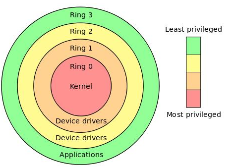

- # Hook 程序  
[参考文章1](https://xz.aliyun.com/t/6961)  
[参考文章2](https://stibel.icu/md/c++/function/c++-function-Linux_Hook.html)  

## 简介  

系统调用属于一种`软中断`机制，它有操作系统提供的功能入口(sys_call)以及CPU提供的硬件支持(int 3 trap)共同完成。 Hook技术是一个相对较宽的话题，因为操作系统从`ring3`到`ring0`是分层次的结构，在每一个层次上都可以进行相应的Hook，它们使用的技术方法以及取得的效果也是不尽相同的。本文主要关注"系统调用的Hook学习"，讲解从ring3到ring0中所涉及到的Hook技术，来实现系统调用的监控功能。 

## 原理  

Hook技术无论对`安全软件`还是`恶意软件`都是十分关键的一项技术，其本质就是`劫持函数调用`。但是由于处于Linux用户态，每个进程都有自己独立的进程空间，所以必须先注入到所要Hook的`进程空间`，修改其内存中的进程代码，替换其过程表的符号地址。 

## 操作系统RING3到RING0的分层结构

Intel的CPU将特权级别分为4个级别：`RING0`,`RING1`,`RING2`,`RING3`。 Windows只使用`RING0`和`RING3`，RING0只给操作系统用，RING3谁都能用。 如果普通应用程序企图执行RING0指令，则Windows会显示“非法指令”错误信息。因为有CPU的特权级别作保护。 ring0是指CPU的运行级别，ring0是最高级别，ring1次之，ring2更次之……

<br>
<div align=center>
    </img>  
</div>
<br>

以Linux+x86为例
操作系统（内核）的代码运行在最高运行级别RING0上，可以使用特权指令，控制中断、修改页表、访问设备等。 应用程序的代码运行在最低运行级别上RING3上，不能做受控操作。如果要做，例如访问磁盘，写文件的操作，则必须通过`系统调用`（函数），执行系统调用的时候，CPU的运行级别会从RING3切换到RING0，并跳转到系统调用对应的内核代码位置执行，这样内核就替我们完成了设备访问的操作，完成之后再从RING0返回RING3。整个过程也称作用户态和内核态的切换。 

## Ring3中Hook技术
### **LD_PRELOAD动态连接.so函数劫持**  


在linux操作系统的动态链接库的世界中，LD_PRELOAD就是这样一个环境变量，它可以影响程序的`运行时的链接`(Runtime linker)，它允许用户在程序运行前优先加载的动态链接库。Loader在进行动态链接的时候，会将有相同符号名的符号`覆盖`成LD_PRELOAD指定的so文件中的符号。换句话说，可以用我们自己编写的so库中的函数替换原来库里有的函数，从而达到hook的目的。  

动态库加载优先级:  
- `LD_PRELOAD` > `LD_LIBRARY_PATH` > `/etc/ld.so.cache `> `/lib`> `/usr/lib`  

Linux用的C语言库使用的是glibc，存在一个libc.so.6的文件。默认情况下，linux所编译的程序中对标准C函数的链接，都是通过动态链接方式来链接libc.so.6函数库的。这也意味着我们在通过注入的.so来实现函数覆盖劫持之后需要从libc.so.6中取得原本的正常函数，让程序能够继续正常执行。  

正常情况的main.c  
```c
#include <stdio.h>
#include <string.h>

int main(int argc, char *argv[])
{
  if( strcmp(argv[1], "test") )
  {
    printf("Compare inconsistent\n");
  }
  else
  {
    printf("Compare consistent\n");
  }
  return 0;
}
```

用于劫持函数的.so代码hook.c:
```c
#include <stdio.h>
#include <string.h>
#include <dlfcn.h>
#include <stdlib.h>

/*
hook的目标是strcmp，所以typedef了一个STRCMP函数指针
hook的目的是要控制函数行为，从原库libc.so.6中拿到strcmp指针，保存成old_strcmp以备调用
*/
typedef int(*STRCMP)(const char*, const char*);
 
int strcmp(const char *s1, const char *s2)
{
  static void *handle = NULL;
  static STRCMP old_strcmp = NULL;
    
  handle = dlopen ("libc.so.6", RTLD_LAZY);  
  if (!handle) {  
     fprintf (stderr, "%s ", dlerror());  
     exit(1);  
  }
  else
  {
     old_strcmp = (STRCMP)dlsym(handle, "strcmp"); 
  }
   
  printf("oops!!! hack function invoked. s1=<%s> s2=<%s>\n", s1, s2);
  dlclose(handle);
  return old_strcmp(s1, s2);
}
```

使用过程
```sh
gcc -o test main.c
gcc -fPIC -shared -o hook.so hook.c -ldl

# 运行程序  
$ LD_PRELOAD=./hook.so ./test 123
LD_PRELOAD=./hook.so ./test 123
oops!!! hack function invoked. s1=<123> s2=<test>
Compare inconsistent

$ LD_PRELOAD=./hook.so ./test test
oops!!! hack function invoked. s1=<test> s2=<test>
Compare consistent
```

> 前提是程序还没有启动  

### **ptrace API调试技术Hook**

ptrace是很多Linux平台下调试器实现的基础，包括syscall跟踪程序strace。  

ptrace可以实现调试程序、跟踪；但是一个进程只能被一个进程跟踪。所以无法在gdb或者其他程序调试的时候去ptrace一个程序，同样也无法在ptrace一个进程的时候，再去gdb调试。后者经常作为一个简单的反调试手段。  

整体思路:
1. ptrace attach目标进程
2. 保存rip
3. 控制跳转到mmap分配一段rwx内存
4. 将一段机器码copy进去
5. 控制跳转到机器码（可以以bin文件的形式）
6. 恢复执行。

示例:  
首先需要知道一些函数在目标进程的地址，下面是已知pid获取libc基地址（读取`/proc/pid/maps`），和函数地址(`dlsym`)
```sh
7f71ead32000-7f71ead3f000 r--p 00000000 fd:00 3283239                    /usr/lib/x86_64-linux-gnu/libm-2.31.so
7f71ead3f000-7f71eade6000 r-xp 0000d000 fd:00 3283239                    /usr/lib/x86_64-linux-gnu/libm-2.31.so
7f71eade6000-7f71eae7f000 r--p 000b4000 fd:00 3283239                    /usr/lib/x86_64-linux-gnu/libm-2.31.so
7f71eae7f000-7f71eae80000 r--p 0014c000 fd:00 3283239                    /usr/lib/x86_64-linux-gnu/libm-2.31.so
7f71eae80000-7f71eae81000 rw-p 0014d000 fd:00 3283239                    /usr/lib/x86_64-linux-gnu/libm-2.31.so
7f71eae81000-7f71eae86000 r--p 00000000 fd:00 3283351                    /usr/lib/x86_64-linux-gnu/libudev.so.1.6.17
7f71eae86000-7f71eaea2000 r-xp 00005000 fd:00 3283351                    /usr/lib/x86_64-linux-gnu/libudev.so.1.6.17
...
```

- #### 动态注入指令 示例

用过gdb等调试器的人都知道,debugger工具可以给程序打断点和单步运行等. 这些功能其实也能用ptrace实现, 其原理就是ATTACH并追踪正在运行的进程, 读取其指令寄存器`IR`(32bit系统为%eip, 64位系统为%rip)的内容, 备份后替换成目标指令,再使其返回运行;此时被追踪进程就会执行我们替换的指令. 运行完注入的指令之后, 我们再恢复原进程的IR,从而达到改变原程序运行逻辑的目的. `talk is cheap`, 先写个循环打印的程序:  

```c
//victim.c
int main() {
    while(1) {
        printf("Hello, ptrace! [pid:%d]\n", getpid());
        sleep(2);
    }
    return 0;
}
```

程序运行后会每隔2秒会打印到终端.然后再另外编写一个程序:
```c
//attacker.c
int main(int argc, char *argv[]) {
    if(argc!=2) {
        printf("Usage: %s pid\n", argv[0]);
        return 1;
    }
    pid_t victim = atoi(argv[1]);
    struct user_regs_struct regs;
    /* int 0x80, int3 */
    unsigned char code[] = {0xcd,0x80,0xcc,0x00,0,0,0,0};
    char backup[8];
    ptrace(PTRACE_ATTACH, victim, NULL, NULL);
    long inst;

    wait(NULL);
    ptrace(PTRACE_GETREGS, victim, NULL, &regs);
    inst = ptrace(PTRACE_PEEKTEXT, victim, regs.rip, NULL);
    printf("Victim: EIP:0x%llx INST: 0x%lx\n", regs.rip, inst);

    /* Copy instructions into a backup variable */
    getdata(victim, regs.rip, backup, 7);
    /* Put the breakpoint */
    putdata(victim, regs.rip, code, 7);
    /* Let the process continue and execute the int 3 instruction */
    ptrace(PTRACE_CONT, victim, NULL, NULL);

    wait(NULL);
    printf("Press Enter to continue ptraced process.\n");
    getchar();
    putdata(victim, regs.rip, backup, 7);
    ptrace(PTRACE_SETREGS, victim, NULL, &regs);

    ptrace(PTRACE_CONT, victim, NULL, NULL);
    ptrace(PTRACE_DETACH, victim, NULL, NULL);
    return 0;
}
```

运行后会将一直循环输出的进程暂停, 再按回车使得进程恢复循环输出. 其中putdata和getdata在上文中已经介绍过了. 我们用之前替换寄存器内容的方法,将%rip的内容修改为int 3的机器码, 使得对应进程暂停执行; 恢复寄存器状态时使用的是PTRACE_SETREGS参数. 值得一提的是对于不同的处理器架构, 其使用的寄存器名称也不尽相同, 在不同的机器上允许时代码也要作相应的修改.

这里注入的代码长度只有8个字节, 而且是用shellcode的格式注入, 但实际中我们可以在目标进程中动态加载库文件(.so), 包括标准库文件(如libc.so)和我们自己编译的库文件, 从而可以通过传递函数地址和参数来进行复杂的注入,限于篇幅暂不细说. 不过需要注意的是动态链接库挂载的地址是动态确定的, 可以在/proc/$pid/maps文件中查看, 其中$pid为进程id.


### **PLT重定向劫持Hook**  

- 这个主要是利用ELF文件的，GOT和PLT的方式解决地址无关的链接.so文件的机制。
- 在第一次调用前，Got里是PLT的地址；一般在调用之后Got里会写入库函数的真实地址。
- PLT在text段，一般不可写；（所以迷，为啥有这一技术）


## Ring0中Hook技术
### Kernel Inline Hook

传统的kernel inline hook技术就是修改内核函数的`opcode`，通过写入`jmp`或`push ret`等指令跳转到新的内核函数中，从而达到劫持的目的。对于这类劫持攻击，目前常见的做法是`函数返回地址污点检测`，通过对原有指令返回位置的汇编代码作污点标记，通过查找`jmp，push re`t等指令来进行防御 

> 备注：OPCode 操作码(Operation Code,OPCode):描述机器语言指令中,指定要执行某种操作的机器码。   

在系统调用函数中一定会递归的嵌套有很多的子函数，即它必定要调用它的下层函数。从汇编的角度看，对一个子函数的调用是采用`段内相对短跳转 jmp offset`的方式来实现的，即CPU根据offset来进行一个`偏移量`的跳转。 如果我们把下层函数在上层函数中的offset替换成我们`Hook函数`的offset，这样上层函数调用下层函数时，就会跳到我们的"Hook函数"中，我们就可以在"Hook函数"中做过滤和劫持内容的工作。

```c
asmlinkage ssize_t sys_read(unsigned int fd, char __user * buf, size_t count)
{
  struct file *file;
  ssize_t ret = -EBADF;
  int fput_needed;

  file = fget_light(fd, &fput_needed);
  if (file) 
    {
    loff_t pos = file_pos_read(file);
    ret = vfs_read(file, buf, count, &pos);
    file_pos_write(file, pos);
    fput_light(file, fput_needed);
  }

  return ret;
}
EXPORT_SYMBOL_GPL(sys_read);
```

在`sys_read()`中，调用了子函数vfs_read()来完成读取数据的操作，在sys_read()中调用子函数vfs_read()的汇编命令是:

`call 0xc106d75c <vfs_read>`  

等同于: `jmp offset(相对于sys_read()的基址偏移)`  

所以，目标就是找到`call  0xc106d75c <vfs_read>`这条汇编，把其中的offset改成我们的Hook函数对应的offset，即可实现劫持目的。  

- ### sys_call_table

基础知识: 
- 都知道linux通过int 0x80或者syscall都可以进入kernel完成系统调用，而我们需要把对应的系统调用号传给`rax`。两者最终还是用了system_call。
- int 0x80工作原理  

```sh
1、系统维护一个叫做`向量中断表的`，每个int xx都会去对应的向量表的xx处
2、0x80对应系统调用的服务例程，记录了`syscall`的地址。
3、而`eax`的值，对应具体的系统调用号。 [eax]作为参数  
```


### systemtap  

[官网地址](https://sourceware.org/systemtap/)  

#### ubuntu环境搭建
```sh
apt-get install -y build-essential gettext elfutils libdw-dev python wget tar 
```

下载源码 https://sourceware.org/ftp/systemtap/releases/  
```sh
wget https://sourceware.org/ftp/systemtap/releases/systemtap-4.8.tar.gz
```

编译
```sh
cd systemtap-4.8/
./configure 
make -j4
make install
```

编写个tap
```sh
# stap -ve 'probe begin { log("hello world") exit () }'

Pass 1: parsed user script and 484 library scripts using 109164virt/102128res/6100shr/96128data kb, in 250usr/30sys/280real ms.
Pass 2: analyzed script: 1 probe, 2 functions, 0 embeds, 0 globals using 110748virt/103896res/6300shr/97712data kb, in 10usr/0sys/7real ms.
Pass 3: translated to C into "/tmp/stapYXfNc2/stap_de562f769926c93749aa6a120b8fcd8f_1136_src.c" using 110748virt/103896res/6300shr/97712data kb, in 0usr/0sys/0real ms.
Pass 4: compiled C into "stap_de562f769926c93749aa6a120b8fcd8f_1136.ko" in 13480usr/1880sys/8873real ms.
Pass 5: starting run.
hello world
Pass 5: run completed in 10usr/50sys/460real ms.
```

```sh
# stap -c df -e 'probe syscall.* { if (target()==pid()) log(name." ".argstr) }'
```


`sendto.stp`
```sh
probe syscall.sendto.call {
	if (pid() == $1) {
		printf("pid:[%d], sendto begin: long_arg[%d] \n", pid(), long_arg(1))
		s = -1
	}
}

probe syscall.send.call {
    if (pid() == $1) {
        printf("pid:[%d], sendto begin: long_arg[%d] \n", pid(), long_arg(1))
        s = -1
    }   
}
```

运行指令:`stap -B CONFIG_MODVERSIONS=y -vg sendto.stp 41054`


