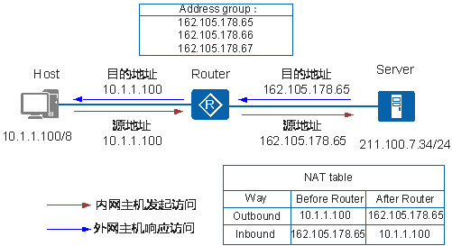
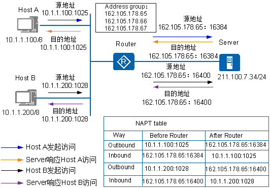
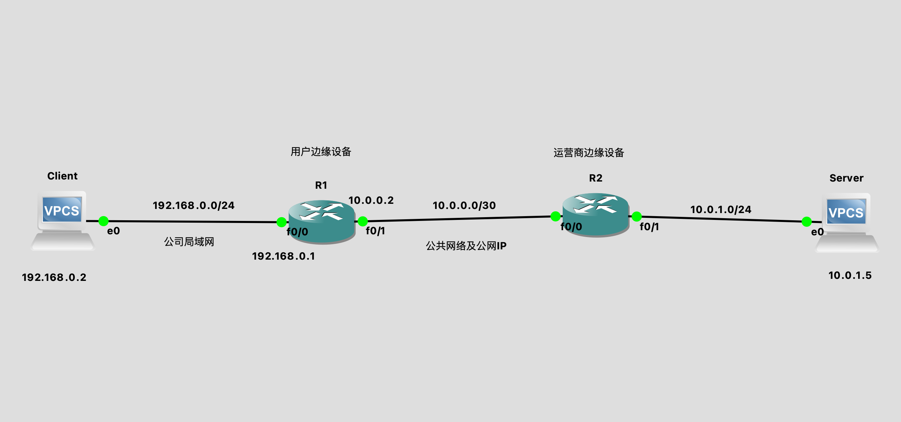

- # NAT  

## 原理
[参考文档](https://support.huawei.com/enterprise/zh/doc/EDOC1100086644#ZH-CN_TOPIC_0170224861)  

网络地址转换NAT（Network Address Translation）是将IP数据报文头中的IP地址转换为另一个IP地址的过程。  

随着Internet的发展和网络应用的增多，IPv4地址枯竭已成为制约网络发展的瓶颈。尽管IPv6可以从根本上解决IPv4地址空间不足问题，但目前众多网络设备和网络应用大多是基于IPv4的，因此在IPv6广泛应用之前，一些过渡技术（如CIDR、私网地址等）的使用是解决这个问题最主要的技术手段。NAT主要用于实现内部网络（简称`内网`，使用私有IP地址）访问外部网络（简称`外网`，使用公有IP地址）的功能。当内网的主机要访问外网时，通过NAT技术可以将其私网地址转换为公网地址，可以实现`多个私网用户`共用一个`公网地址`来访问外部网络，这样既可保证网络互通，又节省了公网地址。  

### Basic NAT
Basic NAT方式属于一对一的地址转换，在这种方式下只转换IP地址，而不处理TCP/UDP协议的端口号，一个公网IP地址不能同时被多个私网用户使用。  

描述了Basic NAT的基本原理，实现过程如下：

<br>
<div align=center>
    </img>  
</div>
<br>

1. Router收到内网侧Host发送的访问公网侧Server的报文，其源IP地址为10.1.1.100。
2. Router从`地址池`中选取一个空闲的公网IP地址，建立与内网侧报文源IP地址间的NAT转换表项（正反向），并依据查找正向NAT表项的结果将报文转换后向公网侧发送，其源IP地址是1.1.1.1，目的IP地址是2.2.2.2。
3. Router收到公网侧的回应报文后，根据其目的IP地址查找反向NAT表项，并依据查表结果将报文转换后向私网侧发送，其源IP地址是2.2.2.2，目的IP地址是10.1.1.100。

### NAPT
除了一对一的NAT转换方式外，网络地址端口转换NAPT（Network Address `Port` Translation）可以实现并发的地址转换。它允许多个内部地址映射到同一个公有地址上，因此也可以称为“多对一地址转换”或地址复用。

NAPT方式属于多对一的地址转换，它通过使用`IP地址＋端口号`的形式进行转换，使多个私网用户可共用一个公网IP地址访问外网。  

描述了NAPT的基本原理，实现过程如下：  

<br>
<div align=center>
    </img>  
</div>
<br>

1. Router收到内网侧Host发送的访问公网侧Server的报文。比如收到Host A报文的源地址是10.1.1.100，端口号`1025`。
2. Router从地址池中选取一对空闲的“公网IP地址＋端口号”，建立与内网侧报文“源IP地址＋源端口号”间的NAPT转换表项（正反向），并依据查找正向NAPT表项的结果将报文转换后向公网侧发送。比如Host A的报文经Router转换后的报文源地址为1.1.1.1，端口号`16384`。
3. Router收到公网侧的回应报文后，根据其“目的IP地址＋目的端口号”查找反向NAPT表项，并依据查表结果将报文转换后向私网侧发送。比如Server回应Host A的报文经Router转换后，目的地址为10.1.1.100，端口号`1025`。


## GNS3 模拟
### 网络拓扑图

<br>
<div align=center>
    </img>  
</div>
<br>

如果不增加NAT功能时，Client Ping Server时，Server能够接受到ICMP报文，相应ICMP报文时，目标地址是`192.168.0.2`, 因为`192.168.0.2`是私有地址，无法再公网上找到，所以Client无法收到ICMP响应报文  

```sh
# Server收到的请求
Frame 2: 98 bytes on wire (784 bits), 98 bytes captured (784 bits) on interface -, id 0
Ethernet II, Src: c0:04:09:79:00:01 (c0:04:09:79:00:01), Dst: Private_66:68:01 (00:50:79:66:68:01)
Internet Protocol Version 4, Src: 192.168.0.2, Dst: 10.0.1.5
Internet Control Message Protocol

# Server响应的ICMP报文
Frame 10: 98 bytes on wire (784 bits), 98 bytes captured (784 bits) on interface -, id 0
Ethernet II, Src: Private_66:68:01 (00:50:79:66:68:01), Dst: c0:04:09:79:00:01 (c0:04:09:79:00:01)
Internet Protocol Version 4, Src: 10.0.1.5, Dst: 192.168.0.2
Internet Control Message Protocol
```

配置SNAT后，请求报文就变成`src ip 10.0.0.2`  
对应指令`ip route 10.0.1.0 255.255.255.0 10.0.0.1`
```sh
Frame 83: 98 bytes on wire (784 bits), 98 bytes captured (784 bits) on interface -, id 0
Ethernet II, Src: c0:04:09:79:00:01 (c0:04:09:79:00:01), Dst: Private_66:68:01 (00:50:79:66:68:01)
Internet Protocol Version 4, Src: 10.0.0.2, Dst: 10.0.1.5
Internet Control Message Protocol

```

### 配置

Client配置
```sh
ip 192.168.0.2 192.168.0.1
```

Server配置
```sh
ip 10.0.1.5 10.0.1.1 
```

R1配置
```sh
R1#config t         
R1(config)#do show ip inter bri
Interface                  IP-Address      OK? Method Status                Protocol
FastEthernet0/0            unassigned      YES unset  administratively down down    
FastEthernet0/1            unassigned      YES unset  administratively down down    

R1(config)#inter FastEthernet0/0
R1(config-if)#ip address 192.168.0.1 255.255.255.0  
R1(config-if)#ip nat inside
R1(config-if)#duplex auto
R1(config-if)#speed auto
R1(config-if)#no shut

R1(config)#inter FastEthernet0/1
R1(config-if)#ip address 10.0.0.2 255.255.255.252
R1(config-if)#ip nat outside
R1(config-if)#duplex auto
R1(config-if)#speed auto
R1(config-if)#no shut

R1(config-if)#do show ip route
Codes: C - connected, S - static, R - RIP, M - mobile, B - BGP
       D - EIGRP, EX - EIGRP external, O - OSPF, IA - OSPF inter area 
       N1 - OSPF NSSA external type 1, N2 - OSPF NSSA external type 2
       E1 - OSPF external type 1, E2 - OSPF external type 2
       i - IS-IS, su - IS-IS summary, L1 - IS-IS level-1, L2 - IS-IS level-2
       ia - IS-IS inter area, * - candidate default, U - per-user static route
       o - ODR, P - periodic downloaded static route

Gateway of last resort is not set

     10.0.0.0/8 is variably subnetted, 2 subnets, 2 masks
C       10.0.0.0/30 is directly connected, FastEthernet0/1
C    192.168.0.0/24 is directly connected, FastEthernet0/0

# 增加一条路由
R1(config)#ip nat inside source static 192.168.0.2 10.0.0.2
R1(config)#do show ip nat translations                     
Pro Inside global      Inside local       Outside local      Outside global
--- 10.0.0.2           192.168.0.2        ---                ---
```


R2
```sh
R2#configure t
R2(config)#do show ip inter bri
Interface                  IP-Address      OK? Method Status                Protocol
FastEthernet0/0            unassigned      YES unset  administratively down down    
FastEthernet0/1            unassigned      YES unset  administratively down down  

R2(config)#inter FastEthernet0/0 
R2(config-if)#ip address 10.0.0.1 255.255.255.252
R2(config-if)#duplex auto
R2(config-if)#speed auto
R2(config-if)#no shutdown 

R2(config-if)#inter FastEthernet0/1
R2(config-if)#ip address 10.0.1.1 255.255.255.0
R2(config-if)#duplex auto
R2(config-if)#speed auto
R2(config-if)#no shutdown 

R2(config-if)#do show ip inter bri 
Interface                  IP-Address      OK? Method Status                Protocol
FastEthernet0/0            10.0.0.1        YES manual up                    up      
FastEthernet0/1            10.0.1.1        YES manual up                    up   

R2(config-if)#do show ip route     
Codes: C - connected, S - static, R - RIP, M - mobile, B - BGP
       D - EIGRP, EX - EIGRP external, O - OSPF, IA - OSPF inter area 
       N1 - OSPF NSSA external type 1, N2 - OSPF NSSA external type 2
       E1 - OSPF external type 1, E2 - OSPF external type 2
       i - IS-IS, su - IS-IS summary, L1 - IS-IS level-1, L2 - IS-IS level-2
       ia - IS-IS inter area, * - candidate default, U - per-user static route
       o - ODR, P - periodic downloaded static route

Gateway of last resort is not set

     10.0.0.0/8 is variably subnetted, 2 subnets, 2 masks
C       10.0.0.0/30 is directly connected, FastEthernet0/0
C       10.0.1.0/24 is directly connected, FastEthernet0/1

# 增加路由
ip route 10.0.1.0 255.255.255.0 10.0.0.1
```