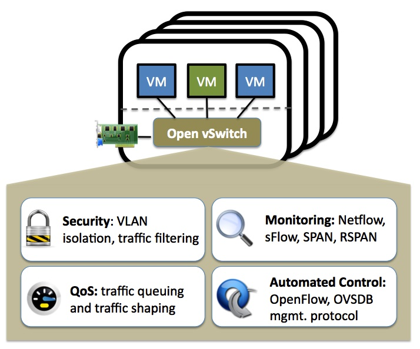

- # nftables的nfqueue数据包读取  

- [环境搭建](#环境搭建)
- [数据包读取](#数据包读取)
- [linux命令创建网桥](#linux命令创建网桥)
- [docker搭建网桥触发规则](#docker搭建网桥触发规则)
  - [docker启动ubuntu容器作为出接口](#docker启动ubuntu容器作为出接口)
- [虚拟网卡搭建网桥触发规则](#虚拟网卡搭建网桥触发规则)
- [eBPF/xdp 二层转发功能](#ebpfxdp-二层转发功能)
  - [ubuntu环境搭建](#ubuntu环境搭建)
  - [网卡数据镜像](#网卡数据镜像)
  - [python http服务](#python-http服务)
- [网桥原理](#网桥原理)
  - [网桥的工作原理](#网桥的工作原理)
  - [实例](#实例)
- [ovs 转发流量](#ovs-转发流量)
  - [ovs环境搭建](#ovs环境搭建)

## 环境搭建

```sh
apt install libnetfilter-queue-dev
apt install nftables
```

设置规则`nft -f test.rule`  
`ip`
```sh
table ip netvine-table {
	chain ids-rule-chain {
		type filter hook prerouting priority filter; policy accept;
		iifname "br0" log prefix "nft-rule-test " queue num 0
	}
}
```

> prerouting 也可以是  forward

`netdev`
```sh
table netdev netvine-table {
	chain ids-rule-chain {
		type filter hook ingress device enp0s5 priority filter; policy accept;
		log prefix "nftables-test" queue num 0-3
	}
}
```
> enp0s5 具体的网卡  , queue num 0-3 , Queueing to userspace    

- ip: Used for IPv4 related chains.
- ip6: Used for IPv6 related chains.
- arp: Used for ARP related chains.
- bridge: Used for bridging related chains.
- inet: Mixed ipv4/ipv6 chains (kernel 3.14 and up).
- netdev: Used for chains that filter early in the stack (kernel 4.2 and up).  

tcpreplay的依赖
```sh
sudo apt-get install build-essential autogen libpcap-dev cmake openssl libssl-dev python3 autoconf automake libtool pkg-config m4 zlib1g-dev 
```


nftables作用:  
`nftables` is a subsystem of the Linux kernel providing filtering and classification of network packets/datagrams/frames.  

`nftables` replaces the legacy `iptables` portions of `Netfilter`. Among the advantages of nftables over iptables is less code duplication and easier extension to new protocols. nftables is configured via the user-space utility nft, while legacy tools are configured via the utilities iptables, ip6tables, arptables and ebtables frameworks.

## 数据包读取  
```c
#include <stdio.h>
#include <stdlib.h>
#include <string.h>
#include <netinet/in.h>
#include <linux/netfilter.h>
#include <libnetfilter_queue/libnetfilter_queue.h>

#define BUFSIZE 65536

void print_hex(char *buffer, int len){
	int i;
	for(i = 1; i <= strlen(buffer); i++){
		printf("0x%02X ",buffer[i-1]);					
		if(i % 16 == 0){
			printf("\n");
		}
	}
	printf("\n");
}

static int cb(struct nfq_q_handle *qh, struct nfgenmsg *nfmsg,
              struct nfq_data *nfa, void *data)
{
    u_int32_t id = 0;
    struct nfqnl_msg_packet_hdr *ph;
    ph = nfq_get_msg_packet_hdr(nfa);
    if (ph) {
        id = ntohl(ph->packet_id);
    }

    int len = nfq_get_payload(nfa, (unsigned char **)(&data));
    if (len > 0) {
        // 对数据包进行处理
		// printf("接收的数据包:%d->%s\n", len,data);
		print_hex(data, len);
    }

    return nfq_set_verdict(qh, id, NF_ACCEPT, 0, NULL);
}


int main(int argc, char **argv)
{
    struct nfq_handle *h;
    struct nfq_q_handle *qh;
    struct nfnl_handle *nh;
    int fd, rv;
    char buf[BUFSIZE] __attribute__ ((aligned));
    unsigned char *data;
    struct nfq_data *nfad;
    int len;

    // 初始化netfilter_queue
    h = nfq_open();
    if (!h) {
        fprintf(stderr, "nfq_open() error\n");
        exit(1);
    }

    // 绑定到nfqueue队列号为0的队列
    if (nfq_unbind_pf(h, AF_INET) < 0) {
        fprintf(stderr, "nfq_unbind_pf() error\n");
        exit(1);
    }
    if (nfq_bind_pf(h, AF_INET) < 0) {
        fprintf(stderr, "nfq_bind_pf() error\n");
        exit(1);
    }
    qh = nfq_create_queue(h, 0, &cb, NULL);
    if (!qh) {
        fprintf(stderr, "nfq_create_queue() error\n");
        exit(1);
    }
    if (nfq_set_mode(qh, NFQNL_COPY_PACKET, BUFSIZE) < 0) {
        fprintf(stderr, "nfq_set_mode() error\n");
        exit(1);
    }

    // 打开netlink socket
    nh = nfq_nfnlh(h);
    fd = nfnl_fd(nh);

    while (1) {
        rv = recv(fd, buf, sizeof(buf), 0);
        if (rv >= 0) {
            nfq_handle_packet(h, buf, rv);
            continue;
        }
        // 错误处理
        if (rv < 0) {
            fprintf(stderr, "recv() error\n");
            continue;
        }
    }

    nfq_destroy_queue(qh);
    nfq_close(h);

    return 0;
}
```

编译:  
```sh
 gcc -o main main.c -lnetfilter_queue -lnfnetlink
```

也可以使用`tcpdump -i nfqueue:0 -nnvvS`监听, 使用`nnvvXS`参数，可以显示16进制与ascii码
```sh
15:09:44.964616 IP6 (hlim 255, next-header ICMPv6 (58) payload length: 32) fe80::21c:42ff:fe00:18 > ff02::1:ff8a:5718: [icmp6 sum ok] ICMP6, neighbor solicitation, length 32, who has fe80::21c:42ff:fe8a:5718
	  source link-address option (1), length 8 (1): 00:1c:42:00:00:18
	    0x0000:  001c 4200 0018
15:09:44.964617 IP6 (hlim 255, next-header ICMPv6 (58) payload length: 32) fe80::21c:42ff:fe00:18 > ff02::1:ff8a:5718: [icmp6 sum ok] ICMP6, neighbor solicitation, length 32, who has fe80::21c:42ff:fe8a:5718
^Ctcpdump: Unable to write output: Interrupted system call
```

## linux命令创建网桥

创建网桥的普通模式：  
```sh
brctl addbr enp0s6-enp0s7
brctl addif enp0s6-enp0s7 enp0s6
brctl addif enp0s6-enp0s7 enp0s7
ip link set dev enp0s6 up
ip link set dev enp0s7 up
ip link set enp0s6-enp0s7 up
```

nftable输出日志(`tail -f /var/log/kern.log`)：
```sh
Mar  3 15:00:23 matrix kernel: [ 5879.059317] nftables-testIN=enp0s6-enp0s7 OUT= PHYSIN=enp0s6 MAC=00:1c:42:00:00:08:00:1c:42:5a:b0:7d:08:00 SRC=10.211.55.16 DST=10.211.55.2 LEN=1776 TOS=0x10 PREC=0x00 TTL=64 ID=48804 DF PROTO=TCP SPT=22 DPT=57913 WINDOW=501 RES=0x00 ACK PSH URGP=0 
```

> 从结果可以看出，网桥模式也算是路由(route)  

这样的前提是两个网卡都是up状态，也就是有物理接入才行。  
## docker搭建网桥触发规则  

国内镜像安装docker
```sh
curl -fsSL https://get.docker.com | bash -s docker --mirror Aliyun
```

把某个网卡，比如`enp4s0`的流量全部镜像到容器内，方法就是自己创建一个基于`enp4s0`的网桥，这样来自于`enp4s0`的数据都会转发到容器内。  


[参考文章](https://yeasy.gitbook.io/docker_practice/advanced_network/bridge)  

docker服务启动时，会有一个默认网桥
```shell
docker0: flags=4163<UP,BROADCAST,RUNNING,MULTICAST>  mtu 1500
        inet 172.17.0.1  netmask 255.255.0.0  broadcast 172.17.255.255
        inet6 fe80::42:cbff:feca:454f  prefixlen 64  scopeid 0x20<link>
        ether 02:42:cb:ca:45:4f  txqueuelen 0  (Ethernet)
        RX packets 1568  bytes 17640614 (16.8 MiB)
        RX errors 0  dropped 0  overruns 0  frame 0
        TX packets 3844  bytes 452141 (441.5 KiB)
        TX errors 0  dropped 0 overruns 0  carrier 0  collisions 0
```

容器配置端口的的转发规则:  
```shell
$ iptables -nvL

Chain DOCKER (1 references)
 pkts bytes target     prot opt in     out     source               destination         
    0     0 ACCEPT     tcp  --  !docker0 docker0  0.0.0.0/0            172.17.0.2           tcp dpt:6379
    0     0 ACCEPT     tcp  --  !docker0 docker0  0.0.0.0/0            172.17.0.2           tcp dpt:3306
   18  1152 ACCEPT     tcp  --  !docker0 docker0  0.0.0.0/0            172.17.0.2           tcp dpt:443
```

如果想通过网口流量直接转发`enp4s0->docker->ids-container`  

除了默认的 `docker0` 网桥，用户也可以指定网桥来连接各个容器。并且可以删除。  
在启动 Docker 服务的时候，使用 `-b BRIDGE`或`--bridge=BRIDGE` 来指定使用的网桥。  


删除网卡
```shell
$ sudo ip link set dev br0 down
$ sudo brctl delbr br0
```

设置网卡为混杂模式
```shell
sudo ifconfig enp4s0 promisc
```

```shell
# 创建网桥
sudo brctl addbr br0

# 添加物理网卡
sudo brctl addif br0 enp4s0

# 设置up状态
sudo ip link set dev br0 up

# 查看网卡状态
ip addr show br0

# 关闭docker原网桥
sudo systemctl stop docker
sudo ifconfig docker0 down
sudo brctl delbr docker0

# 修改docker默认网桥 

vim /etc/docker/daemon.json
{
  "bridge": "br0"
}

sudo systemctl start docker
```

### docker启动ubuntu容器作为出接口  

```sh
docker pull ubuntu:20.04

docker run --privileged -itd -v data:/data -p 8080:8080 --name ub ubuntu:20.04 /usr/sbin/init

# 进入容器
docker exec -it ub bash

// 因为镜像中没有包缓存，所以需要运行：
# apt-get update

// 安装curl 
# apt-get -y install curl
# apt-get install -y bash-completion
# apt install net-tools
# apt install tcpdump 
```

网卡信息
```sh
ifconfig
eth0: flags=4163<UP,BROADCAST,RUNNING,MULTICAST>  mtu 1500
        inet 172.17.0.2  netmask 255.255.0.0  broadcast 172.17.255.255
        ether 02:42:ac:11:00:02  txqueuelen 0  (Ethernet)
        RX packets 23049  bytes 33162159 (33.1 MB)
        RX errors 0  dropped 0  overruns 0  frame 0
        TX packets 7818  bytes 435544 (435.5 KB)
        TX errors 0  dropped 0 overruns 0  carrier 0  collisions 0

# 宿主机多了一个 veth05841b9 网卡  
6: veth05841b9@if5: <BROADCAST,MULTICAST,UP,LOWER_UP> mtu 1500 qdisc noqueue master docker0 state UP group default 
    link/ether 9e:31:da:e4:2b:0b brd ff:ff:ff:ff:ff:ff link-netnsid 0
    inet6 fe80::9c31:daff:fee4:2b0b/64 scope link 
       valid_lft forever preferred_lft forever
```

在宿主机执行` ping 172.17.0.2 `, 查看镜像接口数据  
```sh
tcpdump -i eth0 -vvnnXS

11:59:00.807078 IP (tos 0x0, ttl 64, id 57335, offset 0, flags [none], proto ICMP (1), length 84)
    172.17.0.2 > 172.17.0.1: ICMP echo reply, id 1, seq 4, length 64
	0x0000:  4500 0054 dff7 0000 4001 428c ac11 0002  E..T....@.B.....
	0x0010:  ac11 0001 0000 55b5 0001 0004 84be 0d64  ......U........d
	0x0020:  0000 0000 4d50 0c00 0000 0000 1011 1213  ....MP..........
	0x0030:  1415 1617 1819 1a1b 1c1d 1e1f 2021 2223  .............!"#
	0x0040:  2425 2627 2829 2a2b 2c2d 2e2f 3031 3233  $%&'()*+,-./0123
	0x0050:  3435 3637                                4567
```

首先尝试往docker网桥打入网络数据，看容器是否能够收到?  

```sh
# 宿主机， 发送ftp包
tcpreplay -i docker0 ftp-test.pcap 

# ubuntu镜像内收到, eth0 没有开混杂模式，也是可以收到数据的  
tcpdump -i eth0 -vvnnXS
12:19:03.092497 IP (tos 0x0, ttl 128, id 19331, offset 0, flags [DF], proto TCP (6), length 50)
    192.168.10.21.60573 > 192.168.10.25.21: Flags [P.], cksum 0x3b40 (correct), seq 3557710849:3557710859, ack 2091964120, win 16417, length 10: FTP, length: 10
	USER lfz
	0x0000:  4500 0032 4b83 4000 8006 19c4 c0a8 0a15  E..2K.@.........
	0x0010:  c0a8 0a19 ec9d 0015 d40e 5c01 7cb0 d6d8  ..........\.|...
	0x0020:  5018 4021 3b40 0000 5553 4552 206c 667a  P.@!;@..USER.lfz
	0x0030:  0d0a                                     ..
```

目前通过xdp重定向，把所有的数据都发送到docker0网卡，但是容器eth0仍然收不到数据。  

先把物理网卡enp0s6和veth网卡都加到docker0网桥中，现在修改网络数据的目的mac地址为veth，然后使用tcpdump重发流量到enp0s6中，看veth能否收到数据?  

```sh
docker0的网卡信息
4: docker0: <BROADCAST,MULTICAST,PROMISC,UP,LOWER_UP> mtu 1500 qdisc noqueue state UP group default 
    link/ether 02:42:39:7b:8d:4e brd ff:ff:ff:ff:ff:ff
    inet 172.17.0.1/16 brd 172.17.255.255 scope global docker0

# 如果不指定cache文件, 将把所有包的源mac地址和目的mac地址都改写成
tcprewrite --enet-dmac=9e:31:da:e4:2b:0b -i ftp-test.pcap -o ftp-test-modity.pcap

# 向enp0s,veth发送数据 都没有反应
tcpreplay -i enp0s6 ftp-test-modity.pcap
tcpreplay -i veth ftp-test-modity.pcap              # tcpdump ip host 192.168.10.21 -i eth0 -nnvvXS 容器eth0能收到数据，但是mac地址没有变化  

# 收不到数据
tcpdump ip host 192.168.10.21 -i docker0 -nnvvS
```

最终还是收不到的。自己新建一个网桥试试
```sh
# 修改成容器eth0的mac地址
tcprewrite --enet-dmac=02:42:ac:11:00:02 -i ftp-test.pcap -o ftp-test-modity.pcap

# 向enp0s发送数据
tcpreplay -i veth ftp-test-modity.pcap

tcpdump ip host 192.168.10.21 -i docker0 -nnvvS
# 修改后的数据往，docker网桥收到的转发的数据有,并且都是request 
Frame 25: 64 bytes on wire (512 bits), 64 bytes captured (512 bits) on interface sshdump, id 0
Ethernet II, Src: 02:42:ac:11:00:02 (02:42:ac:11:00:02), Dst: 02:42:39:7b:8d:4e (02:42:39:7b:8d:4e)
Internet Protocol Version 4, Src: 192.168.10.21, Dst: 192.168.10.25
Transmission Control Protocol, Src Port: 60573, Dst Port: 21, Seq: 1, Ack: 32, Len: 10
File Transfer Protocol (FTP)
    USER lfz\r\n
[Current working directory: ]


原始报文中有两个请求报文，docker0转发的也只有两个请求报文，一条是:
Frame 5: 64 bytes on wire (512 bits), 64 bytes captured (512 bits)
Ethernet II, Src: LCFCHeFe_ef:ad:ee (c8:5b:76:ef:ad:ee), Dst: 02:42:ac:11:00:02 (02:42:ac:11:00:02)
Internet Protocol Version 4, Src: 192.168.10.21, Dst: 192.168.10.25
Transmission Control Protocol, Src Port: 60573, Dst Port: 21, Seq: 1, Ack: 32, Len: 10
File Transfer Protocol (FTP)
    USER lfz\r\n
[Current working directory: ]
```


## 虚拟网卡搭建网桥触发规则  

总体思路是创建一个虚拟网卡，然后把物理网卡和虚拟网卡搭一个网桥，软件从虚拟网卡中读取数据，网桥负责通过nftable规律数据。  

tun/tap 驱动程序实现了虚拟网卡的功能，tun表示虚拟的是点对点设备，tap表示虚拟的是以太网设备，这两种设备针对网络包实施不同的封装。 利用tun/tap 驱动，可以将tcp/ip协议栈处理好的网络分包传给任何一个使用tun/tap驱动的进程，由进程重新处理后再发到物理链路中。   

确认内核是否有tun模块: 
```sh
modinfo tun
name:           tun
filename:       (builtin)
alias:          devname:net/tun
alias:          char-major-10-200
license:        GPL
author:         (C) 1999-2004 Max Krasnyansky <maxk@qualcomm.com>
description:    Universal TUN/TAP device driver
```

创建网卡
```sh
# 安装工具
apt install uml-utilities

# 创建
tunctl -t tap0 -u root

ifconfig tap0 up

# 删除
tunctl -d tap0

# 从网桥中移除
brctl delif br0 tap0
```

> tap0一直处于down状态，无法up  
查看详情: `strace ifconfig tap0 up`  
```sh
strace ifconfig tap0 up
openat(AT_FDCWD, "/usr/share/locale-langpack/en.utf8/LC_MESSAGES/net-tools.mo", O_RDONLY) = -1 ENOENT (No such file or directory)
openat(AT_FDCWD, "/usr/share/locale-langpack/en/LC_MESSAGES/net-tools.mo", O_RDONLY) = -1 ENOENT (No such file or directory)
ioctl(4, SIOCGIFFLAGS, {ifr_name="tap0", ifr_flags=IFF_BROADCAST|IFF_MULTICAST}) = 0
ioctl(4, SIOCSIFFLAGS, {ifr_name="tap0", ifr_flags=IFF_UP|IFF_BROADCAST|IFF_RUNNING|IFF_MULTICAST}) = 0
exit_group(0)                           = ?
+++ exited with 0 +++
```

可以设置网卡
```sh
ifconfig tap0 192.168.0.1  netmask 255.255.255.0 promisc
```

在物理网卡与虚拟网卡之前创建网桥
```sh
# 清理
ip link set dev br0 down
brctl delbr br0

# 网卡设置为混杂模式
sudo ifconfig enp0s6 promisc

# 创建网桥
sudo brctl addbr br0

# 添加物理网卡
sudo brctl addif br0 enp0s6
sudo brctl addif br0 tap0

# 设置up状态
sudo ip link set dev br0 up

# 查看网卡状态
ip addr show br0

# 查看网桥中包含的网卡
brctl show

> bridge name	bridge id		STP enabled	interfaces
> br0		8000.001c4250a337	no		enp0s7
> docker0		8000.02423784b7c1	no
```

规则:
```sh
table ip netvine-table {
	chain ids-rule-chain {
		type filter hook prerouting priority filter; policy accept;
		iifname "br0" ip saddr != { 10.211.55.4, 10.211.55.2 }  log prefix "nft-rule-test " accept
	}
}
```

iptable规则实现转发
- `-p 协议（protocol）`  
- `-s 源地址（source）`  
- `-d 目的地址（destination）`
- `-j 执行目标（jump to target）`
- `-i 输入接口（input interface）`
- `-o 输出（out interface）`
- `--append  -A chain		Append to chain`
- 

设置网桥ip及设置nat规则
```sh
# ip
ifconfig br1 10.25.2.1 netmask 255.255.255.0 promisc
```

设置物理网卡的方法
```sh
sudo modprobe dummy

sudo ip link add eth0 type dummy

ip link show eth0

# 可以不设置
sudo ifconfig eth0 hw ether C8:D7:4A:4E:47:51

# 可以不设置
sudo ip addr add 192.168.1.100/24 brd + dev eth0 label eth0:0

sudo ip link set dev eth0 up
```

> 这样创建的网卡才行，tap虚拟网卡无法使用.  

<br>

## eBPF/xdp 二层转发功能  

通过网络层无法实现二层转发，只要需要通过ip地址查询mac，然后实现转发，是三层的转发，但是ip地址变了，还是需要二层链路层的转发，相当于交换机。  

eXpress Data Path，Linux 提供的高性能网络数据路径。允许网络包在进入内核协议栈之前就进行处理。XDP 与 bcc-tools 都是基于 eBPF 机制实现的。XDP 应用程序一般是专业的网络程序，如 IDS（入侵检测系统）、DDoS 防御、cilium 容器网络插件等。  


<br>
<div align=center>
    </img>  
</div>
<br>

从图中可以看出，可以使用`Forward`功能实现转发。不然其他的路都会送往协议栈.  

另外一个重要内容就是`maps`  

<br>
<div align=center>
    </img>  
</div>
<br>

- #### 用户态
1. 用户编写 eBPF 程序，可以使用 eBPF 汇编或者 eBPF 特有的 C 语言来编写。
2. 使用 LLVM/CLang 编译器，将 eBPF 程序编译成 eBPF 字节码。
3. 调用 `bpf()` 系统调用把 eBPF 字节码加载到内核。

- #### 内核态
1. 当用户调用 `bpf()` 系统调用把 eBPF 字节码加载到内核时，内核先会对 eBPF 字节码进行安全验证。
2. 使用 `JIT`（Just In Time）技术将 eBPF 字节编译成本地机器码（Native Code）。
3. 然后根据 eBPF 程序的功能，将 eBPF 机器码挂载到内核的不同运行路径上（如用于跟踪内核运行状态的 eBPF 程序将会挂载在 kprobes 的运行路径上）。当内核运行到这些路径时，就会触发执行相应路径上的 eBPF 机器码。


### ubuntu环境搭建
- Linux kernel 5.0以上版本
- 安装LLVM和Clang  `sudo apt install llvm clang`
- 安装libelf-dev和libbpf-dev库 `sudo apt install libelf-dev libbpf-dev`  

[官方安装依赖说明](https://github.com/xdp-project/xdp-tutorial/blob/master/setup_dependencies.org)  

安装依赖
```sh
sudo apt install clang llvm libelf-dev libpcap-dev gcc-multilib build-essential 

sudo apt install linux-tools-$(uname -r)

# linux kernel header
sudo apt install linux-headers-$(uname -r)

# tools
sudo apt install linux-tools-common linux-tools-generic
sudo apt install tcpdump
```

```sh
alias t='sudo /root/xdp-tutorial/testenv/testenv.sh'
```

下载BPF Samples  
https://github.com/xdp-project/xdp-tutorial  
```sh
# 下载代码
git clone https://github.com/xdp-project/xdp-tutorial.git

# 根目录执行
git submodule update --init

# 根目录执行
make
```

进入测试demo`xdp-tutorial/tracing03-xdp-debug-print`  


```c
/* SPDX-License-Identifier: GPL-2.0 */
#include <linux/bpf.h>
#include <linux/if_ether.h>
#include <linux/if_packet.h>
#include <linux/if_vlan.h>
#include <linux/ip.h>
#include <linux/in.h>
#include <stdbool.h>
#include <bpf/bpf_helpers.h>
#include <bpf/bpf_endian.h>

#define bpf_printk(fmt, ...)                                    \
({                                                              \
	char ____fmt[] = fmt;                                   \
	bpf_trace_printk(____fmt, sizeof(____fmt),              \
                         ##__VA_ARGS__);                        \
})

/* to u64 in host order */
static inline __u64 ether_addr_to_u64(const __u8 *addr)
{
	__u64 u = 0;
	int i;

	for (i = ETH_ALEN - 1; i >= 0; i--)
		u = u << 8 | addr[i];
	return u;
}

SEC("xdp")
int  xdp_prog_simple(struct xdp_md *ctx)
{
	void *data = (void *)(long)ctx->data;
	void *data_end = (void *)(long)ctx->data_end;
	struct ethhdr *eth = data;
	__u64 offset = sizeof(*eth);

	if ((void *)eth + offset > data_end)
		return 0;

	bpf_printk("src: %llu, dst: %llu, proto: %u\n",
		   ether_addr_to_u64(eth->h_source),
		   ether_addr_to_u64(eth->h_dest),
		   bpf_ntohs(eth->h_proto));

	return XDP_PASS;
}

char _license[] SEC("license") = "GPL";
```

Makefile
```sh
# SPDX-License-Identifier: (GPL-2.0 OR BSD-2-Clause)

XDP_TARGETS := xdp_prog_kern
USER_TARGETS := trace_read

COPY_LOADER = xdp_loader

LLC ?= llc
CLANG ?= clang
CC := gcc

LIBBPF_DIR = ../libbpf/src/
COMMON_DIR = ../common/

include $(COMMON_DIR)/common.mk
COMMON_OBJS := $(COMMON_DIR)/common_params.o
```

```sh
# 使用以下命令编译代码
rm -fr xdp_prog_kern.o 
make # 做好使用makefile编译，不然warn也会导致部署失败  
# clang -O2 -target bpf -c xdp_prog_kern.c -o xdp_prog_kern.o

# 将编译好的xdp_prog_kern.o文件加载到内核中
sudo ip link set dev enp0s6 xdp object xdp_prog_kern.o sec xdp  

# 查看是否加载xdp程序
ip link show enp0s6  // prog/xdp id 13 tag 649153f4d32aeb29 jited

# 卸载
ip link set dev enp0s6 xdp off
```

```sh
#!/usr/bin/env bash
arg=$1
interface=enp0s6

if [[ "${arg}" == "load" ]]; then
    echo "--load"
    rm -fr xdp_prog_kern.o 
    make
    sudo ip link set dev $interface xdp object xdp_prog_kern.o sec xdp  
    ip link show $interface
fi

if [[ "${arg}" == "unload" ]]; then
    echo "--unload"
    ip link set dev $interface xdp off
    ip link show $interface
fi

if [[ "${arg}" == "log" ]]; then
    echo "--log"
    tail /sys/kernel/debug/tracing/trace
fi
```

加载到内核报错:  
```sh
BTF debug data section '.BTF' rejected: Invalid argument (22)!
 - Length:       738
Verifier analysis:

magic: 0xeb9f
version: 1
flags: 0x0
hdr_len: 24
type_off: 0
type_len: 256
str_off: 256
str_len: 458
btf_total_size: 738
[1] PTR (anon) type_id=2
[2] STRUCT xdp_md size=20 vlen=5
	data type_id=3 bits_offset=0
	data_end type_id=3 bits_offset=32
	data_meta type_id=3 bits_offset=64
	ingress_ifindex type_id=3 bits_offset=96
	rx_queue_index type_id=3 bits_offset=128
[3] TYPEDEF __u32 type_id=4
[4] INT unsigned int size=4 bits_offset=0 nr_bits=32 encoding=(none)
[5] FUNC_PROTO (anon) return=6 args=(1 ctx)
[6] INT int size=4 bits_offset=0 nr_bits=32 encoding=SIGNED
[7] FUNC xdp_prog_simple type_id=5 vlen != 0

Program section 'prog' not found in ELF file!
Error fetching program/map!
```

> ip link set dev [device name] xdp obj xdp-drop-world.o sec [section name]  // section 就是 SEC("xdp") 的名称  
> ip link set dev enp0s5 xdp obj xdp_prog_kern.o sec xdp  

输出日志`sudo cat /sys/kernel/debug/tracing/trace`或者`sudo ./trace_read`:
```sh
src: 0:1c:42:0:0:8 dst: 0:1c:42:5a:b0:7d proto: 2048
```

### 网卡数据镜像

准备环境:
```sh
t setup -n left --legacy-ip
```

```c
/* SPDX-License-Identifier: GPL-2.0 */

#include <linux/bpf.h>
#include <linux/if_ether.h>
#include <linux/ip.h>
#include <netinet/in.h> // # <linux/in.h>

#include <bpf/bpf_helpers.h>
#include <bpf/bpf_endian.h>

// The parsing helper functions from the packet01 lesson have moved here
#include "../common/parsing_helpers.h"

/* Defines xdp_stats_map */
#include "../common/xdp_stats_kern_user.h"
#include "../common/xdp_stats_kern.h"

#ifndef memcpy
#define memcpy(dest, src, n) __builtin_memcpy((dest), (src), (n))
#endif

#define bpf_printk(fmt, ...)                       \
    ({                                             \
        char ____fmt[] = fmt;                      \
        bpf_trace_printk(____fmt, sizeof(____fmt), \
                         ##__VA_ARGS__);           \
    })

/* to u64 in host order */
static inline __u64 ether_addr_to_u64(const __u8 *addr)
{
    __u64 u = 0;
    int i;

    for (i = ETH_ALEN - 1; i >= 0; i--)
        u = u << 8 | addr[i];
    return u;
}

SEC("xdp")
int xdp_prog(struct xdp_md *ctx)
{
    void *data_end = (void *)(long)ctx->data_end;
    void *data = (void *)(long)ctx->data;

    struct ethhdr *eth;
    struct hdr_cursor nh;
    int eth_type;
    int action = XDP_PASS;
    unsigned ifindex = 6;

    // unsigned char src[ETH_ALEN] = {0x78,0x09,0xd6,0x95,0x2e,0xee};
    unsigned char dst[ETH_ALEN] = {0xee, 0x2e, 0x95, 0xd6, 0x09, 0x78};

    /* These keep track of the next header type and iterator pointer */
    nh.pos = data;

    /* Parse Ethernet and IP/IPv6 headers */
    eth_type = parse_ethhdr(&nh, data_end, &eth);
    if (eth_type == -1)
        goto out;

    /* Set a proper destination address */
    // memcpy(eth->h_source, src, ETH_ALEN);
    memcpy(eth->h_dest, dst, ETH_ALEN);

    // 将数据包重定向到指定的输出接口
    bpf_printk("26119 xdp msg ./src: %llu, dst: %llu, proto: %u\n",
               ether_addr_to_u64(eth->h_source),
               ether_addr_to_u64(eth->h_dest),
               bpf_ntohs(eth->h_proto));

    action = bpf_redirect(ifindex, 0);   
    // action = xdp_stats_record_action(ctx, XDP_REDIRECT);

    bpf_printk("161 xdp debug msg action:%d \n", action);
out:
    return xdp_stats_record_action(ctx, action);
}

char __license[] SEC("license") = "GPL";
```

> ip link show 查看网卡的索引  
> bpf_redirect(ifindex, 0);  相当于二层交换机了，ifindex 是交换机的出接口mac地址，配置的dstmac地址就是下一跳  

`bpf_redirect`重定向还是发向下一跳.  

<br>
<div align=center>
    </img>  
</div>
<br>

编译完成后，查看`objdump -x xdp_prog_kern.o`信息:  

```sh
objdump -x xdp_prog_kern.o 

xdp_prog_kern.o:     file format elf64-little
xdp_prog_kern.o
architecture: UNKNOWN!, flags 0x00000011:
HAS_RELOC, HAS_SYMS
start address 0x0000000000000000

Sections:
Idx Name          Size      VMA               LMA               File off  Algn
  0 .text         00000000  0000000000000000  0000000000000000  00000040  2**2
                  CONTENTS, ALLOC, LOAD, READONLY, CODE
  1 xdp           000000d0  0000000000000000  0000000000000000  00000040  2**3
                  CONTENTS, ALLOC, LOAD, RELOC, READONLY, CODE
  2 maps          00000014  0000000000000000  0000000000000000  00000110  2**2
                  CONTENTS, ALLOC, LOAD, DATA
  3 license       00000004  0000000000000000  0000000000000000  00000124  2**0
                  CONTENTS, ALLOC, LOAD, DATA
  4 .llvm_addrsig 00000003  0000000000000000  0000000000000000  000001f0  2**0
                  CONTENTS, READONLY, EXCLUDE
SYMBOL TABLE:
0000000000000000 l    df *ABS*	0000000000000000 xdp_prog_kern.c
00000000000000c0 l       xdp	0000000000000000 LBB0_4
0000000000000000 g     O license	0000000000000004 __license
0000000000000000         *UND*	0000000000000000 htons
0000000000000000 g     O maps	0000000000000014 output_map
0000000000000000 g     F xdp	00000000000000d0 xdp_prog


RELOCATION RECORDS FOR [xdp]:
OFFSET           TYPE              VALUE 
0000000000000070 UNKNOWN           htons
0000000000000090 UNKNOWN           output_map
```

> 可以看到`xdp`与`map`段，但是段的作用是什么?  

查看`section header`通过指令 `readelf -l xdp_prog_kern.o` 
```sh
readelf -l xdp_prog_kern.o 

There are no program headers in this file.
root@matrix:~/work/xdp-tutorial/sample# readelf -S xdp_prog_kern.o 
There are 9 section headers, starting at offset 0x260:

Section Headers:
  [Nr] Name              Type             Address           Offset
       Size              EntSize          Flags  Link  Info  Align
  [ 0]                   NULL             0000000000000000  00000000
       0000000000000000  0000000000000000           0     0     0
  [ 1] .strtab           STRTAB           0000000000000000  000001f3
       000000000000006d  0000000000000000           0     0     1
  [ 2] .text             PROGBITS         0000000000000000  00000040
       0000000000000000  0000000000000000  AX       0     0     4
  [ 3] xdp               PROGBITS         0000000000000000  00000040
       00000000000000d0  0000000000000000  AX       0     0     8
  [ 4] .relxdp           REL              0000000000000000  000001d0
       0000000000000020  0000000000000010           8     3     8
  [ 5] maps              PROGBITS         0000000000000000  00000110
       0000000000000014  0000000000000000  WA       0     0     4
  [ 6] license           PROGBITS         0000000000000000  00000124
       0000000000000004  0000000000000000  WA       0     0     1
  [ 7] .llvm_addrsig     LOOS+0xfff4c03   0000000000000000  000001f0
       0000000000000003  0000000000000000   E       8     0     1
  [ 8] .symtab           SYMTAB           0000000000000000  00000128
       00000000000000a8  0000000000000018           1     3     8
Key to Flags:
  W (write), A (alloc), X (execute), M (merge), S (strings), I (info),
  L (link order), O (extra OS processing required), G (group), T (TLS),
  C (compressed), x (unknown), o (OS specific), E (exclude),
  p (processor specific)
```

不同的 `section` 可能分属不同的类型，而不同的类型自然包含着不同含义的数据，起到不同的作用，有一部分 section 针对链接过程而存在，有一部分针对加载过程而存在.  

针对加载过程的 `section` 数据分为两种:  
- 一种是需要被加载器进行解析，给加载过程提供辅助信息 
- 另一种就是程序代码和数据，加载器直接将其 copy 到对应的虚拟地址即可，二进制代码和数据由 CPU 执行.  
对于需要解析的 section 数据，自然需要规定在它组成和解析的时候遵循特定的格式，这样链接器或者加载器才能按照格式对它进行解析，从程序中的角度来看这就涉及到不同的数据结构.  

加载程序`sudo ip link set dev enp0s6 xdp object xdp_prog_kern.o sec xdp `时提示错误

```sh
Prog section 'xdp' rejected: Invalid argument (22)!
 - Type:         6
 - Instructions: 26 (0 over limit)
 - License:      GPL

Verifier analysis:

call to invalid destination
processed 0 insns (limit 1000000) max_states_per_insn 0 total_states 0 peak_states 0 mark_read 0

Error fetching program/map!
```

编译错误及告警也会影响，使用Makefile编译发现问题，修改后就可以加载了.  

```sh
error: implicit declaration of function 'htons' is invalid in C99 [-Werror,-Wimplicit-function-declaration]
```

修改代码: `#include <netinet/in.h>  // # <linux/in.h>`  


首先查看原始物理网卡能不能收到数据，然后再去查看镜像的网卡是否能收到数据。之前tcpreplay不一定是物理层面的，可能是内核的中转，发现无法达到xdp点。  

xdp处理后，tcpdump也无法抓到包，因为tcpdump也是在内核抓包的，但是xdp在网卡驱动处拦截了。  


XDP提供的重定向机制是基于`出接口`（`egress`）进行操作的。这意味着，只有在数据包要经过的出接口是指定的接口时，重定向才会生效。

具体来说，当XDP程序通过调用`bpf_redirect()`函数实现重定向时，它将检查当前数据包要经过的`出接口`是否与`指定的接口`相同。如果是，则该数据包将被重定向到指定的接口；否则，该数据包将被丢弃。

这种出接口的限制是为了确保重定向机制不会影响其他接口的正常工作。在实践中，这种机制使得XDP可以通过重定向机制实现多种功能，例如网络嗅探、网络过滤、负载均衡等，而不会对网络性能产生不良影响。

需要注意的是，出接口的判断是基于数据包到达XDP程序的`接口`，而不是目标IP地址的接口。这意味着，如果要重定向到的目标IP地址与当前接口不同，仍然可以通过指定正确的出接口实现重定向。

当使用XDP将数据包从一个网络接口重定向到另一个网络接口时，数据包的流向确实会从eth0到eth1。但是，如果使用tcpdump在eth1上抓取数据包，可能会发现并没有抓到重定向过来的数据包。这是因为XDP会在硬件层面直接将数据包从一个网络接口转发到另一个网络接口，而不经过内核协议栈。因此，tcpdump在eth1上无法抓到这些数据包。

解决这个问题的方法是在XDP程序中添加一些额外的逻辑来把数据包同时复制到用户态，然后再使用tcpdump在用户态抓取数据包。在XDP程序中可以使用`bpf_perf_event_output`或`bpf_trace_printk`等函数将数据包复制到用户态中。具体的步骤如下

### python http服务

```sh
$ python3 -m http.server -b 10.211.55.45 9080 
Serving HTTP on 10.211.55.45 port 9080 (http://10.211.55.45:9080/) ...

10.211.55.2 - - [09/Mar/2023 14:10:38] "GET / HTTP/1.1" 200 -
10.211.55.2 - - [09/Mar/2023 14:10:38] code 404, message File not found
10.211.55.2 - - [09/Mar/2023 14:10:38] "GET /favicon.ico HTTP/1.1" 404 -
10.211.55.2 - - [09/Mar/2023 14:11:00] "GET /.bash_history HTTP/1.1" 200 -
```
直接可以文件下载， python服务位置: `/usr/lib/python3.8/http/server.py`  

通过tcpdump过滤端口查看报文
```sh
tcpdump -i enp0s6 port 9080
```

报文
```sh
14:24:22.864189 IP 10.211.55.2.53239 > matrix.9080: Flags [SEW], seq 3442087008, win 65535, options [mss 1460,nop,wscale 6,nop,nop,TS val 2512115741 ecr 0,sackOK,eol], length 0
14:24:22.864353 IP matrix.9080 > 10.211.55.2.53239: Flags [S.E], seq 2829168985, ack 3442087009, win 65160, options [mss 1460,sackOK,TS val 2897013303 ecr 2512115741,nop,wscale 7], length 0
```


## 网桥原理  
### 网桥的工作原理
网桥处理包遵循以下几条规则：

- 在一个接口上接收到的包不会再往那个接口上发送此包。  
- 每个接收到的包都要学习其源MAC地址。  
- 如果数据包是多播或者广播包（通过2层MAC地址确定）则要向接收端口以外的所有端口转发，如果上层协议感兴趣，则还会递交上层处理。  
- 如果数据包的地址不能再CAM表中找到，则向接收端口以外的其他端口转发。  
- 如果CAM表中能找到，则转发给相应端口，如果发送和接收都是统一端口，则不发送。  

> 注意，网桥是以混杂模式工作的。关于网桥更多，请查阅相关资料。

### 实例  
[参考资料](https://www.cnblogs.com/still-smile/p/14932131.html)  

<br>
<div align=center>
    </img>  
</div>
<br>

Docker 在启动时，会创建一个名为 `docker0` 的 网桥，并且把其 IP 地址设置为 `172.17.0.1/16`（私有 IP 地址）。然后使用虚拟设备对 `veth-pair` 来将容器与 `网桥` 连接起来，如上图所示。而对于 `172.17.0.0/16` 网段的数据包，Docker 会定义一条 `iptables NAT` 的规则来将这些数据包的 `IP` 地址转换成公网 `IP` 地址，然后通过真实网络接口（如上图的 ens160 接口）发送出去。  


同 `tap/tun`、`veth-pair` 一样，`Bridge` 也是一种虚拟网络设备，所以具备虚拟网络设备的所有特性，比如可以配置 `IP`、`MAC` 等。

除此之外，Bridge 还是一个交换机，具有交换机所有的功能。

对于普通的网络设备，就像一个管道，只有两端，数据从一端进，从另一端出。而 Bridge 有多个端口，数据可以从多个端口进，从多个端口出。 

Bridge 的这个特性让它可以接入其他的网络设备，比如物理设备、虚拟设备、VLAN 设备等。Bridge 通常充当主设备，其他设备为从设备，这样的效果就等同于物理交换机的端口连接了一根网线。比如下面这幅图通过 Bridge 连接两个 VM 的 tap 虚拟网卡和物理网卡 eth0。

<br>
<div align=center>
    </img>  
</div>
<br>

- ### Bridge 常用使用场景
Bridge 设备通常就是结合 tap/tun、veth-pair 设备用于虚拟机、容器网络里面。这两种网络，在数据传输流程上还有些许不同，我们简单来看下：

首先是虚拟机网络，虚拟机一般通过 tap/tun 设备将虚拟机网卡同宿主机里的 Bridge 连接起来，完成同主机和跨主机的通信。如下图所示：

<br>
<div align=center>
    </img>  
</div>
<br>

虚拟机发出的数据包通过 `tap` 设备先到达 `br0`，然后经过 `eth0` 发送到物理网络中，数据包不需要经过主机的的协议栈，效率是比较高的。

其次是容器网络（容器网络有多种引申的形式，这里我们只说 Bridge 网络），容器网络和虚拟机网络类似，不过一般是使用 `veth-pair` 来连接容器和主机，因为在主机看来，容器就是一个个被隔离的 `namespace`，用 veth-pair 更有优势。如下图所示：

<br>
<div align=center>
    </img>  
</div>
<br>

容器的 Bridge 网络通常配置成内网形式，要出外网需要走 `NAT`，所以它的数据传输不像虚拟机的桥接形式可以直接跨过协议栈，而是必须经过协议栈，通过 `NAT` 和 `ip_forward `功能从物理网卡转发出去，因此，从性能上看，Bridge 网络虚拟机要优于容器。


Bridge 是偏低级的工具，更高级的工具是 Open vSwitch，这个工具后面再详说。


tap/tun/veth

<br>
<div align=center>
    </img>  
</div>
<br>


## ovs 转发流量  
Open vSwitch (OVS) 是一个高性能、多层、虚拟交换机，它提供了一种软件定义网络的解决方案。  


<br>
<div align=center>
    </img>  
</div>
<br>

整体结构:  
<br>
<div align=center>
    </img>  
</div>
<br>

镜像设置
- 指定mirror名称，name={name}
- 指定流量：
  - select-all: true，表示此bridge上的所有流量;
  - select-dst-port: 镜像从此port离开的流量;
  - select-src-port: 镜像从此port进入的流量;
  - select-vlan: 镜像此VLAN下的数据流量。
- 指定镜像目的端口:
  - output-port: 流量镜像至此端口;
  - output-vlan: 流量镜像至指定vlan，镜像至指定VLAN时，原始tag会被剥离。


### ovs环境搭建
```sh
apt install openvswitch-switch
ovs-vsctl --version
> ovs-vsctl (Open vSwitch) 2.13.8
> DB Schema 8.2.0
```


```sh
# 创建网桥
ovs-vsctl add-br br0
ip link set br0 up 

# 查看网桥
ovs-vsctl show
923d5dbd-771f-4e32-9164-db00da3a4e41
    Bridge br0
        Port br0
            Interface br0
                type: internal
    ovs_version: "2.13.8"

# 把物理网卡和虚拟网卡加入网桥

sudo ip link add eth0 type dummy
sudo ip link set dev eth0 up

ovs-vsctl add-port br0 enp0s6 
ovs-vsctl add-port br0 eth0 

# 查看网桥接入的接口
ovs-vsctl list-ports br0 

# 删除接口
ovs-vsctl del-port br0 enp0s6

# 增加镜像功能
ovs-vsctl -- --id=@aaa get port enp0s6 \
          -- --id=@bbb get port eth0 \
          -- --id=@m create mirror name=m0 select_src_port=@aaa select-dst-port=@aaa \
          output_port=@bbb \
          -- set bridge br0 mirrors=@m

# 查看镜像
$ ovs-vsctl list Mirror 
_uuid               : c866af50-cbca-473d-ae0f-97ade787ca50
external_ids        : {}
name                : m0
output_port         : a2ca428e-35e6-441a-a496-6ec377e21620
output_vlan         : []
select_all          : false
select_dst_port     : [855cdfc5-0da2-4b2f-810c-c791007faefb]
select_src_port     : [855cdfc5-0da2-4b2f-810c-c791007faefb]
select_vlan         : []
snaplen             : []
statistics          : {tx_bytes=1423714, tx_packets=12694}

# 删除镜像
$ ovs-vsctl remove Bridge br0 mirrors c866af50-cbca-473d-ae0f-97ade787ca50

# 增加流表, 和镜像功能二选一即可
ovs-ofctl add-flow br0 in_port="enp0s6",actions=output:"eth0"

# 查看流流表
ovs-ofctl dump-flows br0
 cookie=0x0, duration=3.639s, table=0, n_packets=2, n_bytes=238, in_port=enp7s0 actions=output:eth0
 cookie=0x0, duration=4437.322s, table=0, n_packets=3317, n_bytes=387810, priority=0 actions=NORMAL

 # 删除流表
ovs-ofctl del-flows br0 in_port=enp7s0
```

> tcpreplay 不行的，還是需要交换机的镜像口才行。  :cry:  


### ovs通过network namesapce 环境验证  
[参考文章](http://just4coding.com/2017/12/02/ovs-mirror/)  

<br>
<div align=center>
    </img>  
</div>
<br>

首先构造环境
```sh
ovs-vsctl add-br br0
ovs-vsctl add-port br0 tap1 -- set interface tap1 type=internal
ovs-vsctl add-port br0 tap2 -- set interface tap2 type=internal
ovs-vsctl add-port br0 tap3 -- set interface tap3 type=internal

# 删除
ovs-vsctl del-port br0 tap1
ovs-vsctl del-port br0 tap2
ovs-vsctl del-port br0 tap3

ovs-vsctl list-ports br0

ip netns add ns1
ip netns add ns2
ip netns add ns3

ip link set dev tap1 netns ns1
ip link set dev tap2 netns ns2
ip link set dev tap3 netns ns3

ip netns exec ns1 ip addr add 10.10.10.11/24 dev tap1
ip netns exec ns1 ip link set up tap1
ip netns exec ns2 ip addr add 10.10.10.12/24 dev tap2
ip netns exec ns2 ip link set up tap2
ip netns exec ns3 ip link set up tap3
```

创建了三个网络空间，然后把三个网络空间的网卡加入一个网桥中，这时网桥充当交换机的功能，由于`ns1`与`ns2`处于同一网段，应该能够通信。`ns3`没有ip地址，所有不能和其他空间进行通信。但是可以设置为镜像口，接收其他空间的数据。  

我们从ns1中PING ns2的IP:
```sh
ip netns exec ns1 ping 10.10.10.12 -c 2
PING 10.10.10.12 (10.10.10.12) 56(84) bytes of data.
64 bytes from 10.10.10.12: icmp_seq=1 ttl=64 time=0.060 ms
64 bytes from 10.10.10.12: icmp_seq=2 ttl=64 time=0.106 ms
```

创建一个镜像口`tap3`
```sh
ovs-vsctl -- --id=@tap1 get port tap1  \
          -- --id=@tap3 get port tap3  \
          -- --id=@m create mirror name=m0 select_src_port=@tap1 select_dst_port=@tap1 output_port=@tap3 \
          -- set bridge br0 mirrors=@m
```

在`ns3`上抓包可以看到成功获得`tap2`回应`tap1`的`ICMP`响应数据包:  
```sh
ip netns exec ns3 tcpdump -i tap3 -e -nn icmp or arp
tcpdump: WARNING: tap3: no IPv4 address assigned
tcpdump: verbose output suppressed, use -v or -vv for full protocol decode
listening on tap3, link-type EN10MB (Ethernet), capture size 65535 bytes
23:22:11.919448 26:1e:74:67:6c:cc > 16:fe:12:ad:f0:4f, ethertype IPv4 (0x0800), length 98: 10.10.10.12 > 10.10.10.11: ICMP echo reply, id 4411, seq 1, length 64
23:22:12.919823 26:1e:74:67:6c:cc > 16:fe:12:ad:f0:4f, ethertype IPv4 (0x0800), length 98: 10.10.10.12 > 10.10.10.11: ICMP echo reply, id 4411, seq 2, length 64
23:22:16.929503 26:1e:74:67:6c:cc > 16:fe:12:ad:f0:4f, ethertype ARP (0x0806), length 42: Request who-has 10.10.10.11 tell 10.10.10.12, length 28
^C
3 packets captured
3 packets received by filter
0 packets dropped by kernel
```

### kvm搭建虚拟环境，验证ovs 镜像功能 

#### 简介  
- KVM 是`kernel-based Virtual Machine` 
- QEMU `Quick Emulator`，是一个纯软件实现的虚拟化系统  


<br>
<div align=center>
    </img>  
</div>
<br>

QEMU/KVM 是目前最流行的虚拟化技术，它基于 Linux 内核提供的 kvm 模块，结构精简，性能损失小，而且开源免费（对比收费的 vmware），因此成了大部分企业的首选虚拟化方案。

目前各大云厂商的虚拟化方案，新的服务器实例基本都是用的 KVM 技术。即使是起步最早，一直重度使用 Xen 的 AWS，从 EC2 C5 开始就改用了基于 KVM 定制的 Nitro 虚拟化技术。。

但是 KVM 作为一个企业级的底层虚拟化技术，却没有对桌面使用做深入的优化，因此如果想把它当成桌面虚拟化软件来使用，替代掉 VirtualBox/VMware，有一定难度。

<br>
<div align=center>
    </img>  
</div>
<br>

### 环境搭建

```sh
# 查看是否支持虚拟化
$ grep vmx /proc/cpuinfo
flags		: fpu vme de pse tsc msr pae mce cx8 apic sep mtrr pge

# 创建虚拟硬盘
qemu-img create -f qcow2 vm/ubuntu.img 10G

# 创建虚拟机
# –virt-type：虚拟机类型（kvm，xen，exsi）
# 执行完该命令后，qemu会开启一个5991端口，使用VNC软件连接，便可正常安装虚拟机
virt-install --name kvmtest01 \
--boot network,cdrom,menu=on \
--ram 1024 \
--vcpus=1 \
--os-type=linux \
--accelerate \
-c iso/CentOS-6.4-x86_64-bin-DVD1.iso \
--disk path=vm/ubuntu.img,size=10,format=qcow2,bus=virtio \
--bridge=br0,model=virtio \
--vnc \
--vncport=5991 \
--vnclisten=0.0.0.0
```


### docker 搭建虚拟环境验证ovs功能  

| 网络模式| 	简介 | 
| ------ | ------- |
| Host	| --net=host, --net=bridge, 容器将不会虚拟出自己的网卡，配置自己的IP等，**而是使用宿主机的IP和端口。** | 
| Bridge	| --net=bridge, 此模式会为每一个容器分配、设置IP等，并将容器连接到一个docker0虚拟网桥，通过docker0网桥以及Iptables nat表配置与宿主机通信。 | 
| None	| --net=none, 该模式关闭了容器的网络功能。 | 
| Container	| --net=container:NAME_or_ID, 创建的容器不会创建自己的网卡，配置自己的IP，而是和一个指定的容器共享IP、端口范围。 | 
| 自定义网络	| 略 | 

```sh
docker network ls
NETWORK ID     NAME      DRIVER    SCOPE
611e35839147   bridge    bridge    local
6019583ed676   host      host      local
4c6b0ea28cfb   none      null      local

brctl show 
bridge name	bridge id		STP enabled	interfaces
docker0		8000.024200a1fa63	no
```


