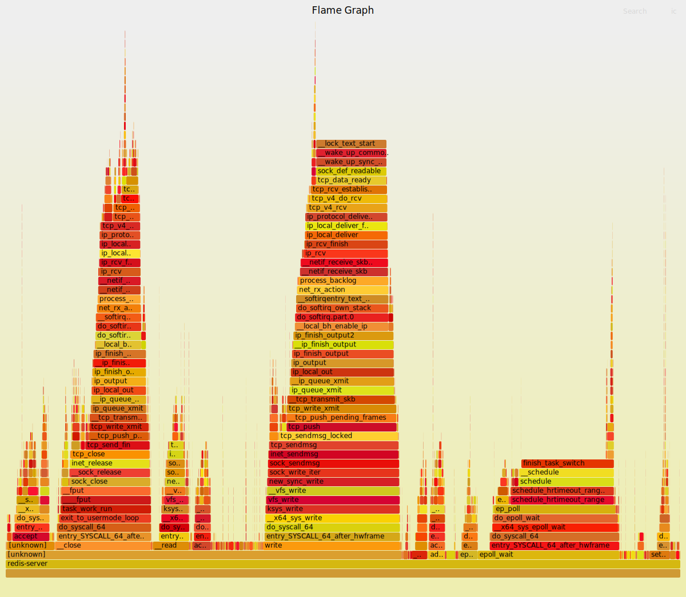

- # perf  

- [安装](#安装)
  - [基础知识](#基础知识)
  - [主要关注点](#主要关注点)
- [应用](#应用)
  - [event](#event)
  - [测试程序](#测试程序)
  - [perf top](#perf-top)
  - [perf record](#perf-record)
  - [perf probe](#perf-probe)
  - [perf sched](#perf-sched)
  - [perf lock](#perf-lock)
  - [mem \&\& kmem](#mem--kmem)

<br>
<div align=center>
    </img>  
</div>
<br>

## 安装  

需要安装对应内核版本的工具  
```sh
sudo apt-get install linux-tools-generic
```


`mkdir -p /usr/share/doc/perf-tip/`  
拷贝:`https://github.com/torvalds/linux/blob/master/tools/perf/Documentation/tips.txt` to `/usr/share/doc/perf-tip/tips.txt`

```sh
perf -v
perf version 5.4.229
```

GUI程序: https://github.com/KDAB/hotspot  

### 基础知识  
- 系统级性能优化通常包括两个阶段：`性能剖析（performance profiling`）和`代码优化`。
- 性能剖析的目标是寻找性能瓶颈，查找引发性能问题的原因及热点代码。
- 代码优化的目标是针对具体性能问题而优化代码或编译选项，以改善软件性能。

背景知识  
- ### tracepoints  
- tracepoints是散落在内核源码中的一些`hook`，它们可以在特定的代码被执行到时触发，这一特定可以被各种`trace/debug`工具所使用。  
- perf将tracepoint产生的时间记录下来，生成报告，通过分析这些报告，便可以了解程序运行期间内核的各种细节，对性能症状做出准确的诊断。  
- 这些tracepint的对应的sysfs节点在`/sys/kernel/debug/tracing/events`目录下。  

- ### 硬件特性之cache  
内存读写是很快的，但是还是无法和处理器指令执行速度相比。为了从内存中读取指令和数据，处理器需要等待，用处理器时间来衡量，这种等待非常漫长。cache是一种SRAM，读写速度非常快，能和处理器相匹配。因此将常用的数据保存在cache中，处理器便无需等待，从而提高性能。cache的尺寸一般都很小，充分利用cache是软件调优非常重要部分。  

### 主要关注点
1. 基于性能分析，可以进行算法优化（空间复杂度和时间复杂度权衡）、代码优化（提高执行速度、减少内存占用）  
1. 评估程序对硬件资源的使用情况，例如各级cache的访问次数、各级cache的丢失次数、流水线停顿周期、前端总线访问次数等  
1. 评估程序对操作系统资源的使用情况，系统调用次数、上下文切换次数、任务迁移次数。

事件可以分为三种：  
- Hardware Event由`PMU`部件产生，在特定的条件下探测性能事件是否发生以及发生的次数。比如cache命中  
- Software Event是内核产生的事件，分布在各个功能模块中，统计和操作系统相关性能事件。比如进程切换，tick数等  
- Tracepoint Event是内核中静态tracepoint所触发的事件，这些tracepoint用来判断程序运行期间内核的行为细节，比如slab分配器的分配次数等  


## 应用 
### event 
`perf list`  
```sh
List of pre-defined events (to be used in -e):

  alignment-faults                                   [Software event]
  bpf-output                                         [Software event]
  context-switches OR cs                             [Software event]
  cpu-clock                                          [Software event]
  cpu-migrations OR migrations                       [Software event]
  dummy                                              [Software event]
  emulation-faults                                   [Software event]
  major-faults                                       [Software event]
  minor-faults                                       [Software event]
  page-faults OR faults                              [Software event]
  task-clock                                         [Software event]

  duration_time                                      [Tool event]

  msr/cpu_thermal_margin/                            [Kernel PMU event]
  msr/pperf/                                         [Kernel PMU event]
  msr/smi/                                           [Kernel PMU event]
  msr/tsc/                                           [Kernel PMU event]

  rNNN                                               [Raw hardware event descriptor]
  cpu/t1=v1[,t2=v2,t3 ...]/modifier                  [Raw hardware event descriptor]
   (see 'man perf-list' on how to encode it)

  mem:<addr>[/len][:access]                          [Hardware breakpoint]

  alarmtimer:alarmtimer_cancel                       [Tracepoint event]
  alarmtimer:alarmtimer_fired                        [Tracepoint event]
  alarmtimer:alarmtimer_start                        [Tracepoint event]
  alarmtimer:alarmtimer_suspend                      [Tracepoint event]
  block:block_bio_backmerge                          [Tracepoint event]
  block:block_bio_bounce                             [Tracepoint event]
```

### 测试程序
使用`Redis 5.0`  
https://download.redis.io/releases/redis-5.0.14.tar.gz  

工程目录
```sh
-rw-rw-r--  1 root root 127554 Oct  4  2021 00-RELEASENOTES
-rw-rw-r--  1 root root     53 Oct  4  2021 BUGS
-rw-rw-r--  1 root root   2381 Oct  4  2021 CONTRIBUTING
-rw-rw-r--  1 root root   1487 Oct  4  2021 COPYING
drwxrwxr-x  6 root root   4096 Oct  4  2021 deps
-rw-rw-r--  1 root root     11 Oct  4  2021 INSTALL
-rw-rw-r--  1 root root    151 Oct  4  2021 Makefile
-rw-rw-r--  1 root root   6888 Oct  4  2021 MANIFESTO
-rw-rw-r--  1 root root  20555 Oct  4  2021 README.md
-rw-rw-r--  1 root root  63088 Oct  4  2021 redis.conf
-rwxrwxr-x  1 root root    275 Oct  4  2021 runtest
-rwxrwxr-x  1 root root    280 Oct  4  2021 runtest-cluster
-rwxrwxr-x  1 root root    373 Oct  4  2021 runtest-moduleapi
-rwxrwxr-x  1 root root    281 Oct  4  2021 runtest-sentinel
-rw-rw-r--  1 root root   9710 Oct  4  2021 sentinel.conf
drwxrwxr-x  3 root root   4096 Oct  4  2021 src
drwxrwxr-x 11 root root   4096 Oct  4  2021 tests
drwxrwxr-x  8 root root   4096 Oct  4  2021 utils
```

编译:  
```sh
make -j4
```

编译好的程序:  
- redis-cli  
- redis-server  
- redis-sentinel  

启动参数:
```sh
./src/redis-server redis.conf 
```

客户端调用
`test.sh`  
```sh
#!/bin/bash
while :
do
    echo "start test"
    /root/redis-5.0.14/src/redis-cli  -n 0 set "note" "123456789"
    /root/redis-5.0.14/src/redis-cli  -n 0 get "note"
    /root/redis-5.0.14/src/redis-cli  -n 0 del "note"
done
```

### perf top  
用于实时显示当前系统的性能统计信息。该命令主要用来观察整个系统当前的状态，比如可以通过查看该命令的输出来查看当前系统最耗时的内核函数或某个用户进程  

这里使用关键字`redis`搜索:  
```sh
Samples: 332K of event 'cpu-clock:pppH', 4000 Hz, Event count (approx.): 18950868210 lost: 0/0 drop: 0/0
Overhead  Shared Ob  Symbol
   0.07%  redis-cli  [.] redisBufferRead
   0.01%  redis-cli  [.] redisBufferWrite
   0.01%  redis-cli  [.] redisFormatSdsCommandArgv
   0.01%  redis-cli  [.] redisReaderGetReply
   0.01%  redis-cli  [.] _redisContextConnectTcp
   0.01%  redis-cli  [.] redisReaderCreateWithFunctions
   0.00%  redis-cli  [.] redisAppendCommandArgv
   0.00%  redis-cli  [.] redisReaderFeed
   0.00%  redis-cli  [.] redisReaderCreate
   0.00%  redis-cli  [.] redisCheckSocketError
   0.00%  redis-cli  [.] redisGetReply
   0.00%  redis-cli  [.] redisContextWaitReady
   0.00%  redis-cli  [.] __redisAppendCommand
   0.00%  redis-cli  [.] redisConnect
   0.00%  redis-cli  [.] redisContextConnectTcp
   0.00%  redis-cli  [.] redisGetReplyFromReader
```

点击某个进程进去:  
```sh
Annotate redisBufferRead
Zoom out of redis-cli DSO
Browse map details
Exit 
```

`Annotate redisBufferRead`  
```sh
Samples: 4M of event 'cpu-clock:pppH', 4000 Hz, Event count (approx.): 21080405173, DSO: redis-cli
redisBufferRead  /root/redis-5.0.14/src/redis-cli [Percent: local period]
Percent│
       │     000000000002e170 <redisBufferRead>:
       │     redisBufferRead():
       │     /* Use this function to handle a read event on the descriptor. It will try
       │     * and read some bytes from the socket and feed them to the reply parser.
       │     *
       │     * After this function is called, you may use redisContextReadReply to
       │     * see if there is a reply available. */
       │     int redisBufferRead(redisContext *c) {
  2.06 │       endbr64
  0.04 │       push    %r13
  0.29 │       push    %r12
       │       push    %rbp
  0.07 │       push    %rbx
  0.14 │       lea     -0x4000(%rsp),%r11
  0.14 │ 12:   sub     $0x1000,%rsp
 76.36 │       orq     $0x0,(%rsp)
 15.10 │       cmp     %r11,%rsp
       │     ↑ jne     12
       │       sub     $0x18,%rsp
       │     char buf[1024*16];
       │     int nread;
       │
       │     /* Return early when the context has seen an error. */
       │     if (c->err)
       │       mov     (%rdi),%r13d
       │     int redisBufferRead(redisContext *c) {
       │       mov     %fs:0x28,%rax
  0.11 │       mov     %rax,0x4008(%rsp)
       │       xor     %eax,%eax
       │     if (c->err)
       │       test    %r13d,%r13d
Press 'h' for help on key bindings
```

`Browse map details`  
```sh
/root/redis-5.0.14/src/redis-cli
 15000  161c0 l _init  
 15030  15040 g __ctype_toupper_loc@plt     
 15040  15050 g __strcat_chk@plt            
 15050  15060 g inet_ntop@plt               
 15060  15070 g getenv@plt                  
 15070  15080 g __snprintf_chk@plt          
 15080  15090 g free@plt                    
 15090  150a0 g putchar@plt                 
 150a0  150b0 g pthread_sigmask@plt         
 150b0  150c0 g strcasecmp@plt              
 150c0  150d0 g __vfprintf_chk@plt          
 150d0  150e0 g abort@plt                   
 150e0  150f0 g __errno_location@plt        
 150f0  15100 g strncpy@plt                 
 15100  15110 g strncmp@plt                 
 15110  15120 g _exit@plt                   
 15120  15130 g strcpy@plt                  
 15130  15140 g secure_getenv@plt           
 15140  15150 g __read_chk@plt              
 15150  15160 g puts@plt                    
 15160  15170 g qsort@plt                   
 15170  15180 g isatty@plt                  
 15180  15190 g fread@plt                   
 15190  151a0 g strtod@plt                  
 151a0  151b0 g setsockopt@plt              
 151b0  151c0 g __xpg_strerror_r@plt        
 151c0  151d0 g readlink@plt                
 151d0  151e0 g fcntl@plt                   
 151e0  151f0 g clock_gettime@plt           
 151f0  15200 g write@plt                   
 15200  15210 g getpid@plt                  
 15210  15220 g lround@plt                  
 15220  15230 g pthread_cond_wait@plt 
```

### perf record  
perf record 记录单个函数级别的统计信息，并使用 perf report 来显示统计结果  

参数:  
```sh
-e, --event=
           Select the PMU event. Selection can be:
       -a, --all-cpus
           System-wide collection from all CPUs (default if no target is specified).

       -p, --pid=
           Record events on existing process ID (comma separated list).

       -t, --tid=
           Record events on existing thread ID (comma separated list). This option also disables inheritance by default. Enable it by adding
           --inherit.

       -u, --uid=
           Record events in threads owned by uid. Name or number.
       -g
           Enables call-graph (stack chain/backtrace) recording.
```

` perf record -e cpu-clock ./src/redis-server redis.conf`  
```sh
Overhead  Command       Shared Object       Symbol
   9.68%  redis-server  [kernel.kallsyms]   [k] apparmor_file_alloc_security                                                                         ▒
   9.68%  redis-server  [kernel.kallsyms]   [k] finish_task_switch                                                                                   ◆
   6.45%  redis-server  libc-2.31.so        [.] __vfprintf_internal                                                                                  ▒
   6.45%  redis-server  redis-server        [.] sdssplitlen                                                                                          ▒
   3.23%  redis-server  [kernel.kallsyms]   [k] __handle_mm_fault                                                                                    ▒
   3.23%  redis-server  [kernel.kallsyms]   [k] do_syscall_64                                                                                        ▒
   3.23%  redis-server  [kernel.kallsyms]   [k] dput                                                                                                 ▒
   3.23%  redis-server  [kernel.kallsyms]   [k] flush_tlb_mm_range                                                                                   ▒
   3.23%  redis-server  [kernel.kallsyms]   [k] kmem_cache_alloc_trace                                                                               ▒
   3.23%  redis-server  [kernel.kallsyms]   [k] lru_cache_add_active_or_unevictable                                                                  ▒
   3.23%  redis-server  [kernel.kallsyms]   [k] memcg_kmem_get_cache                                                                                 ▒
   3.23%  redis-server  [kernel.kallsyms]   [k] percpu_counter_add_batch                                                                             ▒
   3.23%  redis-server  ld-2.31.so          [.] _dl_lookup_symbol_x                                                                                  ▒
   3.23%  redis-server  libc-2.31.so        [.] __GI_____strtol_l_internal                                                                           ▒
   3.23%  redis-server  libc-2.31.so        [.] __strcasecmp_l_avx                                                                                   ▒
   3.23%  redis-server  libc-2.31.so        [.] __tz_convert                                                                                         ▒
   3.23%  redis-server  libc-2.31.so        [.] __tzstring                                                                                           ▒
   3.23%  redis-server  libc-2.31.so        [.] epoll_wait                                                                                           ▒
   3.23%  redis-server  libc-2.31.so        [.] localtime_r                                                                                          ▒
   3.23%  redis-server  libpthread-2.31.so  [.] __read                                                                                               ▒
   3.23%  redis-server  libpthread-2.31.so  [.] pthread_mutex_trylock                                                                                ▒
   3.23%  redis-server  redis-server        [.] aeProcessEvents                                                                                      ▒
   3.23%  redis-server  redis-server        [.] createSharedObjects                                                                                  ▒
   3.23%  redis-server  redis-server        [.] je_arena_tcache_fill_small                                                                           ▒
   3.23%  redis-server  redis-server        [.] lua_getfield 
```

增加`-g`选项，可以打印调用栈。  


### perf probe  
能够动态地在想查看的地方插入动态监测点  

使用:  
```sh
NAME
       perf-probe - Define new dynamic tracepoints

SYNOPSIS
       perf probe [options] --add=PROBE [...]
       or
       perf probe [options] PROBE
       or
       perf probe [options] --del=[GROUP:]EVENT [...]
       or
       perf probe --list[=[GROUP:]EVENT]
       or
       perf probe [options] --line=LINE
       or
       perf probe [options] --vars=PROBEPOINT
       or
       perf probe [options] --funcs
       or
       perf probe [options] --definition=PROBE [...]
```

动态跟踪的函数要在内核符号文件`/proc/kallsyms`  
```sh
cat /proc/kallsyms | grep schedule
```

```sh
$ perf list probe:schedule  
$ perf probe --add schedule  
Added new event:
  probe:schedule       (on schedule)

You can now use it in all perf tools, such as:

	perf record -e probe:schedule -aR sleep 1

$ perf record -e probe:schedule -aR sleep 1 
$ perf report
perf 1177199 [001] 10913.150166: probe:schedule: (ffffffffb70f5c60)
perf 1177202 [000] 10913.150311: probe:schedule: (ffffffffb70f5c60)
rcu_sched    10 [000] 10913.150759: probe:schedule: (ffffffffb70f5c60)
sleep 1177202 [000] 10913.151428: probe:schedule: (ffffffffb70f5c60)
sleep 1177202 [000] 10913.152319: probe:schedule: (ffffffffb70f5c60)
rcu_sched    10 [000] 10913.158761: probe:schedule: (ffffffffb70f5c60)

$ perf probe --del probe:schedule
```

### perf sched
perf sched提供了许多工具来分析内核CPU调度器的行为。你可以用它来识别和量化调度器延迟的问题。  

语法:
```sh
NAME
       perf-sched - Tool to trace/measure scheduler properties (latencies)

SYNOPSIS
       perf sched {record|latency|map|replay|script|timehist}
```

```sh
perf sched record sleep 10 
perf sched latency --sort max
```

统计redis及脚本的占用最高: 
```sh
 -----------------------------------------------------------------------------------------------------------------
  Task                  |   Runtime ms  | Switches | Average delay ms | Maximum delay ms | Maximum delay at       |
 -----------------------------------------------------------------------------------------------------------------
  bash:1177683          |   1238.251 ms |     9149 | avg:    0.016 ms | max:    2.535 ms | max at:  11396.137012 s
  redis-cli:(9068)      |   8799.462 ms |    18460 | avg:    0.018 ms | max:    1.832 ms | max at:  11405.007142 s
  redis-server:1177674  |   1164.477 ms |    18741 | avg:    0.015 ms | max:    1.820 ms | max at:  11405.007086 s
  sshd:18787            |    464.397 ms |    12237 | avg:    0.002 ms | max:    1.765 ms | max at:  11405.007041 s
  :1214483:1214483      |      1.136 ms |        2 | avg:    0.278 ms | max:    0.529 ms | max at:  11395.396800 s
  rcu_sched:10          |     14.211 ms |     1584 | avg:    0.011 ms | max:    0.182 ms | max at:  11400.731712 s
  ksoftirqd/1:18        |      7.955 ms |      454 | avg:    0.005 ms | max:    0.179 ms | max at:  11400.731714 s
  kworker/u64:3-e:1177235 |    249.339 ms |    10387 | avg:    0.007 ms | max:    0.089 ms | max at:  11401.235574 s
  kworker/0:1-eve:13747 |     23.865 ms |     6057 | avg:    0.001 ms | max:    0.069 ms | max at:  11403.735693 s
  kworker/u64:0-e:1197125 |     51.337 ms |     2027 | avg:    0.009 ms | max:    0.067 ms | max at:  11400.788923 s
  perf:(2)              |     29.168 ms |       14 | avg:    0.015 ms | max:    0.050 ms | max at:  11395.396267 s
  ksoftirqd/0:9         |     10.134 ms |     1343 | avg:    0.002 ms | max:    0.050 ms | max at:  11399.667541 s
  kworker/1:0-eve:1494  |      3.408 ms |      171 | avg:    0.004 ms | max:    0.040 ms | max at:  11399.427483 s
  migration/0:11        |      0.000 ms |      312 | avg:    0.002 ms | max:    0.036 ms | max at:  11404.035641 s
  scsi_eh_3:178         |      0.352 ms |       10 | avg:    0.010 ms | max:    0.025 ms | max at:  11401.711573 s
  gmain:723             |      0.052 ms |        2 | avg:    0.021 ms | max:    0.022 ms | max at:  11398.723435 s
  multipathd:(3)        |      0.000 ms |       22 | avg:    0.009 ms | max:    0.019 ms | max at:  11398.058154 s
  migration/1:17        |      0.000 ms |      184 | avg:    0.002 ms | max:    0.019 ms | max at:  11396.039398 s
  irqbalance:732        |      0.173 ms |        1 | avg:    0.017 ms | max:    0.017 ms | max at:  11400.731537 s
  kworker/1:1H-kb:221   |      0.173 ms |        8 | avg:    0.010 ms | max:    0.014 ms | max at:  11395.543490 s
  sleep:1214471         |      0.654 ms |        2 | avg:    0.005 ms | max:    0.009 ms | max at:  11405.397310 s
  jbd2/dm-0-8:337       |      0.133 ms |        3 | avg:    0.004 ms | max:    0.007 ms | max at:  11400.235875 s
  kworker/0:1H-kb:246   |      0.020 ms |        1 | avg:    0.001 ms | max:    0.001 ms | max at:  11400.235579 s
 -----------------------------------------------------------------------------------------------------------------
  TOTAL:                |  12058.697 ms |    81171 |
 ---------------------------------------------------
```


### perf lock
锁是内核同步的方法，一旦加了锁，其他准备加锁的内核执行路径就必须等待，降低了并行。因此对于锁进行专门分析应该是调优的一项重要工作  

用法:  
```sh
NAME
       perf-lock - Analyze lock events

SYNOPSIS
       perf lock {record|report|script|info}

DESCRIPTION
       You can analyze various lock behaviours and statistics with this perf lock command.

           'perf lock record <command>' records lock events
           between start and end <command>. And this command
           produces the file "perf.data" which contains tracing
           results of lock events.

           'perf lock report' reports statistical data.

           'perf lock script' shows raw lock events.

           'perf lock info' shows metadata like threads or addresses
           of lock instances.
```


### mem && kmem  

`perf kmem`使用
```sh
NAME
       perf-kmem - Tool to trace/measure kernel memory properties

SYNOPSIS
       perf kmem {record|stat} [<options>]

DESCRIPTION
       There are two variants of perf kmem:

           'perf kmem record <command>' to record the kmem events
           of an arbitrary workload.

           'perf kmem stat' to report kernel memory statistics.
```

`perf kmem record sleep 5`  
```sh
Samples: 181K of event 'kmem:kmalloc', Event count (approx.): 181016
Overhead  Trace output
  64.49%  call_site=perf_event_mmap ptr=0xffff8d733b2e8000 bytes_req=4096 bytes_alloc=4096 gfp_flags=GFP_KERNEL                                      ◆
   4.16%  call_site=kernfs_fop_open ptr=0xffff8d73396bba40 bytes_req=48 bytes_alloc=64 gfp_flags=GFP_KERNEL                                          ▒
   2.08%  call_site=load_elf_binary ptr=0xffff8d7341166c80 bytes_req=128 bytes_alloc=128 gfp_flags=GFP_KERNEL                                        ▒
   2.08%  call_site=proc_sys_call_handler ptr=0xffff8d733b2e8000 bytes_req=4096 bytes_alloc=4096 gfp_flags=GFP_KERNEL                                ▒
   1.80%  call_site=kernfs_fop_open ptr=0xffff8d733b4023c0 bytes_req=152 bytes_alloc=192 gfp_flags=GFP_KERNEL|__GFP_ZERO                             ▒
   1.11%  call_site=kernfs_fop_open ptr=0xffff8d733b403bc0 bytes_req=152 bytes_alloc=192 gfp_flags=GFP_KERNEL|__GFP_ZERO                             ▒
   0.90%  call_site=__do_execve_file.isra.0 ptr=0xffff8d7335eab600 bytes_req=392 bytes_alloc=512 gfp_flags=GFP_KERNEL|__GFP_ZERO                     ▒
   0.69%  call_site=kernfs_fop_open ptr=0xffff8d733b402c00 bytes_req=152 bytes_alloc=192 gfp_flags=GFP_KERNEL|__GFP_ZERO                             ▒
   0.56%  call_site=kernfs_fop_open ptr=0xffff8d733b403ec0 bytes_req=152 bytes_alloc=192 gfp_flags=GFP_KERNEL|__GFP_ZERO                             ▒
   0.55%  call_site=__do_execve_file.isra.0 ptr=0xffff8d7335ea8600 bytes_req=392 bytes_alloc=512 gfp_flags=GFP_KERNEL|__GFP_ZERO                     ▒
```


`perf mem`使用  
```sh
NAME
       perf-mem - Profile memory accesses

SYNOPSIS
       perf mem [<options>] (record [<command>] | report)

DESCRIPTION
       "perf mem record" runs a command and gathers memory operation data from it, into perf.data. Perf record options are accepted and are passed
       through.

       "perf mem report" displays the result. It invokes perf report with the right set of options to display a memory access profile. By default,
       loads and stores are sampled. Use the -t option to limit to loads or stores.

       Note that on Intel systems the memory latency reported is the use-latency, not the pure load (or store latency). Use latency includes any
       pipeline queueing delays in addition to the memory subsystem latency.
```

`perf mem record sleep 5`  

```sh
$ perf mem record sleep 5
failed: memory events not supported
```

### 火焰图  

https://github.com/brendangregg/FlameGraph  

查看redis进程:  
```sh
ps -ef | grep -i redis
root     1177674    1175 11 12:32 pts/0    00:06:07 ./src/redis-server 127.0.0.1:6379
```

```sh
# 在当前目录下会生成采样数据perf.data.
perf record -e cpu-clock -g -p 1177674 sleep 20

# 用perf script工具对perf.data进行解析
perf script -i perf.data &> perf.unfold

# perf.unfold中的符号进行折叠：
./stackcollapse-perf.pl perf.unfold &> perf.folded

# 最后生成svg图
./flamegraph.pl perf.folded > perf.svg
```

<br>
<div align=center>
    </img>  
</div>
<br>


