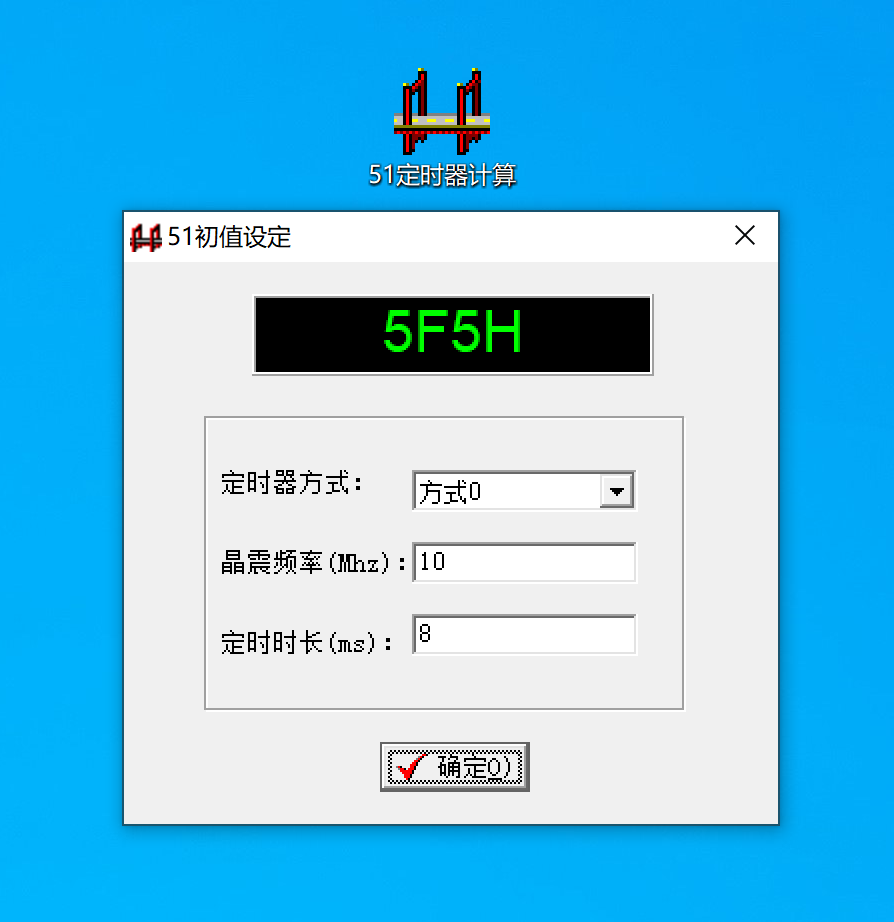

- # 机器码转汇编/C  

- [机器码转汇编](#机器码转汇编)
- [机器码转C](#机器码转c)
  - [ubuntu 源码编译](#ubuntu-源码编译)
  - [retdec-decompiler 软件使用及效果](#retdec-decompiler-软件使用及效果)
  - [PE文件反汇编](#pe文件反汇编)

## 机器码转汇编

## 机器码转C  

[github retdec](https://github.com/avast/retdec)  

### ubuntu 源码编译

安装依赖
```sh
sudo apt-get install libssl-dev
```

### retdec-decompiler 软件使用及效果  
源码:
```sh
#include <stdio.h>
#include <stdlib.h>

int main (void)
{
	//create char pointer
	char *ptr;

	//ptr is now the memory address of the beginning of this 10 char element array.
	//we used the sizeof() function to make sure that the size of memory allocated is 10 units on any host
	ptr = malloc(10 * sizeof(char));

	//if malloc fails, our ptr pointer will be pointing towards a NULL value, this checks for that
	if (ptr == NULL)
	{
		printf("Memory could not be allocated.");
		return 1;
	}
	else 
	{
		printf("Memory was successfully allocated.");
		//this makes sure we don't keep memory allocated that we're not using.
		free(ptr);
		return 0;
	}
}
```

编译参数:
```sh
/usr/bin/gcc -g3 -O0 /root/work/c-cpp-cookbook/code/test/main.c -o /root/work/c-cpp-cookbook/code/test/main
```

执行指令:  
```sh
./retdec-decompiler main
```

运行日志: 
```sh
Running phase: initialization ( 0.20s )
 -> loading the input config ( 0.20s )
 -> creating the used HLL writer [c] ( 0.21s )
 -> creating the used alias analysis [simple] ( 0.21s )
 -> creating the used call info obtainer [optim] ( 0.21s )
 -> creating the used evaluator of arithmetical expressions [c] ( 0.21s )
 -> creating the used variable names generator [fruit] ( 0.21s )
 -> creating the used variable renamer [readable] ( 0.21s )
 -> creating the used semantics [libc,gcc-general,win-api] ( 0.21s )
Running phase: conversion of LLVM IR into BIR ( 0.21s )
 -> converting global variables ( 0.21s )
 -> converting function function_1000 ( 0.21s )
 -> converting function function_1060 ( 0.21s )
 -> converting function function_1070 ( 0.21s )
 -> converting function function_1080 ( 0.21s )
 -> converting function function_1090 ( 0.21s )
 -> converting function entry_point ( 0.21s )
 -> converting function function_10d0 ( 0.21s )
 -> converting function function_1100 ( 0.21s )
 -> converting function function_1140 ( 0.21s )
 -> converting function function_1180 ( 0.21s )
 -> converting function function_1189 ( 0.21s )
 -> converting function function_11f0 ( 0.21s )
 -> converting function function_1260 ( 0.21s )
 -> converting function function_1268 ( 0.21s )
Running phase: removing functions from standard libraries ( 0.21s )
Running phase: removing code that is not reachable in a CFG ( 0.21s )
Running phase: signed/unsigned types fixing ( 0.21s )
Running phase: converting LLVM intrinsic functions to standard functions ( 0.21s )
Running phase: obtaining debug information ( 0.21s )
Running phase: alias analysis [simple] ( 0.21s )
Running phase: optimizations ( 0.21s )
 -> running GotoStmtOptimizer ( 0.21s )
 -> running RemoveUselessCastsOptimizer ( 0.21s )
 -> running UnusedGlobalVarOptimizer ( 0.21s )
 -> running DeadLocalAssignOptimizer ( 0.21s )
 -> running SimpleCopyPropagationOptimizer ( 0.21s )
 -> running CopyPropagationOptimizer ( 0.22s )
 -> running SimplifyArithmExprOptimizer ( 0.22s )
 -> running IfStructureOptimizer ( 0.22s )
 -> running LoopLastContinueOptimizer ( 0.22s )
 -> running PreWhileTrueLoopConvOptimizer ( 0.22s )
```

解析机器码的目录:
```sh
▶ ls -l main.*
-rw-r--r--  1 ymm  staff   5212  2 28 12:00 main.bc
-rw-r--r--  1 ymm  staff   4144  2 28 12:00 main.c
-rw-r--r--  1 ymm  staff  97446  2 28 12:00 main.config.json
-rw-r--r--  1 ymm  staff  20482  2 28 12:00 main.dsm
-rw-r--r--  1 ymm  staff   8333  2 28 12:00 main.ll
```

通过机器码翻译的`main.c`:  
```sh
// From module:   /root/work/c-cpp-cookbook/code/test/main.c
// Address range: 0x1189 - 0x11e6
// Line range:    4 - 26
int main() {
    int64_t * mem = malloc(10); // 0x119a
    int32_t result; // 0x1189
    if (mem != NULL) {
        // 0x11c2
        printf("Memory was successfully allocated.");
        free(mem);
        result = 0;
    } else {
        // 0x11aa
        printf("Memory could not be allocated.");
        result = 1;
    }
    // 0x11e4
    return result;
}

// Address range: 0x11f0 - 0x1255
int64_t __libc_csu_init(int64_t a1, int64_t a2, int64_t a3) {
    int64_t result = _init(); // 0x121c
    if ((int64_t)&g2 - (int64_t)&g1 >> 3 == 0) {
        // 0x1246
        return result;
    }
    int64_t v1 = 0; // 0x1225
    while (v1 + 1 != (int64_t)&g2 - (int64_t)&g1 >> 3) {
        // 0x1230
        v1++;
    }
    // 0x1246
    return result;
}
```

`main.dsm`  反汇编内容
```sh
;;
;; Code Segment
;;

; section: .init
; function: _init at 0x1000 -- 0x101b
...
0x1184:   e9 77 ff ff ff            	jmp 0x1100 <register_tm_clones>
; function: main at 0x1189 -- 0x11e6
0x1189:   f3 0f 1e fa               	endbr64 
0x118d:   55                        	push rbp
0x118e:   48 89 e5                  	mov rbp, rsp
0x1191:   48 83 ec 10               	sub rsp, 0x10
0x1195:   bf 0a 00 00 00            	mov edi, 0xa
0x119a:   e8 f1 fe ff ff            	call 0x1090 <malloc>
0x119f:   48 89 45 f8               	mov qword ptr [rbp - 8], rax
0x11a3:   48 83 7d f8 00            	cmp qword ptr [rbp - 8], 0
0x11a8:   75 18                     	jne 0x11c2 <main+0x39>
0x11aa:   48 8d 3d 57 0e 00 00      	lea rdi, [rip + 0xe57]
0x11b1:   b8 00 00 00 00            	mov eax, 0
0x11b6:   e8 c5 fe ff ff            	call 0x1080 <printf>
0x11bb:   b8 01 00 00 00            	mov eax, 1
0x11c0:   eb 22                     	jmp 0x11e4 <main+0x5b>
0x11c2:   48 8d 3d 5f 0e 00 00      	lea rdi, [rip + 0xe5f]
0x11c9:   b8 00 00 00 00            	mov eax, 0
0x11ce:   e8 ad fe ff ff            	call 0x1080 <printf>
0x11d3:   48 8b 45 f8               	mov rax, qword ptr [rbp - 8]
0x11d7:   48 89 c7                  	mov rdi, rax
0x11da:   e8 91 fe ff ff            	call 0x1070 <free>
0x11df:   b8 00 00 00 00            	mov eax, 0
0x11e4:   c9                        	leave 
0x11e5:   c3                        	ret 
; data inside code section at 0x11e6 -- 0x11f0
0x11e6:   66 2e 0f 1f 84 00 00 00  00 00                     |f.........      |
...
```

如果去掉符号表呢？还能解析吗?:
```sh
objcopy --strip-debug main main_release
strip main_release
```

也可以单独使用`strip`去掉符号变和关联表: 
```sh
strip --help
Usage: strip <option(s)> in-file(s)
 Removes symbols and sections from files
 The options are:
  -I --input-target=<bfdname>      Assume input file is in format <bfdname>
  -O --output-target=<bfdname>     Create an output file in format <bfdname>
  -F --target=<bfdname>            Set both input and output format to <bfdname>
  -p --preserve-dates              Copy modified/access timestamps to the output
  -D --enable-deterministic-archives
                                   Produce deterministic output when stripping archives (default)
  -U --disable-deterministic-archives
                                   Disable -D behavior
  -R --remove-section=<name>       Also remove section <name> from the output
     --remove-relocations <name>   Remove relocations from section <name>
  -s --strip-all                   Remove all symbol and relocation information
  -g -S -d --strip-debug           Remove all debugging symbols & sections
     --strip-dwo                   Remove all DWO sections
     --strip-unneeded              Remove all symbols not needed by relocations
     --only-keep-debug             Strip everything but the debug information
  -M  --merge-notes                Remove redundant entries in note sections (default)
      --no-merge-notes             Do not attempt to remove redundant notes
  -N --strip-symbol=<name>         Do not copy symbol <name>
     --keep-section=<name>         Do not strip section <name>
  -K --keep-symbol=<name>          Do not strip symbol <name>
     --keep-file-symbols           Do not strip file symbol(s)
  -w --wildcard                    Permit wildcard in symbol comparison
  -x --discard-all                 Remove all non-global symbols
  -X --discard-locals              Remove any compiler-generated symbols
  -v --verbose                     List all object files modified
  -V --version                     Display this program's version number
  -h --help                        Display this output
     --info                        List object formats & architectures supported
  -o <file>                        Place stripped output into <file>
strip: supported targets: elf64-x86-64 elf32-i386 elf32-iamcu elf32-x86-64 pei-i386 pei-x86-64 elf64-l1om elf64-k1om elf64-little elf64-big elf32-little elf32-big pe-x86-64 pe-bigobj-x86-64 pe-i386 srec symbolsrec verilog tekhex binary ihex plugin
Report bugs to <http://www.sourceware.org/bugzilla/>
```

查看内容`objdump -x main_release` , 显示`no symbols`  
```sh
main_re:     file format elf64-x86-64
main_re
architecture: i386:x86-64, flags 0x00000150:
HAS_SYMS, DYNAMIC, D_PAGED
start address 0x00000000000010a0

Program Header:
    PHDR off    0x0000000000000040 vaddr 0x0000000000000040 paddr 0x0000000000000040 align 2**3
         filesz 0x00000000000002d8 memsz 0x00000000000002d8 flags r--
  INTERP off    0x0000000000000318 vaddr 0x0000000000000318 paddr 0x0000000000000318 align 2**0
         filesz 0x000000000000001c memsz 0x000000000000001c flags r--
    LOAD off    0x0000000000000000 vaddr 0x0000000000000000 paddr 0x0000000000000000 align 2**12
         filesz 0x0000000000000670 memsz 0x0000000000000670 flags r--
    LOAD off    0x0000000000001000 vaddr 0x0000000000001000 paddr 0x0000000000001000 align 2**12
         filesz 0x0000000000000275 memsz 0x0000000000000275 flags r-x
    LOAD off    0x0000000000002000 vaddr 0x0000000000002000 paddr 0x0000000000002000 align 2**12
         filesz 0x0000000000000198 memsz 0x0000000000000198 flags r--
    LOAD off    0x0000000000002da8 vaddr 0x0000000000003da8 paddr 0x0000000000003da8 align 2**12
         filesz 0x0000000000000268 memsz 0x0000000000000270 flags rw-
 DYNAMIC off    0x0000000000002db8 vaddr 0x0000000000003db8 paddr 0x0000000000003db8 align 2**3
         filesz 0x00000000000001f0 memsz 0x00000000000001f0 flags rw-
    NOTE off    0x0000000000000338 vaddr 0x0000000000000338 paddr 0x0000000000000338 align 2**3
         filesz 0x0000000000000020 memsz 0x0000000000000020 flags r--
    NOTE off    0x0000000000000358 vaddr 0x0000000000000358 paddr 0x0000000000000358 align 2**2
         filesz 0x0000000000000044 memsz 0x0000000000000044 flags r--
0x6474e553 off    0x0000000000000338 vaddr 0x0000000000000338 paddr 0x0000000000000338 align 2**3
         filesz 0x0000000000000020 memsz 0x0000000000000020 flags r--
EH_FRAME off    0x000000000000204c vaddr 0x000000000000204c paddr 0x000000000000204c align 2**2
         filesz 0x0000000000000044 memsz 0x0000000000000044 flags r--
   STACK off    0x0000000000000000 vaddr 0x0000000000000000 paddr 0x0000000000000000 align 2**4
         filesz 0x0000000000000000 memsz 0x0000000000000000 flags rw-
   RELRO off    0x0000000000002da8 vaddr 0x0000000000003da8 paddr 0x0000000000003da8 align 2**0
         filesz 0x0000000000000258 memsz 0x0000000000000258 flags r--

Dynamic Section:
  NEEDED               libc.so.6
  INIT                 0x0000000000001000
  FINI                 0x0000000000001268
  INIT_ARRAY           0x0000000000003da8
  INIT_ARRAYSZ         0x0000000000000008
  FINI_ARRAY           0x0000000000003db0
  FINI_ARRAYSZ         0x0000000000000008
  GNU_HASH             0x00000000000003a0
  STRTAB               0x00000000000004a0
  SYMTAB               0x00000000000003c8
  STRSZ                0x0000000000000090
  SYMENT               0x0000000000000018
  DEBUG                0x0000000000000000
  PLTGOT               0x0000000000003fa8
  PLTRELSZ             0x0000000000000048
  PLTREL               0x0000000000000007
  JMPREL               0x0000000000000628
  RELA                 0x0000000000000568
  RELASZ               0x00000000000000c0
  RELAENT              0x0000000000000018
  FLAGS                0x0000000000000008
  FLAGS_1              0x0000000008000001
  VERNEED              0x0000000000000548
  VERNEEDNUM           0x0000000000000001
  VERSYM               0x0000000000000530
  RELACOUNT            0x0000000000000003

Version References:
  required from libc.so.6:
    0x09691a75 0x00 02 GLIBC_2.2.5

Sections:
Idx Name          Size      VMA               LMA               File off  Algn
  0 .interp       0000001c  0000000000000318  0000000000000318  00000318  2**0
                  CONTENTS, ALLOC, LOAD, READONLY, DATA
  1 .note.gnu.property 00000020  0000000000000338  0000000000000338  00000338  2**3
                  CONTENTS, ALLOC, LOAD, READONLY, DATA
  2 .note.gnu.build-id 00000024  0000000000000358  0000000000000358  00000358  2**2
                  CONTENTS, ALLOC, LOAD, READONLY, DATA
  3 .note.ABI-tag 00000020  000000000000037c  000000000000037c  0000037c  2**2
                  CONTENTS, ALLOC, LOAD, READONLY, DATA
  4 .gnu.hash     00000024  00000000000003a0  00000000000003a0  000003a0  2**3
                  CONTENTS, ALLOC, LOAD, READONLY, DATA
  5 .dynsym       000000d8  00000000000003c8  00000000000003c8  000003c8  2**3
                  CONTENTS, ALLOC, LOAD, READONLY, DATA
  6 .dynstr       00000090  00000000000004a0  00000000000004a0  000004a0  2**0
                  CONTENTS, ALLOC, LOAD, READONLY, DATA
  7 .gnu.version  00000012  0000000000000530  0000000000000530  00000530  2**1
                  CONTENTS, ALLOC, LOAD, READONLY, DATA
  8 .gnu.version_r 00000020  0000000000000548  0000000000000548  00000548  2**3
                  CONTENTS, ALLOC, LOAD, READONLY, DATA
  9 .rela.dyn     000000c0  0000000000000568  0000000000000568  00000568  2**3
                  CONTENTS, ALLOC, LOAD, READONLY, DATA
 10 .rela.plt     00000048  0000000000000628  0000000000000628  00000628  2**3
                  CONTENTS, ALLOC, LOAD, READONLY, DATA
 11 .init         0000001b  0000000000001000  0000000000001000  00001000  2**2
                  CONTENTS, ALLOC, LOAD, READONLY, CODE
 12 .plt          00000040  0000000000001020  0000000000001020  00001020  2**4
                  CONTENTS, ALLOC, LOAD, READONLY, CODE
 13 .plt.got      00000010  0000000000001060  0000000000001060  00001060  2**4
                  CONTENTS, ALLOC, LOAD, READONLY, CODE
 14 .plt.sec      00000030  0000000000001070  0000000000001070  00001070  2**4
                  CONTENTS, ALLOC, LOAD, READONLY, CODE
 15 .text         000001c5  00000000000010a0  00000000000010a0  000010a0  2**4
                  CONTENTS, ALLOC, LOAD, READONLY, CODE
 16 .fini         0000000d  0000000000001268  0000000000001268  00001268  2**2
                  CONTENTS, ALLOC, LOAD, READONLY, CODE
 17 .rodata       0000004b  0000000000002000  0000000000002000  00002000  2**3
                  CONTENTS, ALLOC, LOAD, READONLY, DATA
 18 .eh_frame_hdr 00000044  000000000000204c  000000000000204c  0000204c  2**2
                  CONTENTS, ALLOC, LOAD, READONLY, DATA
 19 .eh_frame     00000108  0000000000002090  0000000000002090  00002090  2**3
                  CONTENTS, ALLOC, LOAD, READONLY, DATA
 20 .init_array   00000008  0000000000003da8  0000000000003da8  00002da8  2**3
                  CONTENTS, ALLOC, LOAD, DATA
 21 .fini_array   00000008  0000000000003db0  0000000000003db0  00002db0  2**3
                  CONTENTS, ALLOC, LOAD, DATA
 22 .dynamic      000001f0  0000000000003db8  0000000000003db8  00002db8  2**3
                  CONTENTS, ALLOC, LOAD, DATA
 23 .got          00000058  0000000000003fa8  0000000000003fa8  00002fa8  2**3
                  CONTENTS, ALLOC, LOAD, DATA
 24 .data         00000010  0000000000004000  0000000000004000  00003000  2**3
                  CONTENTS, ALLOC, LOAD, DATA
 25 .bss          00000008  0000000000004010  0000000000004010  00003010  2**0
                  ALLOC
 26 .comment      0000002b  0000000000000000  0000000000000000  00003010  2**0
                  CONTENTS, READONLY
SYMBOL TABLE:
no symbols
```

翻译的内容为:
```c
// Address range: 0x1189 - 0x11e6
int64_t function_1189(void) {
    int64_t * mem = malloc(10); // 0x119a
    int64_t result; // 0x1189
    if (mem != NULL) {
        // 0x11c2
        printf("Memory was successfully allocated.");
        free(mem);
        result = 0;
    } else {
        // 0x11aa
        printf("Memory could not be allocated.");
        result = 1;
    }
    // 0x11e4
    return result;
}

// Address range: 0x11f0 - 0x1255
int64_t function_11f0(int64_t a1, int64_t a2, int64_t a3) {
    int64_t result = function_1000(); // 0x121c
    if ((int64_t)&g2 - (int64_t)&g1 >> 3 == 0) {
        // 0x1246
        return result;
    }
    int64_t v1 = 0; // 0x1225
    while (v1 + 1 != (int64_t)&g2 - (int64_t)&g1 >> 3) {
        // 0x1230
        v1++;
    }
    // 0x1246
    return result;
}
```

自己定义的函数无法识别，通过`function_1189`代替。但是调用其他库的函数仍然可以，本身就存在于可执行文件中，相当于`链接`了.  
`vim main_release`  
```sh
libc.so.6^@printf^@malloc^@__cxa_finalize^@__libc_start_main^@free^@GLIBC_2.2.5^@_ITM_deregisterTMCloneTable^@
```

### PE文件反汇编  
[51定时器计算](../../res/files/51定时器计算.exe)  

<br>
<div align=center>
    </img>  
</div>
<br>

文件信息:
```sh
51定时器计算.exe: PE32 executable (GUI) Intel 80386 (stripped to external PDB), for MS Windows
```

反汇编结果(部分): [文件详情](../../res/files/51定时器计算.exe.c)  
```c
// Address range: 0x4056f0 - 0x40575c
int32_t function_4056f0(void) {
    int32_t v1 = 0; // 0x4056f7
    int32_t v2 = 0; // 0x4056f7
    int32_t v3; // 0x4056f0
    if (v3 != 0) {
        // 0x4056f9
        v1 = 256 * v3 & 0xdf00;
        v2 = v1 | (int32_t)*(char *)(v3 - 4);
    }
    // 0x405704
    int32_t v4; // 0x4056f0
    int32_t v5 = v4;
    int32_t v6 = v5 + 2 + (int32_t)*(char *)(v5 + 1); // 0x405709
    int32_t v7 = (int32_t)*(char *)(v6 + 10); // 0x40570d
    int32_t v8 = v6 + v7;
    uint16_t v9 = *(int16_t *)(v8 + 11); // 0x405710
    int32_t v10 = v2; // 0x405717
    int32_t v11; // 0x4056f0
    int32_t v12; // 0x4056f0
    int32_t result; // 0x4056f0
    int32_t v13; // 0x4056f0
    int32_t v14; // 0x4056f0
    int32_t v15; // 0x4056f0
    int32_t v16; // 0x4056f0
    int32_t v17; // 0x4056f0
    int32_t v18; // 0x4056f0
    int32_t v19; // 0x40571d
    int16_t v20; // 0x40571d
    int32_t v21; // 0x405721
    int32_t v22; // 0x405721
    int32_t v23; // 0x4056f0
    int32_t v24; // 0x405748
    char v25; // 0x40574c
    int32_t v26; // 0x40574c
    int32_t v27; // 0x405728
    int32_t v28; // 0x40572a
    if (v9 != 0) {
        // 0x405719
        v28 = v9;
        v12 = v8 + 13;
        v19 = v12 + 26;
        v20 = *(int16_t *)v19;
        v21 = v7 & -0x10000 | (int32_t)(v20 & 255);
        v22 = v21 | (int32_t)(v20 & -0x2100);
        v16 = v2;
        v13 = v22;
        v14 = v21;
        if (v22 == v2) {
            v15 = v14;
            v23 = v15 - 1;
            v24 = v2 & -0xff01;
            v25 = *(char *)(v15 + v19);
            v26 = (int32_t)(v25 ^ *(char *)(v23 + v3));
            while ((v26 & 223) == 0) {
                // 0x405755
                result = v12;
                if (v23 == 0) {
                    return result;
                }
                v15 = v23;
                v23 = v15 - 1;
                v24 = (256 * v26 | v24) & -0xff01;
                v25 = *(char *)(v15 + v19);
                v26 = (int32_t)(v25 ^ *(char *)(v23 + v3));
            }
            // 0x40573c
            v16 = v24 | v1;
            v13 = v15 & -256 | (int32_t)*(char *)v19;
        }
        // 0x405728
        v17 = v16;
        v27 = v13 & -0xff01;
        v28--;
        v11 = v12 + 27 + v27;
        v10 = v17;
        while (v28 != 0) {
            // 0x40571d
            v12 = v11;
            v19 = v12 + 26;
            v20 = *(int16_t *)v19;
            v21 = v27 & -0x10000 | (int32_t)(v20 & 255);
            v22 = v21 | (int32_t)(v20 & -0x2100);
            v16 = v17;
            v13 = v22;
            v18 = v17;
            v14 = v21;
            if (v22 == v17) {
                v15 = v14;
                v23 = v15 - 1;
                v24 = v18 & -0xff01;
                v25 = *(char *)(v15 + v19);
                v26 = (int32_t)(v25 ^ *(char *)(v23 + v3));
                while ((v26 & 223) == 0) {
                    // 0x405755
                    result = v12;
                    if (v23 == 0) {
                        return result;
                    }
                    v15 = v23;
                    v23 = v15 - 1;
                    v24 = (256 * v26 | v24) & -0xff01;
                    v25 = *(char *)(v15 + v19);
                    v26 = (int32_t)(v25 ^ *(char *)(v23 + v3));
                }
                // 0x40573c
                v16 = v24 | v1;
                v13 = v15 & -256 | (int32_t)*(char *)v19;
            }
            // 0x405728
            v17 = v16;
            v27 = v13 & -0xff01;
            v28--;
            v11 = v12 + 27 + v27;
            v10 = v17;
        }
    }
    int32_t v29 = *(int32_t *)(v6 + 4); // 0x405731
    result = 0;
    while (v29 != 0) {
        int32_t v30 = v10;
        v5 = *(int32_t *)v29;
        v6 = v5 + 2 + (int32_t)*(char *)(v5 + 1);
        v7 = (int32_t)*(char *)(v6 + 10);
        v8 = v6 + v7;
        v9 = *(int16_t *)(v8 + 11);
        v10 = v30;
        if (v9 != 0) {
            // 0x405719
            v28 = v9;
            v12 = v8 + 13;
            v19 = v12 + 26;
            v20 = *(int16_t *)v19;
            v21 = v7 & -0x10000 | (int32_t)(v20 & 255);
            v22 = v21 | (int32_t)(v20 & -0x2100);
            v16 = v30;
            v13 = v22;
            v18 = v30;
            v14 = v21;
            if (v22 == v30) {
                v15 = v14;
                v23 = v15 - 1;
                v24 = v18 & -0xff01;
                v25 = *(char *)(v15 + v19);
                v26 = (int32_t)(v25 ^ *(char *)(v23 + v3));
                while ((v26 & 223) == 0) {
                    // 0x405755
                    result = v12;
                    if (v23 == 0) {
                        return result;
                    }
                    v15 = v23;
                    v23 = v15 - 1;
                    v24 = (256 * v26 | v24) & -0xff01;
                    v25 = *(char *)(v15 + v19);
                    v26 = (int32_t)(v25 ^ *(char *)(v23 + v3));
                }
                // 0x40573c
                v16 = v24 | v1;
                v13 = v15 & -256 | (int32_t)*(char *)v19;
            }
            // 0x405728
            v17 = v16;
            v27 = v13 & -0xff01;
            v28--;
            v11 = v12 + 27 + v27;
            v10 = v17;
            while (v28 != 0) {
                // 0x40571d
                v12 = v11;
                v19 = v12 + 26;
                v20 = *(int16_t *)v19;
                v21 = v27 & -0x10000 | (int32_t)(v20 & 255);
                v22 = v21 | (int32_t)(v20 & -0x2100);
                v16 = v17;
                v13 = v22;
                v18 = v17;
                v14 = v21;
                if (v22 == v17) {
                    v15 = v14;
                    v23 = v15 - 1;
                    v24 = v18 & -0xff01;
                    v25 = *(char *)(v15 + v19);
                    v26 = (int32_t)(v25 ^ *(char *)(v23 + v3));
                    while ((v26 & 223) == 0) {
                        // 0x405755
                        result = v12;
                        if (v23 == 0) {
                            return result;
                        }
                        v15 = v23;
                        v23 = v15 - 1;
                        v24 = (256 * v26 | v24) & -0xff01;
                        v25 = *(char *)(v15 + v19);
                        v26 = (int32_t)(v25 ^ *(char *)(v23 + v3));
                    }
                    // 0x40573c
                    v16 = v24 | v1;
                    v13 = v15 & -256 | (int32_t)*(char *)v19;
                }
                // 0x405728
                v17 = v16;
                v27 = v13 & -0xff01;
                v28--;
                v11 = v12 + 27 + v27;
                v10 = v17;
            }
        }
        // 0x405731
        v29 = *(int32_t *)(v6 + 4);
        result = 0;
    }
  lab_0x405758:
    // 0x405758
    return result;
}

// Address range: 0x40575c - 0x4057cd
int32_t function_40575c(void) {
    // 0x40575c
    int32_t v1; // 0x40575c
    int32_t v2 = v1;
    char v3 = 4; // 0x405767
    if ((char)v2 != 7) {
        // 0x405769
        v3 = *(char *)(v2 + 2 + (int32_t)*(char *)(v2 + 1));
    }
    // 0x405772
    int32_t v4; // 0x40575c
    int32_t v5; // 0x4057c0
    if (*(char *)(v2 + 7) == -1) {
        int32_t v6 = (*(int32_t *)(v2 + 4) & 0xffffff) + v1; // 0x405793
        v4 = (int32_t)*(char *)v6;
        if (v3 >= 2) {
            // 0x40579c
            if (v3 >= 4) {
                // 0x4057ca
                return *(int32_t *)v6;
            }
            // 0x4057c0
            v5 = 0x10000 * (int32_t)*(int16_t *)v6 >> 16;
            return v3 == 2 ? v5 : v5 & 0xffff;
        }
    } else {
        if (v3 >= 4) {
            // 0x4057ca
            int32_t result; // 0x40575c
            return result;
        }
        if (v3 >= 2) {
            // 0x4057c0
            int32_t v7; // 0x40575c
            v5 = 0x10000 * v7 >> 16;
            return v3 == 2 ? v5 : v5 & 0xffff;
        }
    }
    int32_t result2 = 0x1000000 * v4 >> 24; // 0x4057b3
    if (v3 != 0) {
        // 0x4057b8
        return result2 & 255;
    }
    // 0x4057ca
    return result2;
}

// Address range: 0x4057d0 - 0x40582b
int32_t function_4057d0(void) {
    // 0x4057d0
    int32_t v1; // 0x4057d0
    int32_t v2 = v1;
    char v3 = 4; // 0x4057de
    if ((char)v2 != 7) {
        // 0x4057e0
        v3 = *(char *)(v2 + 2 + (int32_t)*(char *)(v2 + 1));
    }
    // 0x4057e9
    if (*(char *)(v2 + 11) != -1) {
        // 0x405827
        int32_t result; // 0x4057d0
        return result;
    }
    int32_t result2 = (*(int32_t *)(v2 + 8) & 0xffffff) + v1; // 0x405814
    *(char *)result2 = (char)v1;
    if (v3 < 2) {
        // 0x405827
        return result2;
    }
    // 0x40581d
    *(int16_t *)result2 = (int16_t)v1;
    if (v3 >= 4) {
        // branch -> 0x405827
    }
    // 0x405827
    return result2;
}

// Address range: 0x40582c - 0x40587d
int32_t function_40582c(void) {
    // 0x40582c
    int32_t result; // 0x40582c
    if (*(char *)(result + 11) != -1) {
        // 0x405846
        return result;
    }
    int32_t v1 = *(int32_t *)(result + 16); // 0x405830
    int32_t v2 = v1 != -0x80000000 ? v1 : result;
    int32_t v3 = (*(int32_t *)(result + 8) & 0xffffff) + result; // 0x40585d
    unsigned char v4 = *(char *)(v2 + 2 + (int32_t)*(char *)(v2 + 1)); // 0x40586a
    int32_t v5 = v4;
    bool v6; // 0x40582c
    int32_t v7 = v6 ? -1 : 1; // 0x40586e
    *(char *)v3 = v4;
    __asm_rep_movsb_memcpy((char *)(v3 + v7), (char *)(v7 + result), v5);
    return v2 & -256 | v5;
}

// Address range: 0x405880 - 0x4058b2
int32_t function_405880(void) {
    // 0x405880
    function_44ae68();
    return function_40582c();
}
```